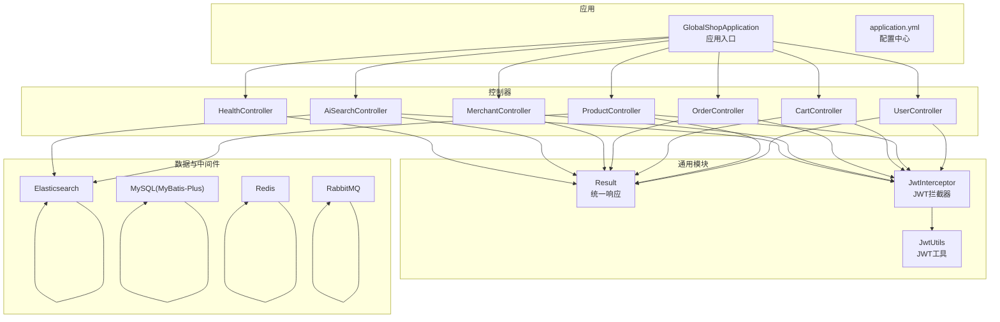
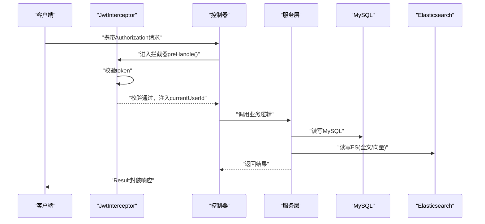
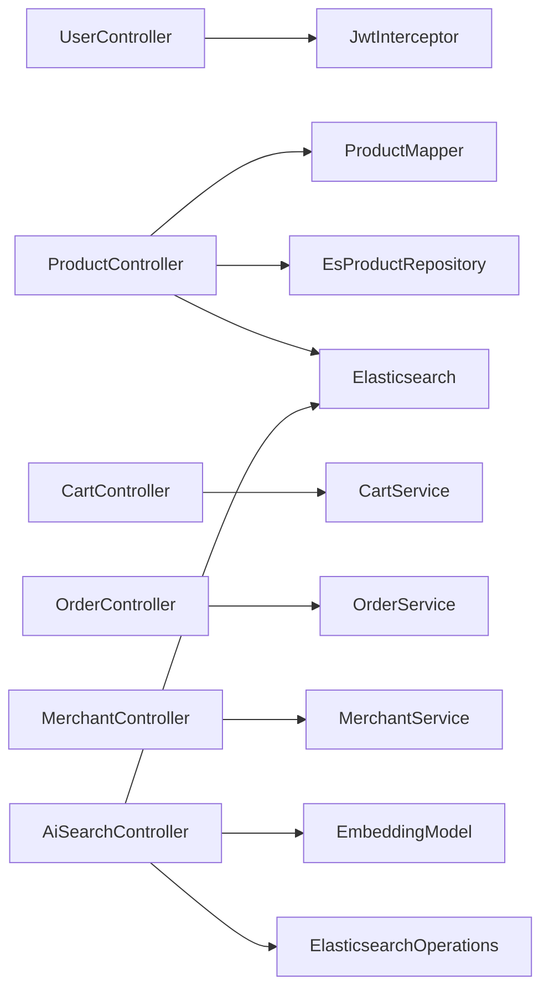

# API接口文档

<cite>
**本文引用的文件**
- [GlobalShopApplication.java](file://src/main/java/com/bohao/globalshop/GlobalShopApplication.java)
- [application.yml](file://src/main/resources/application.yml)
- [JwtUtils.java](file://src/main/java/com/bohao/globalshop/common/JwtUtils.java)
- [Result.java](file://src/main/java/com/bohao/globalshop/common/Result.java)
- [JwtInterceptor.java](file://src/main/java/com/bohao/globalshop/interceptor/JwtInterceptor.java)
- [UserController.java](file://src/main/java/com/bohao/globalshop/controller/UserController.java)
- [ProductController.java](file://src/main/java/com/bohao/globalshop/controller/ProductController.java)
- [CartController.java](file://src/main/java/com/bohao/globalshop/controller/CartController.java)
- [OrderController.java](file://src/main/java/com/bohao/globalshop/controller/OrderController.java)
- [MerchantController.java](file://src/main/java/com/bohao/globalshop/controller/MerchantController.java)
- [AiSearchController.java](file://src/main/java/com/bohao/globalshop/controller/AiSearchController.java)
- [HealthController.java](file://src/main/java/com/bohao/globalshop/controller/HealthController.java)
- [UserLoginDto.java](file://src/main/java/com/bohao/globalshop/dto/UserLoginDto.java)
- [UserRegisterDto.java](file://src/main/java/com/bohao/globalshop/dto/UserRegisterDto.java)
- [CartAddDto.java](file://src/main/java/com/bohao/globalshop/dto/CartAddDto.java)
- [OrderCreateDto.java](file://src/main/java/com/bohao/globalshop/dto/OrderCreateDto.java)
- [ProductPublishDto.java](file://src/main/java/com/bohao/globalshop/dto/ProductPublishDto.java)
- [ShopApplyDto.java](file://src/main/java/com/bohao/globalshop/dto/ShopApplyDto.java)
- [ReviewSubmitDto.java](file://src/main/java/com/bohao/globalshop/dto/ReviewSubmitDto.java)
</cite>

## 目录
1. [简介](#简介)
2. [项目结构](#项目结构)
3. [核心组件](#核心组件)
4. [架构总览](#架构总览)
5. [详细组件分析](#详细组件分析)
6. [依赖分析](#依赖分析)
7. [性能考虑](#性能考虑)
8. [故障排查指南](#故障排查指南)
9. [结论](#结论)
10. [附录](#附录)

## 简介
本项目为全球购物平台后端，采用Spring Boot实现RESTful API，提供用户认证、商品查询与搜索、购物车管理、订单处理、商户管理等能力。系统使用JWT进行认证与授权，统一响应包装Result，支持Elasticsearch全文检索与向量语义检索，集成RabbitMQ消息队列与Redis缓存。

## 项目结构
- 应用入口与配置
  - 应用入口：GlobalShopApplication
  - 配置文件：application.yml（数据库、Redis、Elasticsearch、RabbitMQ、AI相关配置）
- 控制器层
  - 用户：UserController
  - 商品：ProductController
  - 购物车：CartController
  - 订单：OrderController
  - 商户：MerchantController
  - AI搜索：AiSearchController
  - 健康检查：HealthController
- 通用工具与拦截器
  - JWT工具：JwtUtils
  - 统一响应：Result
  - JWT拦截器：JwtInterceptor
- DTO/VO
  - 用户注册/登录：UserRegisterDto、UserLoginDto
  - 购物车：CartAddDto
  - 订单：OrderCreateDto、ReviewSubmitDto
  - 商户：ShopApplyDto、ProductPublishDto
- 数据访问与仓库
  - Mapper接口（MyBatis-Plus）
  - Elasticsearch仓库：EsProductRepository
- 异常处理与任务
  - 全局异常：GlobalExceptionHandler
  - 定时任务：CacheWarmUpRunner、OrderTask

图表来源
- [GlobalShopApplication.java:1-17](file://src/main/java/com/bohao/globalshop/GlobalShopApplication.java#L1-L17)
- [application.yml:1-42](file://src/main/resources/application.yml#L1-L42)
- [JwtInterceptor.java:1-36](file://src/main/java/com/bohao/globalshop/interceptor/JwtInterceptor.java#L1-L36)
- [JwtUtils.java:1-41](file://src/main/java/com/bohao/globalshop/common/JwtUtils.java#L1-L41)
- [Result.java:1-30](file://src/main/java/com/bohao/globalshop/common/Result.java#L1-L30)
- [UserController.java:1-29](file://src/main/java/com/bohao/globalshop/controller/UserController.java#L1-L29)
- [ProductController.java:1-101](file://src/main/java/com/bohao/globalshop/controller/ProductController.java#L1-L101)
- [CartController.java:1-41](file://src/main/java/com/bohao/globalshop/controller/CartController.java#L1-L41)
- [OrderController.java:1-59](file://src/main/java/com/bohao/globalshop/controller/OrderController.java#L1-L59)
- [MerchantController.java:1-48](file://src/main/java/com/bohao/globalshop/controller/MerchantController.java#L1-L48)
- [AiSearchController.java:1-93](file://src/main/java/com/bohao/globalshop/controller/AiSearchController.java#L1-L93)

章节来源
- [GlobalShopApplication.java:1-17](file://src/main/java/com/bohao/globalshop/GlobalShopApplication.java#L1-L17)
- [application.yml:1-42](file://src/main/resources/application.yml#L1-L42)

## 核心组件
- 统一响应Result
  - 字段：code、message、data
  - 方法：success(data)、success()、error(code,message)
- JWT认证与拦截
  - 生成令牌：JwtUtils.generateToken(userId, username)
  - 验证令牌：JwtUtils.verifyToken(token)
  - 拦截器：JwtInterceptor在preHandle中校验Authorization头，失败返回401
- 控制器路由前缀
  - 用户：/api/user
  - 商品：/api/product
  - 购物车：/api/cart
  - 订单：/api/order
  - 商户：/api/merchant
  - AI：/api/ai
  - 健康：/api/health

章节来源
- [Result.java:1-30](file://src/main/java/com/bohao/globalshop/common/Result.java#L1-L30)
- [JwtUtils.java:1-41](file://src/main/java/com/bohao/globalshop/common/JwtUtils.java#L1-L41)
- [JwtInterceptor.java:1-36](file://src/main/java/com/bohao/globalshop/interceptor/JwtInterceptor.java#L1-L36)
- [UserController.java:1-29](file://src/main/java/com/bohao/globalshop/controller/UserController.java#L1-L29)
- [ProductController.java:1-101](file://src/main/java/com/bohao/globalshop/controller/ProductController.java#L1-L101)
- [CartController.java:1-41](file://src/main/java/com/bohao/globalshop/controller/CartController.java#L1-L41)
- [OrderController.java:1-59](file://src/main/java/com/bohao/globalshop/controller/OrderController.java#L1-L59)
- [MerchantController.java:1-48](file://src/main/java/com/bohao/globalshop/controller/MerchantController.java#L1-L48)
- [AiSearchController.java:1-93](file://src/main/java/com/bohao/globalshop/controller/AiSearchController.java#L1-L93)
- [HealthController.java:1-19](file://src/main/java/com/bohao/globalshop/controller/HealthController.java#L1-L19)

## 架构总览
- 认证流程
  - 用户登录成功后返回JWT令牌
  - 前端在后续请求头Authorization中携带令牌
  - 拦截器校验令牌有效性，注入currentUserId供业务使用
- 数据流
  - 商品：MySQL存储商品基础信息；Elasticsearch存储全文索引与向量；AI模块生成语义向量
  - 订单：购物车结算生成订单，异步任务处理超时取消
  - 缓存：热点数据通过Redis与本地缓存策略提升性能
- 集成点
  - RabbitMQ：订单取消监听与消息确认
  - Elasticsearch：全文检索与KNN向量检索
  - Spring AI：文本嵌入生成向量

图表来源
- [JwtInterceptor.java:14-34](file://src/main/java/com/bohao/globalshop/interceptor/JwtInterceptor.java#L14-L34)
- [UserController.java:19-27](file://src/main/java/com/bohao/globalshop/controller/UserController.java#L19-L27)
- [ProductController.java:30-99](file://src/main/java/com/bohao/globalshop/controller/ProductController.java#L30-L99)
- [CartController.java:22-39](file://src/main/java/com/bohao/globalshop/controller/CartController.java#L22-L39)
- [OrderController.java:19-57](file://src/main/java/com/bohao/globalshop/controller/OrderController.java#L19-L57)
- [MerchantController.java:20-46](file://src/main/java/com/bohao/globalshop/controller/MerchantController.java#L20-L46)

## 详细组件分析

### 用户认证接口
- 登录
  - 方法与路径：POST /api/user/login
  - 请求体：UserLoginDto（username,password）
  - 成功响应：Result<String>（包含JWT令牌）
  - 失败响应：Result.error(code,message)
- 注册
  - 方法与路径：POST /api/user/register
  - 请求体：UserRegisterDto（username,password）
  - 成功响应：Result<String>
  - 失败响应：Result.error(code,message)

章节来源
- [UserController.java:19-27](file://src/main/java/com/bohao/globalshop/controller/UserController.java#L19-L27)
- [UserLoginDto.java:1-10](file://src/main/java/com/bohao/globalshop/dto/UserLoginDto.java#L1-L10)
- [UserRegisterDto.java:1-10](file://src/main/java/com/bohao/globalshop/dto/UserRegisterDto.java#L1-L10)
- [Result.java:11-28](file://src/main/java/com/bohao/globalshop/common/Result.java#L11-L28)

### 商品查询与搜索接口
- 商品列表
  - 方法与路径：GET /api/product/list
  - 查询：无
  - 响应：Result<List<ProductVo>>
- 商品详情
  - 方法与路径：GET /api/product/detail/{id}
  - 路径参数：id（商品ID）
  - 响应：Result<Product>，未找到返回404
- 商品评价列表
  - 方法与路径：GET /api/product/{id}/reviews
  - 路径参数：id（商品ID）
  - 响应：Result<List<ProductReviewVo>>
- 同步商品到ES
  - 方法与路径：GET /api/product/sync-es
  - 功能：全量同步MySQL商品到Elasticsearch
  - 响应：Result<String>
- 全文搜索
  - 方法与路径：GET /api/product/search
  - 查询参数：keyword（关键词）、page（默认0）、size（默认10）
  - 响应：Result<List<EsProduct>>

章节来源
- [ProductController.java:30-99](file://src/main/java/com/bohao/globalshop/controller/ProductController.java#L30-L99)

### AI语义搜索接口
- 初始化向量
  - 方法与路径：GET /api/ai/init-vectors
  - 功能：对现有商品生成语义向量并写回ES
  - 响应：String（统计数量）
- 语义搜索
  - 方法与路径：GET /api/ai/semantic
  - 查询参数：keyWord（用户输入）
  - 响应：List<EsProduct>（基于KNN向量相似度返回TopN）

章节来源
- [AiSearchController.java:35-91](file://src/main/java/com/bohao/globalshop/controller/AiSearchController.java#L35-L91)

### 购物车接口
- 加入购物车
  - 方法与路径：POST /api/cart/add
  - 请求体：CartAddDto（productId,quantity）
  - 响应：Result<String>
- 查看购物车
  - 方法与路径：GET /api/cart/list
  - 响应：Result<List<CartShopVo>>
- 删除购物车项
  - 方法与路径：DELETE /api/cart/remove/{id}
  - 路径参数：id（购物车项ID）
  - 响应：Result<String>

章节来源
- [CartController.java:22-39](file://src/main/java/com/bohao/globalshop/controller/CartController.java#L22-L39)
- [CartAddDto.java:1-11](file://src/main/java/com/bohao/globalshop/dto/CartAddDto.java#L1-L11)

### 订单接口
- 创建订单
  - 方法与路径：POST /api/order/create
  - 请求体：OrderCreateDto（productId,quantity）
  - 响应：Result<String>
- 我的订单
  - 方法与路径：GET /api/order/my
  - 响应：Result<List<OrderVo>>
- 结算购物车
  - 方法与路径：POST /api/order/checkout
  - 功能：将购物车内容一次性生成订单
  - 响应：Result<String>
- 订单支付
  - 方法与路径：POST /api/order/pay/{id}
  - 路径参数：id（订单ID）
  - 响应：Result<String>
- 确认收货
  - 方法与路径：POST /api/order/confirm-receipt/{id}
  - 路径参数：id（订单ID）
  - 响应：Result<String>
- 提交评价
  - 方法与路径：POST /api/order/review
  - 请求体：ReviewSubmitDto（orderItemId,rating,content,images）
  - 响应：Result<String>

章节来源
- [OrderController.java:19-57](file://src/main/java/com/bohao/globalshop/controller/OrderController.java#L19-L57)
- [OrderCreateDto.java:1-10](file://src/main/java/com/bohao/globalshop/dto/OrderCreateDto.java#L1-L10)
- [ReviewSubmitDto.java:1-13](file://src/main/java/com/bohao/globalshop/dto/ReviewSubmitDto.java#L1-L13)

### 商户管理接口
- 申请开店
  - 方法与路径：POST /api/merchant/shop/apply
  - 请求体：ShopApplyDto（name,description）
  - 响应：Result<String>
- 上架商品
  - 方法与路径：POST /api/merchant/product/publish
  - 请求体：ProductPublishDto（name,description,price,stock,coverImage）
  - 响应：Result<String>
- 本店订单列表
  - 方法与路径：GET /api/merchant/order/list
  - 响应：Result<List<OrderVo>>
- 本店订单发货
  - 方法与路径：POST /api/merchant/order/deliver/{id}
  - 路径参数：id（订单ID）
  - 响应：Result<String>

章节来源
- [MerchantController.java:20-46](file://src/main/java/com/bohao/globalshop/controller/MerchantController.java#L20-L46)
- [ShopApplyDto.java:1-10](file://src/main/java/com/bohao/globalshop/dto/ShopApplyDto.java#L1-L10)
- [ProductPublishDto.java:1-15](file://src/main/java/com/bohao/globalshop/dto/ProductPublishDto.java#L1-L15)

### 健康检查接口
- 健康检查
  - 方法与路径：GET /api/health
  - 响应：Result<String>

章节来源
- [HealthController.java:14-17](file://src/main/java/com/bohao/globalshop/controller/HealthController.java#L14-L17)

## 依赖分析
- 认证与拦截
  - 所有受保护接口均依赖JwtInterceptor进行令牌校验
  - 令牌由UserController提供，拦截器注入currentUserId
- 数据访问
  - ProductController依赖ProductMapper与EsProductRepository
  - 订单与购物车依赖各自Mapper与仓库
- 搜索能力
  - ProductController：全文检索（IK分词）
  - AiSearchController：向量检索（KNN），依赖EmbeddingModel与ElasticsearchOperations
- 中间件集成
  - RabbitMQ：订单取消监听与消息确认
  - Redis：缓存与会话
  - Elasticsearch：全文与向量检索

图表来源
- [JwtInterceptor.java:1-36](file://src/main/java/com/bohao/globalshop/interceptor/JwtInterceptor.java#L1-L36)
- [UserController.java:1-29](file://src/main/java/com/bohao/globalshop/controller/UserController.java#L1-L29)
- [ProductController.java:1-101](file://src/main/java/com/bohao/globalshop/controller/ProductController.java#L1-L101)
- [CartController.java:1-41](file://src/main/java/com/bohao/globalshop/controller/CartController.java#L1-L41)
- [OrderController.java:1-59](file://src/main/java/com/bohao/globalshop/controller/OrderController.java#L1-L59)
- [MerchantController.java:1-48](file://src/main/java/com/bohao/globalshop/controller/MerchantController.java#L1-L48)
- [AiSearchController.java:1-93](file://src/main/java/com/bohao/globalshop/controller/AiSearchController.java#L1-L93)

## 性能考虑
- 缓存策略
  - 商品详情与热门商品建议加入Redis缓存，减少数据库压力
  - 使用本地缓存与分布式缓存结合，避免缓存穿透与雪崩
- 搜索优化
  - 全文检索使用IK分词，建议预热索引与定期重建
  - 向量检索设置合理的numCandidates与k值，平衡召回与性能
- 数据库优化
  - 对常用查询字段建立索引（如商品ID、订单状态、用户ID）
  - 分页查询使用LIMIT/OFFSET或游标分页，避免深度分页
- 异步处理
  - 订单超时取消使用RabbitMQ异步监听，降低主流程阻塞
- 并发控制
  - 购物车与下单场景使用乐观锁或分布式锁，防止超卖

## 故障排查指南
- 认证失败（401）
  - 现象：返回{"code":401,"message":"..."}
  - 排查：确认Authorization头是否存在、令牌是否过期、签名是否正确
- 未找到资源（404）
  - 现象：商品详情未找到
  - 排查：确认商品ID是否正确、商品状态是否上架
- 参数错误（400）
  - 现象：同步ES时MySQL无数据
  - 排查：确认商品表是否有数据，检查同步逻辑
- 业务异常
  - 统一通过Result.error(code,message)返回，前端可根据code与message提示用户

章节来源
- [JwtInterceptor.java:18-30](file://src/main/java/com/bohao/globalshop/interceptor/JwtInterceptor.java#L18-L30)
- [ProductController.java:54-60](file://src/main/java/com/bohao/globalshop/controller/ProductController.java#L54-L60)
- [Result.java:23-28](file://src/main/java/com/bohao/globalshop/common/Result.java#L23-L28)

## 结论
本API体系以JWT为核心认证机制，围绕用户、商品、购物车、订单、商户五大域提供完整能力。通过Elasticsearch与Spring AI实现高性能全文与语义检索，配合RabbitMQ与Redis保障高并发下的稳定性与可扩展性。建议在生产环境完善鉴权边界、限流熔断与监控告警，持续优化搜索与缓存策略。

## 附录

### 认证与权限
- 认证方式：Bearer Token（Authorization头）
- 令牌有效期：7天
- 受保护接口：除登录、注册、健康检查外，其余接口均需有效令牌

章节来源
- [JwtUtils.java:10-23](file://src/main/java/com/bohao/globalshop/common/JwtUtils.java#L10-L23)
- [JwtInterceptor.java:14-34](file://src/main/java/com/bohao/globalshop/interceptor/JwtInterceptor.java#L14-L34)

### 统一响应格式
- 成功：code=200，message="操作成功!"，data为具体对象
- 失败：code为业务错误码，message为错误描述，data可为空

章节来源
- [Result.java:11-28](file://src/main/java/com/bohao/globalshop/common/Result.java#L11-L28)

### 分页与搜索
- 分页参数：page（从0开始）、size（默认10）
- 搜索：全文搜索基于Elasticsearch IK分词；语义搜索基于KNN向量

章节来源
- [ProductController.java:85-99](file://src/main/java/com/bohao/globalshop/controller/ProductController.java#L85-L99)
- [AiSearchController.java:58-91](file://src/main/java/com/bohao/globalshop/controller/AiSearchController.java#L58-L91)

### Postman集合与curl示例
- 健康检查
  - curl示例：curl -X GET http://localhost:8080/api/health
- 登录
  - curl示例：curl -X POST http://localhost:8080/api/user/login -H "Content-Type: application/json" -d '{"username":"...","password":"..."}'
- 获取商品列表
  - curl示例：curl -X GET "http://localhost:8080/api/product/list"
- 全文搜索
  - curl示例：curl -X GET "http://localhost:8080/api/product/search?keyword=手机&page=0&size=10"
- 语义搜索
  - curl示例：curl -X GET "http://localhost:8080/api/ai/semantic?keyWord=想要买一部拍照好的手机"
- 加入购物车
  - curl示例：curl -X POST http://localhost:8080/api/cart/add -H "Authorization: Bearer YOUR_TOKEN" -H "Content-Type: application/json" -d '{"productId":1,"quantity":1}'
- 创建订单
  - curl示例：curl -X POST http://localhost:8080/api/order/create -H "Authorization: Bearer YOUR_TOKEN" -H "Content-Type: application/json" -d '{"productId":1,"quantity":1}'
- 申请开店
  - curl示例：curl -X POST http://localhost:8080/api/merchant/shop/apply -H "Authorization: Bearer YOUR_TOKEN" -H "Content-Type: application/json" -d '{"name":"店铺名","description":"店铺描述"}'