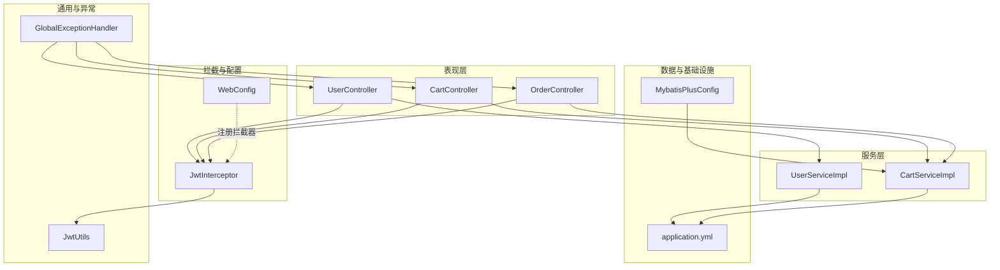
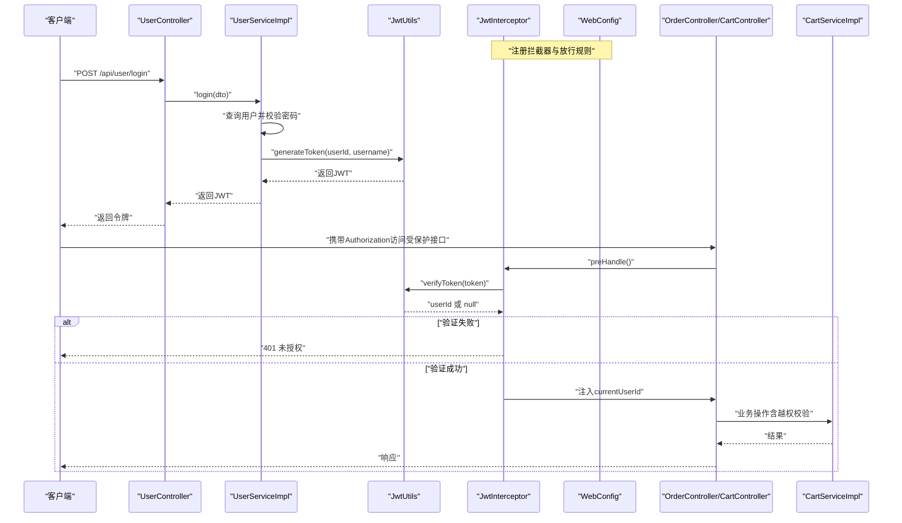
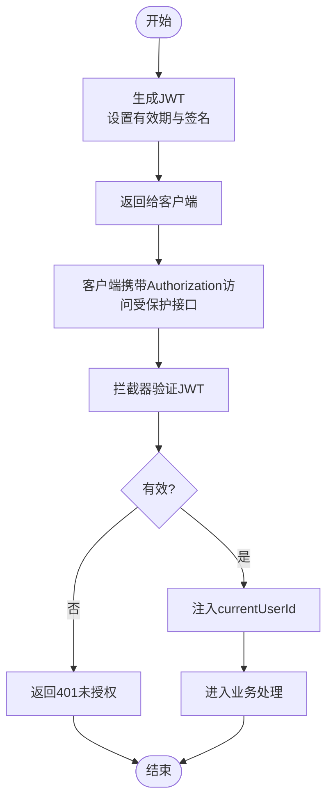
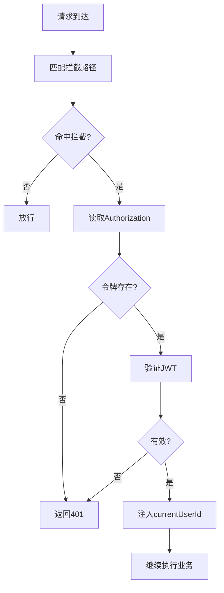
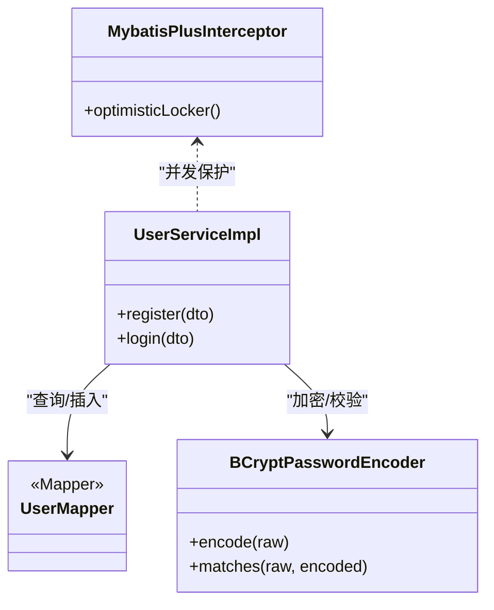
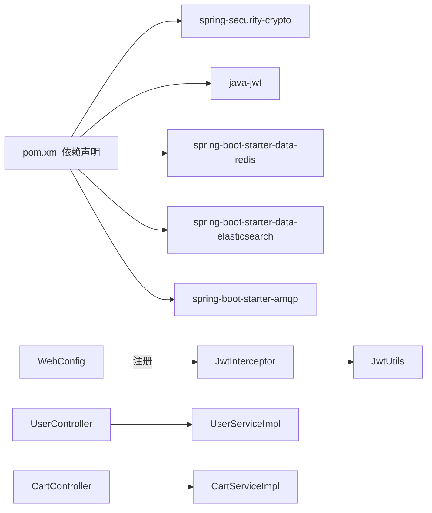

# 安全架构

<cite>
**本文引用的文件**
- [JwtUtils.java](file://src/main/java/com/bohao/globalshop/common/JwtUtils.java)
- [JwtInterceptor.java](file://src/main/java/com/bohao/globalshop/interceptor/JwtInterceptor.java)
- [WebConfig.java](file://src/main/java/com/bohao/globalshop/config/WebConfig.java)
- [UserController.java](file://src/main/java/com/bohao/globalshop/controller/UserController.java)
- [UserServiceImpl.java](file://src/main/java/com/bohao/globalshop/service/impl/UserServiceImpl.java)
- [CartController.java](file://src/main/java/com/bohao/globalshop/controller/CartController.java)
- [CartServiceImpl.java](file://src/main/java/com/bohao/globalshop/service/impl/CartServiceImpl.java)
- [OrderController.java](file://src/main/java/com/bohao/globalshop/controller/OrderController.java)
- [MybatisPlusConfig.java](file://src/main/java/com/bohao/globalshop/config/MybatisPlusConfig.java)
- [GlobalExceptionHandler.java](file://src/main/java/com/bohao/globalshop/exception/GlobalExceptionHandler.java)
- [application.yml](file://src/main/resources/application.yml)
- [pom.xml](file://pom.xml)
</cite>

## 目录
1. [引言](#引言)
2. [项目结构](#项目结构)
3. [核心组件](#核心组件)
4. [架构总览](#架构总览)
5. [详细组件分析](#详细组件分析)
6. [依赖分析](#依赖分析)
7. [性能考虑](#性能考虑)
8. [故障排除指南](#故障排除指南)
9. [结论](#结论)
10. [附录](#附录)

## 引言
本文件面向安全工程师与合规人员，系统化梳理全球购物平台的安全架构与实现要点，重点覆盖以下方面：
- JWT 认证机制：令牌生成、验证与刷新策略建议
- 请求拦截器与权限控制：拦截路径、放行规则与越权保护
- 密码加密存储与数据库访问安全
- SQL 注入与 XSS 防护现状与改进建议
- CSRF 防护、会话管理与安全响应头配置现状
- 安全最佳实践与常见漏洞预防方案

## 项目结构
项目采用 Spring Boot 三层分层与模块化组织，安全相关的关键位置如下：
- common：通用工具（JWT 工具）
- interceptor：全局拦截器（JWT 校验与用户上下文注入）
- config：Web MVC 配置（拦截器注册、CORS）
- controller/service/impl：业务控制器与服务实现
- exception：全局异常处理
- resources：应用配置（数据库、Redis、Elasticsearch 等）

图表来源
- [WebConfig.java:12-32](file://src/main/java/com/bohao/globalshop/config/WebConfig.java#L12-L32)
- [JwtInterceptor.java:12-34](file://src/main/java/com/bohao/globalshop/interceptor/JwtInterceptor.java#L12-L34)
- [JwtUtils.java:9-39](file://src/main/java/com/bohao/globalshop/common/JwtUtils.java#L9-L39)
- [UserController.java:14-27](file://src/main/java/com/bohao/globalshop/controller/UserController.java#L14-L27)
- [UserServiceImpl.java:16-67](file://src/main/java/com/bohao/globalshop/service/impl/UserServiceImpl.java#L16-L67)
- [CartController.java:15-40](file://src/main/java/com/bohao/globalshop/controller/CartController.java#L15-L40)
- [CartServiceImpl.java:27-121](file://src/main/java/com/bohao/globalshop/service/impl/CartServiceImpl.java#L27-L121)
- [OrderController.java:14-36](file://src/main/java/com/bohao/globalshop/controller/OrderController.java#L14-L36)
- [MybatisPlusConfig.java:8-17](file://src/main/java/com/bohao/globalshop/config/MybatisPlusConfig.java#L8-L17)
- [GlobalExceptionHandler.java:12-32](file://src/main/java/com/bohao/globalshop/exception/GlobalExceptionHandler.java#L12-L32)
- [application.yml:1-42](file://src/main/resources/application.yml#L1-L42)

章节来源
- [WebConfig.java:12-32](file://src/main/java/com/bohao/globalshop/config/WebConfig.java#L12-L32)
- [JwtInterceptor.java:12-34](file://src/main/java/com/bohao/globalshop/interceptor/JwtInterceptor.java#L12-L34)
- [JwtUtils.java:9-39](file://src/main/java/com/bohao/globalshop/common/JwtUtils.java#L9-L39)
- [UserController.java:14-27](file://src/main/java/com/bohao/globalshop/controller/UserController.java#L14-L27)
- [UserServiceImpl.java:16-67](file://src/main/java/com/bohao/globalshop/service/impl/UserServiceImpl.java#L16-L67)
- [CartController.java:15-40](file://src/main/java/com/bohao/globalshop/controller/CartController.java#L15-L40)
- [CartServiceImpl.java:27-121](file://src/main/java/com/bohao/globalshop/service/impl/CartServiceImpl.java#L27-L121)
- [OrderController.java:14-36](file://src/main/java/com/bohao/globalshop/controller/OrderController.java#L14-L36)
- [MybatisPlusConfig.java:8-17](file://src/main/java/com/bohao/globalshop/config/MybatisPlusConfig.java#L8-L17)
- [GlobalExceptionHandler.java:12-32](file://src/main/java/com/bohao/globalshop/exception/GlobalExceptionHandler.java#L12-L32)
- [application.yml:1-42](file://src/main/resources/application.yml#L1-L42)

## 核心组件
- JWT 工具：负责令牌生成与验证，包含密钥与有效期常量
- JWT 拦截器：从请求头读取 Authorization 令牌，验证后注入当前用户标识
- Web 配置：注册拦截器与 CORS 策略
- 用户服务：注册时使用 BCrypt 存储密码；登录时校验密码并签发 JWT
- 购物车服务：核心越权保护在删除接口执行用户 ID 校验
- 全局异常处理：统一异常输出格式，避免敏感信息泄露

章节来源
- [JwtUtils.java:9-39](file://src/main/java/com/bohao/globalshop/common/JwtUtils.java#L9-L39)
- [JwtInterceptor.java:12-34](file://src/main/java/com/bohao/globalshop/interceptor/JwtInterceptor.java#L12-L34)
- [WebConfig.java:12-32](file://src/main/java/com/bohao/globalshop/config/WebConfig.java#L12-L32)
- [UserServiceImpl.java:16-67](file://src/main/java/com/bohao/globalshop/service/impl/UserServiceImpl.java#L16-L67)
- [CartServiceImpl.java:105-121](file://src/main/java/com/bohao/globalshop/service/impl/CartServiceImpl.java#L105-L121)
- [GlobalExceptionHandler.java:12-32](file://src/main/java/com/bohao/globalshop/exception/GlobalExceptionHandler.java#L12-L32)

## 架构总览
下图展示从客户端到业务层的安全控制链路，包括认证拦截、权限注入与越权保护。

图表来源
- [WebConfig.java:16-22](file://src/main/java/com/bohao/globalshop/config/WebConfig.java#L16-L22)
- [JwtInterceptor.java:14-34](file://src/main/java/com/bohao/globalshop/interceptor/JwtInterceptor.java#L14-L34)
- [JwtUtils.java:17-39](file://src/main/java/com/bohao/globalshop/common/JwtUtils.java#L17-L39)
- [UserController.java:24-27](file://src/main/java/com/bohao/globalshop/controller/UserController.java#L24-L27)
- [UserServiceImpl.java:42-66](file://src/main/java/com/bohao/globalshop/service/impl/UserServiceImpl.java#L42-L66)
- [CartController.java:22-39](file://src/main/java/com/bohao/globalshop/controller/CartController.java#L22-L39)
- [CartServiceImpl.java:105-121](file://src/main/java/com/bohao/globalshop/service/impl/CartServiceImpl.java#L105-L121)

## 详细组件分析

### JWT 认证机制
- 令牌生成
  - 使用固定密钥与固定有效期生成 JWT，Claims 包含用户标识与用户名
  - 生成流程由服务层登录接口调用工具类完成
- 令牌验证
  - 拦截器从请求头读取 Authorization，调用工具类验证并提取用户标识
  - 验证失败返回未授权状态
- 刷新策略
  - 当前实现未包含刷新令牌逻辑，建议引入短期访问令牌与长期刷新令牌的双令牌模型，并在服务端维护刷新令牌的黑/白名单与失效时间

图表来源
- [JwtUtils.java:17-39](file://src/main/java/com/bohao/globalshop/common/JwtUtils.java#L17-L39)
- [JwtInterceptor.java:14-34](file://src/main/java/com/bohao/globalshop/interceptor/JwtInterceptor.java#L14-L34)
- [UserServiceImpl.java:62-66](file://src/main/java/com/bohao/globalshop/service/impl/UserServiceImpl.java#L62-L66)

章节来源
- [JwtUtils.java:9-39](file://src/main/java/com/bohao/globalshop/common/JwtUtils.java#L9-L39)
- [JwtInterceptor.java:12-34](file://src/main/java/com/bohao/globalshop/interceptor/JwtInterceptor.java#L12-L34)
- [UserServiceImpl.java:42-66](file://src/main/java/com/bohao/globalshop/service/impl/UserServiceImpl.java#L42-L66)

### 请求拦截器与权限控制
- 拦截范围
  - 对订单、购物车、商户相关接口启用拦截
  - 放行登录、注册与商品相关接口
- 权限注入
  - 验证通过后将 currentUserId 写入请求属性，供后续业务使用
- 越权保护
  - 删除购物车条目时再次校验 userId 一致性，防止越权删除

图表来源
- [WebConfig.java:16-22](file://src/main/java/com/bohao/globalshop/config/WebConfig.java#L16-L22)
- [JwtInterceptor.java:14-34](file://src/main/java/com/bohao/globalshop/interceptor/JwtInterceptor.java#L14-L34)
- [CartServiceImpl.java:113-117](file://src/main/java/com/bohao/globalshop/service/impl/CartServiceImpl.java#L113-L117)

章节来源
- [WebConfig.java:16-22](file://src/main/java/com/bohao/globalshop/config/WebConfig.java#L16-L22)
- [JwtInterceptor.java:14-34](file://src/main/java/com/bohao/globalshop/interceptor/JwtInterceptor.java#L14-L34)
- [CartServiceImpl.java:113-117](file://src/main/java/com/bohao/globalshop/service/impl/CartServiceImpl.java#L113-L117)

### 密码加密存储与数据库访问
- 密码存储
  - 注册时使用 BCrypt 对密码进行不可逆加密后入库
- 登录校验
  - 使用 BCrypt 的 matches 方法进行明文与密文匹配
- 数据库访问
  - 使用 MyBatis-Plus 查询用户与购物车记录，未发现显式拼接 SQL 的情况
- 乐观锁
  - 配置了乐观锁插件，有助于并发场景下的数据一致性

图表来源
- [UserServiceImpl.java:20-66](file://src/main/java/com/bohao/globalshop/service/impl/UserServiceImpl.java#L20-L66)
- [MybatisPlusConfig.java:10-16](file://src/main/java/com/bohao/globalshop/config/MybatisPlusConfig.java#L10-L16)

章节来源
- [UserServiceImpl.java:20-66](file://src/main/java/com/bohao/globalshop/service/impl/UserServiceImpl.java#L20-L66)
- [MybatisPlusConfig.java:10-16](file://src/main/java/com/bohao/globalshop/config/MybatisPlusConfig.java#L10-L16)

### SQL 注入防护
- ORM 使用
  - 通过 MyBatis-Plus 的 QueryWrapper 与条件构造器进行查询，未见原生 SQL 字符串拼接
- 防护结论
  - 基于 ORM 的条件查询可有效降低 SQL 注入风险；仍需确保 DTO 参数校验与业务边界清晰

章节来源
- [UserServiceImpl.java:23-28](file://src/main/java/com/bohao/globalshop/service/impl/UserServiceImpl.java#L23-L28)
- [CartServiceImpl.java:43-46](file://src/main/java/com/bohao/globalshop/service/impl/CartServiceImpl.java#L43-L46)

### XSS 攻击防范
- 现状
  - 未发现专门的 XSS 过滤器或内容转义配置
- 建议
  - 在模板渲染或返回 JSON 前对用户输入进行严格校验与转义
  - 使用安全的视图模板引擎与默认转义策略
  - 对富文本场景采用白名单过滤库（如 HTMLCleaner/JSoup）

[本节为通用安全建议，不直接分析具体文件]

### CSRF 防护
- 现状
  - 未发现 CSRF Token 校验或 SameSite Cookie 设置
- 建议
  - 启用基于 Token 的 CSRF 防护（如 Spring Security 的 CSRF 模块）
  - 对 Cookie 设置 SameSite 属性，限制跨站请求携带凭据
  - 对无状态 API，优先使用 Token 身份验证而非 Session

[本节为通用安全建议，不直接分析具体文件]

### 会话管理与安全头
- 现状
  - CORS 允许携带凭证，但未配置安全响应头（如 X-Content-Type-Options、X-Frame-Options、Content-Security-Policy 等）
- 建议
  - 在网关或过滤器中统一添加安全响应头
  - 对 Session 场景设置 HttpOnly、Secure、SameSite 属性
  - 对静态资源与 API 接口分别制定 CSP 策略

[本节为通用安全建议，不直接分析具体文件]

### 全局异常处理
- 统一输出
  - 捕获运行时与未知异常，返回统一的错误结构，避免直接暴露堆栈
- 建议
  - 结合日志记录与告警，区分业务异常与系统异常
  - 对敏感字段进行脱敏处理

章节来源
- [GlobalExceptionHandler.java:12-32](file://src/main/java/com/bohao/globalshop/exception/GlobalExceptionHandler.java#L12-L32)

## 依赖分析
- 外部依赖
  - spring-security-crypto：提供 BCrypt 加密能力
  - java-jwt：提供 JWT 生成与验证
  - spring-boot-starter-data-redis、redisson、caffeine：缓存与分布式能力
  - spring-boot-starter-data-elasticsearch：搜索引擎集成
  - spring-boot-starter-amqp：消息队列集成
- 内部耦合
  - 拦截器依赖 JWT 工具
  - 控制器依赖服务层，服务层依赖 Mapper 与工具类
  - Web 配置集中注册拦截器与 CORS

图表来源
- [pom.xml:33-101](file://pom.xml#L33-L101)
- [JwtInterceptor.java:3](file://src/main/java/com/bohao/globalshop/interceptor/JwtInterceptor.java#L3)
- [JwtUtils.java:3](file://src/main/java/com/bohao/globalshop/common/JwtUtils.java#L3)
- [WebConfig.java:14](file://src/main/java/com/bohao/globalshop/config/WebConfig.java#L14)

章节来源
- [pom.xml:33-101](file://pom.xml#L33-L101)
- [WebConfig.java:12-32](file://src/main/java/com/bohao/globalshop/config/WebConfig.java#L12-L32)

## 性能考虑
- 缓存策略
  - 使用 Redis 与本地缓存（Caffeine）提升热点数据访问性能
- 并发控制
  - 乐观锁插件减少写冲突导致的重试成本
- 日志与监控
  - 开启标准日志输出，结合外部监控系统追踪异常与延迟

[本节提供一般性指导，不直接分析具体文件]

## 故障排除指南
- 401 未授权
  - 检查请求头 Authorization 是否正确传递
  - 核对令牌有效期与签名密钥
- 越权操作
  - 确认业务层对用户 ID 的二次校验逻辑
- 登录失败
  - 核对用户名是否存在与密码匹配逻辑
- 全局异常
  - 查看统一异常处理器输出与日志记录

章节来源
- [JwtInterceptor.java:19-30](file://src/main/java/com/bohao/globalshop/interceptor/JwtInterceptor.java#L19-L30)
- [CartServiceImpl.java:113-117](file://src/main/java/com/bohao/globalshop/service/impl/CartServiceImpl.java#L113-L117)
- [UserServiceImpl.java:49-61](file://src/main/java/com/bohao/globalshop/service/impl/UserServiceImpl.java#L49-L61)
- [GlobalExceptionHandler.java:15-31](file://src/main/java/com/bohao/globalshop/exception/GlobalExceptionHandler.java#L15-L31)

## 结论
本项目在认证与权限控制层面已具备基础能力：JWT 工具、拦截器与越权校验。建议在现有基础上补充：
- 刷新令牌与黑名单机制
- CSRF 防护与安全响应头
- XSS 防护与内容转义
- 更严格的输入校验与参数过滤
- 安全审计与告警联动

[本节为总结性内容，不直接分析具体文件]

## 附录
- 配置要点
  - 数据源与 Redis、Elasticsearch、RabbitMQ 的连接配置位于应用配置文件中
  - MyBatis-Plus 的驼峰映射与日志输出也在此配置

章节来源
- [application.yml:1-42](file://src/main/resources/application.yml#L1-L42)
- [MybatisPlusConfig.java:10-16](file://src/main/java/com/bohao/globalshop/config/MybatisPlusConfig.java#L10-L16)