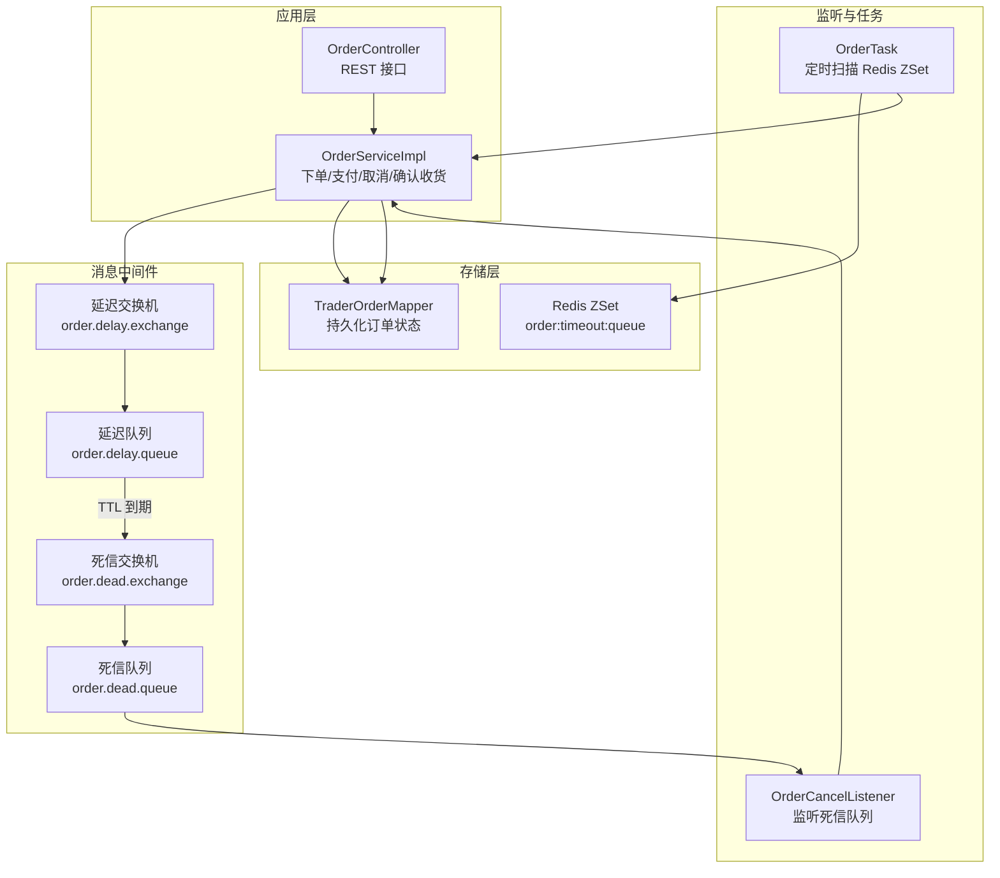
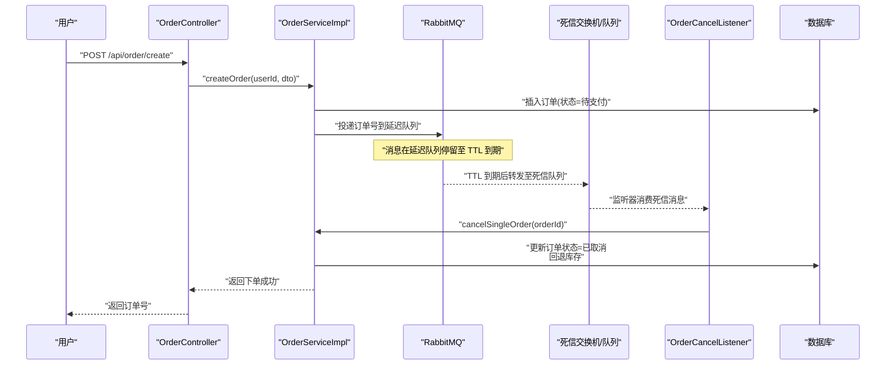
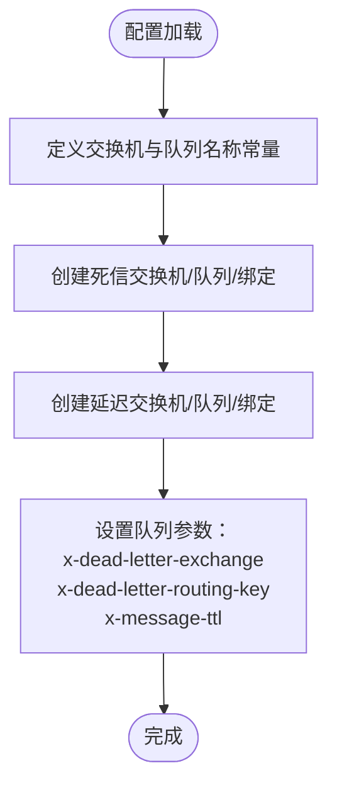
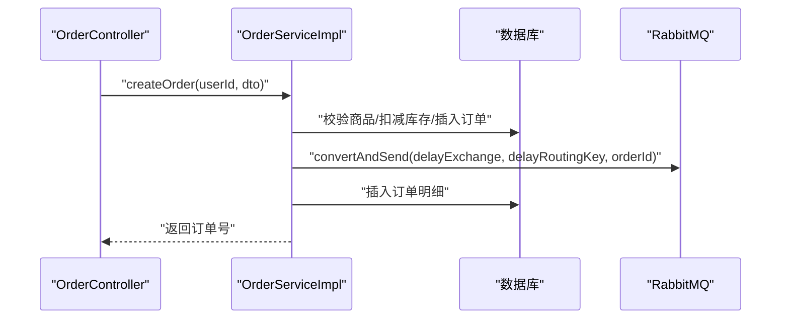
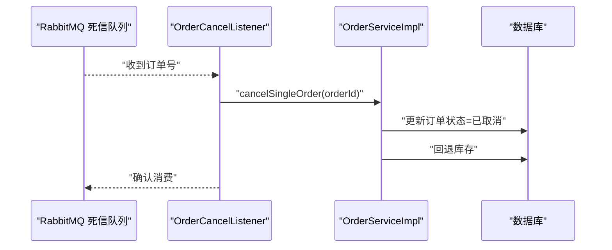
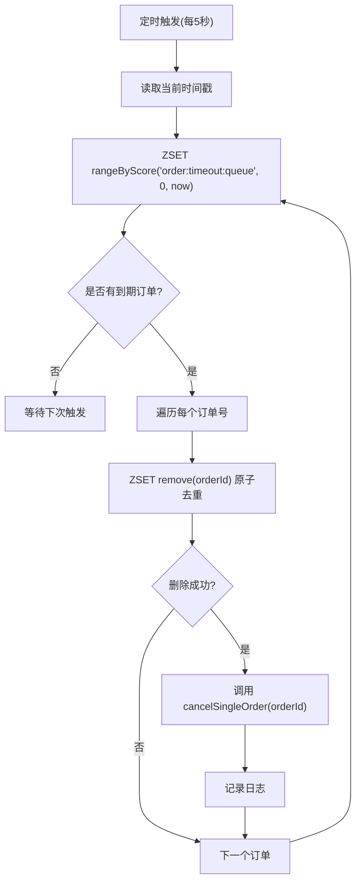
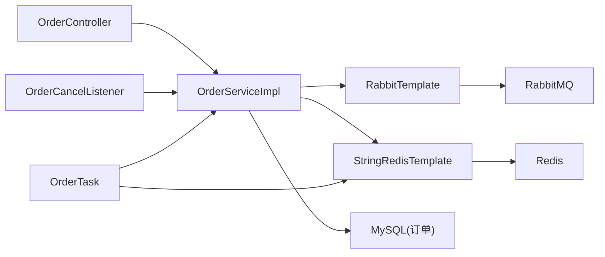

# 异步处理

<cite>
**本文引用的文件列表**
- [RabbitMqConfig.java](file://src/main/java/com/bohao/globalshop/config/RabbitMqConfig.java)
- [OrderCancelListener.java](file://src/main/java/com/bohao/globalshop/listener/OrderCancelListener.java)
- [OrderTask.java](file://src/main/java/com/bohao/globalshop/task/OrderTask.java)
- [OrderServiceImpl.java](file://src/main/java/com/bohao/globalshop/service/impl/OrderServiceImpl.java)
- [OrderController.java](file://src/main/java/com/bohao/globalshop/controller/OrderController.java)
- [application.yml](file://src/main/resources/application.yml)
- [GlobalShopApplication.java](file://src/main/java/com/bohao/globalshop/GlobalShopApplication.java)
- [TradeOrder.java](file://src/main/java/com/bohao/globalshop/entity/TradeOrder.java)
- [TraderOrderMapper.java](file://src/main/java/com/bohao/globalshop/mapper/TraderOrderMapper.java)
</cite>

## 目录
1. [简介](#简介)
2. [项目结构](#项目结构)
3. [核心组件](#核心组件)
4. [架构总览](#架构总览)
5. [详细组件分析](#详细组件分析)
6. [依赖关系分析](#依赖关系分析)
7. [性能考量](#性能考量)
8. [故障排查指南](#故障排查指南)
9. [结论](#结论)
10. [附录](#附录)

## 简介
本文件面向分布式系统开发者，系统性阐述全球购物平台的异步处理机制，重点覆盖：
- 基于 RabbitMQ 的消息队列架构与订单超时取消的异步处理流程
- 定时任务调度机制与订单状态自动更新逻辑
- 消息可靠性保证、死信队列处理与消息重试策略
- 异步处理与同步处理的权衡与适用场景
- 消息队列监控、性能调优与故障恢复方案

## 项目结构
围绕异步处理的关键模块包括：
- 配置层：RabbitMQ 交换机、队列、绑定与 TTL/死信参数配置
- 控制层：订单控制器对外暴露下单、支付、确认收货等接口
- 服务层：订单服务负责下单、支付、取消、确认收货等业务逻辑；下单时将订单号投递到延迟队列
- 监听器层：监听死信队列，触发超时取消
- 定时任务层：基于 Redis ZSet 的延迟队列轮询，兜底处理未进入 MQ 的超时订单
- 应用入口：启用调度能力，确保定时任务生效

图表来源
- [RabbitMqConfig.java:11-59](file://src/main/java/com/bohao/globalshop/config/RabbitMqConfig.java#L11-L59)
- [OrderCancelListener.java:17-27](file://src/main/java/com/bohao/globalshop/listener/OrderCancelListener.java#L17-L27)
- [OrderTask.java:19-42](file://src/main/java/com/bohao/globalshop/task/OrderTask.java#L19-L42)
- [OrderServiceImpl.java:65-67](file://src/main/java/com/bohao/globalshop/service/impl/OrderServiceImpl.java#L65-L67)
- [OrderController.java:19-44](file://src/main/java/com/bohao/globalshop/controller/OrderController.java#L19-L44)

章节来源
- [GlobalShopApplication.java:6-9](file://src/main/java/com/bohao/globalshop/GlobalShopApplication.java#L6-L9)
- [application.yml:29-38](file://src/main/resources/application.yml#L29-L38)

## 核心组件
- RabbitMQ 配置：定义延迟交换机、延迟队列、死信交换机、死信队列，并设置 TTL 与死信转发规则
- 订单服务：下单时将订单号投递到延迟队列；支付成功时可撤销延迟消息（当前实现未显式撤销，但可通过业务幂等避免重复取消）
- 死信监听器：监听死信队列，触发超时取消逻辑
- 定时任务：每 5 秒扫描 Redis ZSet 中已到期的订单号，执行取消与库存回退
- 订单控制器：对外提供下单、支付、确认收货等接口

章节来源
- [RabbitMqConfig.java:11-59](file://src/main/java/com/bohao/globalshop/config/RabbitMqConfig.java#L11-L59)
- [OrderServiceImpl.java:65-67](file://src/main/java/com/bohao/globalshop/service/impl/OrderServiceImpl.java#L65-L67)
- [OrderCancelListener.java:17-27](file://src/main/java/com/bohao/globalshop/listener/OrderCancelListener.java#L17-L27)
- [OrderTask.java:19-42](file://src/main/java/com/bohao/globalshop/task/OrderTask.java#L19-L42)
- [OrderController.java:19-44](file://src/main/java/com/bohao/globalshop/controller/OrderController.java#L19-L44)

## 架构总览
异步处理采用“延迟队列 + 死信队列”的经典模式，结合 Redis ZSet 的定时任务作为兜底，形成高可靠、低耦合的订单超时取消体系。

图表来源
- [OrderController.java:19-24](file://src/main/java/com/bohao/globalshop/controller/OrderController.java#L19-L24)
- [OrderServiceImpl.java:65-81](file://src/main/java/com/bohao/globalshop/service/impl/OrderServiceImpl.java#L65-L81)
- [RabbitMqConfig.java:43-53](file://src/main/java/com/bohao/globalshop/config/RabbitMqConfig.java#L43-L53)
- [OrderCancelListener.java:17-27](file://src/main/java/com/bohao/globalshop/listener/OrderCancelListener.java#L17-L27)
- [TraderOrderMapper.java:1-10](file://src/main/java/com/bohao/globalshop/mapper/TraderOrderMapper.java#L1-L10)

## 详细组件分析

### 组件一：RabbitMQ 延迟与死信配置
- 延迟交换机与队列：用于承载待支付订单的延迟消息
- 死信交换机与队列：用于承接 TTL 到期的消息，触发超时取消
- 关键参数：
  - x-dead-letter-exchange：消息到期后转发的目标交换机
  - x-dead-letter-routing-key：转发时使用的路由键
  - x-message-ttl：消息存活时间（当前测试环境为 10 秒，生产建议 15 分钟）

图表来源
- [RabbitMqConfig.java:11-59](file://src/main/java/com/bohao/globalshop/config/RabbitMqConfig.java#L11-L59)

章节来源
- [RabbitMqConfig.java:11-59](file://src/main/java/com/bohao/globalshop/config/RabbitMqConfig.java#L11-L59)

### 组件二：下单与延迟消息投递
- 下单流程：
  - 校验商品与库存
  - 写入主订单（状态=待支付）
  - 将订单号投递到延迟队列
  - 写入订单明细
  - 返回订单号
- 关键点：
  - 使用 RabbitTemplate 将订单号作为消息体投递
  - 延迟队列 TTL 到期后自动进入死信队列

图表来源
- [OrderController.java:19-24](file://src/main/java/com/bohao/globalshop/controller/OrderController.java#L19-L24)
- [OrderServiceImpl.java:65-81](file://src/main/java/com/bohao/globalshop/service/impl/OrderServiceImpl.java#L65-L81)

章节来源
- [OrderServiceImpl.java:65-81](file://src/main/java/com/bohao/globalshop/service/impl/OrderServiceImpl.java#L65-L81)

### 组件三：死信监听器与超时取消
- 监听器：
  - 监听死信队列，收到订单号后调用服务层取消逻辑
  - 日志记录与异常捕获，便于问题追踪
- 业务逻辑：
  - 若订单仍为待支付状态，则更新为已取消
  - 回退订单明细对应的库存

图表来源
- [OrderCancelListener.java:17-27](file://src/main/java/com/bohao/globalshop/listener/OrderCancelListener.java#L17-L27)
- [OrderServiceImpl.java:240-260](file://src/main/java/com/bohao/globalshop/service/impl/OrderServiceImpl.java#L240-L260)

章节来源
- [OrderCancelListener.java:17-27](file://src/main/java/com/bohao/globalshop/listener/OrderCancelListener.java#L17-L27)
- [OrderServiceImpl.java:240-260](file://src/main/java/com/bohao/globalshop/service/impl/OrderServiceImpl.java#L240-L260)

### 组件四：Redis 定时任务兜底
- 轮询策略：
  - 每 5 秒扫描 Redis ZSet 中 score ≤ 当前时间的订单号
  - 使用 remove 原子操作去重，避免并发重复执行
- 业务逻辑：
  - 调用服务层取消逻辑，完成状态更新与库存回退
  - 记录日志，异常时提示人工介入

图表来源
- [OrderTask.java:19-42](file://src/main/java/com/bohao/globalshop/task/OrderTask.java#L19-L42)
- [OrderServiceImpl.java:240-260](file://src/main/java/com/bohao/globalshop/service/impl/OrderServiceImpl.java#L240-L260)

章节来源
- [OrderTask.java:19-42](file://src/main/java/com/bohao/globalshop/task/OrderTask.java#L19-L42)
- [OrderServiceImpl.java:240-260](file://src/main/java/com/bohao/globalshop/service/impl/OrderServiceImpl.java#L240-L260)

### 组件五：支付与状态流转
- 支付流程：
  - 校验订单与用户权限
  - 校验余额充足
  - 扣款并更新订单状态为已支付
- 状态定义参考：
  - 订单状态字段见实体类定义

章节来源
- [OrderServiceImpl.java:111-138](file://src/main/java/com/bohao/globalshop/service/impl/OrderServiceImpl.java#L111-L138)
- [TradeOrder.java:14-22](file://src/main/java/com/bohao/globalshop/entity/TradeOrder.java#L14-L22)

## 依赖关系分析
- 组件耦合：
  - 订单服务依赖 RabbitTemplate 与 RedisTemplate
  - 监听器依赖订单服务
  - 定时任务依赖 RedisTemplate 与订单服务
- 外部依赖：
  - RabbitMQ：延迟/死信队列
  - Redis：ZSet 延迟队列
  - MySQL：订单状态持久化

图表来源
- [OrderServiceImpl.java:36-36](file://src/main/java/com/bohao/globalshop/service/impl/OrderServiceImpl.java#L36-L36)
- [OrderCancelListener.java:14-14](file://src/main/java/com/bohao/globalshop/listener/OrderCancelListener.java#L14-L14)
- [OrderTask.java:16-17](file://src/main/java/com/bohao/globalshop/task/OrderTask.java#L16-L17)

章节来源
- [OrderServiceImpl.java:36-36](file://src/main/java/com/bohao/globalshop/service/impl/OrderServiceImpl.java#L36-L36)
- [OrderCancelListener.java:14-14](file://src/main/java/com/bohao/globalshop/listener/OrderCancelListener.java#L14-L14)
- [OrderTask.java:16-17](file://src/main/java/com/bohao/globalshop/task/OrderTask.java#L16-L17)

## 性能考量
- 延迟队列 TTL 设置：
  - 测试环境使用短 TTL（10 秒）便于验证
  - 生产建议设置为 15 分钟（900000 毫秒），以平衡实时性与资源占用
- 消息可靠性：
  - 开启发送确认与返回，确保消息不丢失
  - 死信队列兜底，避免 MQ 故障导致的超时漏处理
- 并发与幂等：
  - Redis 原子 remove 去重，避免重复取消
  - 订单状态检查（仅待支付订单才取消），避免重复处理
- 资源优化：
  - 定时任务间隔 5 秒已足够低延迟
  - 可根据业务峰值调整任务并发度与批处理大小

章节来源
- [RabbitMqConfig.java:51-52](file://src/main/java/com/bohao/globalshop/config/RabbitMqConfig.java#L51-L52)
- [application.yml:35-37](file://src/main/resources/application.yml#L35-L37)
- [OrderTask.java:29-29](file://src/main/java/com/bohao/globalshop/task/OrderTask.java#L29-L29)
- [OrderServiceImpl.java:242-247](file://src/main/java/com/bohao/globalshop/service/impl/OrderServiceImpl.java#L242-L247)

## 故障排查指南
- MQ 消息未到达死信队列
  - 检查延迟交换机与队列绑定是否正确
  - 核对 TTL 参数与路由键配置
- 死信监听器未消费
  - 确认监听器队列名与死信队列一致
  - 检查监听器方法签名与消息类型匹配
- 定时任务未触发
  - 确认应用已启用调度（@EnableScheduling）
  - 检查定时表达式与 Redis 连接
- 取消逻辑未生效
  - 核对订单状态是否仍为待支付
  - 检查库存回退是否成功
- 支付后仍被取消
  - 当前实现未显式撤销延迟消息，需在支付成功时补充撤销逻辑（建议在支付成功后主动删除对应延迟消息或在取消逻辑中增加幂等判断）

章节来源
- [GlobalShopApplication.java:9-9](file://src/main/java/com/bohao/globalshop/GlobalShopApplication.java#L9-L9)
- [OrderCancelListener.java:17-27](file://src/main/java/com/bohao/globalshop/listener/OrderCancelListener.java#L17-L27)
- [OrderTask.java:19-42](file://src/main/java/com/bohao/globalshop/task/OrderTask.java#L19-L42)
- [OrderServiceImpl.java:240-260](file://src/main/java/com/bohao/globalshop/service/impl/OrderServiceImpl.java#L240-L260)

## 结论
本系统通过“延迟队列 + 死信队列 + Redis 定时任务”的组合，实现了高可靠、低耦合的订单超时取消机制。RabbitMQ 负责高吞吐、低延迟的消息传递，Redis 定时任务作为兜底保障，二者协同确保业务连续性。生产部署时应根据实际业务峰值与 SLA 调整 TTL、任务间隔与并发策略，并补充支付成功后的延迟消息撤销逻辑，进一步提升一致性与用户体验。

## 附录
- 关键配置与参数
  - RabbitMQ 发送确认与返回：publisher-confirm-type、publisher-returns
  - 延迟队列 TTL：当前测试 10 秒，生产建议 15 分钟
  - 定时任务间隔：每 5 秒扫描一次
- 最佳实践
  - 引入消息幂等：在取消逻辑中增加订单状态与幂等键校验
  - 增加监控告警：对死信队列积压、取消失败率进行监控
  - 异步与同步权衡：下单与支付等强一致场景使用同步，超时取消等最终一致场景使用异步

章节来源
- [application.yml:35-37](file://src/main/resources/application.yml#L35-L37)
- [RabbitMqConfig.java:51-52](file://src/main/java/com/bohao/globalshop/config/RabbitMqConfig.java#L51-L52)
- [OrderTask.java:19-19](file://src/main/java/com/bohao/globalshop/task/OrderTask.java#L19-L19)