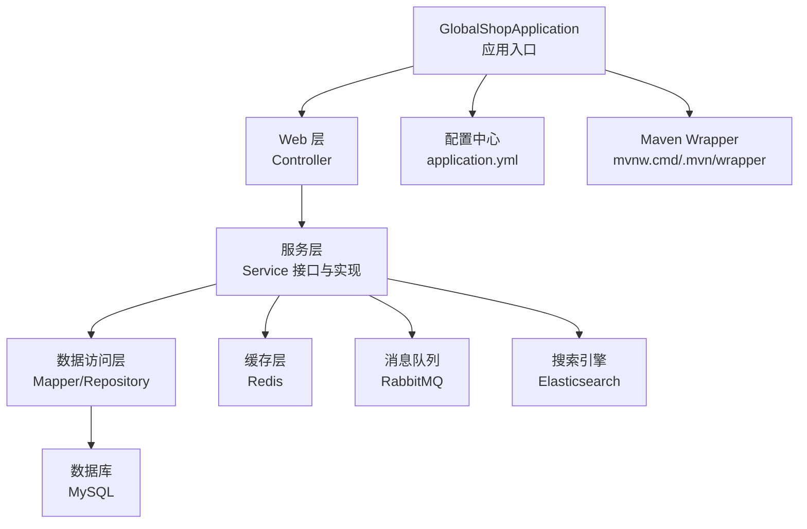
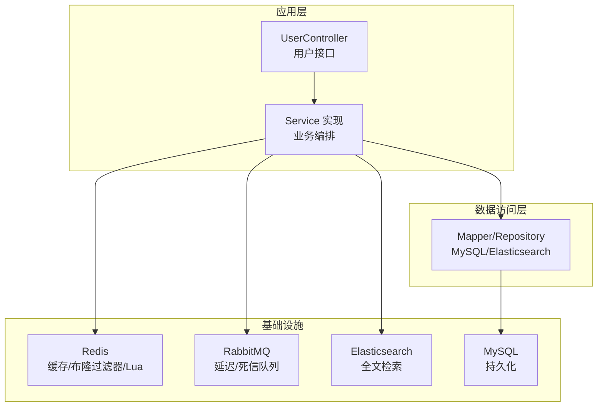
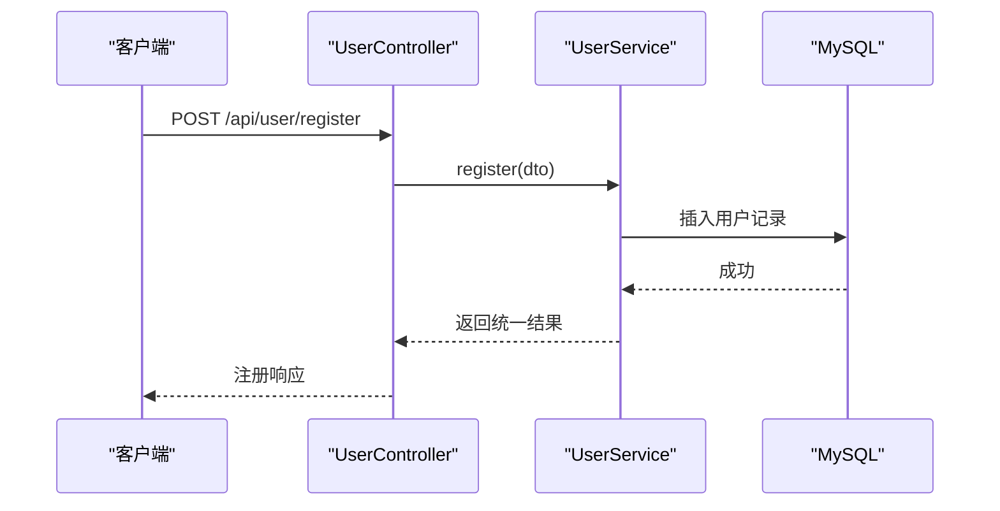
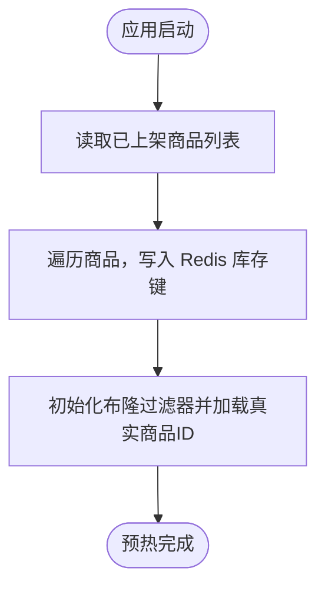
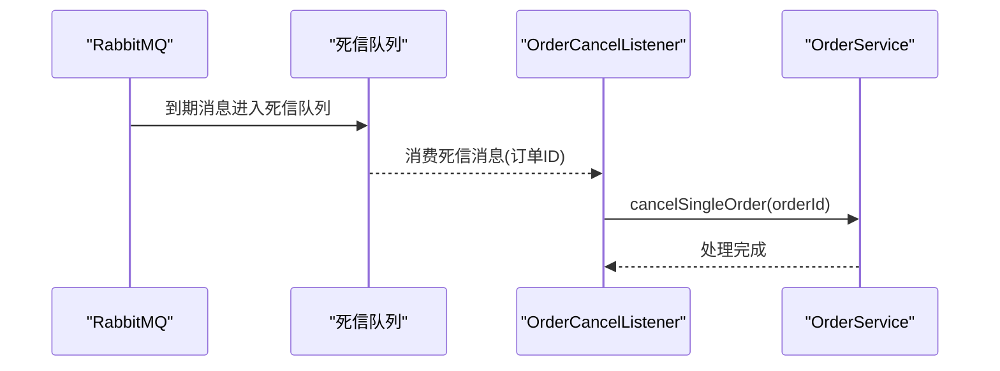
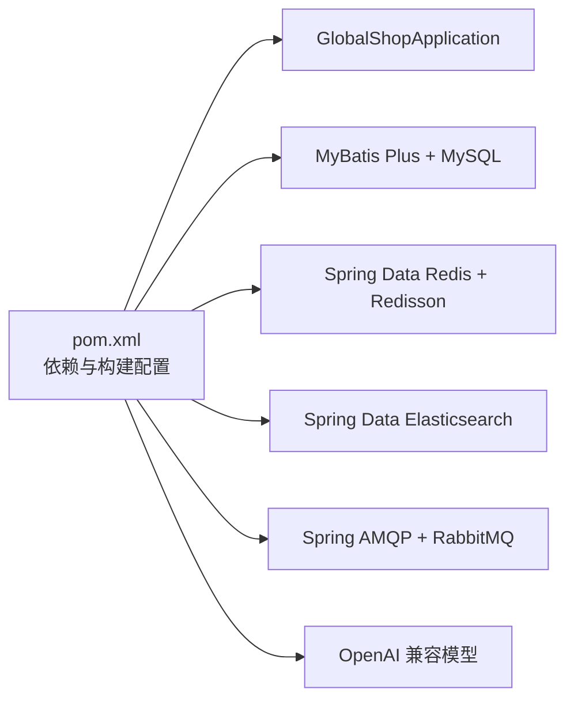

# 快速开始

<cite>
**本文引用的文件**   
- [pom.xml](file://pom.xml)
- [application.yml](file://src/main/resources/application.yml)
- [GlobalShopApplication.java](file://src/main/java/com/bohao/globalshop/GlobalShopApplication.java)
- [mvnw.cmd](file://mvnw.cmd)
- [maven-wrapper.properties](file://.mvn/wrapper/maven-wrapper.properties)
- [RedisConfig.java](file://src/main/java/com/bohao/globalshop/config/RedisConfig.java)
- [RabbitMqConfig.java](file://src/main/java/com/bohao/globalshop/config/RabbitMqConfig.java)
- [CacheManagerConfig.java](file://src/main/java/com/bohao/globalshop/config/CacheManagerConfig.java)
- [WebConfig.java](file://src/main/java/com/bohao/globalshop/config/WebConfig.java)
- [CacheWarmUpRunner.java](file://src/main/java/com/bohao/globalshop/task/CacheWarmUpRunner.java)
- [OrderCancelListener.java](file://src/main/java/com/bohao/globalshop/listener/OrderCancelListener.java)
- [EsProductRepository.java](file://src/main/java/com/bohao/globalshop/repository/EsProductRepository.java)
- [UserController.java](file://src/main/java/com/bohao/globalshop/controller/UserController.java)
- [User.java](file://src/main/java/com/bohao/globalshop/entity/User.java)
- [UserService.java](file://src/main/java/com/bohao/globalshop/service/UserService.java)
</cite>

## 目录
1. [简介](#简介)
2. [项目结构](#项目结构)
3. [核心组件](#核心组件)
4. [架构总览](#架构总览)
5. [详细组件分析](#详细组件分析)
6. [依赖关系分析](#依赖关系分析)
7. [性能与并发特性](#性能与并发特性)
8. [故障排查指南](#故障排查指南)
9. [结论](#结论)
10. [附录：环境安装与启动步骤](#附录环境安装与启动步骤)

## 简介
本指南面向新开发者，帮助你在30分钟内完成全球购物平台项目的环境准备、依赖安装、数据库与中间件初始化、配置修改、启动与验证。项目基于 Spring Boot 3.2.4，使用 JDK 17+、MySQL、Redis、Elasticsearch、RabbitMQ、OpenAI 兼容模型等技术栈。

## 项目结构
- 应用入口位于全局应用类，负责启动 Spring Boot。
- 配置集中在 YAML 文件中，涵盖数据库、Redis、Elasticsearch、RabbitMQ、MyBatis Plus 等。
- 核心模块包括：用户认证、购物车、订单、商品、商户、搜索、缓存与消息队列等。
- 使用 Maven Wrapper 提供跨平台构建能力。

**图示来源**
- [GlobalShopApplication.java:10-14](file://src/main/java/com/bohao/globalshop/GlobalShopApplication.java#L10-L14)
- [application.yml:1-42](file://src/main/resources/application.yml#L1-L42)
- [mvnw.cmd:1-190](file://mvnw.cmd#L1-L190)
- [maven-wrapper.properties:1-4](file://.mvn/wrapper/maven-wrapper.properties#L1-L4)

**章节来源**
- [GlobalShopApplication.java:10-14](file://src/main/java/com/bohao/globalshop/GlobalShopApplication.java#L10-L14)
- [application.yml:1-42](file://src/main/resources/application.yml#L1-L42)
- [mvnw.cmd:1-190](file://mvnw.cmd#L1-L190)
- [maven-wrapper.properties:1-4](file://.mvn/wrapper/maven-wrapper.properties#L1-L4)

## 核心组件
- 应用入口与调度：应用类启用调度，便于定时任务执行。
- 配置中心：集中管理数据库连接、Redis、Elasticsearch、RabbitMQ、OpenAI、MyBatis Plus 等。
- 缓存与布隆过滤器：本地缓存 + Redisson 布隆过滤器，提升查询命中率与抗穿透能力。
- 消息队列：延迟队列 + 死信队列，支撑订单超时取消等异步流程。
- 搜索：基于 Spring Data Elasticsearch 的仓库接口，提供全文检索能力。
- Web 层：统一跨域与 JWT 拦截器，保护受控接口。

**章节来源**
- [GlobalShopApplication.java:8-10](file://src/main/java/com/bohao/globalshop/GlobalShopApplication.java#L8-L10)
- [application.yml:4-42](file://src/main/resources/application.yml#L4-L42)
- [CacheManagerConfig.java:22-52](file://src/main/java/com/bohao/globalshop/config/CacheManagerConfig.java#L22-L52)
- [RedisConfig.java:10-25](file://src/main/java/com/bohao/globalshop/config/RedisConfig.java#L10-L25)
- [RabbitMqConfig.java:9-60](file://src/main/java/com/bohao/globalshop/config/RabbitMqConfig.java#L9-L60)
- [EsProductRepository.java:1-13](file://src/main/java/com/bohao/globalshop/repository/EsProductRepository.java#L1-L13)
- [WebConfig.java:11-34](file://src/main/java/com/bohao/globalshop/config/WebConfig.java#L11-L34)

## 架构总览
系统采用多层架构：Web 控制器接收请求，服务层编排业务，数据访问层对接数据库与搜索引擎，缓存与消息队列贯穿于高性能与可靠性保障。

**图示来源**
- [UserController.java:13-28](file://src/main/java/com/bohao/globalshop/controller/UserController.java#L13-L28)
- [CacheManagerConfig.java:22-52](file://src/main/java/com/bohao/globalshop/config/CacheManagerConfig.java#L22-L52)
- [RedisConfig.java:10-25](file://src/main/java/com/bohao/globalshop/config/RedisConfig.java#L10-L25)
- [RabbitMqConfig.java:9-60](file://src/main/java/com/bohao/globalshop/config/RabbitMqConfig.java#L9-L60)
- [EsProductRepository.java:1-13](file://src/main/java/com/bohao/globalshop/repository/EsProductRepository.java#L1-L13)

## 详细组件分析

### 用户认证与拦截器
- 用户控制器提供注册与登录接口，返回统一结果包装。
- Web 配置定义 CORS 与 JWT 拦截器，对受保护路径进行拦截校验。
- 用户实体映射到数据库表，包含基础字段与时间戳。

**图示来源**
- [UserController.java:19-22](file://src/main/java/com/bohao/globalshop/controller/UserController.java#L19-L22)
- [UserService.java:7-11](file://src/main/java/com/bohao/globalshop/service/UserService.java#L7-L11)
- [User.java:11-22](file://src/main/java/com/bohao/globalshop/entity/User.java#L11-L22)

**章节来源**
- [UserController.java:13-28](file://src/main/java/com/bohao/globalshop/controller/UserController.java#L13-L28)
- [WebConfig.java:16-32](file://src/main/java/com/bohao/globalshop/config/WebConfig.java#L16-L32)
- [User.java:11-22](file://src/main/java/com/bohao/globalshop/entity/User.java#L11-L22)

### 缓存与布隆过滤器
- 本地缓存：Caffeine，设置容量与过期策略，作为 L1 缓存。
- 布隆过滤器：Redisson 布隆过滤器，预热真实存在的商品 ID，降低误判与数据库压力。
- 启动预热：CommandLineRunner 在启动完成后批量写入库存到 Redis，配合 Lua 脚本实现防超卖。

**图示来源**
- [CacheWarmUpRunner.java:27-50](file://src/main/java/com/bohao/globalshop/task/CacheWarmUpRunner.java#L27-L50)
- [CacheManagerConfig.java:36-52](file://src/main/java/com/bohao/globalshop/config/CacheManagerConfig.java#L36-L52)
- [RedisConfig.java:27-44](file://src/main/java/com/bohao/globalshop/config/RedisConfig.java#L27-L44)

**章节来源**
- [CacheManagerConfig.java:22-52](file://src/main/java/com/bohao/globalshop/config/CacheManagerConfig.java#L22-L52)
- [CacheWarmUpRunner.java:17-50](file://src/main/java/com/bohao/globalshop/task/CacheWarmUpRunner.java#L17-L50)
- [RedisConfig.java:10-44](file://src/main/java/com/bohao/globalshop/config/RedisConfig.java#L10-L44)

### 消息队列与订单取消
- 延迟交换机与队列：通过 TTL 将未支付订单转入死信队列。
- 死信监听器：监听死信队列，调用订单服务取消订单并释放库存。

**图示来源**
- [RabbitMqConfig.java:43-58](file://src/main/java/com/bohao/globalshop/config/RabbitMqConfig.java#L43-L58)
- [OrderCancelListener.java:16-27](file://src/main/java/com/bohao/globalshop/listener/OrderCancelListener.java#L16-L27)

**章节来源**
- [RabbitMqConfig.java:9-60](file://src/main/java/com/bohao/globalshop/config/RabbitMqConfig.java#L9-L60)
- [OrderCancelListener.java:10-29](file://src/main/java/com/bohao/globalshop/listener/OrderCancelListener.java#L10-L29)

### 搜索与全文检索
- Elasticsearch 仓库接口基于命名规范自动生成全文检索方法，支持按名称或描述分页查询。

**章节来源**
- [EsProductRepository.java:8-12](file://src/main/java/com/bohao/globalshop/repository/EsProductRepository.java#L8-L12)

## 依赖关系分析
- 构建工具：Maven Wrapper 提供跨平台构建，Java 版本属性与编译插件固定为 17。
- 运行时依赖：Spring Web、MyBatis Plus、MySQL 驱动、Redis、Elasticsearch、AMQP、Redisson、Caffeine、OpenAI 兼容模型等。
- 项目启动：应用类扫描并启动。

**图示来源**
- [pom.xml:29-102](file://pom.xml#L29-L102)
- [GlobalShopApplication.java:8-10](file://src/main/java/com/bohao/globalshop/GlobalShopApplication.java#L8-L10)

**章节来源**
- [pom.xml:29-102](file://pom.xml#L29-L102)
- [GlobalShopApplication.java:8-10](file://src/main/java/com/bohao/globalshop/GlobalShopApplication.java#L8-L10)

## 性能与并发特性
- 缓存策略：本地缓存 + 布隆过滤器 + Redis 预热，降低数据库压力与误判。
- 防超卖：Lua 脚本原子性扣减库存，结合 Redisson 客户端。
- 异步处理：延迟队列 + 死信队列自动取消未支付订单，避免阻塞主线程。
- 搜索优化：Elasticsearch 全文检索，分页返回，适合高并发查询场景。

**章节来源**
- [CacheManagerConfig.java:26-52](file://src/main/java/com/bohao/globalshop/config/CacheManagerConfig.java#L26-L52)
- [RedisConfig.java:27-44](file://src/main/java/com/bohao/globalshop/config/RedisConfig.java#L27-L44)
- [RabbitMqConfig.java:43-58](file://src/main/java/com/bohao/globalshop/config/RabbitMqConfig.java#L43-L58)
- [EsProductRepository.java:8-12](file://src/main/java/com/bohao/globalshop/repository/EsProductRepository.java#L8-L12)

## 故障排查指南
- 数据库连接失败
  - 检查数据库地址、端口、用户名、密码是否与配置一致。
  - 确认数据库已创建且字符集与时区设置正确。
- Redis 连接失败
  - 检查 Redis 地址与端口；若开启认证，需在配置中启用密码。
  - 确认 Redisson 客户端地址前缀与库号设置正确。
- Elasticsearch 认证失败
  - 检查用户名与密码；确认服务已启动并可访问。
- RabbitMQ 连接失败
  - 检查主机、端口、账号与确认机制配置。
  - 确认延迟与死信交换机、队列、绑定已正确声明。
- OpenAI 兼容模型不可用
  - 检查 API Key 与 Base URL；必要时更换可用网关。
- 启动端口冲突
  - 修改服务器端口配置以避免冲突。
- 跨域与鉴权问题
  - 检查 CORS 配置与拦截路径，确保受保护接口正确拦截。

**章节来源**
- [application.yml:4-42](file://src/main/resources/application.yml#L4-L42)
- [RedisConfig.java:12-25](file://src/main/java/com/bohao/globalshop/config/RedisConfig.java#L12-L25)
- [RabbitMqConfig.java:11-19](file://src/main/java/com/bohao/globalshop/config/RabbitMqConfig.java#L11-L19)
- [WebConfig.java:26-32](file://src/main/java/com/bohao/globalshop/config/WebConfig.java#L26-L32)

## 结论
通过本快速开始指南，你可以在30分钟内完成从环境准备到项目启动与验证的全流程。建议在本地开发环境中先行完成数据库与中间件初始化，再进行应用启动与接口验证，确保各组件连接正常后再进行功能联调。

## 附录：环境安装与启动步骤

### 环境要求
- JDK 17+：用于编译与运行 Spring Boot 应用。
- Maven：使用 Maven Wrapper 提供跨平台构建能力。
- MySQL：用于持久化用户、商品、订单等数据。
- Redis：用于缓存、布隆过滤器与库存扣减。
- Elasticsearch：用于商品全文检索。
- RabbitMQ：用于订单延迟取消等异步流程。
- OpenAI 兼容模型：用于 AI 相关能力（可选）。

### 安装与配置步骤（Windows）

1) 克隆项目
- 使用 Git 克隆仓库至本地目录。

2) 安装与配置 MySQL
- 安装 MySQL 服务，创建数据库与用户。
- 在配置文件中更新数据库连接信息（地址、端口、用户名、密码）。

3) 安装与配置 Redis
- 安装 Redis 服务，启动实例。
- 若启用认证，修改配置中的密码项。
- 确认 Redisson 客户端地址与库号设置正确。

4) 安装与配置 Elasticsearch
- 安装并启动 Elasticsearch 服务。
- 如启用安全认证，配置用户名与密码。
- 确认服务可达并可访问。

5) 安装与配置 RabbitMQ
- 安装并启动 RabbitMQ 服务。
- 配置主机、端口、账号与确认机制。
- 确认延迟与死信交换机、队列、绑定已创建。

6) 安装与配置 OpenAI 兼容模型（可选）
- 在配置文件中填写有效的 API Key 与 Base URL。
- 如需向量模型，配置相应参数。

7) 修改配置文件
- 打开配置文件，按需调整数据库、Redis、Elasticsearch、RabbitMQ、OpenAI 等连接信息。
- 确保端口与网络可达性符合实际部署环境。

8) 启动项目
- 使用 Maven Wrapper 执行构建与启动命令。
- 查看控制台输出，确认应用启动成功。

9) 验证服务
- 访问健康检查接口，确认服务可用。
- 调用用户注册与登录接口，验证鉴权流程。
- 检查缓存预热与布隆过滤器初始化日志。
- 发送测试消息到延迟队列，观察死信监听器处理结果。

### 常见问题与解决方案
- 数据库连接失败：核对地址、端口、用户名、密码与字符集设置。
- Redis 连接失败：检查地址、端口与认证配置；确认网络连通。
- Elasticsearch 认证失败：核对用户名与密码；确认服务状态。
- RabbitMQ 连接失败：核对主机、端口与账号；确认交换机与队列存在。
- OpenAI 兼容模型不可用：更换可用网关或检查 API Key。
- 启动端口冲突：修改服务器端口配置。
- 跨域与鉴权问题：检查 CORS 与拦截路径配置。

### 不同操作系统安装要点
- Windows：使用提供的批处理脚本与配置文件；注意路径分隔符与权限。
- Linux/macOS：使用终端执行 Maven Wrapper 命令；确保 JDK 与 Maven 环境变量正确。
- Docker：可将各中间件容器化部署，通过网络互通与环境变量注入配置。