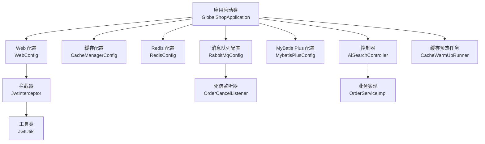
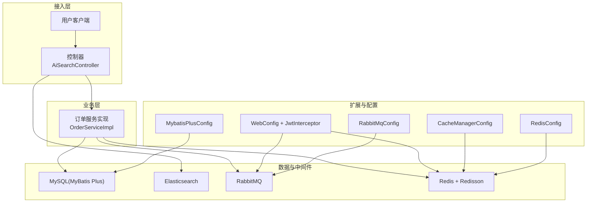
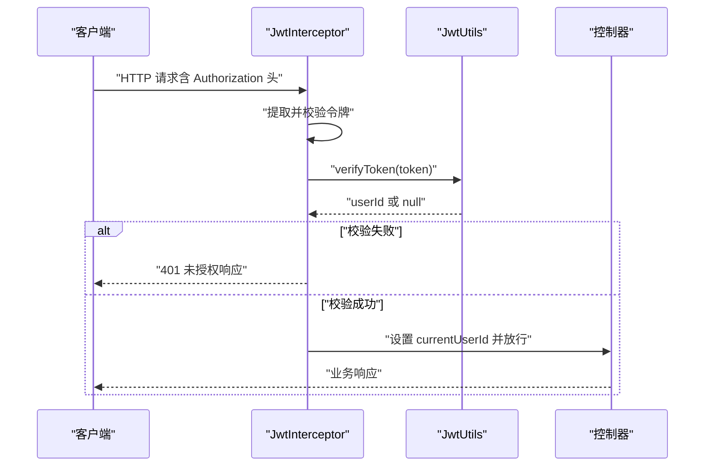
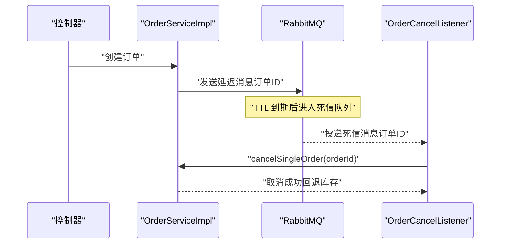
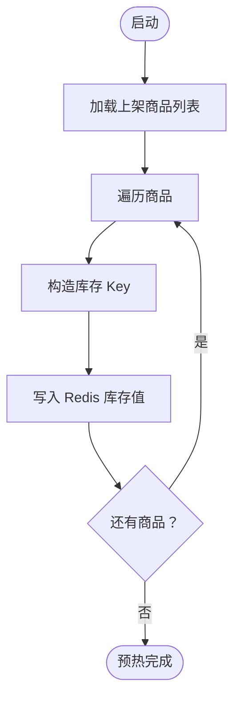
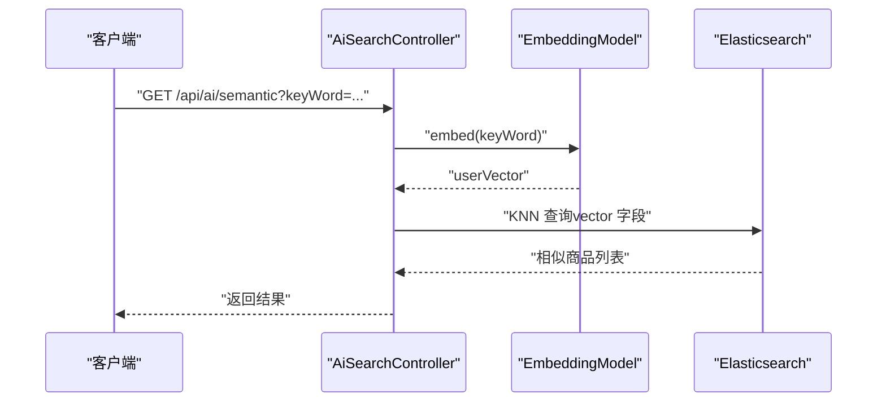
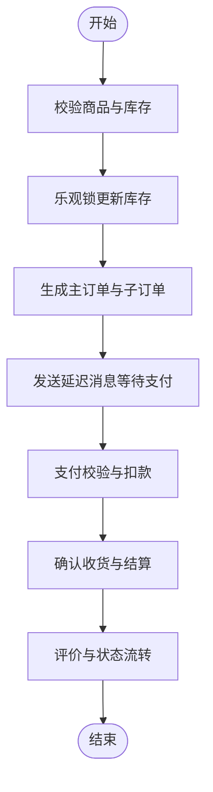
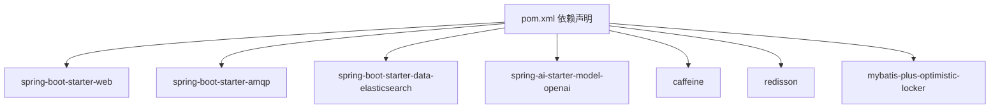

# 扩展开发

<cite>
**本文引用的文件**
- [GlobalShopApplication.java](file://src/main/java/com/bohao/globalshop/GlobalShopApplication.java)
- [WebConfig.java](file://src/main/java/com/bohao/globalshop/config/WebConfig.java)
- [JwtInterceptor.java](file://src/main/java/com/bohao/globalshop/interceptor/JwtInterceptor.java)
- [JwtUtils.java](file://src/main/java/com/bohao/globalshop/common/JwtUtils.java)
- [RabbitMqConfig.java](file://src/main/java/com/bohao/globalshop/config/RabbitMqConfig.java)
- [OrderCancelListener.java](file://src/main/java/com/bohao/globalshop/listener/OrderCancelListener.java)
- [CacheManagerConfig.java](file://src/main/java/com/bohao/globalshop/config/CacheManagerConfig.java)
- [RedisConfig.java](file://src/main/java/com/bohao/globalshop/config/RedisConfig.java)
- [MybatisPlusConfig.java](file://src/main/java/com/bohao/globalshop/config/MybatisPlusConfig.java)
- [AiSearchController.java](file://src/main/java/com/bohao/globalshop/controller/AiSearchController.java)
- [OrderServiceImpl.java](file://src/main/java/com/bohao/globalshop/service/impl/OrderServiceImpl.java)
- [CacheWarmUpRunner.java](file://src/main/java/com/bohao/globalshop/task/CacheWarmUpRunner.java)
- [application.yml](file://src/main/resources/application.yml)
- [pom.xml](file://pom.xml)
</cite>

## 目录
1. [简介](#简介)
2. [项目结构](#项目结构)
3. [核心组件](#核心组件)
4. [架构总览](#架构总览)
5. [详细组件分析](#详细组件分析)
6. [依赖分析](#依赖分析)
7. [性能考虑](#性能考虑)
8. [故障排查指南](#故障排查指南)
9. [结论](#结论)
10. [附录](#附录)

## 简介
本扩展开发文档面向高级开发者与系统集成商，围绕全球购物平台的插件化扩展能力，系统阐述以下主题：
- 插件系统架构与扩展点：拦截器、消息监听器、缓存策略的扩展方法
- 第三方服务集成：认证、消息队列、搜索引擎与AI模型的对接与最佳实践
- Spring AI 集成：向量化注入与语义检索的扩展开发
- 性能优化与功能增强：分布式锁、布隆过滤器、延迟队列、缓存预热等
- 定制化开发：基于现有扩展点的二次开发指南

## 项目结构
项目采用标准的 Spring Boot 层次化组织，主要模块如下：
- 启动入口：应用启动类负责扫描与启用调度
- 配置层：Web、拦截器、缓存、Redis、RabbitMQ、MyBatis Plus 等配置
- 控制器层：对外暴露 REST 接口，如订单、用户、AI 搜索等
- 业务层：订单、用户、商品等服务实现
- 数据访问层：MyBatis Mapper 与 Elasticsearch Repository
- 监听与任务：RabbitMQ 死信监听与缓存预热任务
- 工具与实体：通用结果封装、JWT 工具、实体与 VO

图表来源
- [GlobalShopApplication.java:1-17](file://src/main/java/com/bohao/globalshop/GlobalShopApplication.java#L1-L17)
- [WebConfig.java:1-36](file://src/main/java/com/bohao/globalshop/config/WebConfig.java#L1-L36)
- [JwtInterceptor.java:1-36](file://src/main/java/com/bohao/globalshop/interceptor/JwtInterceptor.java#L1-L36)
- [JwtUtils.java:1-41](file://src/main/java/com/bohao/globalshop/common/JwtUtils.java#L1-L41)
- [CacheManagerConfig.java:1-55](file://src/main/java/com/bohao/globalshop/config/CacheManagerConfig.java#L1-L55)
- [RedisConfig.java:1-46](file://src/main/java/com/bohao/globalshop/config/RedisConfig.java#L1-L46)
- [RabbitMqConfig.java:1-61](file://src/main/java/com/bohao/globalshop/config/RabbitMqConfig.java#L1-L61)
- [OrderCancelListener.java:1-30](file://src/main/java/com/bohao/globalshop/listener/OrderCancelListener.java#L1-L30)
- [MybatisPlusConfig.java:1-18](file://src/main/java/com/bohao/globalshop/config/MybatisPlusConfig.java#L1-L18)
- [AiSearchController.java:1-93](file://src/main/java/com/bohao/globalshop/controller/AiSearchController.java#L1-L93)
- [OrderServiceImpl.java:1-330](file://src/main/java/com/bohao/globalshop/service/impl/OrderServiceImpl.java#L1-L330)
- [CacheWarmUpRunner.java:1-52](file://src/main/java/com/bohao/globalshop/task/CacheWarmUpRunner.java#L1-L52)

章节来源
- [GlobalShopApplication.java:1-17](file://src/main/java/com/bohao/globalshop/GlobalShopApplication.java#L1-L17)
- [pom.xml:1-147](file://pom.xml#L1-L147)

## 核心组件
- 应用启动与调度：启用调度注解，便于后续定时任务与异步扩展
- Web 与拦截器：统一跨域与路径拦截，JWT 校验贯穿订单、购物车、商户相关接口
- 缓存体系：Caffeine 本地缓存 + Redisson 布隆过滤器 + Redis 字符串缓存
- 消息队列：延迟交换机与死信队列联动，实现订单超时自动取消
- 数据访问：MyBatis Plus 乐观锁插件；Elasticsearch 语义检索与向量存储
- AI 能力：Spring AI 向量化模型注入商品与用户查询，支持 KNN 语义检索
- 任务与预热：启动时预热库存缓存，保障高并发秒杀场景

章节来源
- [WebConfig.java:16-32](file://src/main/java/com/bohao/globalshop/config/WebConfig.java#L16-L32)
- [JwtInterceptor.java:14-34](file://src/main/java/com/bohao/globalshop/interceptor/JwtInterceptor.java#L14-L34)
- [CacheManagerConfig.java:26-52](file://src/main/java/com/bohao/globalshop/config/CacheManagerConfig.java#L26-L52)
- [RedisConfig.java:12-44](file://src/main/java/com/bohao/globalshop/config/RedisConfig.java#L12-L44)
- [RabbitMqConfig.java:11-59](file://src/main/java/com/bohao/globalshop/config/RabbitMqConfig.java#L11-L59)
- [MybatisPlusConfig.java:10-16](file://src/main/java/com/bohao/globalshop/config/MybatisPlusConfig.java#L10-L16)
- [AiSearchController.java:24-29](file://src/main/java/com/bohao/globalshop/controller/AiSearchController.java#L24-L29)
- [OrderServiceImpl.java:38-81](file://src/main/java/com/bohao/globalshop/service/impl/OrderServiceImpl.java#L38-L81)
- [CacheWarmUpRunner.java:27-50](file://src/main/java/com/bohao/globalshop/task/CacheWarmUpRunner.java#L27-L50)

## 架构总览
系统采用“控制器-服务-数据访问-中间件”的分层架构，结合缓存、消息队列与AI检索形成高性能与智能化的扩展基座。

图表来源
- [AiSearchController.java:20-93](file://src/main/java/com/bohao/globalshop/controller/AiSearchController.java#L20-L93)
- [OrderServiceImpl.java:24-330](file://src/main/java/com/bohao/globalshop/service/impl/OrderServiceImpl.java#L24-L330)
- [WebConfig.java:12-32](file://src/main/java/com/bohao/globalshop/config/WebConfig.java#L12-L32)
- [RabbitMqConfig.java:9-61](file://src/main/java/com/bohao/globalshop/config/RabbitMqConfig.java#L9-L61)
- [CacheManagerConfig.java:19-55](file://src/main/java/com/bohao/globalshop/config/CacheManagerConfig.java#L19-L55)
- [RedisConfig.java:10-46](file://src/main/java/com/bohao/globalshop/config/RedisConfig.java#L10-L46)
- [MybatisPlusConfig.java:8-18](file://src/main/java/com/bohao/globalshop/config/MybatisPlusConfig.java#L8-L18)

## 详细组件分析

### 拦截器扩展：JWT 认证与路径控制
- 扩展点：WebConfig 中注册拦截器，指定拦截路径与排除路径
- 核心逻辑：JwtInterceptor 从请求头读取令牌，调用 JwtUtils 校验并写入用户标识到请求属性
- 自定义建议：
  - 新增业务拦截器：实现 HandlerInterceptor，在 WebConfig 中注册
  - 动态权限：在拦截器中读取用户角色，结合注解或策略进行细粒度授权
  - 日志与审计：在拦截器中记录请求上下文，便于追踪与审计

图表来源
- [WebConfig.java:16-23](file://src/main/java/com/bohao/globalshop/config/WebConfig.java#L16-L23)
- [JwtInterceptor.java:14-34](file://src/main/java/com/bohao/globalshop/interceptor/JwtInterceptor.java#L14-L34)
- [JwtUtils.java:28-38](file://src/main/java/com/bohao/globalshop/common/JwtUtils.java#L28-L38)

章节来源
- [WebConfig.java:12-32](file://src/main/java/com/bohao/globalshop/config/WebConfig.java#L12-L32)
- [JwtInterceptor.java:11-36](file://src/main/java/com/bohao/globalshop/interceptor/JwtInterceptor.java#L11-L36)
- [JwtUtils.java:9-41](file://src/main/java/com/bohao/globalshop/common/JwtUtils.java#L9-L41)

### 消息监听器扩展：订单超时自动取消
- 扩展点：RabbitMqConfig 定义死信交换机与队列；OrderCancelListener 监听死信队列
- 核心逻辑：订单创建后进入延迟队列，到期未支付自动进入死信队列，监听器触发取消并回退库存
- 自定义建议：
  - 新增监听器：实现 @RabbitListener，绑定目标队列，处理特定业务事件
  - 重试与死信：为新队列配置 TTL 与死信交换机，避免无限重试
  - 幂等性：在监听器中增加幂等校验，避免重复处理

图表来源
- [OrderServiceImpl.java:65-67](file://src/main/java/com/bohao/globalshop/service/impl/OrderServiceImpl.java#L65-L67)
- [RabbitMqConfig.java:45-53](file://src/main/java/com/bohao/globalshop/config/RabbitMqConfig.java#L45-L53)
- [OrderCancelListener.java:17-27](file://src/main/java/com/bohao/globalshop/listener/OrderCancelListener.java#L17-L27)

章节来源
- [RabbitMqConfig.java:9-61](file://src/main/java/com/bohao/globalshop/config/RabbitMqConfig.java#L9-L61)
- [OrderCancelListener.java:1-30](file://src/main/java/com/bohao/globalshop/listener/OrderCancelListener.java#L1-L30)
- [OrderServiceImpl.java:238-260](file://src/main/java/com/bohao/globalshop/service/impl/OrderServiceImpl.java#L238-L260)

### 缓存策略扩展：本地缓存、布隆过滤器与预热
- 扩展点：CacheManagerConfig 提供 Caffeine 本地缓存与 Redisson 布隆过滤器；RedisConfig 提供 Lua 脚本；CacheWarmUpRunner 启动预热
- 核心逻辑：
  - 本地缓存：热点商品详情快速命中
  - 布隆过滤器：快速判定商品是否存在，降低误判率
  - 预热任务：启动时将库存写入 Redis，保障高并发秒杀
- 自定义建议：
  - 新增缓存策略：在 CacheManagerConfig 中新增 Bean，结合业务热点选择合适 TTL 与容量
  - 布隆参数：根据数据规模与误判率调整初始化参数
  - 预热策略：按业务维度（品类、区域）分批预热，避免冷启动抖动

图表来源
- [CacheWarmUpRunner.java:27-50](file://src/main/java/com/bohao/globalshop/task/CacheWarmUpRunner.java#L27-L50)
- [CacheManagerConfig.java:37-52](file://src/main/java/com/bohao/globalshop/config/CacheManagerConfig.java#L37-L52)
- [RedisConfig.java:28-44](file://src/main/java/com/bohao/globalshop/config/RedisConfig.java#L28-L44)

章节来源
- [CacheManagerConfig.java:19-55](file://src/main/java/com/bohao/globalshop/config/CacheManagerConfig.java#L19-L55)
- [RedisConfig.java:10-46](file://src/main/java/com/bohao/globalshop/config/RedisConfig.java#L10-L46)
- [CacheWarmUpRunner.java:14-52](file://src/main/java/com/bohao/globalshop/task/CacheWarmUpRunner.java#L14-L52)

### 第三方服务集成与最佳实践
- 认证与授权：JWT 令牌生成与校验，拦截器统一校验，避免重复校验逻辑
- 消息队列：延迟队列 + 死信队列实现订单超时自动取消，开启发送确认与返回，确保消息可靠
- 搜索引擎：Elasticsearch 存储商品向量，Spring AI 生成嵌入，KNN 查询实现语义检索
- 缓存与限流：Redis 布隆过滤器 + Lua 原子扣减，防止超卖；本地缓存降低热点压力
- 数据一致性：MyBatis Plus 乐观锁插件，减少并发冲突导致的数据不一致

章节来源
- [application.yml:4-42](file://src/main/resources/application.yml#L4-L42)
- [pom.xml:33-102](file://pom.xml#L33-L102)

### Spring AI 集成与扩展开发
- 集成方式：通过 Spring AI Starter 注入 EmbeddingModel，结合 ElasticsearchOperations 实现 KNN 语义检索
- 扩展开发：
  - 向量化注入：批量生成商品向量并写回 ES
  - 语义搜索：将用户查询转为向量，执行 KNN 检索，返回相似商品
  - 模型适配：在 application.yml 中配置不同模型与网关，支持多供应商切换
  - 结果增强：结合商品画像、销量、评分等特征进行 rerank

图表来源
- [AiSearchController.java:58-91](file://src/main/java/com/bohao/globalshop/controller/AiSearchController.java#L58-L91)

章节来源
- [AiSearchController.java:20-93](file://src/main/java/com/bohao/globalshop/controller/AiSearchController.java#L20-L93)
- [application.yml:19-28](file://src/main/resources/application.yml#L19-L28)
- [pom.xml:94-97](file://pom.xml#L94-L97)

### 订单流程与并发控制
- 下单流程：校验商品与库存，乐观锁更新，生成主订单与子订单，发送延迟消息
- 支付流程：校验订单状态与用户身份，余额扣减，更新订单状态
- 取消流程：仅待支付订单可取消，回退库存
- 结算流程：按店铺拆单，Redis Lua 原子扣减，同步写库，发送延迟消息

图表来源
- [OrderServiceImpl.java:38-81](file://src/main/java/com/bohao/globalshop/service/impl/OrderServiceImpl.java#L38-L81)
- [OrderServiceImpl.java:110-138](file://src/main/java/com/bohao/globalshop/service/impl/OrderServiceImpl.java#L110-L138)
- [OrderServiceImpl.java:238-260](file://src/main/java/com/bohao/globalshop/service/impl/OrderServiceImpl.java#L238-L260)

章节来源
- [OrderServiceImpl.java:24-330](file://src/main/java/com/bohao/globalshop/service/impl/OrderServiceImpl.java#L24-L330)

## 依赖分析
- Spring Boot 与 Starter：Web、AMQP、Elasticsearch、AI Starter
- 缓存与分布式：Caffeine、Redisson、StringRedisTemplate
- ORM 与插件：MyBatis Plus 乐观锁插件
- 工具与日志：Lombok、SLF4J

图表来源
- [pom.xml:33-102](file://pom.xml#L33-L102)

章节来源
- [pom.xml:1-147](file://pom.xml#L1-L147)

## 性能考虑
- 缓存分层：本地缓存（Caffeine）+ 远端缓存（Redis），热点数据就近命中
- 原子操作：Redis Lua 脚本扣减库存，避免超卖与并发竞争
- 延迟队列：异步取消订单，避免主线程阻塞
- 布隆过滤器：快速判定商品存在性，降低无效查询
- 乐观锁：MyBatis Plus 插件，减少并发写冲突
- 启动预热：系统启动即预热关键缓存，降低首峰抖动

章节来源
- [CacheManagerConfig.java:26-52](file://src/main/java/com/bohao/globalshop/config/CacheManagerConfig.java#L26-L52)
- [RedisConfig.java:28-44](file://src/main/java/com/bohao/globalshop/config/RedisConfig.java#L28-L44)
- [MybatisPlusConfig.java:10-16](file://src/main/java/com/bohao/globalshop/config/MybatisPlusConfig.java#L10-L16)
- [CacheWarmUpRunner.java:27-50](file://src/main/java/com/bohao/globalshop/task/CacheWarmUpRunner.java#L27-L50)
- [OrderServiceImpl.java:174-191](file://src/main/java/com/bohao/globalshop/service/impl/OrderServiceImpl.java#L174-L191)

## 故障排查指南
- 认证失败：检查拦截器是否正确读取 Authorization 头，确认令牌签名与有效期
- 跨域问题：确认 WebConfig 中 CORS 配置允许的源、方法与头
- 消息丢失：检查 RabbitMQ 发送确认与返回配置，确认死信交换机绑定
- 缓存不生效：确认布隆过滤器初始化与预热任务执行情况
- AI 检索异常：检查 EmbeddingModel 配置与 ES 向量字段映射
- 并发冲突：检查乐观锁版本号与数据库更新结果

章节来源
- [WebConfig.java:25-32](file://src/main/java/com/bohao/globalshop/config/WebConfig.java#L25-L32)
- [application.yml:35-37](file://src/main/resources/application.yml#L35-L37)
- [CacheManagerConfig.java:37-52](file://src/main/java/com/bohao/globalshop/config/CacheManagerConfig.java#L37-L52)
- [AiSearchController.java:24-29](file://src/main/java/com/bohao/globalshop/controller/AiSearchController.java#L24-L29)
- [OrderServiceImpl.java:49-54](file://src/main/java/com/bohao/globalshop/service/impl/OrderServiceImpl.java#L49-L54)

## 结论
本项目提供了完善的扩展基座：拦截器统一鉴权、消息队列可靠投递、缓存与布隆过滤器、AI 语义检索与向量化注入。基于这些扩展点，开发者可快速实现自定义拦截器、消息监听器与缓存策略，同时结合 Spring AI 与第三方服务实现智能化功能增强。建议在生产环境中进一步完善监控、告警与灰度发布策略，确保系统稳定与可演进。

## 附录
- 配置文件要点：数据库、Redis、Elasticsearch、AI、RabbitMQ 的连接与选项
- Maven 依赖：Starter 与第三方库版本管理
- 启动类：启用调度，便于扩展定时任务与异步处理

章节来源
- [application.yml:1-42](file://src/main/resources/application.yml#L1-L42)
- [pom.xml:1-147](file://pom.xml#L1-L147)
- [GlobalShopApplication.java:8-16](file://src/main/java/com/bohao/globalshop/GlobalShopApplication.java#L8-L16)