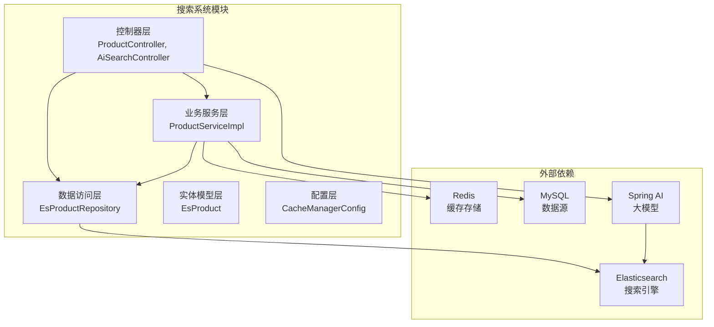
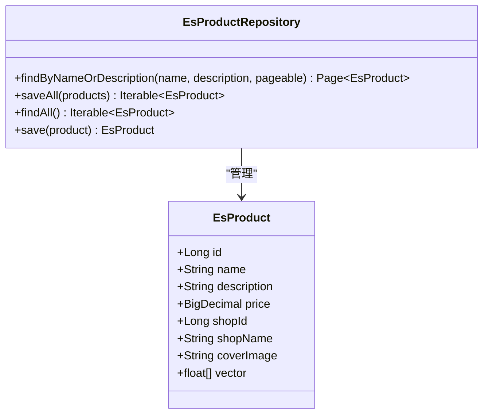
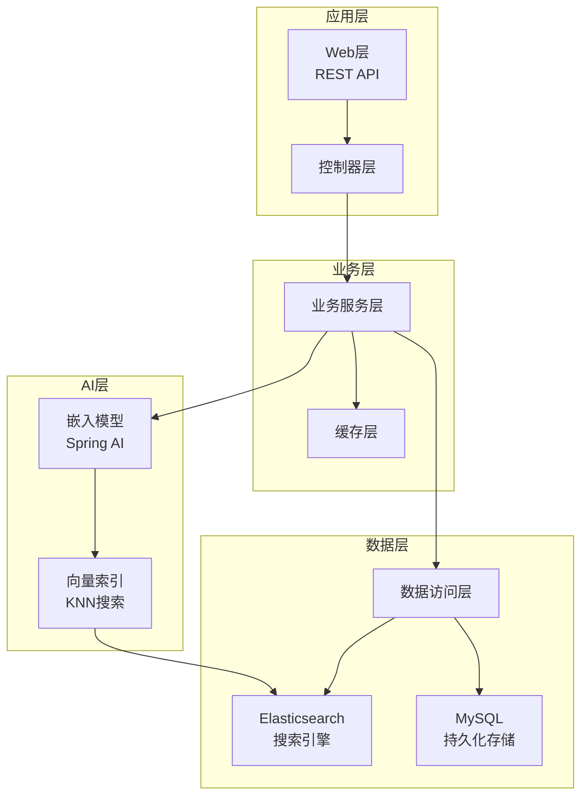
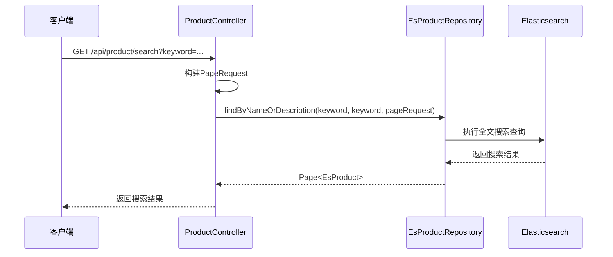
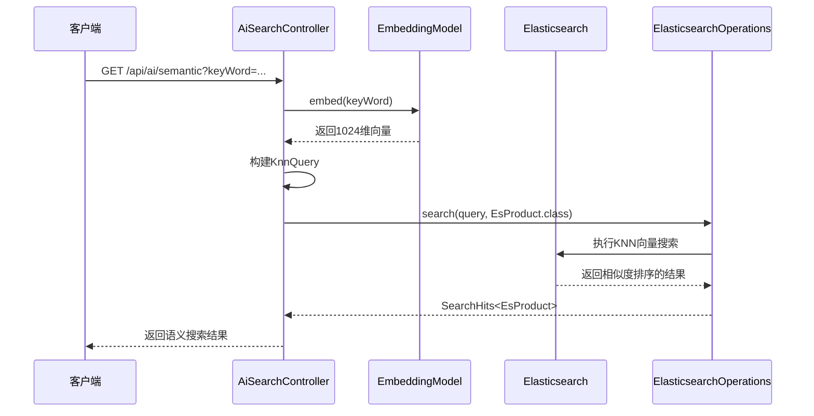
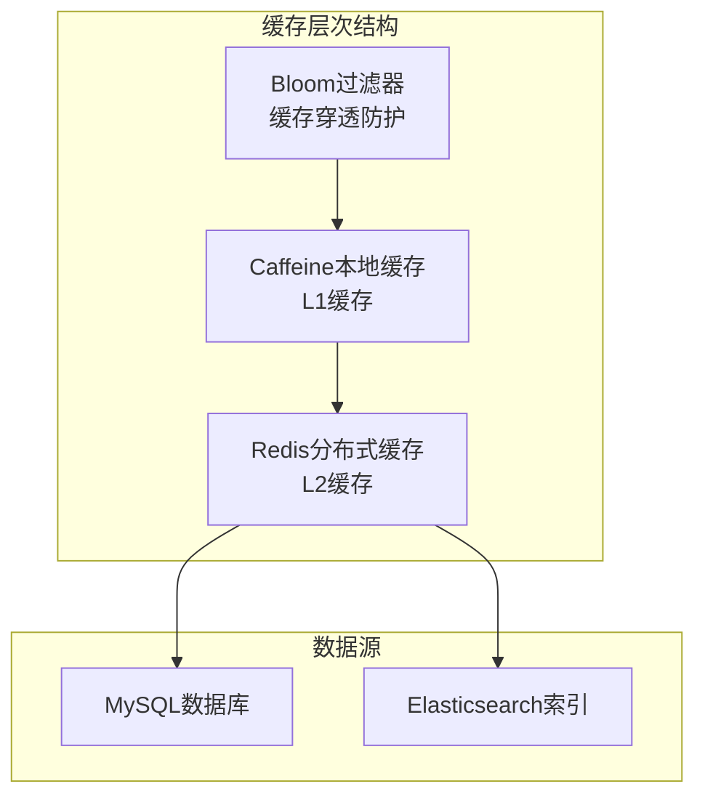
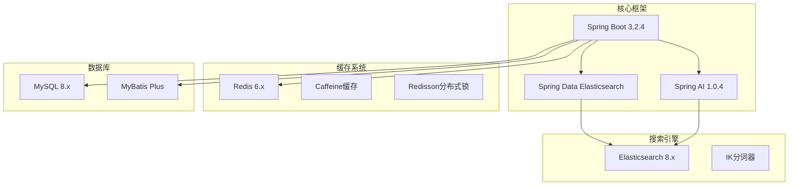
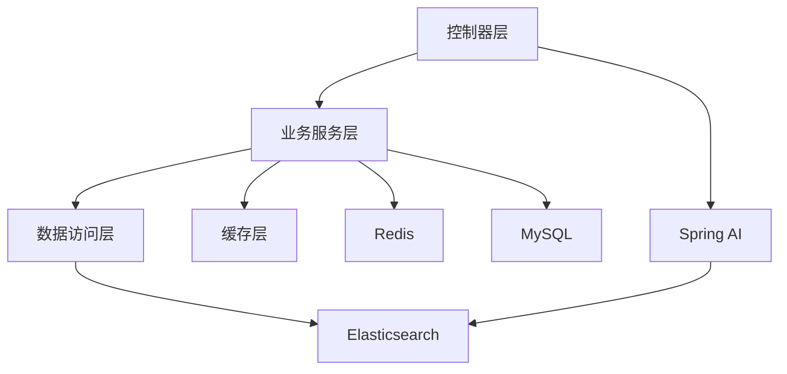

# 搜索系统

<cite>
**本文档引用的文件**
- [EsProduct.java](file://src/main/java/com/bohao/globalshop/entity/EsProduct.java)
- [EsProductRepository.java](file://src/main/java/com/bohao/globalshop/repository/EsProductRepository.java)
- [AiSearchController.java](file://src/main/java/com/bohao/globalshop/controller/AiSearchController.java)
- [ProductController.java](file://src/main/java/com/bohao/globalshop/controller/ProductController.java)
- [application.yml](file://src/main/resources/application.yml)
- [CacheManagerConfig.java](file://src/main/java/com/bohao/globalshop/config/CacheManagerConfig.java)
- [ProductServiceImpl.java](file://src/main/java/com/bohao/globalshop/service/impl/ProductServiceImpl.java)
- [pom.xml](file://pom.xml)
</cite>

## 目录
1. [简介](#简介)
2. [项目结构](#项目结构)
3. [核心组件](#核心组件)
4. [架构概览](#架构概览)
5. [详细组件分析](#详细组件分析)
6. [依赖关系分析](#依赖关系分析)
7. [性能考虑](#性能考虑)
8. [故障排除指南](#故障排除指南)
9. [结论](#结论)

## 简介

本搜索系统是一个基于Spring Boot的企业级购物平台搜索解决方案，集成了Elasticsearch搜索引擎和Spring AI大模型技术。系统采用多层缓存架构，支持全文搜索、模糊匹配、语义向量检索和高性能搜索体验。

该系统主要服务于全球购物平台，提供以下核心功能：
- 基于Elasticsearch的全文搜索引擎
- 支持中文分词的IK分词器配置
- AI语义向量检索功能
- 多级缓存策略（布隆过滤器、本地缓存、分布式缓存）
- 高性能搜索API接口
- 搜索结果排序和分页处理

## 项目结构

搜索系统在整体项目中的组织结构如下：

**图表来源**
- [ProductController.java:1-101](file://src/main/java/com/bohao/globalshop/controller/ProductController.java#L1-L101)
- [AiSearchController.java:1-93](file://src/main/java/com/bohao/globalshop/controller/AiSearchController.java#L1-L93)
- [EsProductRepository.java:1-13](file://src/main/java/com/bohao/globalshop/repository/EsProductRepository.java#L1-L13)

**章节来源**
- [ProductController.java:1-101](file://src/main/java/com/bohao/globalshop/controller/ProductController.java#L1-L101)
- [AiSearchController.java:1-93](file://src/main/java/com/bohao/globalshop/controller/AiSearchController.java#L1-L93)
- [EsProductRepository.java:1-13](file://src/main/java/com/bohao/globalshop/repository/EsProductRepository.java#L1-L13)

## 核心组件

### 数据模型设计

系统的核心数据模型围绕EsProduct实体展开，该实体定义了Elasticsearch索引的结构和字段映射。

**图表来源**
- [EsProduct.java:12-42](file://src/main/java/com/bohao/globalshop/entity/EsProduct.java#L12-L42)
- [EsProductRepository.java:8-12](file://src/main/java/com/bohao/globalshop/repository/EsProductRepository.java#L8-L12)

### 搜索控制器

系统提供了两个主要的搜索控制器：

1. **传统全文搜索控制器**：基于Spring Data Elasticsearch的Repository接口
2. **AI语义搜索控制器**：基于Spring AI嵌入模型的向量检索

**章节来源**
- [EsProduct.java:12-42](file://src/main/java/com/bohao/globalshop/entity/EsProduct.java#L12-L42)
- [EsProductRepository.java:8-12](file://src/main/java/com/bohao/globalshop/repository/EsProductRepository.java#L8-L12)
- [AiSearchController.java:20-93](file://src/main/java/com/bohao/globalshop/controller/AiSearchController.java#L20-L93)

## 架构概览

搜索系统采用分层架构设计，结合传统搜索和AI语义搜索两种模式：

**图表来源**
- [ProductController.java:20-101](file://src/main/java/com/bohao/globalshop/controller/ProductController.java#L20-L101)
- [AiSearchController.java:20-93](file://src/main/java/com/bohao/globalshop/controller/AiSearchController.java#L20-L93)
- [CacheManagerConfig.java:22-54](file://src/main/java/com/bohao/globalshop/config/CacheManagerConfig.java#L22-L54)

## 详细组件分析

### Elasticsearch索引设计

#### 字段映射配置

系统为EsProduct实体配置了专门的Elasticsearch字段映射：

| 字段名 | 类型 | 分词器 | 用途 | 配置说明 |
|--------|------|--------|------|----------|
| id | Long | 主键 | 文档标识 | 使用Spring Data注解映射 |
| name | Text | ik_max_word/ik_smart | 商品名称搜索 | 存入时最大分词，搜索时智能分词 |
| description | Text | ik_max_word | 商品描述搜索 | 仅存入时分词 |
| price | Double | 数值类型 | 价格范围查询 | 支持数值比较 |
| shopId | Keyword | 精确匹配 | 店铺过滤 | 不分词，支持精确匹配 |
| shopName | Keyword | 精确匹配 | 店铺名称过滤 | 不分词，支持精确匹配 |
| coverImage | Keyword | 精确匹配 | 图片URL存储 | 不分词，存储原始值 |
| vector | Dense_Vector | 向量索引 | AI语义搜索 | 1024维浮点数组 |

#### 中文分词器配置

系统采用了IK分词器的双模式配置：

- **存入时分词** (`ik_max_word`)：将中文文本切分为尽可能细粒度的词汇
- **搜索时分词** (`ik_smart`)：根据搜索意图智能选择分词粒度

这种配置确保了搜索的准确性和召回率的平衡。

**章节来源**
- [EsProduct.java:18-40](file://src/main/java/com/bohao/globalshop/entity/EsProduct.java#L18-L40)

### 搜索策略实现

#### 传统全文搜索

系统通过Spring Data Elasticsearch的Repository接口实现了自动化的全文搜索：

**图表来源**
- [ProductController.java:85-99](file://src/main/java/com/bohao/globalshop/controller/ProductController.java#L85-L99)
- [EsProductRepository.java:10-11](file://src/main/java/com/bohao/globalshop/repository/EsProductRepository.java#L10-L11)

#### AI语义搜索

系统集成了Spring AI嵌入模型，实现了基于语义的智能搜索：

**图表来源**
- [AiSearchController.java:58-91](file://src/main/java/com/bohao/globalshop/controller/AiSearchController.java#L58-L91)

### 缓存策略设计

系统实现了多级缓存架构来提升搜索性能：

**图表来源**
- [CacheManagerConfig.java:26-52](file://src/main/java/com/bohao/globalshop/config/CacheManagerConfig.java#L26-L52)
- [ProductServiceImpl.java:111-176](file://src/main/java/com/bohao/globalshop/service/impl/ProductServiceImpl.java#L111-L176)

#### 缓存穿透防护

系统使用Redisson的布隆过滤器来防止缓存穿透：

- **初始化**：启动时将所有真实商品ID加载到布隆过滤器
- **查询前检查**：在缓存查询前先检查ID是否存在
- **恶意请求拦截**：对不存在的ID直接拒绝请求

#### 缓存一致性

系统实现了完整的缓存更新策略：

1. **写入流程**：数据库更新 → 缓存失效 → 新数据写入
2. **读取流程**：缓存命中 → 直接返回 → 缓存未命中 → 查询数据库 → 更新缓存
3. **并发控制**：使用Redis分布式锁防止缓存击穿

**章节来源**
- [CacheManagerConfig.java:26-52](file://src/main/java/com/bohao/globalshop/config/CacheManagerConfig.java#L26-L52)
- [ProductServiceImpl.java:111-176](file://src/main/java/com/bohao/globalshop/service/impl/ProductServiceImpl.java#L111-L176)

### 搜索性能优化

#### 查询优化策略

系统采用了多种查询优化技术：

1. **IK分词器优化**：针对中文搜索场景的专用分词配置
2. **向量索引优化**：KNN查询的候选集限制和相似度计算
3. **缓存预热**：启动时预加载布隆过滤器数据
4. **批量操作**：支持批量数据同步到Elasticsearch

#### 性能监控

系统提供了详细的性能监控指标：

- **搜索耗时统计**：记录每次搜索的执行时间
- **缓存命中率**：监控各级缓存的命中情况
- **向量相似度**：展示AI搜索的语义相似度评分

**章节来源**
- [AiSearchController.java:60-86](file://src/main/java/com/bohao/globalshop/controller/AiSearchController.java#L60-L86)

## 依赖关系分析

### 外部依赖

系统的关键外部依赖包括：

**图表来源**
- [pom.xml:33-102](file://pom.xml#L33-L102)

### 内部组件依赖

系统内部组件之间的依赖关系：

**图表来源**
- [ProductController.java:20-28](file://src/main/java/com/bohao/globalshop/controller/ProductController.java#L20-L28)
- [AiSearchController.java:24-29](file://src/main/java/com/bohao/globalshop/controller/AiSearchController.java#L24-L29)

**章节来源**
- [pom.xml:33-102](file://pom.xml#L33-L102)

## 性能考虑

### 搜索性能优化

#### 索引优化

1. **字段类型选择**：根据查询需求选择合适的字段类型
2. **分词器配置**：针对中文场景优化分词效果
3. **向量索引**：为AI搜索建立高效的KNN索引

#### 查询优化

1. **分页查询**：合理设置分页大小，避免深度分页
2. **查询缓存**：对热门搜索结果进行缓存
3. **并发控制**：使用分布式锁防止缓存击穿

#### 缓存策略

1. **多级缓存**：布隆过滤器、本地缓存、分布式缓存三层防护
2. **缓存预热**：启动时预加载热点数据
3. **缓存更新**：采用写后失效策略保证数据一致性

### 监控和调优

系统提供了完善的监控指标：

- **响应时间**：记录搜索请求的处理时间
- **缓存命中率**：监控各级缓存的效率
- **错误率统计**：跟踪搜索功能的稳定性
- **资源使用**：监控Elasticsearch和Redis的资源消耗

## 故障排除指南

### 常见问题及解决方案

#### Elasticsearch连接问题

**症状**：搜索接口报连接超时或连接失败

**解决方案**：
1. 检查Elasticsearch服务状态
2. 验证连接配置（主机、端口、认证）
3. 确认网络连通性

#### 分词器配置问题

**症状**：中文搜索结果不准确或无法匹配

**解决方案**：
1. 确认IK分词器已正确安装
2. 验证分词器配置是否生效
3. 测试分词效果

#### 缓存穿透问题

**症状**：大量不存在的ID导致数据库压力增大

**解决方案**：
1. 检查布隆过滤器是否正常工作
2. 验证布隆过滤器初始化过程
3. 监控缓存穿透防护效果

#### AI搜索异常

**症状**：语义搜索结果质量差或性能不佳

**解决方案**：
1. 检查Spring AI配置
2. 验证嵌入模型可用性
3. 优化向量维度和候选集大小

**章节来源**
- [CacheManagerConfig.java:37-52](file://src/main/java/com/bohao/globalshop/config/CacheManagerConfig.java#L37-L52)
- [AiSearchController.java:35-52](file://src/main/java/com/bohao/globalshop/controller/AiSearchController.java#L35-L52)

## 结论

本搜索系统通过整合Elasticsearch搜索引擎和Spring AI大模型技术，为企业级购物平台提供了高性能、智能化的搜索解决方案。系统采用多层缓存架构，有效提升了搜索性能和用户体验。

### 主要优势

1. **技术先进性**：集成了最新的Elasticsearch 8.x和Spring AI技术
2. **性能优异**：多级缓存架构确保了毫秒级响应时间
3. **扩展性强**：模块化设计便于功能扩展和维护
4. **稳定性高**：完善的错误处理和监控机制

### 未来发展方向

1. **搜索建议**：实现基于历史搜索的智能推荐
2. **热门搜索统计**：分析用户搜索行为，优化搜索算法
3. **个性化搜索**：基于用户画像的个性化搜索排序
4. **多语言支持**：扩展对其他语言的搜索支持

该搜索系统为搜索算法工程师和用户体验设计师提供了专业的技术参考，能够满足全球化购物平台的复杂搜索需求。