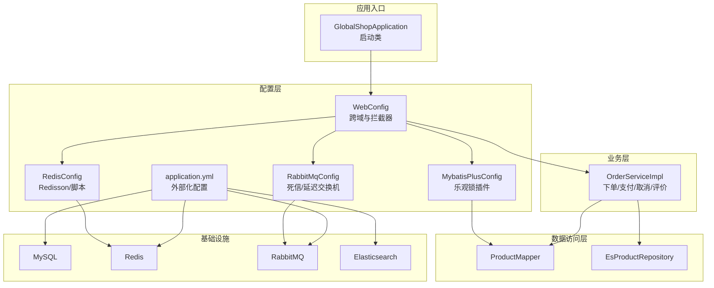
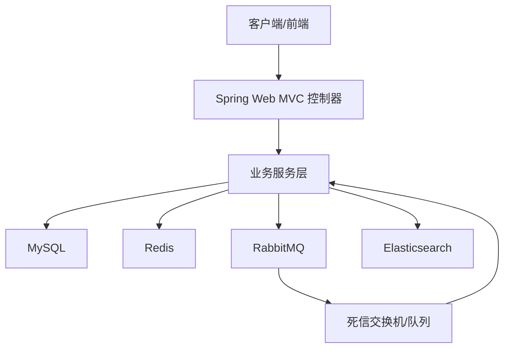
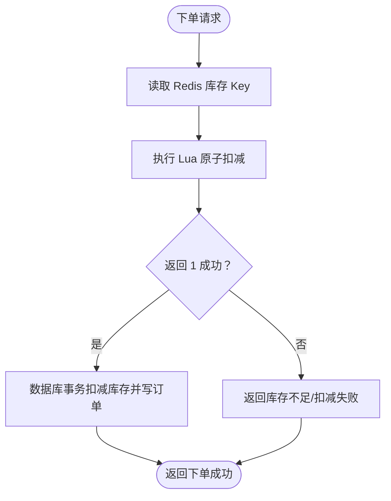
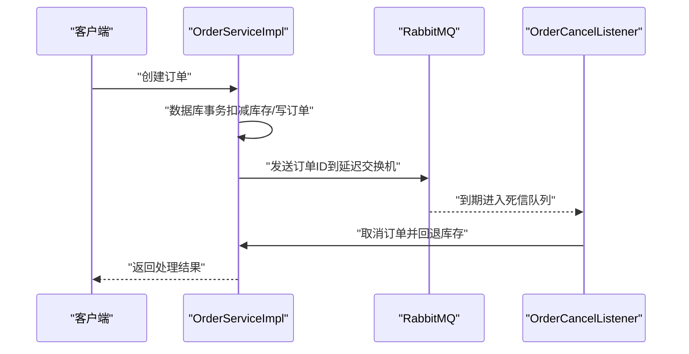
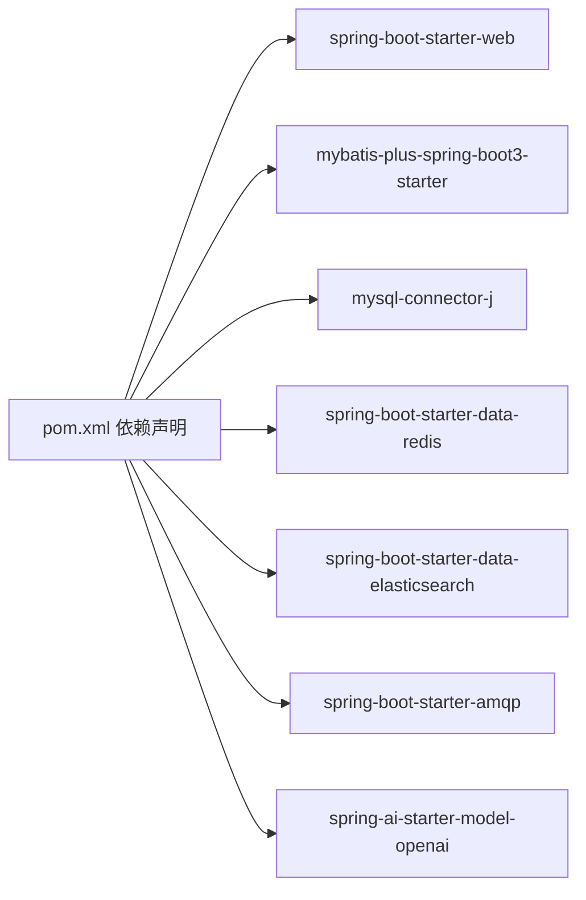

# 故障排查FAQ

<cite>
**本文引用的文件**   
- [GlobalShopApplication.java](file://src/main/java/com/bohao/globalshop/GlobalShopApplication.java)
- [application.yml](file://src/main/resources/application.yml)
- [GlobalExceptionHandler.java](file://src/main/java/com/bohao/globalshop/exception/GlobalExceptionHandler.java)
- [RabbitMqConfig.java](file://src/main/java/com/bohao/globalshop/config/RabbitMqConfig.java)
- [RedisConfig.java](file://src/main/java/com/bohao/globalshop/config/RedisConfig.java)
- [MybatisPlusConfig.java](file://src/main/java/com/bohao/globalshop/config/MybatisPlusConfig.java)
- [WebConfig.java](file://src/main/java/com/bohao/globalshop/config/WebConfig.java)
- [Result.java](file://src/main/java/com/bohao/globalshop/common/Result.java)
- [OrderServiceImpl.java](file://src/main/java/com/bohao/globalshop/service/impl/OrderServiceImpl.java)
- [OrderCancelListener.java](file://src/main/java/com/bohao/globalshop/listener/OrderCancelListener.java)
- [HealthController.java](file://src/main/java/com/bohao/globalshop/controller/HealthController.java)
- [CacheWarmUpRunner.java](file://src/main/java/com/bohao/globalshop/task/CacheWarmUpRunner.java)
- [ProductMapper.java](file://src/main/java/com/bohao/globalshop/mapper/ProductMapper.java)
- [EsProductRepository.java](file://src/main/java/com/bohao/globalshop/repository/EsProductRepository.java)
- [pom.xml](file://pom.xml)
</cite>

## 目录
1. [简介](#简介)
2. [项目结构](#项目结构)
3. [核心组件](#核心组件)
4. [架构总览](#架构总览)
5. [详细组件分析与故障排查](#详细组件分析与故障排查)
6. [依赖分析](#依赖分析)
7. [性能考虑](#性能考虑)
8. [故障排查指南](#故障排查指南)
9. [结论](#结论)
10. [附录](#附录)

## 简介
本手册面向开发、测试、部署与运维团队，聚焦全球购物平台在数据库连接、缓存异常、消息队列故障、搜索服务异常等常见问题的诊断与修复路径。结合系统实际配置与代码实现，提供日志分析、性能调优与监控建议，以及错误码含义与调试工具使用方法，帮助快速定位与解决问题。

## 项目结构
系统采用 Spring Boot 应用，核心模块包括：
- 配置层：数据库、Redis、Elasticsearch、RabbitMQ、MyBatis-Plus、Web 跨域与拦截器等
- 业务层：订单、购物车、商品、商户、用户等服务与实现
- 数据访问层：MyBatis Mapper 与 Spring Data Elasticsearch Repository
- 监听与任务：RabbitMQ 死信监听、缓存预热任务
- 控制器与全局异常：健康检查、统一响应体、全局异常处理

图示来源
- [GlobalShopApplication.java:1-17](file://src/main/java/com/bohao/globalshop/GlobalShopApplication.java#L1-L17)
- [WebConfig.java:1-36](file://src/main/java/com/bohao/globalshop/config/WebConfig.java#L1-L36)
- [RedisConfig.java:1-46](file://src/main/java/com/bohao/globalshop/config/RedisConfig.java#L1-L46)
- [RabbitMqConfig.java:1-61](file://src/main/java/com/bohao/globalshop/config/RabbitMqConfig.java#L1-L61)
- [MybatisPlusConfig.java:1-18](file://src/main/java/com/bohao/globalshop/config/MybatisPlusConfig.java#L1-L18)
- [application.yml:1-42](file://src/main/resources/application.yml#L1-L42)
- [OrderServiceImpl.java:1-330](file://src/main/java/com/bohao/globalshop/service/impl/OrderServiceImpl.java#L1-L330)
- [ProductMapper.java:1-10](file://src/main/java/com/bohao/globalshop/mapper/ProductMapper.java#L1-L10)
- [EsProductRepository.java:1-13](file://src/main/java/com/bohao/globalshop/repository/EsProductRepository.java#L1-L13)

章节来源
- [GlobalShopApplication.java:1-17](file://src/main/java/com/bohao/globalshop/GlobalShopApplication.java#L1-L17)
- [application.yml:1-42](file://src/main/resources/application.yml#L1-L42)

## 核心组件
- 统一响应体 Result：封装 code/message/data，便于前后端一致的错误与结果传递
- 全局异常处理器 GlobalExceptionHandler：捕获运行时异常与未知异常，输出统一错误响应并记录日志
- 订单服务 OrderServiceImpl：实现下单、支付、取消、确认收货、评价等核心流程，集成 Redis Lua 原子扣减与 RabbitMQ 延迟取消
- 缓存预热 CacheWarmUpRunner：启动时将上架商品库存写入 Redis，降低首次高并发压力
- 死信监听 OrderCancelListener：监听死信队列，自动取消超时未支付订单并回退库存

章节来源
- [Result.java:1-30](file://src/main/java/com/bohao/globalshop/common/Result.java#L1-L30)
- [GlobalExceptionHandler.java:1-33](file://src/main/java/com/bohao/globalshop/exception/GlobalExceptionHandler.java#L1-L33)
- [OrderServiceImpl.java:1-330](file://src/main/java/com/bohao/globalshop/service/impl/OrderServiceImpl.java#L1-L330)
- [CacheWarmUpRunner.java:1-52](file://src/main/java/com/bohao/globalshop/task/CacheWarmUpRunner.java#L1-L52)
- [OrderCancelListener.java:1-30](file://src/main/java/com/bohao/globalshop/listener/OrderCancelListener.java#L1-L30)

## 架构总览
系统采用“应用服务 + 外部中间件”的分布式架构：
- 数据库：MySQL（持久化订单、商品、用户等）
- 缓存：Redis（库存原子扣减、缓存预热）
- 消息：RabbitMQ（延迟取消订单，死信兜底）
- 搜索：Elasticsearch（商品全文检索）
- 配置：application.yml 外部化管理各组件连接信息

图示来源
- [application.yml:1-42](file://src/main/resources/application.yml#L1-L42)
- [OrderServiceImpl.java:1-330](file://src/main/java/com/bohao/globalshop/service/impl/OrderServiceImpl.java#L1-L330)
- [RabbitMqConfig.java:1-61](file://src/main/java/com/bohao/globalshop/config/RabbitMqConfig.java#L1-L61)
- [RedisConfig.java:1-46](file://src/main/java/com/bohao/globalshop/config/RedisConfig.java#L1-L46)
- [EsProductRepository.java:1-13](file://src/main/java/com/bohao/globalshop/repository/EsProductRepository.java#L1-L13)

## 详细组件分析与故障排查

### 数据库连接与事务（MySQL）
- 关键点
  - 数据源配置位于 application.yml，包含驱动、URL、用户名、密码
  - MyBatis-Plus 配置启用乐观锁插件，避免并发更新冲突
  - 订单服务多处使用 @Transactional，确保库存扣减与订单写入一致性
- 常见问题与排查
  - 连接失败：核对 application.yml 中的主机、端口、账号、密码是否正确；确认 MySQL 服务状态与网络连通性
  - 并发冲突：若出现“更新影响行数为 0”，通常由乐观锁导致，需重试或提示用户重试
  - SQL 日志：mybatis-plus 配置开启标准输出日志，便于定位 SQL 与参数
- 优化建议
  - 生产环境使用连接池参数调优与只读分离
  - 对热点表建立合适索引，减少锁竞争

章节来源
- [application.yml:4-10](file://src/main/resources/application.yml#L4-L10)
- [MybatisPlusConfig.java:1-18](file://src/main/java/com/bohao/globalshop/config/MybatisPlusConfig.java#L1-L18)
- [OrderServiceImpl.java:38-81](file://src/main/java/com/bohao/globalshop/service/impl/OrderServiceImpl.java#L38-L81)
- [OrderServiceImpl.java:140-160](file://src/main/java/com/bohao/globalshop/service/impl/OrderServiceImpl.java#L140-L160)

### 缓存异常（Redis）
- 关键点
  - Redis 使用 Redisson 单节点配置，默认地址与库号
  - 下单流程使用 Lua 原子脚本进行库存扣减，脚本返回 1 表示成功，0 表示失败
  - 启动时执行缓存预热，将上架商品库存写入 Redis
- 常见问题与排查
  - 连接失败：核对 application.yml 中 Redis 地址与端口；确认 Redis 服务状态
  - 命令执行异常：检查 Redis 是否设置密码，如设置需在 Redisson 配置中启用
  - 库存超卖：若 Lua 返回 0，表示库存不足或脚本执行失败，需检查预热与脚本逻辑
  - 预热失败：确认启动顺序与 ProductMapper 查询条件，确保上架商品被正确写入
- 优化建议
  - 生产环境使用 Redis 集群/哨兵，提升可用性
  - 对 Lua 脚本与 Key 命名规范进行统一治理

图示来源
- [RedisConfig.java:12-44](file://src/main/java/com/bohao/globalshop/config/RedisConfig.java#L12-L44)
- [OrderServiceImpl.java:174-212](file://src/main/java/com/bohao/globalshop/service/impl/OrderServiceImpl.java#L174-L212)
- [CacheWarmUpRunner.java:24-50](file://src/main/java/com/bohao/globalshop/task/CacheWarmUpRunner.java#L24-L50)

章节来源
- [RedisConfig.java:1-46](file://src/main/java/com/bohao/globalshop/config/RedisConfig.java#L1-L46)
- [CacheWarmUpRunner.java:1-52](file://src/main/java/com/bohao/globalshop/task/CacheWarmUpRunner.java#L1-L52)
- [OrderServiceImpl.java:174-212](file://src/main/java/com/bohao/globalshop/service/impl/OrderServiceImpl.java#L174-L212)

### 消息队列故障（RabbitMQ）
- 关键点
  - 配置死信交换机与延迟队列，用于订单超时自动取消
  - 订单服务在下单成功后将订单 ID 发送至延迟交换机
  - 死信监听器监听死信队列，执行取消并回退库存
  - 开启发送确认与返回，保证消息可靠投递
- 常见问题与排查
  - 无法连接：核对 application.yml 中 RabbitMQ 主机、端口、账号、密码
  - 消息未达：检查交换机/队列绑定是否正确；确认 TTL 与死信路由配置
  - 死信未处理：检查监听器是否启动、日志是否报错；确认业务幂等性
  - 确认机制：生产环境务必启用 publisher-confirm-type 与 publisher-returns
- 优化建议
  - 使用集群与镜像队列提升可靠性
  - 对延迟时间进行灰度验证，避免过短导致频繁取消

图示来源
- [RabbitMqConfig.java:10-61](file://src/main/java/com/bohao/globalshop/config/RabbitMqConfig.java#L10-L61)
- [OrderServiceImpl.java:65-67](file://src/main/java/com/bohao/globalshop/service/impl/OrderServiceImpl.java#L65-L67)
- [OrderCancelListener.java:16-27](file://src/main/java/com/bohao/globalshop/listener/OrderCancelListener.java#L16-L27)
- [application.yml:29-38](file://src/main/resources/application.yml#L29-L38)

章节来源
- [RabbitMqConfig.java:1-61](file://src/main/java/com/bohao/globalshop/config/RabbitMqConfig.java#L1-L61)
- [OrderServiceImpl.java:65-67](file://src/main/java/com/bohao/globalshop/service/impl/OrderServiceImpl.java#L65-L67)
- [OrderCancelListener.java:1-30](file://src/main/java/com/bohao/globalshop/listener/OrderCancelListener.java#L1-L30)
- [application.yml:29-38](file://src/main/resources/application.yml#L29-L38)

### 搜索服务异常（Elasticsearch）
- 关键点
  - 通过 Spring Data Elasticsearch Repository 提供基于方法名的查询能力
  - 配置包含连接地址、认证信息
- 常见问题与排查
  - 连接失败：核对 application.yml 中 ES 地址、用户名、密码
  - 查询异常：确认索引是否存在、映射是否匹配；检查查询参数与分页
  - 性能问题：对高频查询字段建立索引，避免过度通配
- 优化建议
  - 生产环境启用副本与分片策略
  - 对复杂查询进行缓存与聚合

章节来源
- [application.yml:15-19](file://src/main/resources/application.yml#L15-L19)
- [EsProductRepository.java:1-13](file://src/main/java/com/bohao/globalshop/repository/EsProductRepository.java#L1-L13)

### 统一响应与异常处理
- 关键点
  - Result 统一返回 code/message/data
  - 全局异常处理器捕获运行时异常与未知异常，记录日志并返回友好提示
- 常见问题与排查
  - 前端显示异常：检查全局异常处理器是否生效、日志级别与错误码
  - 空指针：处理器会记录完整堆栈，定位后端代码问题
- 优化建议
  - 明确错误码语义，区分业务错误与系统错误

章节来源
- [Result.java:1-30](file://src/main/java/com/bohao/globalshop/common/Result.java#L1-L30)
- [GlobalExceptionHandler.java:1-33](file://src/main/java/com/bohao/globalshop/exception/GlobalExceptionHandler.java#L1-L33)

### 跨域与拦截器
- 关键点
  - WebConfig 配置跨域与 JWT 拦截器，拦截订单、购物车、商户相关接口
- 常见问题与排查
  - 跨域失败：检查允许的源、方法、头与凭据配置
  - 接口 401：确认 Token 是否有效、拦截器是否正确放行登录/注册/商品接口

章节来源
- [WebConfig.java:1-36](file://src/main/java/com/bohao/globalshop/config/WebConfig.java#L1-L36)

### 健康检查
- 关键点
  - 健康接口返回服务启动状态
- 常见问题与排查
  - 404/500：检查控制器映射与服务是否启动

章节来源
- [HealthController.java:1-19](file://src/main/java/com/bohao/globalshop/controller/HealthController.java#L1-L19)

## 依赖分析
系统主要依赖包括 Web、MyBatis-Plus、MySQL 驱动、Redis、Elasticsearch、AMQP（RabbitMQ）、Spring AI 等。

图示来源
- [pom.xml:33-102](file://pom.xml#L33-L102)

章节来源
- [pom.xml:1-148](file://pom.xml#L1-L148)

## 性能考虑
- 数据库
  - 使用乐观锁避免超卖与并发冲突
  - 合理索引与分页，避免全表扫描
- 缓存
  - 启动预热，降低冷启动抖动
  - Lua 原子操作保障高并发一致性
- 消息
  - 延迟队列与死信兜底，避免阻塞主线程
  - 开启发送确认与返回，保证消息可靠
- 搜索
  - 针对高频查询字段建立索引，减少查询成本
- 监控与日志
  - 结合全局异常处理器与业务日志，定位热点问题

## 故障排查指南

### 通用排查步骤
- 确认服务健康：访问健康接口，检查服务是否正常启动
- 核对配置：逐项比对 application.yml 中数据库、Redis、RabbitMQ、Elasticsearch 的连接信息
- 查看日志：关注全局异常处理器与业务日志，定位异常堆栈与上下文
- 验证链路：从前端请求到数据库/缓存/消息队列/搜索的端到端验证

章节来源
- [HealthController.java:14-17](file://src/main/java/com/bohao/globalshop/controller/HealthController.java#L14-L17)
- [application.yml:1-42](file://src/main/resources/application.yml#L1-L42)
- [GlobalExceptionHandler.java:15-31](file://src/main/java/com/bohao/globalshop/exception/GlobalExceptionHandler.java#L15-L31)

### 数据库连接问题
- 症状
  - 启动报错或接口报数据库连接异常
- 排查要点
  - application.yml 中数据库连接参数是否正确
  - MySQL 服务状态与网络连通性
  - 连接池参数与最大连接数
- 修复建议
  - 修正连接参数后重启服务
  - 生产环境增加连接池监控与告警

章节来源
- [application.yml:4-10](file://src/main/resources/application.yml#L4-L10)

### 缓存异常（Redis）
- 症状
  - 库存扣减失败、Lua 返回 0；或 Redis 连接失败
- 排查要点
  - Redis 地址、端口、密码是否正确
  - 启动预热是否执行成功
  - Lua 脚本与 Key 命名是否一致
- 修复建议
  - 在 Redisson 配置中启用密码（如需要）
  - 检查预热逻辑与商品状态过滤条件

章节来源
- [RedisConfig.java:12-25](file://src/main/java/com/bohao/globalshop/config/RedisConfig.java#L12-L25)
- [CacheWarmUpRunner.java:24-50](file://src/main/java/com/bohao/globalshop/task/CacheWarmUpRunner.java#L24-L50)
- [OrderServiceImpl.java:174-212](file://src/main/java/com/bohao/globalshop/service/impl/OrderServiceImpl.java#L174-L212)

### 消息队列故障（RabbitMQ）
- 症状
  - 订单未取消、死信队列堆积、消息丢失
- 排查要点
  - RabbitMQ 连接参数与认证信息
  - 交换机/队列/绑定是否正确
  - TTL 与死信路由配置
  - 发送确认与返回是否开启
- 修复建议
  - 修正配置后重启服务
  - 增加监控与告警，定期巡检死信队列

章节来源
- [application.yml:29-38](file://src/main/resources/application.yml#L29-L38)
- [RabbitMqConfig.java:10-61](file://src/main/java/com/bohao/globalshop/config/RabbitMqConfig.java#L10-L61)
- [OrderCancelListener.java:16-27](file://src/main/java/com/bohao/globalshop/listener/OrderCancelListener.java#L16-L27)

### 搜索服务异常（Elasticsearch）
- 症状
  - 商品搜索失败、查询超时
- 排查要点
  - Elasticsearch 地址、认证信息
  - 索引是否存在、映射是否匹配
  - 查询参数与分页是否合理
- 修复建议
  - 重建索引或调整映射
  - 对高频查询字段建立索引

章节来源
- [application.yml:15-19](file://src/main/resources/application.yml#L15-L19)
- [EsProductRepository.java:8-11](file://src/main/java/com/bohao/globalshop/repository/EsProductRepository.java#L8-L11)

### 统一响应与错误码
- 错误码含义
  - 200：操作成功
  - 400：业务参数错误或状态不符
  - 403：权限不足或越权
  - 404：资源不存在
  - 500：系统内部错误
- 使用建议
  - 前端依据 code 判断展示友好提示
  - 后端记录完整日志，便于定位

章节来源
- [Result.java:11-28](file://src/main/java/com/bohao/globalshop/common/Result.java#L11-L28)
- [GlobalExceptionHandler.java:15-31](file://src/main/java/com/bohao/globalshop/exception/GlobalExceptionHandler.java#L15-L31)

### 日志分析与调试工具
- 日志位置
  - 控制台日志：MyBatis SQL 输出、业务日志
  - 文件日志：结合日志框架配置输出到文件
- 调试建议
  - 使用全局异常处理器记录完整堆栈
  - 对关键链路添加埋点与耗时统计
  - 使用健康接口与监控指标辅助定位

章节来源
- [application.yml:40-42](file://src/main/resources/application.yml#L40-L42)
- [GlobalExceptionHandler.java:17-25](file://src/main/java/com/bohao/globalshop/exception/GlobalExceptionHandler.java#L17-L25)

## 结论
本手册基于系统实际配置与代码实现，提供了数据库、缓存、消息队列、搜索等模块的常见故障排查路径与优化建议。建议在生产环境中配合监控告警、日志分析与压测演练，持续提升系统稳定性与可维护性。

## 附录
- 启动与健康检查
  - 访问健康接口确认服务状态
- 配置校验清单
  - 数据库：驱动、URL、账号、密码
  - Redis：地址、端口、密码（如有）
  - RabbitMQ：地址、端口、账号、密码、确认机制
  - Elasticsearch：地址、认证、索引
- 依赖版本
  - Spring Boot、MyBatis-Plus、MySQL、Redis、Elasticsearch、AMQP、Spring AI

章节来源
- [HealthController.java:14-17](file://src/main/java/com/bohao/globalshop/controller/HealthController.java#L14-L17)
- [application.yml:1-42](file://src/main/resources/application.yml#L1-L42)
- [pom.xml:33-102](file://pom.xml#L33-L102)