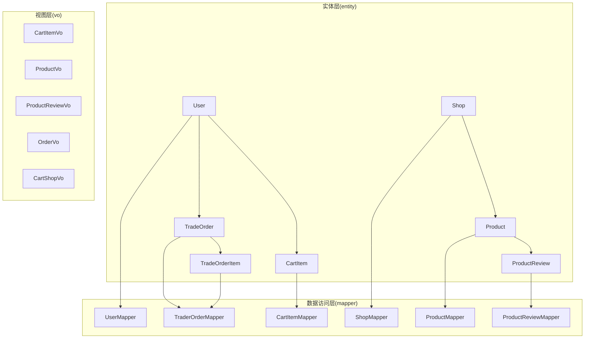
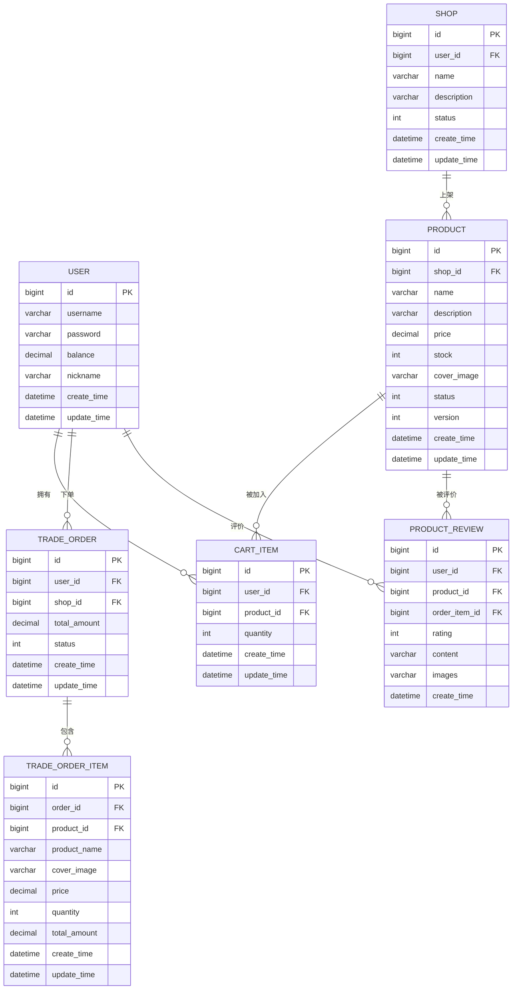
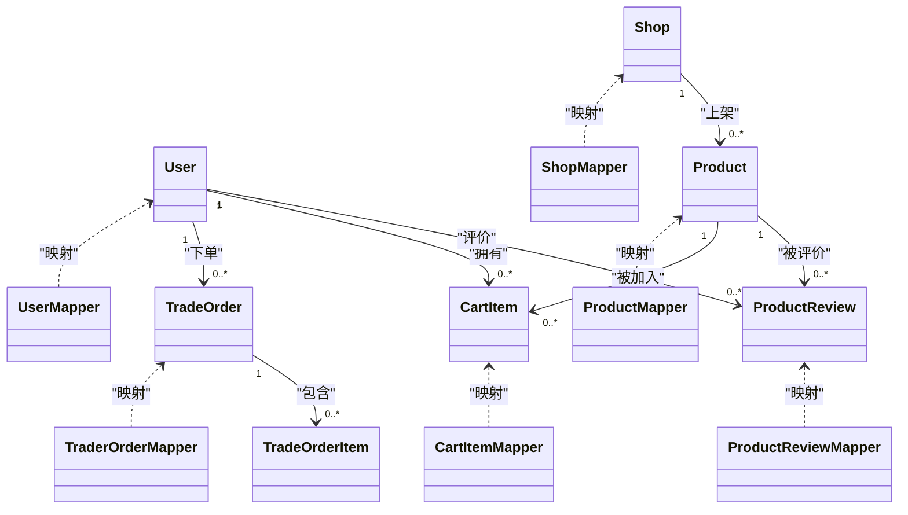

# 数据模型

<cite>
**本文引用的文件**
- [User.java](file://src/main/java/com/bohao/globalshop/entity/User.java)
- [Product.java](file://src/main/java/com/bohao/globalshop/entity/Product.java)
- [CartItem.java](file://src/main/java/com/bohao/globalshop/entity/CartItem.java)
- [TradeOrder.java](file://src/main/java/com/bohao/globalshop/entity/TradeOrder.java)
- [TradeOrderItem.java](file://src/main/java/com/bohao/globalshop/entity/TradeOrderItem.java)
- [Shop.java](file://src/main/java/com/bohao/globalshop/entity/Shop.java)
- [ProductReview.java](file://src/main/java/com/bohao/globalshop/entity/ProductReview.java)
- [UserMapper.java](file://src/main/java/com/bohao/globalshop/mapper/UserMapper.java)
- [ProductMapper.java](file://src/main/java/com/bohao/globalshop/mapper/ProductMapper.java)
- [CartItemMapper.java](file://src/main/java/com/bohao/globalshop/mapper/CartItemMapper.java)
- [TraderOrderMapper.java](file://src/main/java/com/bohao/globalshop/mapper/TraderOrderMapper.java)
- [ShopMapper.java](file://src/main/java/com/bohao/globalshop/mapper/ShopMapper.java)
- [ProductReviewMapper.java](file://src/main/java/com/bohao/globalshop/mapper/ProductReviewMapper.java)
- [CartItemVo.java](file://src/main/java/com/bohao/globalshop/vo/CartItemVo.java)
- [ProductVo.java](file://src/main/java/com/bohao/globalshop/vo/ProductVo.java)
- [ProductReviewVo.java](file://src/main/java/com/bohao/globalshop/vo/ProductReviewVo.java)
- [OrderVo.java](file://src/main/java/com/bohao/globalshop/vo/OrderVo.java)
- [CartShopVo.java](file://src/main/java/com/bohao/globalshop/vo/CartShopVo.java)
</cite>

## 目录
1. [简介](#简介)
2. [项目结构](#项目结构)
3. [核心组件](#核心组件)
4. [架构总览](#架构总览)
5. [详细组件分析](#详细组件分析)
6. [依赖分析](#依赖分析)
7. [性能考虑](#性能考虑)
8. [故障排查指南](#故障排查指南)
9. [结论](#结论)
10. [附录](#附录)

## 简介
本文件面向数据库管理员与后端开发者，系统化梳理全球购物平台的数据模型，覆盖用户(User)、商品(Product)、购物车(CartItem)、交易订单(TradeOrder 及其明细 TradeOrderItem)、店铺(Shop)、商品评价(ProductReview)等核心实体，明确字段语义、数据类型、约束与业务规则，并给出 ERD、索引与性能优化建议、数据完整性保障机制以及迁移与版本管理思路。

## 项目结构
围绕数据模型的核心类位于 entity 包，对应的 MyBatis-Plus Mapper 接口位于 mapper 包；面向前端的视图对象 VO 位于 vo 包，用于订单聚合、购物车分组与评价列表等场景展示。

图表来源
- [User.java:1-23](file://src/main/java/com/bohao/globalshop/entity/User.java#L1-L23)
- [Product.java:1-30](file://src/main/java/com/bohao/globalshop/entity/Product.java#L1-L30)
- [CartItem.java:1-21](file://src/main/java/com/bohao/globalshop/entity/CartItem.java#L1-L21)
- [TradeOrder.java:1-24](file://src/main/java/com/bohao/globalshop/entity/TradeOrder.java#L1-L24)
- [TradeOrderItem.java:1-26](file://src/main/java/com/bohao/globalshop/entity/TradeOrderItem.java#L1-L26)
- [Shop.java:1-22](file://src/main/java/com/bohao/globalshop/entity/Shop.java#L1-L22)
- [ProductReview.java:1-23](file://src/main/java/com/bohao/globalshop/entity/ProductReview.java#L1-L23)
- [UserMapper.java:1-11](file://src/main/java/com/bohao/globalshop/mapper/UserMapper.java#L1-L11)
- [ProductMapper.java:1-10](file://src/main/java/com/bohao/globalshop/mapper/ProductMapper.java#L1-L10)
- [CartItemMapper.java:1-11](file://src/main/java/com/bohao/globalshop/mapper/CartItemMapper.java#L1-L11)
- [TraderOrderMapper.java:1-10](file://src/main/java/com/bohao/globalshop/mapper/TraderOrderMapper.java#L1-L10)
- [ShopMapper.java:1-10](file://src/main/java/com/bohao/globalshop/mapper/ShopMapper.java#L1-L10)
- [ProductReviewMapper.java:1-10](file://src/main/java/com/bohao/globalshop/mapper/ProductReviewMapper.java#L1-L10)
- [CartItemVo.java:1-17](file://src/main/java/com/bohao/globalshop/vo/CartItemVo.java#L1-L17)
- [ProductVo.java:1-19](file://src/main/java/com/bohao/globalshop/vo/ProductVo.java#L1-L19)
- [ProductReviewVo.java:1-20](file://src/main/java/com/bohao/globalshop/vo/ProductReviewVo.java#L1-L20)
- [OrderVo.java:1-18](file://src/main/java/com/bohao/globalshop/vo/OrderVo.java#L1-L18)
- [CartShopVo.java:1-13](file://src/main/java/com/bohao/globalshop/vo/CartShopVo.java#L1-L13)

章节来源
- [User.java:1-23](file://src/main/java/com/bohao/globalshop/entity/User.java#L1-L23)
- [Product.java:1-30](file://src/main/java/com/bohao/globalshop/entity/Product.java#L1-L30)
- [CartItem.java:1-21](file://src/main/java/com/bohao/globalshop/entity/CartItem.java#L1-L21)
- [TradeOrder.java:1-24](file://src/main/java/com/bohao/globalshop/entity/TradeOrder.java#L1-L24)
- [TradeOrderItem.java:1-26](file://src/main/java/com/bohao/globalshop/entity/TradeOrderItem.java#L1-L26)
- [Shop.java:1-22](file://src/main/java/com/bohao/globalshop/entity/Shop.java#L1-L22)
- [ProductReview.java:1-23](file://src/main/java/com/bohao/globalshop/entity/ProductReview.java#L1-L23)
- [UserMapper.java:1-11](file://src/main/java/com/bohao/globalshop/mapper/UserMapper.java#L1-L11)
- [ProductMapper.java:1-10](file://src/main/java/com/bohao/globalshop/mapper/ProductMapper.java#L1-L10)
- [CartItemMapper.java:1-11](file://src/main/java/com/bohao/globalshop/mapper/CartItemMapper.java#L1-L11)
- [TraderOrderMapper.java:1-10](file://src/main/java/com/bohao/globalshop/mapper/TraderOrderMapper.java#L1-L10)
- [ShopMapper.java:1-10](file://src/main/java/com/bohao/globalshop/mapper/ShopMapper.java#L1-L10)
- [ProductReviewMapper.java:1-10](file://src/main/java/com/bohao/globalshop/mapper/ProductReviewMapper.java#L1-L10)
- [CartItemVo.java:1-17](file://src/main/java/com/bohao/globalshop/vo/CartItemVo.java#L1-L17)
- [ProductVo.java:1-19](file://src/main/java/com/bohao/globalshop/vo/ProductVo.java#L1-L19)
- [ProductReviewVo.java:1-20](file://src/main/java/com/bohao/globalshop/vo/ProductReviewVo.java#L1-L20)
- [OrderVo.java:1-18](file://src/main/java/com/bohao/globalshop/vo/OrderVo.java#L1-L18)
- [CartShopVo.java:1-13](file://src/main/java/com/bohao/globalshop/vo/CartShopVo.java#L1-L13)

## 核心组件
- 用户(User): 平台用户主体，具备账户余额、昵称等基础属性。
- 商品(Product): 店铺内销售的商品，包含价格、库存、状态与乐观锁版本号。
- 购物车(CartItem): 用户与商品的临时关联，记录购买数量。
- 订单(TradeOrder): 主订单，聚合多个订单明细。
- 订单明细(TradeOrderItem): 记录下单时的商品快照与小计金额。
- 店铺(Shop): 商户的店铺信息，绑定店主用户。
- 评价(ProductReview): 用户对订单中具体商品的评价，支持评分与图片。

章节来源
- [User.java:1-23](file://src/main/java/com/bohao/globalshop/entity/User.java#L1-L23)
- [Product.java:1-30](file://src/main/java/com/bohao/globalshop/entity/Product.java#L1-L30)
- [CartItem.java:1-21](file://src/main/java/com/bohao/globalshop/entity/CartItem.java#L1-L21)
- [TradeOrder.java:1-24](file://src/main/java/com/bohao/globalshop/entity/TradeOrder.java#L1-L24)
- [TradeOrderItem.java:1-26](file://src/main/java/com/bohao/globalshop/entity/TradeOrderItem.java#L1-L26)
- [Shop.java:1-22](file://src/main/java/com/bohao/globalshop/entity/Shop.java#L1-L22)
- [ProductReview.java:1-23](file://src/main/java/com/bohao/globalshop/entity/ProductReview.java#L1-L23)

## 架构总览
下图展示实体之间的关系与映射，体现一对一、一对多与多对多的业务关系。

图表来源
- [User.java:1-23](file://src/main/java/com/bohao/globalshop/entity/User.java#L1-L23)
- [Shop.java:1-22](file://src/main/java/com/bohao/globalshop/entity/Shop.java#L1-L22)
- [Product.java:1-30](file://src/main/java/com/bohao/globalshop/entity/Product.java#L1-L30)
- [CartItem.java:1-21](file://src/main/java/com/bohao/globalshop/entity/CartItem.java#L1-L21)
- [TradeOrder.java:1-24](file://src/main/java/com/bohao/globalshop/entity/TradeOrder.java#L1-L24)
- [TradeOrderItem.java:1-26](file://src/main/java/com/bohao/globalshop/entity/TradeOrderItem.java#L1-L26)
- [ProductReview.java:1-23](file://src/main/java/com/bohao/globalshop/entity/ProductReview.java#L1-L23)

## 详细组件分析

### 实体与字段定义
- 用户(User)
  - 字段: id、username、password、balance、nickname、createTime、updateTime
  - 类型: 主键自增整数、字符串、数值、时间戳
  - 约束: 非空(用户名、密码)、余额非负
  - 业务规则: 用户可持有余额；用于下单、评价、购物车归属
- 商品(Product)
  - 字段: id、shopId、name、description、price、stock、coverImage、status、version、createTime、updateTime
  - 类型: 外键、数值、整数、乐观锁版本号、时间戳
  - 约束: 价格与库存非负；状态枚举；version 用于并发控制
  - 业务规则: 库存扣减需结合版本号；状态影响上下架
- 购物车(CartItem)
  - 字段: id、userId、productId、quantity、createTime、updateTime
  - 类型: 外键、整数、时间戳
  - 约束: 数量必须大于0；外键存在性
  - 业务规则: 同用户同商品仅保留一条记录(业务层去重)
- 订单(TradeOrder)
  - 字段: id、userId、shopId、totalAmount、status、createTime、updateTime
  - 类型: 外键、数值、整数、时间戳
  - 约束: 总金额与状态合理范围
  - 业务规则: 订单状态驱动后续流程(支付、发货、完成)
- 订单明细(TradeOrderItem)
  - 字段: id、orderId、productId、productName、coverImage、price、quantity、totalAmount、createTime、updateTime
  - 类型: 外键、数值、整数、快照字段
  - 约束: 单价与数量非负；小计=单价×数量
  - 业务规则: 快照保留下单时的价格与封面，避免后续变更影响历史
- 店铺(Shop)
  - 字段: id、userId、name、description、status、createTime、updateTime
  - 类型: 外键、字符串、整数、时间戳
  - 约束: 状态枚举；外键存在性
  - 业务规则: 店铺与用户绑定；状态影响商品展示
- 评价(ProductReview)
  - 字段: id、userId、productId、orderItemId、rating、content、images、createTime
  - 类型: 外键、整数、字符串、时间戳
  - 约束: 评分范围校验；外键存在性
  - 业务规则: 仅购买过该商品的用户可评价；与订单明细关联确保真实性

章节来源
- [User.java:1-23](file://src/main/java/com/bohao/globalshop/entity/User.java#L1-L23)
- [Product.java:1-30](file://src/main/java/com/bohao/globalshop/entity/Product.java#L1-L30)
- [CartItem.java:1-21](file://src/main/java/com/bohao/globalshop/entity/CartItem.java#L1-L21)
- [TradeOrder.java:1-24](file://src/main/java/com/bohao/globalshop/entity/TradeOrder.java#L1-L24)
- [TradeOrderItem.java:1-26](file://src/main/java/com/bohao/globalshop/entity/TradeOrderItem.java#L1-L26)
- [Shop.java:1-22](file://src/main/java/com/bohao/globalshop/entity/Shop.java#L1-L22)
- [ProductReview.java:1-23](file://src/main/java/com/bohao/globalshop/entity/ProductReview.java#L1-L23)

### 关系与映射
- 一对一: 用户与店铺(一个用户可拥有一家店铺)
- 一对多: 店铺-商品、用户-订单、订单-订单明细、用户-购物车、用户-评价
- 多对一: 商品-订单明细(通过 productId 关联)
- 多对多: 通过中间表或业务规则实现(如购物车与商品)

章节来源
- [Shop.java:1-22](file://src/main/java/com/bohao/globalshop/entity/Shop.java#L1-L22)
- [Product.java:1-30](file://src/main/java/com/bohao/globalshop/entity/Product.java#L1-L30)
- [User.java:1-23](file://src/main/java/com/bohao/globalshop/entity/User.java#L1-L23)
- [TradeOrder.java:1-24](file://src/main/java/com/bohao/globalshop/entity/TradeOrder.java#L1-L24)
- [TradeOrderItem.java:1-26](file://src/main/java/com/bohao/globalshop/entity/TradeOrderItem.java#L1-L26)
- [CartItem.java:1-21](file://src/main/java/com/bohao/globalshop/entity/CartItem.java#L1-L21)
- [ProductReview.java:1-23](file://src/main/java/com/bohao/globalshop/entity/ProductReview.java#L1-L23)

### 视图对象与展示逻辑
- 购物车项视图(CartItemVo): 展示商品名称、封面、单价、数量与小计
- 商品视图(ProductVo): 展示商品详情与所属店铺名
- 评价视图(ProductReviewVo): 展示脱敏用户名与头像、评分、内容、图片与时间
- 订单视图(OrderVo): 展示主订单号、总金额、状态与明细集合
- 购物车分组视图(CartShopVo): 按店铺聚合的购物车清单

章节来源
- [CartItemVo.java:1-17](file://src/main/java/com/bohao/globalshop/vo/CartItemVo.java#L1-L17)
- [ProductVo.java:1-19](file://src/main/java/com/bohao/globalshop/vo/ProductVo.java#L1-L19)
- [ProductReviewVo.java:1-20](file://src/main/java/com/bohao/globalshop/vo/ProductReviewVo.java#L1-L20)
- [OrderVo.java:1-18](file://src/main/java/com/bohao/globalshop/vo/OrderVo.java#L1-L18)
- [CartShopVo.java:1-13](file://src/main/java/com/bohao/globalshop/vo/CartShopVo.java#L1-L13)

### 数据访问层与框架约定
- 使用 MyBatis-Plus 的 BaseMapper 提供通用 CRUD，实体类通过注解映射到表。
- Mapper 接口仅声明泛型继承，无需手写 SQL 即可获得常用操作。

章节来源
- [UserMapper.java:1-11](file://src/main/java/com/bohao/globalshop/mapper/UserMapper.java#L1-L11)
- [ProductMapper.java:1-10](file://src/main/java/com/bohao/globalshop/mapper/ProductMapper.java#L1-L10)
- [CartItemMapper.java:1-11](file://src/main/java/com/bohao/globalshop/mapper/CartItemMapper.java#L1-L11)
- [TraderOrderMapper.java:1-10](file://src/main/java/com/bohao/globalshop/mapper/TraderOrderMapper.java#L1-L10)
- [ShopMapper.java:1-10](file://src/main/java/com/bohao/globalshop/mapper/ShopMapper.java#L1-L10)
- [ProductReviewMapper.java:1-10](file://src/main/java/com/bohao/globalshop/mapper/ProductReviewMapper.java#L1-L10)

## 依赖分析
- 实体与 Mapper 的耦合度低，遵循分层架构，便于扩展与测试。
- 订单与订单明细通过外键关联，保证历史一致性与查询效率。
- 购物车与用户/商品的外键约束确保数据完整性。

图表来源
- [User.java:1-23](file://src/main/java/com/bohao/globalshop/entity/User.java#L1-L23)
- [Shop.java:1-22](file://src/main/java/com/bohao/globalshop/entity/Shop.java#L1-L22)
- [Product.java:1-30](file://src/main/java/com/bohao/globalshop/entity/Product.java#L1-L30)
- [CartItem.java:1-21](file://src/main/java/com/bohao/globalshop/entity/CartItem.java#L1-L21)
- [TradeOrder.java:1-24](file://src/main/java/com/bohao/globalshop/entity/TradeOrder.java#L1-L24)
- [TradeOrderItem.java:1-26](file://src/main/java/com/bohao/globalshop/entity/TradeOrderItem.java#L1-L26)
- [ProductReview.java:1-23](file://src/main/java/com/bohao/globalshop/entity/ProductReview.java#L1-L23)
- [UserMapper.java:1-11](file://src/main/java/com/bohao/globalshop/mapper/UserMapper.java#L1-L11)
- [ShopMapper.java:1-10](file://src/main/java/com/bohao/globalshop/mapper/ShopMapper.java#L1-L10)
- [ProductMapper.java:1-10](file://src/main/java/com/bohao/globalshop/mapper/ProductMapper.java#L1-L10)
- [CartItemMapper.java:1-11](file://src/main/java/com/bohao/globalshop/mapper/CartItemMapper.java#L1-L11)
- [TraderOrderMapper.java:1-10](file://src/main/java/com/bohao/globalshop/mapper/TraderOrderMapper.java#L1-L10)
- [ProductReviewMapper.java:1-10](file://src/main/java/com/bohao/globalshop/mapper/ProductReviewMapper.java#L1-L10)

## 性能考虑
- 索引设计建议
  - 用户: username(唯一索引)、id(主键)
  - 商品: id(主键)、shop_id(索引)、status(索引)、name(必要时建立索引)
  - 购物车: id(主键)、user_id+product_id(联合唯一索引)、user_id(索引)
  - 店铺: id(主键)、user_id(索引)、status(索引)
  - 订单: id(主键)、user_id(索引)、shop_id(索引)、status(索引)
  - 订单明细: id(主键)、order_id(索引)、product_id(索引)
  - 评价: id(主键)、user_id(索引)、product_id(索引)、order_item_id(索引)
- 查询优化
  - 分页查询使用主键或索引列排序
  - 聚合统计使用专用索引与物化视图(如需要)
- 写入优化
  - 批量插入/更新购物车与订单明细
  - 使用乐观锁(version)减少冲突
- 缓存策略
  - 商品详情与热门商品缓存
  - 订单与购物车列表分片缓存
- 事务与一致性
  - 下单事务包裹: 创建订单、写入明细、扣减库存(带版本号)、写入购物车清理
  - 评价与售后流程采用消息队列异步处理

## 故障排查指南
- 常见问题定位
  - 外键约束失败: 检查关联实体是否存在且状态有效
  - 乐观锁冲突: 重试或提示库存变化，请重新下单
  - 重复下单: 业务层在提交前检查购物车是否已存在相同商品
- 日志与监控
  - 订单状态流转日志
  - 库存扣减与回滚路径
  - 评价提交与审核链路
- 回滚与修复
  - 订单异常: 通过订单状态与明细核对，必要时人工介入
  - 数据不一致: 基于时间窗口对账，修复缺失记录

## 结论
本数据模型以 MyBatis-Plus 为基础，围绕用户、商品、购物车、订单、店铺与评价构建清晰的实体关系，配合索引与缓存策略可满足高并发场景。通过版本号与事务保障数据一致性，结合视图对象提升前端展示效率。建议在生产环境完善监控与对账机制，持续优化热点查询与写入路径。

## 附录

### 数据库索引设计要点
- 主键: 所有表的 id
- 唯一索引: 用户名(用户表)
- 联合唯一索引: 用户+商品(购物车)
- 普通索引: user_id、shop_id、product_id、order_id、status、name(按需)

### 数据完整性保障机制
- 外键约束: 关联字段存在性
- 非空约束: 关键业务字段
- 乐观锁: 商品库存扣减
- 业务规则: 订单状态机、评价限制

### 数据迁移与版本管理
- 版本演进
  - v1: 初始模型(用户、商品、购物车、订单、店铺、评价)
  - v2: 新增商品版本号与订单快照字段
  - v3: 新增评价图片字段与索引优化
- 迁移策略
  - 增量迁移: 先加列/索引，再回填数据，最后启用新逻辑
  - 降级预案: 旧客户端兼容旧字段，新功能逐步开放
- 发布节奏
  - 开发分支 -> 测试环境 -> 预发布 -> 灰度 -> 全量