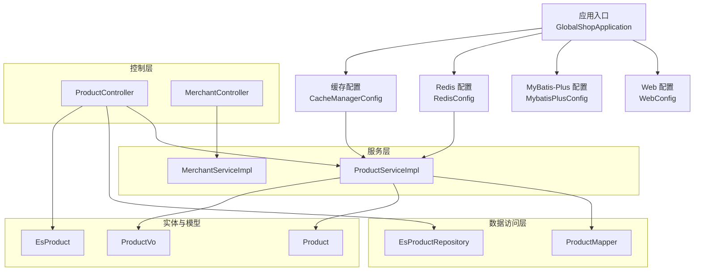
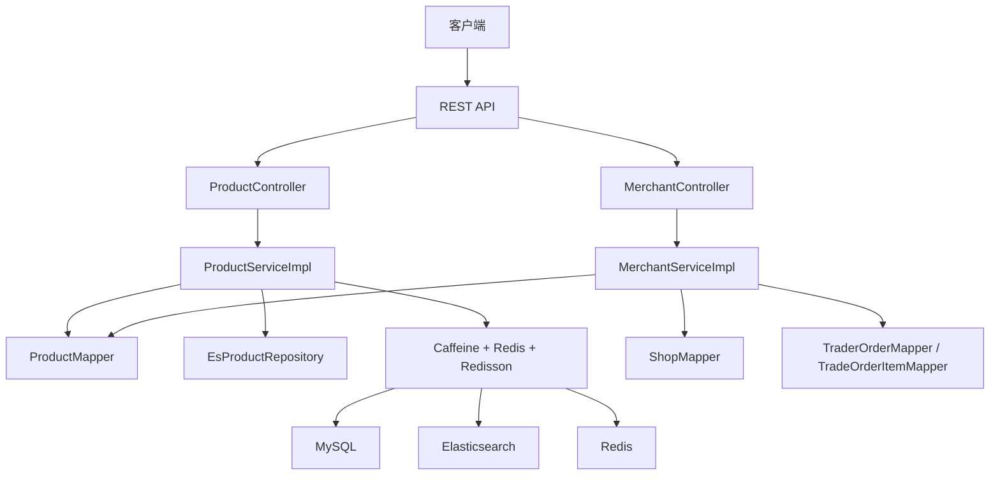
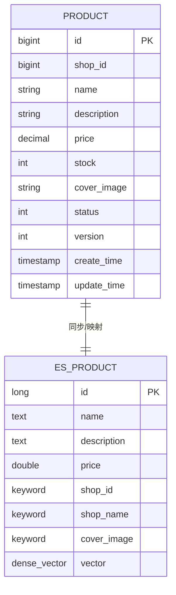
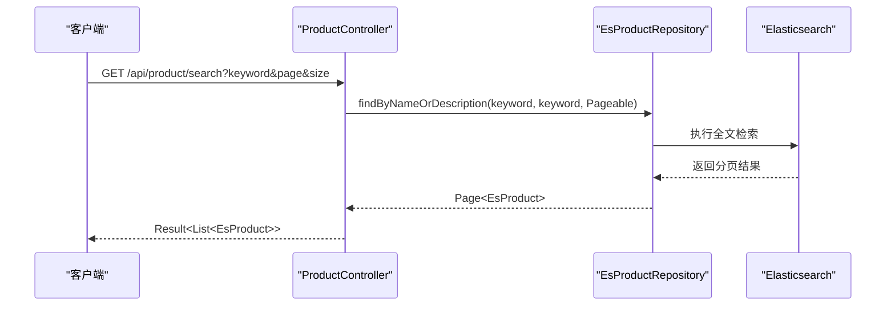
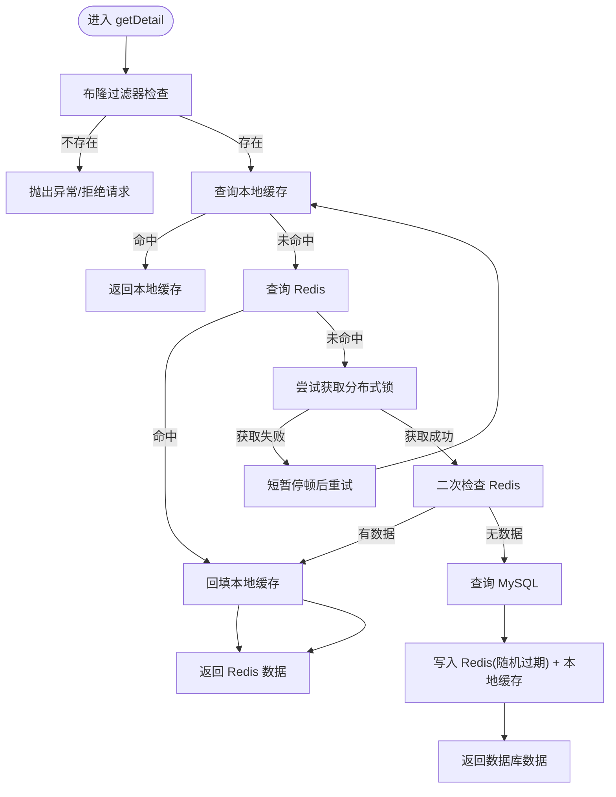
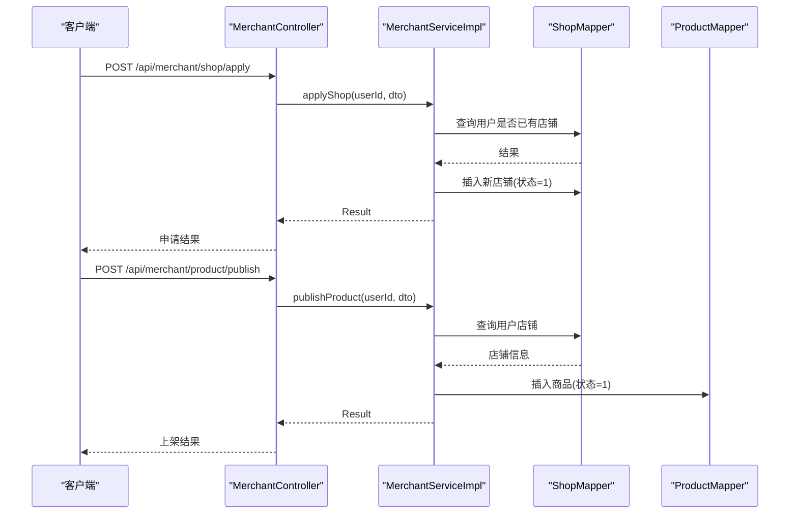
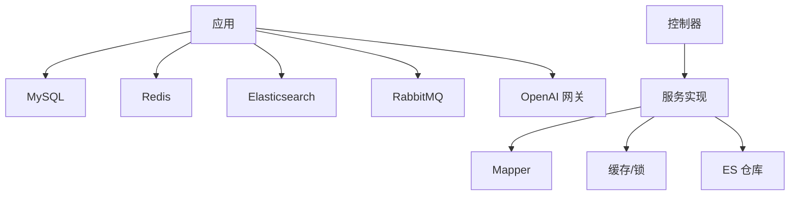

# 商品管理系统

<cite>
**本文引用的文件**
- [GlobalShopApplication.java](file://src/main/java/com/bohao/globalshop/GlobalShopApplication.java)
- [application.yml](file://src/main/resources/application.yml)
- [Product.java](file://src/main/java/com/bohao/globalshop/entity/Product.java)
- [EsProduct.java](file://src/main/java/com/bohao/globalshop/entity/EsProduct.java)
- [ProductVo.java](file://src/main/java/com/bohao/globalshop/vo/ProductVo.java)
- [ProductController.java](file://src/main/java/com/bohao/globalshop/controller/ProductController.java)
- [MerchantController.java](file://src/main/java/com/bohao/globalshop/controller/MerchantController.java)
- [ProductService.java](file://src/main/java/com/bohao/globalshop/service/ProductService.java)
- [ProductServiceImpl.java](file://src/main/java/com/bohao/globalshop/service/impl/ProductServiceImpl.java)
- [MerchantService.java](file://src/main/java/com/bohao/globalshop/service/MerchantService.java)
- [MerchantServiceImpl.java](file://src/main/java/com/bohao/globalshop/service/impl/MerchantServiceImpl.java)
- [ProductMapper.java](file://src/main/java/com/bohao/globalshop/mapper/ProductMapper.java)
- [EsProductRepository.java](file://src/main/java/com/bohao/globalshop/repository/EsProductRepository.java)
- [RedisConfig.java](file://src/main/java/com/bohao/globalshop/config/RedisConfig.java)
- [CacheManagerConfig.java](file://src/main/java/com/bohao/globalshop/config/CacheManagerConfig.java)
- [Result.java](file://src/main/java/com/bohao/globalshop/common/Result.java)
- [ProductPublishDto.java](file://src/main/java/com/bohao/globalshop/dto/ProductPublishDto.java)
</cite>

## 目录
1. [简介](#简介)
2. [项目结构](#项目结构)
3. [核心组件](#核心组件)
4. [架构总览](#架构总览)
5. [详细组件分析](#详细组件分析)
6. [依赖分析](#依赖分析)
7. [性能考虑](#性能考虑)
8. [故障排查指南](#故障排查指南)
9. [结论](#结论)
10. [附录](#附录)

## 简介
本项目是一个基于 Spring Boot 的商品管理系统，提供商品的增删改查、状态管理、分类与库存控制、搜索（含 Elasticsearch 全文检索与 AI 向量搜索）、发布与审核流程、价格与图片处理、API 接口、数据传输对象、缓存策略以及推荐与搜索优化实践。系统采用多级缓存（本地 + 分布式）、布隆过滤器防穿透、分布式锁防击穿、Redis Lua 脚本限流、Elasticsearch 全文检索与向量索引，以及消息队列保障可靠性。

## 项目结构
- 应用入口与配置
  - 应用启动类负责扫描 Mapper 与启用调度
  - 配置文件集中管理数据库、Redis、Elasticsearch、OpenAI 向量嵌入、RabbitMQ 等外部依赖
- 控制层
  - 商品控制器：提供商品列表、详情、评价、同步 ES、全文检索等接口
  - 商户控制器：提供开店申请、商品上架、订单列表与发货等接口
- 服务层
  - 商品服务：封装商品列表、评价、详情缓存与一致性策略
  - 商户服务：封装开店、上架、订单管理等业务
- 数据访问层
  - MyBatis-Plus Mapper：商品、店铺、订单等基础 CRUD
  - Elasticsearch Repository：全文检索与分页
- 实体与视图
  - 商品实体：MySQL 表映射
  - ES 商品实体：索引文档模型，含中文分词与向量字段
  - VO：用于前端展示的商品聚合视图
- DTO：用于接口入参的数据传输对象
- 缓存与配置
  - Caffeine 本地缓存、Redisson 分布式缓存与锁、布隆过滤器
  - Redis Lua 脚本用于秒杀库存扣减
- 工具与统一响应
  - 统一响应包装类

图表来源
- [GlobalShopApplication.java:1-18](file://src/main/java/com/bohao/globalshop/GlobalShopApplication.java#L1-L18)
- [RedisConfig.java:1-46](file://src/main/java/com/bohao/globalshop/config/RedisConfig.java#L1-L46)
- [CacheManagerConfig.java:1-81](file://src/main/java/com/bohao/globalshop/config/CacheManagerConfig.java#L1-L81)
- [ProductController.java:1-101](file://src/main/java/com/bohao/globalshop/controller/ProductController.java#L1-L101)
- [MerchantController.java:1-47](file://src/main/java/com/bohao/globalshop/controller/MerchantController.java#L1-L47)
- [ProductServiceImpl.java:1-177](file://src/main/java/com/bohao/globalshop/service/impl/ProductServiceImpl.java#L1-L177)
- [MerchantServiceImpl.java:1-60](file://src/main/java/com/bohao/globalshop/service/impl/MerchantServiceImpl.java#L1-L60)
- [ProductMapper.java:1-10](file://src/main/java/com/bohao/globalshop/mapper/ProductMapper.java#L1-L10)
- [EsProductRepository.java:1-13](file://src/main/java/com/bohao/globalshop/repository/EsProductRepository.java#L1-L13)
- [Product.java:1-30](file://src/main/java/com/bohao/globalshop/entity/Product.java#L1-L30)
- [EsProduct.java:1-42](file://src/main/java/com/bohao/globalshop/entity/EsProduct.java#L1-L42)
- [ProductVo.java:1-19](file://src/main/java/com/bohao/globalshop/vo/ProductVo.java#L1-L19)

章节来源
- [GlobalShopApplication.java:1-18](file://src/main/java/com/bohao/globalshop/GlobalShopApplication.java#L1-L18)
- [application.yml:1-42](file://src/main/resources/application.yml#L1-L42)

## 核心组件
- 商品实体与模型
  - 商品实体：包含主键、所属店铺、名称、描述、价格、库存、封面图、状态、乐观锁版本、创建/更新时间
  - ES 商品实体：索引文档，支持中文分词与向量字段，便于全文检索与 AI 向量搜索
  - 商品 VO：聚合商品与店铺信息，供前端展示
- 控制器
  - 商品控制器：提供商品列表、详情、评价、同步 ES、全文检索接口
  - 商户控制器：提供开店申请、商品上架、订单列表与发货接口
- 服务层
  - 商品服务实现：多级缓存（本地 + Redis）+ 布隆过滤器 + 分布式锁，保障高并发下的稳定性与一致性
  - 商户服务实现：开店申请与商品上架的业务校验与持久化
- 数据访问层
  - 商品 Mapper：基于 MyBatis-Plus 的通用 CRUD
  - ES 仓库：基于 Spring Data Elasticsearch 的全文检索与分页
- 缓存与配置
  - 本地缓存：Caffeine，毫秒级延迟
  - 分布式缓存：Redis，带随机过期时间，防雪崩
  - 布隆过滤器：Redisson，拦截不存在 ID 的请求，防穿透
  - 分布式锁：Redisson，热点数据缓存击穿防护
  - Redis Lua 脚本：库存扣减原子性控制

章节来源
- [Product.java:1-30](file://src/main/java/com/bohao/globalshop/entity/Product.java#L1-L30)
- [EsProduct.java:1-42](file://src/main/java/com/bohao/globalshop/entity/EsProduct.java#L1-L42)
- [ProductVo.java:1-19](file://src/main/java/com/bohao/globalshop/vo/ProductVo.java#L1-L19)
- [ProductController.java:1-101](file://src/main/java/com/bohao/globalshop/controller/ProductController.java#L1-L101)
- [MerchantController.java:1-47](file://src/main/java/com/bohao/globalshop/controller/MerchantController.java#L1-L47)
- [ProductServiceImpl.java:1-177](file://src/main/java/com/bohao/globalshop/service/impl/ProductServiceImpl.java#L1-L177)
- [MerchantServiceImpl.java:1-60](file://src/main/java/com/bohao/globalshop/service/impl/MerchantServiceImpl.java#L1-L60)
- [ProductMapper.java:1-10](file://src/main/java/com/bohao/globalshop/mapper/ProductMapper.java#L1-L10)
- [EsProductRepository.java:1-13](file://src/main/java/com/bohao/globalshop/repository/EsProductRepository.java#L1-L13)
- [RedisConfig.java:1-46](file://src/main/java/com/bohao/globalshop/config/RedisConfig.java#L1-L46)
- [CacheManagerConfig.java:1-81](file://src/main/java/com/bohao/globalshop/config/CacheManagerConfig.java#L1-L81)

## 架构总览
系统采用分层架构，控制层负责对外暴露 API，服务层封装业务与缓存策略，数据访问层对接 MySQL 与 Elasticsearch，缓存与配置模块提供高性能与高可用支撑。

图表来源
- [ProductController.java:1-101](file://src/main/java/com/bohao/globalshop/controller/ProductController.java#L1-L101)
- [MerchantController.java:1-47](file://src/main/java/com/bohao/globalshop/controller/MerchantController.java#L1-L47)
- [ProductServiceImpl.java:1-177](file://src/main/java/com/bohao/globalshop/service/impl/ProductServiceImpl.java#L1-L177)
- [MerchantServiceImpl.java:1-60](file://src/main/java/com/bohao/globalshop/service/impl/MerchantServiceImpl.java#L1-L60)
- [ProductMapper.java:1-10](file://src/main/java/com/bohao/globalshop/mapper/ProductMapper.java#L1-L10)
- [EsProductRepository.java:1-13](file://src/main/java/com/bohao/globalshop/repository/EsProductRepository.java#L1-L13)
- [RedisConfig.java:1-46](file://src/main/java/com/bohao/globalshop/config/RedisConfig.java#L1-L46)
- [CacheManagerConfig.java:1-81](file://src/main/java/com/bohao/globalshop/config/CacheManagerConfig.java#L1-L81)

## 详细组件分析

### 商品实体与数据模型
- 字段定义与业务规则
  - 主键、所属店铺、名称、描述、价格、库存、封面图、状态、乐观锁版本、创建/更新时间
  - 状态字段用于商品上下架控制；库存用于销售扣减与秒杀保护
  - 价格使用高精度类型，确保金融计算准确性
- ES 文档模型
  - 中文分词：存入时使用最大细粒度分词，搜索时使用智能分词
  - 精确匹配字段使用 keyword 类型（如店铺 ID、名称）
  - 向量字段预留 1024 维度，支持语义检索与推荐

图表来源
- [Product.java:1-30](file://src/main/java/com/bohao/globalshop/entity/Product.java#L1-L30)
- [EsProduct.java:1-42](file://src/main/java/com/bohao/globalshop/entity/EsProduct.java#L1-L42)

章节来源
- [Product.java:1-30](file://src/main/java/com/bohao/globalshop/entity/Product.java#L1-L30)
- [EsProduct.java:1-42](file://src/main/java/com/bohao/globalshop/entity/EsProduct.java#L1-L42)

### 商品搜索与检索
- 全文检索
  - 使用 Elasticsearch + IK 分词器，支持按名称或描述进行全文检索
  - 支持分页查询，返回 ES 文档模型
- AI 向量搜索
  - ES 文档包含向量字段，预留 1024 维度
  - 控制器注释中提示可将文本输入大模型生成向量并写入文档，后续可扩展 KNN 搜索
- 同步机制
  - 提供全量同步接口，将 MySQL 上架商品转换为 ES 文档并批量写入

图表来源
- [ProductController.java:82-99](file://src/main/java/com/bohao/globalshop/controller/ProductController.java#L82-L99)
- [EsProductRepository.java:8-12](file://src/main/java/com/bohao/globalshop/repository/EsProductRepository.java#L8-L12)

章节来源
- [ProductController.java:51-99](file://src/main/java/com/bohao/globalshop/controller/ProductController.java#L51-L99)
- [EsProductRepository.java:8-12](file://src/main/java/com/bohao/globalshop/repository/EsProductRepository.java#L8-L12)
- [EsProduct.java:18-41](file://src/main/java/com/bohao/globalshop/entity/EsProduct.java#L18-L41)

### 商品详情与缓存策略
- 多级缓存
  - 布隆过滤器：拦截不存在 ID，防缓存穿透
  - 本地缓存（Caffeine）：纳秒级延迟，命中即返回
  - 分布式缓存（Redis）：命中则回填本地缓存
- 防击穿与雪崩
  - 分布式锁：热点数据缓存失效时，仅允许一个线程查询数据库并回填缓存
  - 随机过期时间：为缓存添加随机偏移，避免大量缓存在同一时刻过期
- 一致性与重试
  - 获取不到锁的线程短暂休眠后重试，提升吞吐

图表来源
- [ProductServiceImpl.java:111-175](file://src/main/java/com/bohao/globalshop/service/impl/ProductServiceImpl.java#L111-L175)
- [CacheManagerConfig.java:40-78](file://src/main/java/com/bohao/globalshop/config/CacheManagerConfig.java#L40-L78)
- [RedisConfig.java:13-25](file://src/main/java/com/bohao/globalshop/config/RedisConfig.java#L13-L25)

章节来源
- [ProductServiceImpl.java:111-175](file://src/main/java/com/bohao/globalshop/service/impl/ProductServiceImpl.java#L111-L175)
- [CacheManagerConfig.java:29-78](file://src/main/java/com/bohao/globalshop/config/CacheManagerConfig.java#L29-L78)
- [RedisConfig.java:13-25](file://src/main/java/com/bohao/globalshop/config/RedisConfig.java#L13-L25)

### 商品发布与审核流程
- 开店申请
  - 校验用户是否已有店铺，若无则创建新店铺并直接审核通过（演示环境）
- 商品上架
  - 校验用户拥有店铺，构造商品实体并持久化
- 订单管理
  - 商户可查看本店订单并执行发货操作（具体订单实体与映射在其他模块）

图表来源
- [MerchantController.java:20-32](file://src/main/java/com/bohao/globalshop/controller/MerchantController.java#L20-L32)
- [MerchantServiceImpl.java:33-60](file://src/main/java/com/bohao/globalshop/service/impl/MerchantServiceImpl.java#L33-L60)

章节来源
- [MerchantController.java:20-32](file://src/main/java/com/bohao/globalshop/controller/MerchantController.java#L20-L32)
- [MerchantServiceImpl.java:33-60](file://src/main/java/com/bohao/globalshop/service/impl/MerchantServiceImpl.java#L33-L60)

### 价格管理与库存控制
- 价格
  - 使用高精度数值类型存储，避免浮点误差
- 库存
  - 提供 Redis Lua 脚本实现原子性扣减，防止超卖
  - 秒杀场景下建议结合分布式锁与缓存预热，降低数据库压力

章节来源
- [Product.java:19-21](file://src/main/java/com/bohao/globalshop/entity/Product.java#L19-L21)
- [RedisConfig.java:28-44](file://src/main/java/com/bohao/globalshop/config/RedisConfig.java#L28-L44)

### 图片处理与展示
- 封面图字段用于商品展示
- 评价列表中支持图片字段，便于图文评价展示
- 建议在生产环境接入对象存储与缩略图生成策略，提升加载性能

章节来源
- [Product.java:22](file://src/main/java/com/bohao/globalshop/entity/Product.java#L22)
- [ProductVo.java:17](file://src/main/java/com/bohao/globalshop/vo/ProductVo.java#L17)

### API 接口文档
- 商品接口
  - GET /api/product/list：获取上架商品列表（聚合店铺信息）
  - GET /api/product/detail/{id}：获取商品详情（多级缓存）
  - GET /api/product/{id}/reviews：获取商品评价列表（用户信息脱敏）
  - GET /api/product/sync-es：全量同步 MySQL 商品到 ES
  - GET /api/product/search：全文检索（关键词、分页）
- 商户接口
  - POST /api/merchant/shop/apply：申请开店
  - POST /api/merchant/product/publish：商品上架
  - GET /api/merchant/order/list：查看本店订单
  - POST /api/merchant/order/deliver/{id}：订单发货

章节来源
- [ProductController.java:30-99](file://src/main/java/com/bohao/globalshop/controller/ProductController.java#L30-L99)
- [MerchantController.java:20-47](file://src/main/java/com/bohao/globalshop/controller/MerchantController.java#L20-L47)

### 数据传输对象与统一响应
- DTO
  - 商品发布 DTO：名称、描述、价格、库存、封面图
- VO
  - 商品展示 VO：聚合商品与店铺信息
- 统一响应
  - 成功/错误统一封装，便于前端处理

章节来源
- [ProductPublishDto.java:1-15](file://src/main/java/com/bohao/globalshop/dto/ProductPublishDto.java#L1-L15)
- [ProductVo.java:1-19](file://src/main/java/com/bohao/globalshop/vo/ProductVo.java#L1-L19)
- [Result.java:1-30](file://src/main/java/com/bohao/globalshop/common/Result.java#L1-L30)

## 依赖分析
- 外部依赖
  - MySQL：商品、订单、用户等业务数据
  - Redis：分布式缓存、布隆过滤器、分布式锁、Lua 脚本
  - Elasticsearch：全文检索与向量索引
  - RabbitMQ：消息可靠性（发送确认、返回）
  - OpenAI 兼容网关：用于向量嵌入（预留）
- 内部模块耦合
  - 控制器依赖服务接口
  - 服务实现依赖 Mapper 与缓存客户端
  - ES 仓库依赖 Spring Data Elasticsearch

图表来源
- [application.yml:4-42](file://src/main/resources/application.yml#L4-L42)
- [RedisConfig.java:13-25](file://src/main/java/com/bohao/globalshop/config/RedisConfig.java#L13-L25)
- [CacheManagerConfig.java:40-78](file://src/main/java/com/bohao/globalshop/config/CacheManagerConfig.java#L40-L78)
- [EsProductRepository.java:8-12](file://src/main/java/com/bohao/globalshop/repository/EsProductRepository.java#L8-L12)

章节来源
- [application.yml:4-42](file://src/main/resources/application.yml#L4-L42)

## 性能考虑
- 缓存策略
  - 本地缓存优先，命中即返回；未命中再查 Redis；Redis 未命中再查数据库并回填
  - 为缓存设置随机过期时间，避免雪崩
- 并发控制
  - 布隆过滤器拦截不存在 ID 请求
  - 分布式锁保护热点数据，避免击穿
- 检索优化
  - ES 使用 IK 分词器，提高中文检索效果
  - 预留向量字段，支持未来语义检索与推荐
- 数据库与索引
  - 仅同步上架商品到 ES，减少索引体积
  - 为高选择性字段使用 keyword 类型，提升精确匹配性能

## 故障排查指南
- 缓存相关
  - 若出现缓存穿透：检查布隆过滤器是否初始化成功
  - 若出现缓存击穿：确认分布式锁是否正确释放
  - 若出现缓存雪崩：检查过期时间是否带有随机偏移
- 检索相关
  - 若 ES 检索无结果：确认索引是否已同步、IK 分词器是否生效
  - 若向量搜索报错：确认向量字段是否正确写入且 ES 已建立向量索引
- 数据库相关
  - 若商品详情为空：确认商品状态为上架且 ID 存在
- 消息与队列
  - 若消息丢失：检查 RabbitMQ 的发送确认与返回配置

章节来源
- [CacheManagerConfig.java:40-78](file://src/main/java/com/bohao/globalshop/config/CacheManagerConfig.java#L40-L78)
- [ProductServiceImpl.java:111-175](file://src/main/java/com/bohao/globalshop/service/impl/ProductServiceImpl.java#L111-L175)
- [ProductController.java:54-80](file://src/main/java/com/bohao/globalshop/controller/ProductController.java#L54-L80)
- [application.yml:30-38](file://src/main/resources/application.yml#L30-L38)

## 结论
本系统通过多级缓存、布隆过滤器、分布式锁与 Redis Lua 脚本，构建了高并发、低延迟的商品详情读取能力；通过 Elasticsearch 全文检索与向量字段预留，实现了强大的搜索与推荐基础；通过商户侧的开店与上架流程，完成了商品发布的闭环。建议在生产环境中进一步完善审核机制、图片处理与 CDN 加速、ES 向量索引与 KNN 搜索的落地，以及监控与告警体系的建设。

## 附录
- 配置要点
  - 数据源、Redis、Elasticsearch、RabbitMQ、OpenAI 网关均在配置文件中集中管理
- 开发建议
  - 引入统一认证与权限控制
  - 完善日志与链路追踪
  - 增加限流与熔断策略
  - 对评价与评论做敏感词过滤