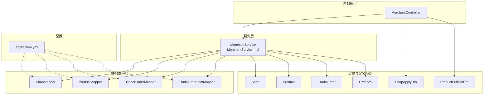
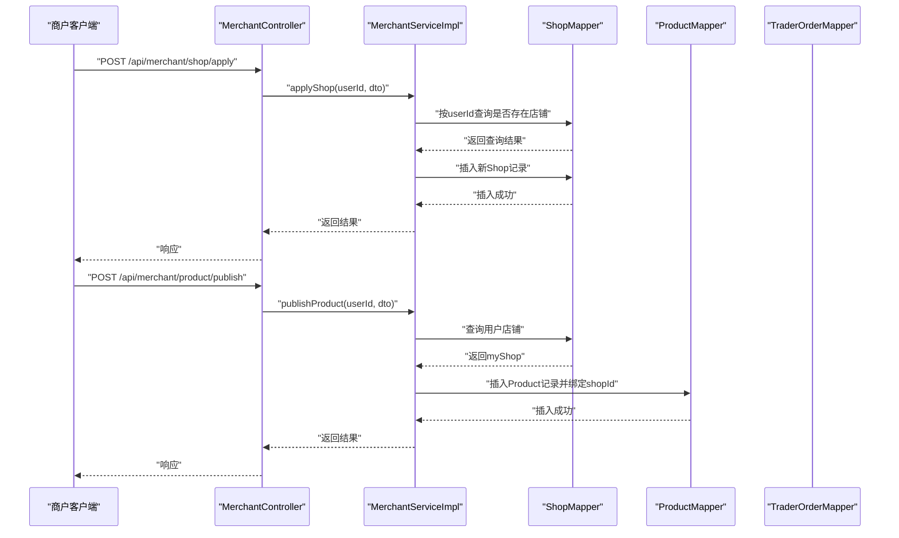
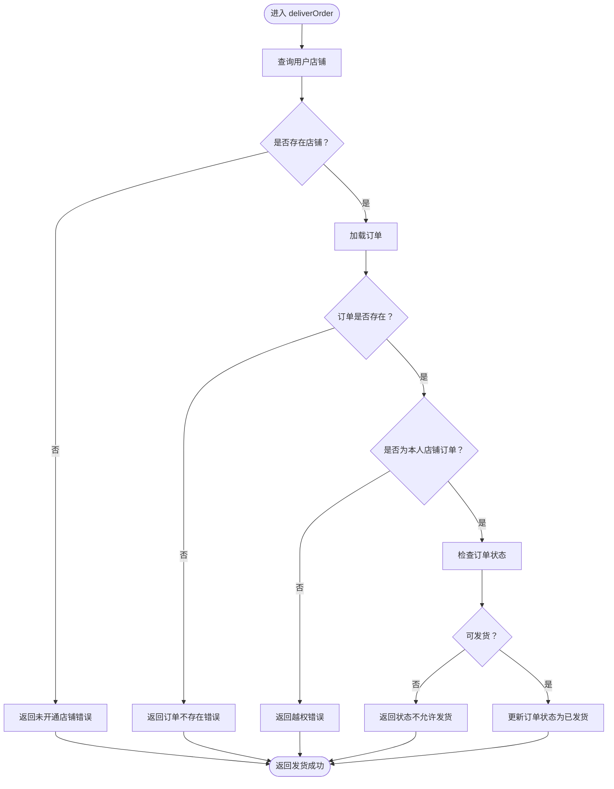
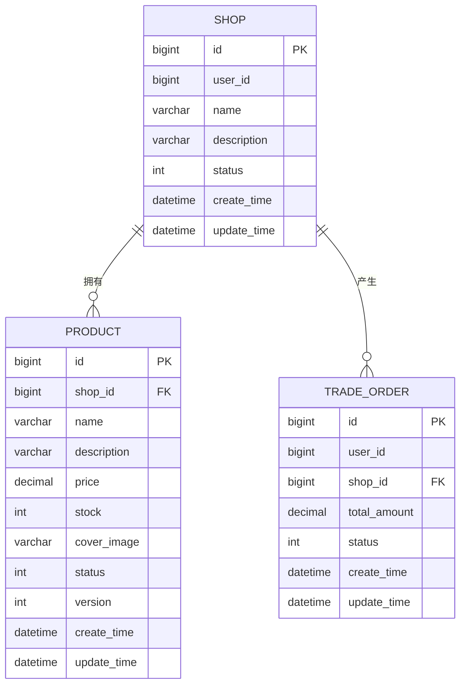
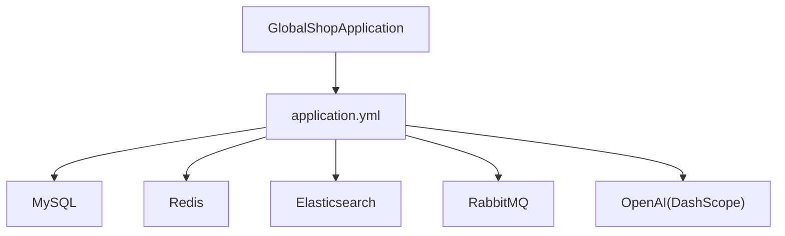

# 商户管理系统

<cite>
**本文引用的文件**
- [GlobalShopApplication.java](file://src/main/java/com/bohao/globalshop/GlobalShopApplication.java)
- [MerchantController.java](file://src/main/java/com/bohao/globalshop/controller/MerchantController.java)
- [MerchantService.java](file://src/main/java/com/bohao/globalshop/service/MerchantService.java)
- [MerchantServiceImpl.java](file://src/main/java/com/bohao/globalshop/service/impl/MerchantServiceImpl.java)
- [Shop.java](file://src/main/java/com/bohao/globalshop/entity/Shop.java)
- [Product.java](file://src/main/java/com/bohao/globalshop/entity/Product.java)
- [TradeOrder.java](file://src/main/java/com/bohao/globalshop/entity/TradeOrder.java)
- [ShopApplyDto.java](file://src/main/java/com/bohao/globalshop/dto/ShopApplyDto.java)
- [ProductPublishDto.java](file://src/main/java/com/bohao/globalshop/dto/ProductPublishDto.java)
- [OrderVo.java](file://src/main/java/com/bohao/globalshop/vo/OrderVo.java)
- [ShopMapper.java](file://src/main/java/com/bohao/globalshop/mapper/ShopMapper.java)
- [ProductMapper.java](file://src/main/java/com/bohao/globalshop/mapper/ProductMapper.java)
- [TraderOrderMapper.java](file://src/main/java/com/bohao/globalshop/mapper/TraderOrderMapper.java)
- [TradeOrderItemMapper.java](file://src/main/java/com/bohao/globalshop/mapper/TradeOrderItemMapper.java)
- [application.yml](file://src/main/resources/application.yml)
</cite>

## 目录
1. [简介](#简介)
2. [项目结构](#项目结构)
3. [核心组件](#核心组件)
4. [架构总览](#架构总览)
5. [详细组件分析](#详细组件分析)
6. [依赖分析](#依赖分析)
7. [性能考虑](#性能考虑)
8. [故障排查指南](#故障排查指南)
9. [结论](#结论)
10. [附录](#附录)

## 简介
本项目为一个面向商户的管理系统，围绕“商户入驻申请、资质审核、店铺管理、商品发布与订单处理”等核心能力构建。系统采用 Spring Boot + MyBatis-Plus 架构，提供 REST 接口供商户侧使用，具备基础的权限隔离与风控校验能力。当前版本在“审核流程”上采用简化策略（申请即通过），便于快速验证；真实生产环境建议补充完整的审核流与风控策略。

## 项目结构
后端采用分层架构：
- 控制器层：暴露商户相关 API
- 服务层：封装业务逻辑与数据隔离
- 数据访问层：基于 MyBatis-Plus 的 Mapper 接口
- 实体与 DTO/VO：描述数据模型与接口入参/出参
- 配置：数据库、Redis、Elasticsearch、RabbitMQ、OpenAI 等外部集成

图表来源
- [MerchantController.java:1-48](file://src/main/java/com/bohao/globalshop/controller/MerchantController.java#L1-L48)
- [MerchantServiceImpl.java:1-143](file://src/main/java/com/bohao/globalshop/service/impl/MerchantServiceImpl.java#L1-L143)
- [ShopMapper.java:1-10](file://src/main/java/com/bohao/globalshop/mapper/ShopMapper.java#L1-L10)
- [ProductMapper.java:1-10](file://src/main/java/com/bohao/globalshop/mapper/ProductMapper.java#L1-L10)
- [TraderOrderMapper.java:1-10](file://src/main/java/com/bohao/globalshop/mapper/TraderOrderMapper.java#L1-L10)
- [TradeOrderItemMapper.java:1-10](file://src/main/java/com/bohao/globalshop/mapper/TradeOrderItemMapper.java#L1-L10)
- [Shop.java:1-22](file://src/main/java/com/bohao/globalshop/entity/Shop.java#L1-L22)
- [Product.java:1-30](file://src/main/java/com/bohao/globalshop/entity/Product.java#L1-L30)
- [TradeOrder.java:1-24](file://src/main/java/com/bohao/globalshop/entity/TradeOrder.java#L1-L24)
- [ShopApplyDto.java:1-10](file://src/main/java/com/bohao/globalshop/dto/ShopApplyDto.java#L1-L10)
- [ProductPublishDto.java:1-15](file://src/main/java/com/bohao/globalshop/dto/ProductPublishDto.java#L1-L15)
- [OrderVo.java:1-18](file://src/main/java/com/bohao/globalshop/vo/OrderVo.java#L1-L18)
- [application.yml:1-42](file://src/main/resources/application.yml#L1-L42)

章节来源
- [GlobalShopApplication.java:1-18](file://src/main/java/com/bohao/globalshop/GlobalShopApplication.java#L1-L18)
- [application.yml:1-42](file://src/main/resources/application.yml#L1-L42)

## 核心组件
- 商户控制器：提供“申请开店、商品上架、查看订单、订单发货”等接口
- 商户服务：实现业务规则、数据隔离与风控校验
- 数据模型：Shop、Product、TradeOrder 及其关联实体
- DTO/VO：ShopApplyDto、ProductPublishDto、OrderVo
- Mapper：ShopMapper、ProductMapper、TraderOrderMapper、TradeOrderItemMapper

章节来源
- [MerchantController.java:1-48](file://src/main/java/com/bohao/globalshop/controller/MerchantController.java#L1-L48)
- [MerchantService.java:1-23](file://src/main/java/com/bohao/globalshop/service/MerchantService.java#L1-L23)
- [MerchantServiceImpl.java:1-143](file://src/main/java/com/bohao/globalshop/service/impl/MerchantServiceImpl.java#L1-L143)
- [Shop.java:1-22](file://src/main/java/com/bohao/globalshop/entity/Shop.java#L1-L22)
- [Product.java:1-30](file://src/main/java/com/bohao/globalshop/entity/Product.java#L1-L30)
- [TradeOrder.java:1-24](file://src/main/java/com/bohao/globalshop/entity/TradeOrder.java#L1-L24)
- [ShopApplyDto.java:1-10](file://src/main/java/com/bohao/globalshop/dto/ShopApplyDto.java#L1-L10)
- [ProductPublishDto.java:1-15](file://src/main/java/com/bohao/globalshop/dto/ProductPublishDto.java#L1-L15)
- [OrderVo.java:1-18](file://src/main/java/com/bohao/globalshop/vo/OrderVo.java#L1-L18)
- [ShopMapper.java:1-10](file://src/main/java/com/bohao/globalshop/mapper/ShopMapper.java#L1-L10)
- [ProductMapper.java:1-10](file://src/main/java/com/bohao/globalshop/mapper/ProductMapper.java#L1-L10)
- [TraderOrderMapper.java:1-10](file://src/main/java/com/bohao/globalshop/mapper/TraderOrderMapper.java#L1-L10)
- [TradeOrderItemMapper.java:1-10](file://src/main/java/com/bohao/globalshop/mapper/TradeOrderItemMapper.java#L1-L10)

## 架构总览
系统采用典型的 MVC 分层与 MyBatis-Plus ORM：
- 控制器接收请求，解析 JWT 中的用户标识，调用服务层
- 服务层进行业务校验、数据隔离与状态变更
- Mapper 层执行数据库操作
- 配置文件集中管理数据源、缓存、搜索与消息队列等外部依赖

图表来源
- [MerchantController.java:20-32](file://src/main/java/com/bohao/globalshop/controller/MerchantController.java#L20-L32)
- [MerchantServiceImpl.java:33-77](file://src/main/java/com/bohao/globalshop/service/impl/MerchantServiceImpl.java#L33-L77)
- [ShopMapper.java:1-10](file://src/main/java/com/bohao/globalshop/mapper/ShopMapper.java#L1-L10)
- [ProductMapper.java:1-10](file://src/main/java/com/bohao/globalshop/mapper/ProductMapper.java#L1-L10)

## 详细组件分析

### 商户控制器（API 定义）
- 申请开店
  - 路径：POST /api/merchant/shop/apply
  - 入参：ShopApplyDto（名称、描述）
  - 出参：Result<String>
  - 关键行为：从 JWT 提取当前用户ID，调用服务层完成开店
- 商品上架
  - 路径：POST /api/merchant/product/publish
  - 入参：ProductPublishDto（名称、描述、价格、库存、封面图）
  - 出参：Result<String>
  - 关键行为：校验用户是否已开店且状态正常，绑定 shopId 后入库
- 订单列表
  - 路径：GET /api/merchant/order/list
  - 出参：Result<List<OrderVo>>
  - 关键行为：按用户店铺过滤订单，组装子项明细
- 订单发货
  - 路径：POST /api/merchant/order/deliver/{id}
  - 入参：orderId（路径变量）
  - 出参：Result<String>
  - 关键行为：越权校验（仅能发本人店铺的单）、状态校验、更新为已发货

章节来源
- [MerchantController.java:1-48](file://src/main/java/com/bohao/globalshop/controller/MerchantController.java#L1-L48)

### 商户服务实现（业务规则与风控）
- 申请开店
  - 重复申请拦截：同一用户仅允许拥有一个店铺
  - 状态策略：当前版本默认“营业中”，便于演示；生产需改为“审核中”
- 商品上架
  - 店铺存在性与状态校验
  - 将商品与当前用户店铺强绑定（shopId）
- 订单查询
  - 数据隔离：仅查询属于当前用户店铺的主订单
  - 明细组装：查询子订单项并返回给前端
- 订单发货
  - 越权校验：确保订单归属当前店铺
  - 状态校验：未付款、已取消、已发货等场景拒绝操作
  - 状态更新：成功后标记为已发货

图表来源
- [MerchantServiceImpl.java:110-141](file://src/main/java/com/bohao/globalshop/service/impl/MerchantServiceImpl.java#L110-L141)

章节来源
- [MerchantServiceImpl.java:1-143](file://src/main/java/com/bohao/globalshop/service/impl/MerchantServiceImpl.java#L1-L143)

### 数据模型与关系
- Shop：商户店铺，包含用户ID、名称、描述、状态、时间戳
- Product：商品，包含所属店铺ID、名称、描述、价格、库存、封面图、状态、版本号、时间戳
- TradeOrder：交易订单，包含用户ID、店铺ID、总金额、状态、时间戳
- TradeOrderItem：订单子项（当前代码中通过 VO 组装，实际表结构以 TradeOrderItemMapper 对应为准）

图表来源
- [Shop.java:1-22](file://src/main/java/com/bohao/globalshop/entity/Shop.java#L1-L22)
- [Product.java:1-30](file://src/main/java/com/bohao/globalshop/entity/Product.java#L1-L30)
- [TradeOrder.java:1-24](file://src/main/java/com/bohao/globalshop/entity/TradeOrder.java#L1-L24)

章节来源
- [Shop.java:1-22](file://src/main/java/com/bohao/globalshop/entity/Shop.java#L1-L22)
- [Product.java:1-30](file://src/main/java/com/bohao/globalshop/entity/Product.java#L1-L30)
- [TradeOrder.java:1-24](file://src/main/java/com/bohao/globalshop/entity/TradeOrder.java#L1-L24)

### DTO 与 VO
- ShopApplyDto：申请开店的入参对象
- ProductPublishDto：商品上架的入参对象
- OrderVo：订单列表的出参对象，包含主订单信息与子项明细

章节来源
- [ShopApplyDto.java:1-10](file://src/main/java/com/bohao/globalshop/dto/ShopApplyDto.java#L1-L10)
- [ProductPublishDto.java:1-15](file://src/main/java/com/bohao/globalshop/dto/ProductPublishDto.java#L1-L15)
- [OrderVo.java:1-18](file://src/main/java/com/bohao/globalshop/vo/OrderVo.java#L1-L18)

### Mapper 接口
- ShopMapper、ProductMapper、TraderOrderMapper、TradeOrderItemMapper 均继承 MyBatis-Plus 的 BaseMapper，提供通用 CRUD 能力

章节来源
- [ShopMapper.java:1-10](file://src/main/java/com/bohao/globalshop/mapper/ShopMapper.java#L1-L10)
- [ProductMapper.java:1-10](file://src/main/java/com/bohao/globalshop/mapper/ProductMapper.java#L1-L10)
- [TraderOrderMapper.java:1-10](file://src/main/java/com/bohao/globalshop/mapper/TraderOrderMapper.java#L1-L10)
- [TradeOrderItemMapper.java:1-10](file://src/main/java/com/bohao/globalshop/mapper/TradeOrderItemMapper.java#L1-L10)

## 依赖分析
- 外部依赖
  - MySQL：持久化存储
  - Redis：缓存（配置存在，具体使用见缓存配置类）
  - Elasticsearch：搜索引擎（用于商品检索，配置存在）
  - RabbitMQ：消息队列（发布确认与回退开启）
  - OpenAI（DashScope）：嵌入向量化能力（用于 AI 搜索）
- 内部模块耦合
  - 控制器依赖服务接口
  - 服务实现依赖多个 Mapper
  - 实体之间通过外键建立关联

图表来源
- [GlobalShopApplication.java:1-18](file://src/main/java/com/bohao/globalshop/GlobalShopApplication.java#L1-L18)
- [application.yml:1-42](file://src/main/resources/application.yml#L1-L42)

章节来源
- [application.yml:1-42](file://src/main/resources/application.yml#L1-L42)

## 性能考虑
- 数据隔离与索引
  - 查询订单时按 shop_id 过滤，建议在 trade_order.shop_id 建立索引
  - 查询商品时按 shop_id 过滤，建议在 product.shop_id 建立索引
- 缓存策略
  - Redis 可用于热点商品详情、店铺信息、订单列表等读多写少场景
  - 结合缓存预热任务提升启动期命中率
- 异步与削峰
  - RabbitMQ 可承载订单取消、发货通知等异步任务，降低主流程阻塞
- 搜索与推荐
  - Elasticsearch 用于商品检索，结合向量化能力实现语义搜索

## 故障排查指南
- 常见错误与定位
  - 重复开店：服务层已做重复申请拦截，返回明确提示
  - 无店铺上架：未开通店铺或状态异常，返回相应错误码
  - 越权发货：订单归属校验失败，返回越权错误
  - 订单状态异常：未付款、已取消、已发货等状态不可重复操作
- 日志与监控
  - MyBatis-Plus 已开启 SQL 日志输出，便于开发调试
  - 建议接入统一异常处理与链路追踪，便于生产问题定位

章节来源
- [MerchantServiceImpl.java:33-77](file://src/main/java/com/bohao/globalshop/service/impl/MerchantServiceImpl.java#L33-L77)
- [MerchantServiceImpl.java:110-141](file://src/main/java/com/bohao/globalshop/service/impl/MerchantServiceImpl.java#L110-L141)
- [application.yml:39-42](file://src/main/resources/application.yml#L39-L42)

## 结论
本系统完成了商户核心能力的最小可行实现：开店、上架、订单管理与发货。当前版本在“审核流程”上做了简化以便快速验证，建议在生产环境中补充完整的审核流、风控策略与权限体系。同时，结合 Redis、Elasticsearch、RabbitMQ 与 AI 能力，可进一步提升性能、搜索体验与智能化水平。

## 附录

### API 接口规范（摘要）
- 申请开店
  - 方法：POST
  - 路径：/api/merchant/shop/apply
  - 入参：ShopApplyDto
  - 出参：Result<String>
- 商品上架
  - 方法：POST
  - 路径：/api/merchant/product/publish
  - 入参：ProductPublishDto
  - 出参：Result<String>
- 订单列表
  - 方法：GET
  - 路径：/api/merchant/order/list
  - 出参：Result<List<OrderVo>>
- 订单发货
  - 方法：POST
  - 路径：/api/merchant/order/deliver/{id}
  - 入参：orderId（路径变量）
  - 出参：Result<String>

章节来源
- [MerchantController.java:20-46](file://src/main/java/com/bohao/globalshop/controller/MerchantController.java#L20-L46)

### 业务规则与合规要点
- 数据隔离：所有订单与商品均按 shop_id 与 user_id 进行严格隔离
- 权限控制：通过 JWT 提取用户ID，结合业务校验防止越权
- 风控策略：发货前进行状态校验与越权校验
- 合规建议：生产环境需补充审核流、日志审计、敏感信息脱敏与数据备份

### 运营优化与最佳实践
- 商品管理：利用 Elasticsearch 提升搜索体验，结合 Redis 缓存热点商品
- 订单处理：通过 RabbitMQ 异步处理发货通知与退款流程
- 客户服务：基于订单状态与物流信息提供可视化看板与客服工单
- 数据分析：沉淀订单、商品与用户行为数据，支持运营决策