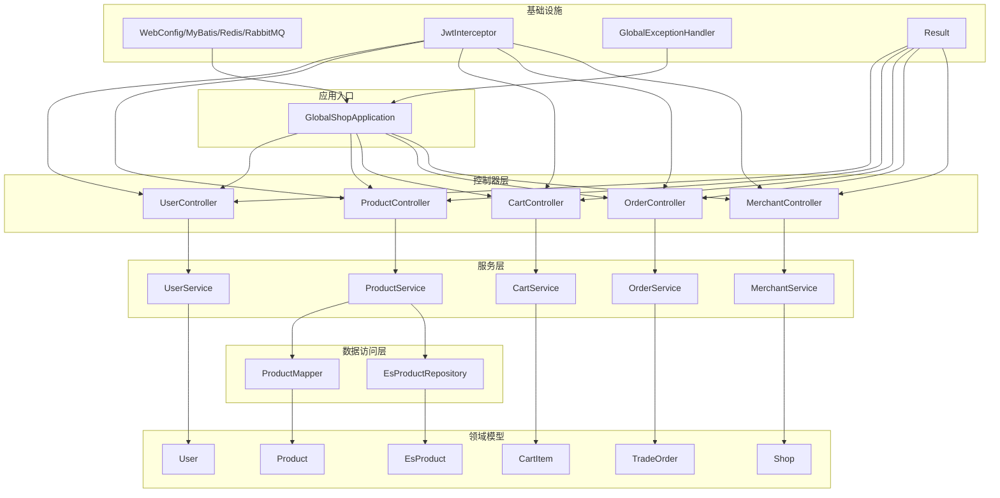
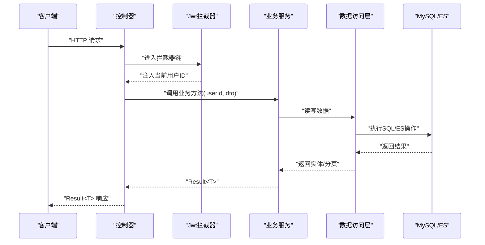
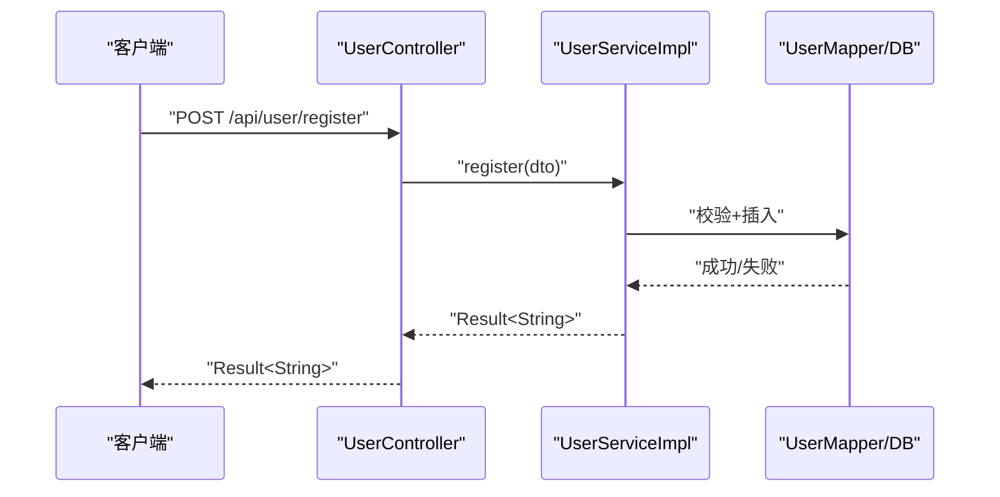
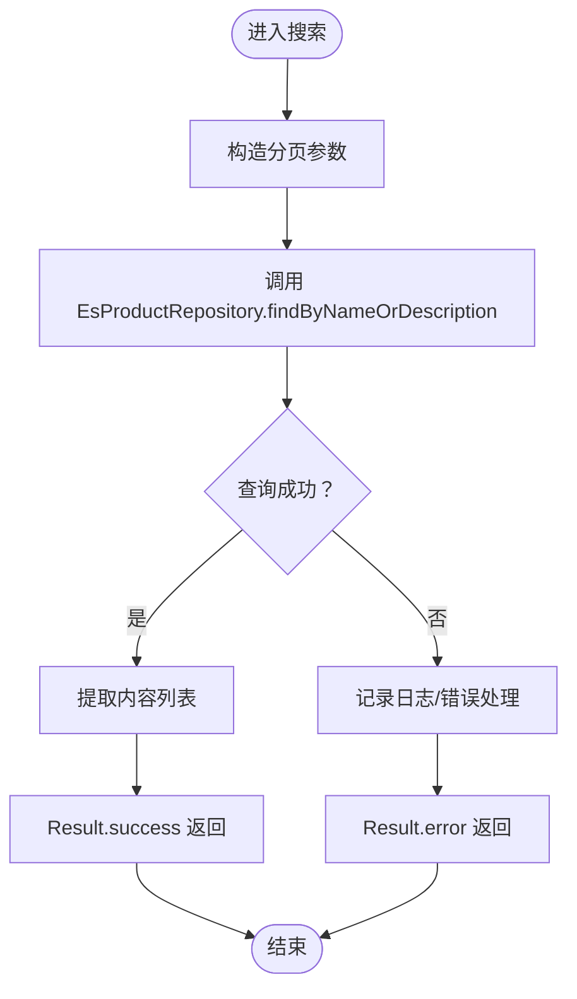
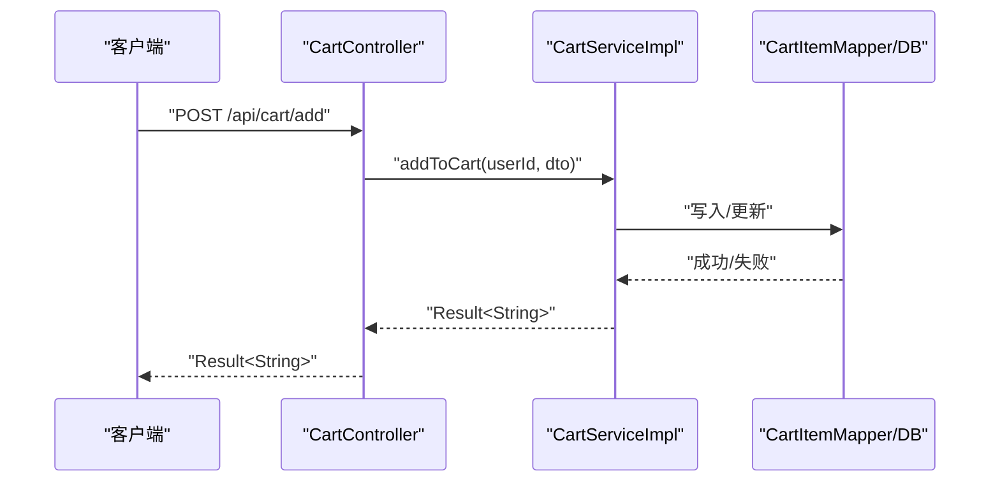
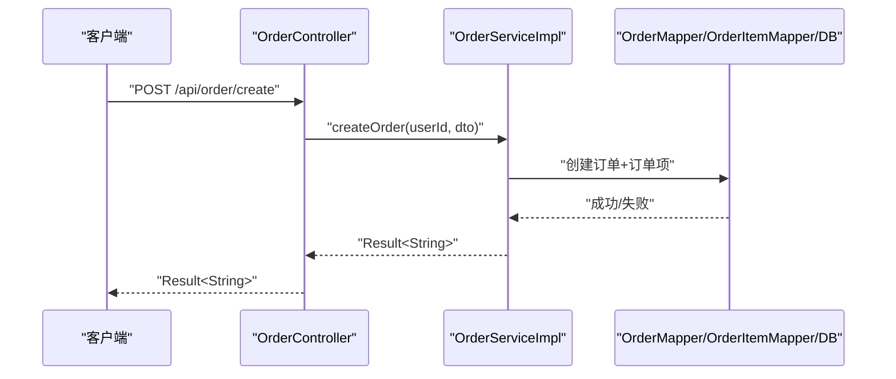
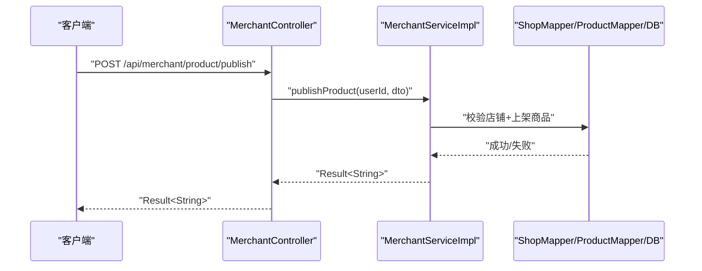
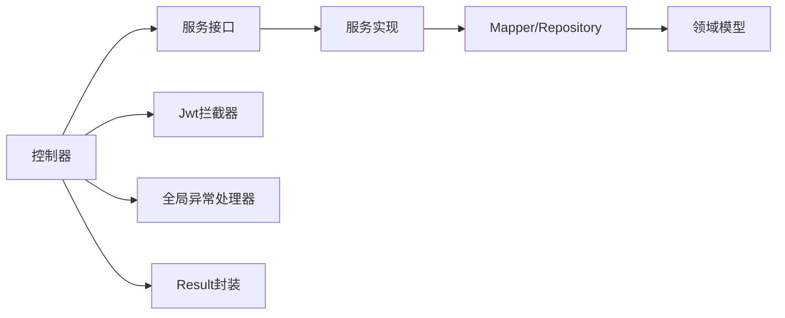

# 核心模块

<cite>
**本文引用的文件**
- [GlobalShopApplication.java](file://src/main/java/com/bohao/globalshop/GlobalShopApplication.java)
- [UserController.java](file://src/main/java/com/bohao/globalshop/controller/UserController.java)
- [ProductController.java](file://src/main/java/com/bohao/globalshop/controller/ProductController.java)
- [CartController.java](file://src/main/java/com/bohao/globalshop/controller/CartController.java)
- [OrderController.java](file://src/main/java/com/bohao/globalshop/controller/OrderController.java)
- [MerchantController.java](file://src/main/java/com/bohao/globalshop/controller/MerchantController.java)
- [UserService.java](file://src/main/java/com/bohao/globalshop/service/UserService.java)
- [ProductService.java](file://src/main/java/com/bohao/globalshop/service/ProductService.java)
- [CartService.java](file://src/main/java/com/bohao/globalshop/service/CartService.java)
- [OrderService.java](file://src/main/java/com/bohao/globalshop/service/OrderService.java)
- [MerchantService.java](file://src/main/java/com/bohao/globalshop/service/MerchantService.java)
- [User.java](file://src/main/java/com/bohao/globalshop/entity/User.java)
- [Product.java](file://src/main/java/com/bohao/globalshop/entity/Product.java)
- [Shop.java](file://src/main/java/com/bohao/globalshop/entity/Shop.java)
- [CartItem.java](file://src/main/java/com/bohao/globalshop/entity/CartItem.java)
- [TradeOrder.java](file://src/main/java/com/bohao/globalshop/entity/TradeOrder.java)
- [CartItemVo.java](file://src/main/java/com/bohao/globalshop/vo/CartItemVo.java)
- [CartShopVo.java](file://src/main/java/com/bohao/globalshop/vo/CartShopVo.java)
- [EsProduct.java](file://src/main/java/com/bohao/globalshop/entity/EsProduct.java)
- [EsProductRepository.java](file://src/main/java/com/bohao/globalshop/repository/EsProductRepository.java)
- [ProductMapper.java](file://src/main/java/com/bohao/globalshop/mapper/ProductMapper.java)
- [JwtInterceptor.java](file://src/main/java/com/bohao/globalshop/interceptor/JwtInterceptor.java)
- [GlobalExceptionHandler.java](file://src/main/java/com/bohao/globalshop/exception/GlobalExceptionHandler.java)
- [Result.java](file://src/main/java/com/bohao/globalshop/common/Result.java)
- [application.yml](file://src/main/resources/application.yml)
</cite>

## 目录
1. [简介](#简介)
2. [项目结构](#项目结构)
3. [核心组件](#核心组件)
4. [架构总览](#架构总览)
5. [详细组件分析](#详细组件分析)
6. [依赖分析](#依赖分析)
7. [性能考虑](#性能考虑)
8. [故障排查指南](#故障排查指南)
9. [结论](#结论)
10. [附录](#附录)

## 简介
本文件面向产品经理、开发者与运维人员，系统化梳理全球购物平台的五大核心业务模块：用户管理、商品管理、购物车、订单处理、商户管理。文档覆盖各模块的业务流程、数据模型、接口设计、模块间依赖与协作、权限控制与异常处理机制，并提供扩展与定制化建议。

## 项目结构
后端采用 Spring Boot 应用，按功能域划分包结构：
- controller：对外 HTTP 接口层，负责请求路由与鉴权上下文透传
- service：业务服务接口与实现，承载领域逻辑
- entity/vo：持久化实体与视图对象
- mapper/repository：数据访问层（MyBatis-Plus 与 Spring Data Elasticsearch）
- common：通用响应封装与工具
- config：配置类（Web、MyBatis-Plus、Redis、RabbitMQ、定时任务等）
- interceptor：拦截器（JWT 鉴权）
- exception：全局异常处理器
- task：定时任务（缓存预热、订单异步处理等）

图表来源
- [GlobalShopApplication.java:1-17](file://src/main/java/com/bohao/globalshop/GlobalShopApplication.java#L1-L17)
- [UserController.java:1-29](file://src/main/java/com/bohao/globalshop/controller/UserController.java#L1-L29)
- [ProductController.java:1-101](file://src/main/java/com/bohao/globalshop/controller/ProductController.java#L1-L101)
- [CartController.java:1-41](file://src/main/java/com/bohao/globalshop/controller/CartController.java#L1-L41)
- [OrderController.java:1-59](file://src/main/java/com/bohao/globalshop/controller/OrderController.java#L1-L59)
- [MerchantController.java:1-48](file://src/main/java/com/bohao/globalshop/controller/MerchantController.java#L1-L48)
- [UserService.java:1-12](file://src/main/java/com/bohao/globalshop/service/UserService.java#L1-L12)
- [ProductService.java:1-19](file://src/main/java/com/bohao/globalshop/service/ProductService.java#L1-L19)
- [CartService.java:1-18](file://src/main/java/com/bohao/globalshop/service/CartService.java#L1-L18)
- [OrderService.java:1-32](file://src/main/java/com/bohao/globalshop/service/OrderService.java#L1-L32)
- [MerchantService.java:1-23](file://src/main/java/com/bohao/globalshop/service/MerchantService.java#L1-L23)
- [ProductMapper.java](file://src/main/java/com/bohao/globalshop/mapper/ProductMapper.java)
- [EsProductRepository.java](file://src/main/java/com/bohao/globalshop/repository/EsProductRepository.java)
- [User.java:1-23](file://src/main/java/com/bohao/globalshop/entity/User.java#L1-L23)
- [Product.java:1-30](file://src/main/java/com/bohao/globalshop/entity/Product.java#L1-L30)
- [Shop.java:1-22](file://src/main/java/com/bohao/globalshop/entity/Shop.java#L1-L22)
- [CartItem.java:1-21](file://src/main/java/com/bohao/globalshop/entity/CartItem.java#L1-L21)
- [TradeOrder.java:1-24](file://src/main/java/com/bohao/globalshop/entity/TradeOrder.java#L1-L24)
- [EsProduct.java](file://src/main/java/com/bohao/globalshop/entity/EsProduct.java)
- [JwtInterceptor.java](file://src/main/java/com/bohao/globalshop/interceptor/JwtInterceptor.java)
- [GlobalExceptionHandler.java](file://src/main/java/com/bohao/globalshop/exception/GlobalExceptionHandler.java)
- [Result.java](file://src/main/java/com/bohao/globalshop/common/Result.java)

章节来源
- [GlobalShopApplication.java:1-17](file://src/main/java/com/bohao/globalshop/GlobalShopApplication.java#L1-L17)
- [application.yml](file://src/main/resources/application.yml)

## 核心组件
- 用户管理：注册、登录，基于 JWT 的鉴权与拦截器透传用户标识
- 商品管理：商品列表、详情、评价、全文检索、MySQL 到 ES 全量同步
- 购物车：加购、查询、删除
- 订单处理：下单、支付、发货、收货、评价
- 商户管理：申请开店、上架商品、查看与发货

章节来源
- [UserController.java:1-29](file://src/main/java/com/bohao/globalshop/controller/UserController.java#L1-L29)
- [ProductController.java:1-101](file://src/main/java/com/bohao/globalshop/controller/ProductController.java#L1-L101)
- [CartController.java:1-41](file://src/main/java/com/bohao/globalshop/controller/CartController.java#L1-L41)
- [OrderController.java:1-59](file://src/main/java/com/bohao/globalshop/controller/OrderController.java#L1-L59)
- [MerchantController.java:1-48](file://src/main/java/com/bohao/globalshop/controller/MerchantController.java#L1-L48)

## 架构总览
系统采用“接口层-服务层-数据访问层-领域模型-基础设施”的分层架构。接口层通过拦截器注入当前用户上下文；服务层编排业务流程；数据访问层对接 MySQL 与 Elasticsearch；异常统一由全局处理器处理；响应体统一使用 Result 包装。

图表来源
- [JwtInterceptor.java](file://src/main/java/com/bohao/globalshop/interceptor/JwtInterceptor.java)
- [UserController.java:1-29](file://src/main/java/com/bohao/globalshop/controller/UserController.java#L1-L29)
- [ProductController.java:1-101](file://src/main/java/com/bohao/globalshop/controller/ProductController.java#L1-L101)
- [CartController.java:1-41](file://src/main/java/com/bohao/globalshop/controller/CartController.java#L1-L41)
- [OrderController.java:1-59](file://src/main/java/com/bohao/globalshop/controller/OrderController.java#L1-L59)
- [MerchantController.java:1-48](file://src/main/java/com/bohao/globalshop/controller/MerchantController.java#L1-L48)

## 详细组件分析

### 用户管理模块
- 业务流程
  - 注册：接收注册 DTO，调用 UserService 完成校验与入库
  - 登录：接收登录 DTO，生成 JWT 并返回
  - 鉴权：JwtInterceptor 在请求进入控制器前解析 JWT，将 userId 注入请求属性
- 数据模型
  - User：用户基本信息、余额、时间戳
- 接口设计
  - POST /api/user/register
  - POST /api/user/login
- 权限控制
  - 所有受保护接口均需携带有效 JWT，拦截器负责注入当前用户标识
- 异常处理
  - 全局异常处理器统一捕获并返回 Result.error

图表来源
- [UserController.java:19-27](file://src/main/java/com/bohao/globalshop/controller/UserController.java#L19-L27)
- [UserService.java:8-11](file://src/main/java/com/bohao/globalshop/service/UserService.java#L8-L11)

章节来源
- [UserController.java:1-29](file://src/main/java/com/bohao/globalshop/controller/UserController.java#L1-L29)
- [User.java:1-23](file://src/main/java/com/bohao/globalshop/entity/User.java#L1-L23)
- [JwtInterceptor.java](file://src/main/java/com/bohao/globalshop/interceptor/JwtInterceptor.java)
- [GlobalExceptionHandler.java](file://src/main/java/com/bohao/globalshop/exception/GlobalExceptionHandler.java)
- [Result.java](file://src/main/java/com/bohao/globalshop/common/Result.java)

### 商品管理模块
- 业务流程
  - 商品列表：聚合商品与店铺信息，返回视图对象列表
  - 商品详情：带本地缓存策略的查询
  - 商品评价：按商品查询评价视图列表
  - 搜索：基于 ES 的全文检索（名称或描述）
  - 同步：将 MySQL 中已上架商品全量同步到 ES
- 数据模型
  - Product：商品基础信息、价格、库存、状态、乐观锁版本
  - Shop：店铺信息（与用户关联）
  - EsProduct：用于 ES 的文档模型
- 接口设计
  - GET /api/product/list
  - GET /api/product/detail/{id}
  - GET /api/product/{id}/reviews
  - GET /api/product/search?keyword&page=size
  - GET /api/product/sync-es
- 权限控制
  - 该模块不直接校验用户身份，但受统一拦截器影响
- 异常处理
  - 未找到商品时返回 404 结果包装

图表来源
- [ProductController.java:85-99](file://src/main/java/com/bohao/globalshop/controller/ProductController.java#L85-L99)
- [EsProductRepository.java](file://src/main/java/com/bohao/globalshop/repository/EsProductRepository.java)

章节来源
- [ProductController.java:1-101](file://src/main/java/com/bohao/globalshop/controller/ProductController.java#L1-L101)
- [ProductService.java:1-19](file://src/main/java/com/bohao/globalshop/service/ProductService.java#L1-L19)
- [Product.java:1-30](file://src/main/java/com/bohao/globalshop/entity/Product.java#L1-L30)
- [Shop.java:1-22](file://src/main/java/com/bohao/globalshop/entity/Shop.java#L1-L22)
- [EsProduct.java](file://src/main/java/com/bohao/globalshop/entity/EsProduct.java)

### 购物车模块
- 业务流程
  - 加购：根据 userId 与商品信息写入购物车
  - 查询：按店铺维度聚合购物车项（CartShopVo）
  - 删除：按 cartItemId 与 userId 删除
- 数据模型
  - CartItem：用户与商品的临时存储
  - CartItemVo/CartShopVo：视图对象
- 接口设计
  - POST /api/cart/add
  - GET /api/cart/list
  - DELETE /api/cart/remove/{id}
- 权限控制
  - 通过拦截器注入的 userId 保证数据隔离
- 异常处理
  - 统一 Result 包装

图表来源
- [CartController.java:22-27](file://src/main/java/com/bohao/globalshop/controller/CartController.java#L22-L27)
- [CartService.java:10-17](file://src/main/java/com/bohao/globalshop/service/CartService.java#L10-L17)
- [CartItem.java:1-21](file://src/main/java/com/bohao/globalshop/entity/CartItem.java#L1-L21)
- [CartShopVo.java:1-13](file://src/main/java/com/bohao/globalshop/vo/CartShopVo.java#L1-L13)
- [CartItemVo.java:1-17](file://src/main/java/com/bohao/globalshop/vo/CartItemVo.java#L1-L17)

章节来源
- [CartController.java:1-41](file://src/main/java/com/bohao/globalshop/controller/CartController.java#L1-L41)
- [CartService.java:1-18](file://src/main/java/com/bohao/globalshop/service/CartService.java#L1-L18)

### 订单处理模块
- 业务流程
  - 下单：根据订单 DTO 创建 TradeOrder 及其明细
  - 我的订单：按 userId 查询订单列表
  - 结算：将购物车中的商品一次性生成订单
  - 支付：更新订单状态为已支付
  - 发货：商户发货（后续流程可扩展）
  - 收货：买家确认收货
  - 评价：提交商品评价
- 数据模型
  - TradeOrder：订单主表（去除了冗余字段，明细由订单项承担）
  - TradeOrderItem：订单项（未在本节列出，但与订单强关联）
- 接口设计
  - POST /api/order/create
  - GET /api/order/my
  - POST /api/order/checkout
  - POST /api/order/pay/{id}
  - POST /api/order/confirm-receipt/{id}
  - POST /api/order/review
- 权限控制
  - 通过拦截器注入的 userId 实现用户与商户的数据隔离
- 异常处理
  - 统一 Result 包装

图表来源
- [OrderController.java:19-24](file://src/main/java/com/bohao/globalshop/controller/OrderController.java#L19-L24)
- [OrderService.java:11-12](file://src/main/java/com/bohao/globalshop/service/OrderService.java#L11-L12)
- [TradeOrder.java:1-24](file://src/main/java/com/bohao/globalshop/entity/TradeOrder.java#L1-L24)

章节来源
- [OrderController.java:1-59](file://src/main/java/com/bohao/globalshop/controller/OrderController.java#L1-L59)
- [OrderService.java:1-32](file://src/main/java/com/bohao/globalshop/service/OrderService.java#L1-L32)
- [TradeOrder.java:1-24](file://src/main/java/com/bohao/globalshop/entity/TradeOrder.java#L1-L24)

### 商户管理模块
- 业务流程
  - 申请开店：绑定当前用户与店铺信息
  - 上架商品：将商品与店铺关联并设置状态
  - 查看订单：仅能查看本店铺订单（数据隔离）
  - 发货：商户对订单进行发货操作
- 数据模型
  - Shop：店铺与用户关联
  - Product：与 Shop 关联
- 接口设计
  - POST /api/merchant/shop/apply
  - POST /api/merchant/product/publish
  - GET /api/merchant/order/list
  - POST /api/merchant/order/deliver/{id}
- 权限控制
  - 通过拦截器注入的 userId 与 Shop.userId 关联实现数据隔离
- 异常处理
  - 统一 Result 包装

图表来源
- [MerchantController.java:28-32](file://src/main/java/com/bohao/globalshop/controller/MerchantController.java#L28-L32)
- [MerchantService.java:14-15](file://src/main/java/com/bohao/globalshop/service/MerchantService.java#L14-L15)
- [Shop.java:1-22](file://src/main/java/com/bohao/globalshop/entity/Shop.java#L1-L22)
- [Product.java:1-30](file://src/main/java/com/bohao/globalshop/entity/Product.java#L1-L30)

章节来源
- [MerchantController.java:1-48](file://src/main/java/com/bohao/globalshop/controller/MerchantController.java#L1-L48)
- [MerchantService.java:1-23](file://src/main/java/com/bohao/globalshop/service/MerchantService.java#L1-L23)

## 依赖分析
- 控制器依赖服务接口，服务实现依赖 Mapper/Repository 与领域模型
- 拦截器在控制器之前注入用户上下文，保障业务层无需感知鉴权
- 全局异常处理器统一处理异常，Result 统一封装响应
- Elasticsearch 作为商品检索的独立存储，与 MySQL 解耦

图表来源
- [JwtInterceptor.java](file://src/main/java/com/bohao/globalshop/interceptor/JwtInterceptor.java)
- [GlobalExceptionHandler.java](file://src/main/java/com/bohao/globalshop/exception/GlobalExceptionHandler.java)
- [Result.java](file://src/main/java/com/bohao/globalshop/common/Result.java)

章节来源
- [JwtInterceptor.java](file://src/main/java/com/bohao/globalshop/interceptor/JwtInterceptor.java)
- [GlobalExceptionHandler.java](file://src/main/java/com/bohao/globalshop/exception/GlobalExceptionHandler.java)
- [Result.java](file://src/main/java/com/bohao/globalshop/common/Result.java)

## 性能考虑
- 商品检索：ES 全文检索提升查询性能，结合分页参数控制返回规模
- 缓存策略：商品详情采用“本地缓存”策略减少数据库压力（注：具体实现以代码为准）
- 数据同步：提供全量同步接口，支持定时任务触发
- 并发控制：商品库存使用乐观锁版本号，避免超卖风险
- 异步处理：订单取消监听器与定时任务（如订单超时取消）可异步执行

章节来源
- [ProductController.java:54-80](file://src/main/java/com/bohao/globalshop/controller/ProductController.java#L54-L80)
- [Product.java:24-25](file://src/main/java/com/bohao/globalshop/entity/Product.java#L24-L25)
- [application.yml](file://src/main/resources/application.yml)

## 故障排查指南
- 常见问题
  - 未登录或 Token 失效：检查拦截器是否正确注入 userId，确认前端携带有效 JWT
  - 商品未找到：确认商品状态与是否存在，查看 Result 错误码
  - 订单状态异常：核对订单状态机与业务流程，检查异步任务执行情况
- 定位手段
  - 查看全局异常处理器输出的日志
  - 使用 Result.error 的状态码与消息定位问题
  - 核对 ES 同步状态与索引映射

章节来源
- [GlobalExceptionHandler.java](file://src/main/java/com/bohao/globalshop/exception/GlobalExceptionHandler.java)
- [Result.java](file://src/main/java/com/bohao/globalshop/common/Result.java)
- [ProductController.java:44-48](file://src/main/java/com/bohao/globalshop/controller/ProductController.java#L44-L48)

## 结论
本系统通过清晰的分层与职责分离，实现了用户、商品、购物车、订单与商户五大核心模块的协同工作。JWT 鉴权与拦截器确保了数据隔离与安全；ES 检索与本地缓存提升了性能；Result 统一封装与全局异常处理增强了可观测性与可维护性。建议在后续迭代中完善订单状态机与风控策略，扩展消息队列支持异步解耦。

## 附录
- 扩展与定制化建议
  - 新增业务：遵循“DTO → Service → Mapper/Repository → Entity/VO”的路径，保持接口稳定
  - 权限扩展：在拦截器中增加角色/资源级权限判断
  - 消息与监控：引入 RabbitMQ/消息中间件与链路追踪
  - 安全加固：密码加密、Token 刷新、接口限流与风控
- 最佳实践
  - 保持 Result 包装一致性
  - 对外接口幂等与重试策略
  - 数据库事务边界清晰，异常回滚一致