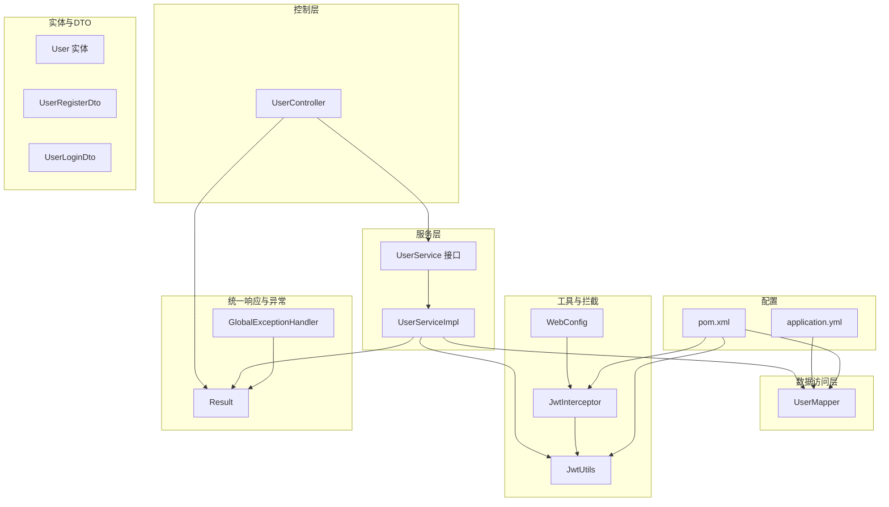
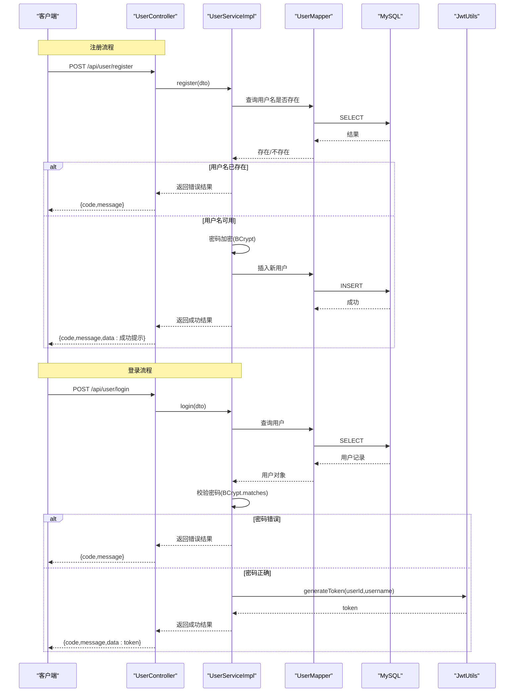
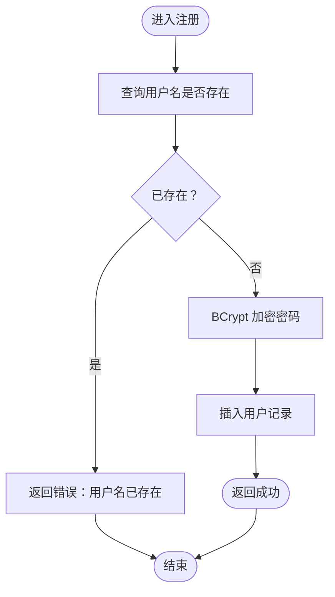
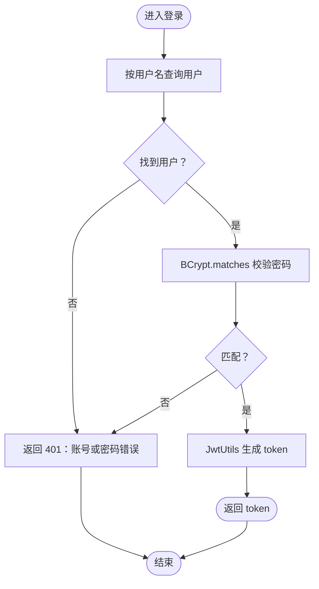
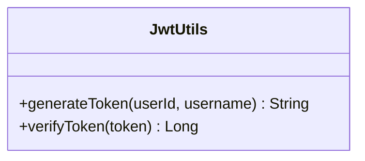
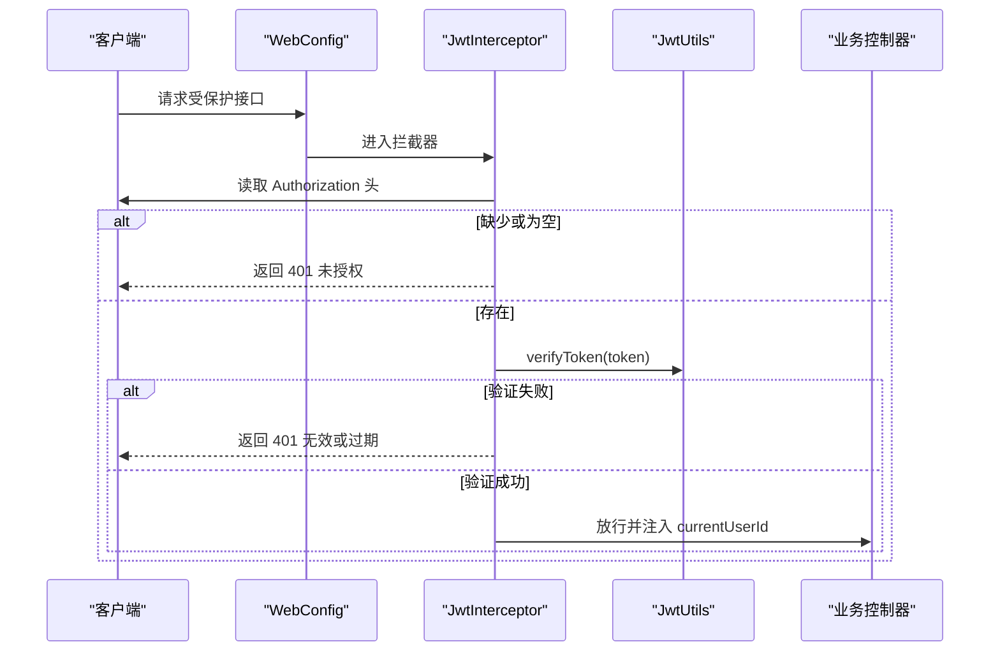
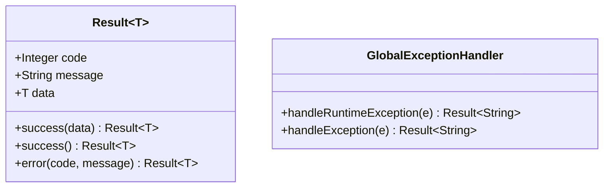
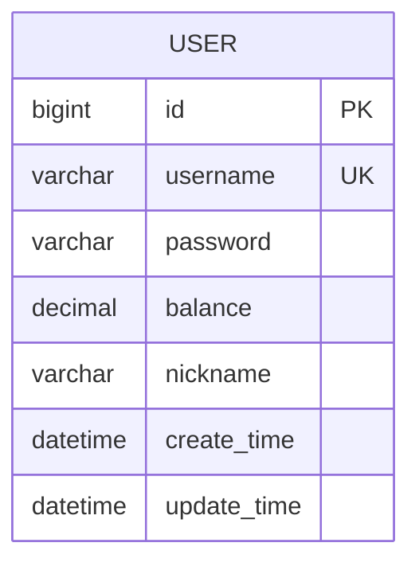
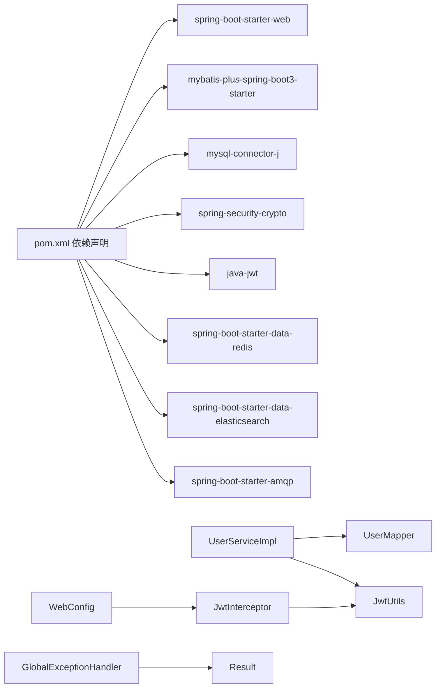

# 用户管理系统

<cite>
**本文引用的文件**
- [UserController.java](file://src/main/java/com/bohao/globalshop/controller/UserController.java)
- [UserService.java](file://src/main/java/com/bohao/globalshop/service/UserService.java)
- [UserServiceImpl.java](file://src/main/java/com/bohao/globalshop/service/impl/UserServiceImpl.java)
- [JwtUtils.java](file://src/main/java/com/bohao/globalshop/common/JwtUtils.java)
- [JwtInterceptor.java](file://src/main/java/com/bohao/globalshop/interceptor/JwtInterceptor.java)
- [WebConfig.java](file://src/main/java/com/bohao/globalshop/config/WebConfig.java)
- [User.java](file://src/main/java/com/bohao/globalshop/entity/User.java)
- [UserMapper.java](file://src/main/java/com/bohao/globalshop/mapper/UserMapper.java)
- [UserLoginDto.java](file://src/main/java/com/bohao/globalshop/dto/UserLoginDto.java)
- [UserRegisterDto.java](file://src/main/java/com/bohao/globalshop/dto/UserRegisterDto.java)
- [Result.java](file://src/main/java/com/bohao/globalshop/common/Result.java)
- [GlobalExceptionHandler.java](file://src/main/java/com/bohao/globalshop/exception/GlobalExceptionHandler.java)
- [application.yml](file://src/main/resources/application.yml)
- [pom.xml](file://pom.xml)
</cite>

## 目录
1. [简介](#简介)
2. [项目结构](#项目结构)
3. [核心组件](#核心组件)
4. [架构总览](#架构总览)
5. [详细组件分析](#详细组件分析)
6. [依赖分析](#依赖分析)
7. [性能考虑](#性能考虑)
8. [故障排除指南](#故障排除指南)
9. [结论](#结论)
10. [附录](#附录)

## 简介
本文件为“用户管理系统”的技术文档，聚焦用户注册、登录认证、信息管理等核心功能，深入解析以下内容：
- JWT 令牌生成与验证流程
- 权限控制策略与拦截器机制
- 密码加密存储方案（BCrypt）
- API 接口规范、请求/响应格式与错误处理
- 用户数据模型与数据库表结构
- 用户状态管理、会话管理与安全防护
- 实际代码示例路径、常见问题与性能优化建议

## 项目结构
系统采用 Spring Boot 分层架构，主要模块如下：
- 控制层：UserController 负责对外暴露用户相关接口
- 服务层：UserService 接口与 UserServiceImpl 实现具体业务逻辑
- 数据访问层：UserMapper 基于 MyBatis-Plus 提供通用 CRUD
- 实体层：User 映射数据库 user 表
- DTO 层：UserRegisterDto、UserLoginDto 封装请求参数
- 工具与拦截：JwtUtils 提供 JWT 生成与校验；JwtInterceptor 拦截器进行权限校验；WebConfig 注册拦截器与跨域配置
- 统一结果包装：Result 封装统一响应结构
- 全局异常处理：GlobalExceptionHandler 统一捕获异常并返回友好提示
- 配置：application.yml 提供数据库、Redis、Elasticsearch、RabbitMQ 等配置；pom.xml 管理依赖

图表来源
- [UserController.java:1-29](file://src/main/java/com/bohao/globalshop/controller/UserController.java#L1-L29)
- [UserService.java:1-12](file://src/main/java/com/bohao/globalshop/service/UserService.java#L1-L12)
- [UserServiceImpl.java:1-68](file://src/main/java/com/bohao/globalshop/service/impl/UserServiceImpl.java#L1-L68)
- [UserMapper.java:1-11](file://src/main/java/com/bohao/globalshop/mapper/UserMapper.java#L1-L11)
- [User.java:1-23](file://src/main/java/com/bohao/globalshop/entity/User.java#L1-L23)
- [UserLoginDto.java:1-10](file://src/main/java/com/bohao/globalshop/dto/UserLoginDto.java#L1-L10)
- [UserRegisterDto.java:1-10](file://src/main/java/com/bohao/globalshop/dto/UserRegisterDto.java#L1-L10)
- [JwtUtils.java:1-41](file://src/main/java/com/bohao/globalshop/common/JwtUtils.java#L1-L41)
- [JwtInterceptor.java:1-36](file://src/main/java/com/bohao/globalshop/interceptor/JwtInterceptor.java#L1-L36)
- [WebConfig.java:1-36](file://src/main/java/com/bohao/globalshop/config/WebConfig.java#L1-L36)
- [Result.java:1-30](file://src/main/java/com/bohao/globalshop/common/Result.java#L1-L30)
- [GlobalExceptionHandler.java:1-33](file://src/main/java/com/bohao/globalshop/exception/GlobalExceptionHandler.java#L1-L33)
- [application.yml:1-42](file://src/main/resources/application.yml#L1-L42)
- [pom.xml:1-148](file://pom.xml#L1-L148)

章节来源
- [application.yml:1-42](file://src/main/resources/application.yml#L1-L42)
- [pom.xml:1-148](file://pom.xml#L1-L148)

## 核心组件
- 用户控制器：提供注册与登录接口，调用 UserService 执行业务逻辑，返回统一结果包装
- 用户服务：定义注册与登录接口；实现类负责用户名唯一性检查、密码加密、JWT 签发与校验
- JWT 工具：封装密钥、过期时间、生成与验证方法
- 拦截器：从请求头读取 Authorization，校验 JWT 并注入当前用户 ID
- Web 配置：注册拦截器与跨域策略，指定受保护路径与放行路径
- 统一结果：Result 封装 code、message、data，便于前后端约定
- 全局异常：统一捕获运行时与未知异常，输出友好提示

章节来源
- [UserController.java:1-29](file://src/main/java/com/bohao/globalshop/controller/UserController.java#L1-L29)
- [UserService.java:1-12](file://src/main/java/com/bohao/globalshop/service/UserService.java#L1-L12)
- [UserServiceImpl.java:1-68](file://src/main/java/com/bohao/globalshop/service/impl/UserServiceImpl.java#L1-L68)
- [JwtUtils.java:1-41](file://src/main/java/com/bohao/globalshop/common/JwtUtils.java#L1-L41)
- [JwtInterceptor.java:1-36](file://src/main/java/com/bohao/globalshop/interceptor/JwtInterceptor.java#L1-L36)
- [WebConfig.java:1-36](file://src/main/java/com/bohao/globalshop/config/WebConfig.java#L1-L36)
- [Result.java:1-30](file://src/main/java/com/bohao/globalshop/common/Result.java#L1-L30)
- [GlobalExceptionHandler.java:1-33](file://src/main/java/com/bohao/globalshop/exception/GlobalExceptionHandler.java#L1-L33)

## 架构总览
系统围绕“控制器-服务-数据访问-实体”分层展开，配合 JWT 拦截器实现无状态认证与权限控制。

图表来源
- [UserController.java:1-29](file://src/main/java/com/bohao/globalshop/controller/UserController.java#L1-L29)
- [UserServiceImpl.java:1-68](file://src/main/java/com/bohao/globalshop/service/impl/UserServiceImpl.java#L1-L68)
- [UserMapper.java:1-11](file://src/main/java/com/bohao/globalshop/mapper/UserMapper.java#L1-L11)
- [JwtUtils.java:1-41](file://src/main/java/com/bohao/globalshop/common/JwtUtils.java#L1-L41)

## 详细组件分析

### 用户注册流程
- 输入参数：UserRegisterDto（用户名、密码）
- 业务逻辑：
  - 查询用户名是否已存在
  - 若不存在，创建用户实体，使用 BCrypt 对密码进行加密存储
  - 插入数据库并返回成功结果
- 错误处理：用户名冲突返回 400

图表来源
- [UserServiceImpl.java:20-40](file://src/main/java/com/bohao/globalshop/service/impl/UserServiceImpl.java#L20-L40)
- [UserMapper.java:1-11](file://src/main/java/com/bohao/globalshop/mapper/UserMapper.java#L1-L11)

章节来源
- [UserServiceImpl.java:20-40](file://src/main/java/com/bohao/globalshop/service/impl/UserServiceImpl.java#L20-L40)
- [UserRegisterDto.java:1-10](file://src/main/java/com/bohao/globalshop/dto/UserRegisterDto.java#L1-L10)
- [UserMapper.java:1-11](file://src/main/java/com/bohao/globalshop/mapper/UserMapper.java#L1-L11)

### 用户登录与认证
- 输入参数：UserLoginDto（用户名、密码）
- 业务逻辑：
  - 查询用户，若不存在返回 401
  - 使用 BCrypt.matches 校验密码
  - 校验通过后，使用 JwtUtils 生成 token 并返回
- 安全要点：密码单向加密，永不落库明文；token 包含 userId 与 username，有效期 7 天

图表来源
- [UserServiceImpl.java:42-66](file://src/main/java/com/bohao/globalshop/service/impl/UserServiceImpl.java#L42-L66)
- [JwtUtils.java:17-23](file://src/main/java/com/bohao/globalshop/common/JwtUtils.java#L17-L23)

章节来源
- [UserServiceImpl.java:42-66](file://src/main/java/com/bohao/globalshop/service/impl/UserServiceImpl.java#L42-L66)
- [UserLoginDto.java:1-10](file://src/main/java/com/bohao/globalshop/dto/UserLoginDto.java#L1-L10)
- [JwtUtils.java:17-23](file://src/main/java/com/bohao/globalshop/common/JwtUtils.java#L17-L23)

### JWT 令牌生成与验证
- 生成：携带 userId、username、过期时间，使用 HMAC256 签名
- 验证：校验签名与过期时间，提取 userId；失败返回 null
- 过期时间：默认 7 天

图表来源
- [JwtUtils.java:1-41](file://src/main/java/com/bohao/globalshop/common/JwtUtils.java#L1-L41)

章节来源
- [JwtUtils.java:10-23](file://src/main/java/com/bohao/globalshop/common/JwtUtils.java#L10-L23)
- [JwtUtils.java:28-39](file://src/main/java/com/bohao/globalshop/common/JwtUtils.java#L28-L39)

### 权限控制与拦截器
- 拦截范围：/api/order/**、/api/cart/**、/api/merchant/**
- 放行范围：/api/user/login、/api/user/register、/api/product/**
- 校验逻辑：从 Authorization 头读取 token，验证失败返回 401，成功注入 currentUserId

图表来源
- [WebConfig.java:17-22](file://src/main/java/com/bohao/globalshop/config/WebConfig.java#L17-L22)
- [JwtInterceptor.java:14-34](file://src/main/java/com/bohao/globalshop/interceptor/JwtInterceptor.java#L14-L34)
- [JwtUtils.java:28-39](file://src/main/java/com/bohao/globalshop/common/JwtUtils.java#L28-L39)

章节来源
- [WebConfig.java:16-23](file://src/main/java/com/bohao/globalshop/config/WebConfig.java#L16-L23)
- [JwtInterceptor.java:14-34](file://src/main/java/com/bohao/globalshop/interceptor/JwtInterceptor.java#L14-L34)

### 统一结果与异常处理
- Result：统一封装 code、message、data，支持 success/error 工厂方法
- 全局异常：捕获 RuntimeException 与 Exception，记录日志并返回友好提示

图表来源
- [Result.java:1-30](file://src/main/java/com/bohao/globalshop/common/Result.java#L1-L30)
- [GlobalExceptionHandler.java:1-33](file://src/main/java/com/bohao/globalshop/exception/GlobalExceptionHandler.java#L1-L33)

章节来源
- [Result.java:6-29](file://src/main/java/com/bohao/globalshop/common/Result.java#L6-L29)
- [GlobalExceptionHandler.java:15-31](file://src/main/java/com/bohao/globalshop/exception/GlobalExceptionHandler.java#L15-L31)

### 用户数据模型与数据库表结构
- 实体映射：User 实体对应 user 表，包含自增主键 id、用户名、密码、余额、昵称、创建/更新时间
- 字段说明：
  - id：Long，自增主键
  - username：String，唯一索引（由业务层检查）
  - password：String，BCrypt 加密存储
  - balance：BigDecimal，账户余额
  - nickname：String，用户昵称
  - createTime/updateTime：LocalDateTime，创建与更新时间

图表来源
- [User.java:1-23](file://src/main/java/com/bohao/globalshop/entity/User.java#L1-L23)

章节来源
- [User.java:14-22](file://src/main/java/com/bohao/globalshop/entity/User.java#L14-L22)

## 依赖分析
- 核心依赖：
  - Spring Web、MyBatis-Plus、MySQL Connector、Spring Security Crypto（BCrypt）、Java-JWT（JWT）
  - Redis（Redisson）、Elasticsearch、RabbitMQ（AMQP）
- 关键耦合点：
  - UserServiceImpl 依赖 UserMapper、JwtUtils
  - JwtInterceptor 依赖 JwtUtils
  - WebConfig 注册 JwtInterceptor 并配置拦截路径
  - 全局异常处理与 Result 协作统一返回

图表来源
- [pom.xml:33-101](file://pom.xml#L33-L101)
- [UserServiceImpl.java:1-68](file://src/main/java/com/bohao/globalshop/service/impl/UserServiceImpl.java#L1-L68)
- [JwtInterceptor.java:1-36](file://src/main/java/com/bohao/globalshop/interceptor/JwtInterceptor.java#L1-L36)
- [WebConfig.java:1-36](file://src/main/java/com/bohao/globalshop/config/WebConfig.java#L1-L36)
- [GlobalExceptionHandler.java:1-33](file://src/main/java/com/bohao/globalshop/exception/GlobalExceptionHandler.java#L1-L33)

章节来源
- [pom.xml:33-101](file://pom.xml#L33-L101)

## 性能考虑
- 密码加密成本：BCrypt 默认迭代次数较高，建议结合缓存与异步处理降低登录峰值延迟
- 数据库索引：为 username 添加唯一索引，避免并发注册时的重复检查竞争
- JWT 签发频率：登录成功才签发，避免频繁签发造成 CPU 压力
- 缓存策略：可引入 Redis 缓存用户基本信息，减少数据库压力
- 日志与监控：全局异常处理器记录错误日志，便于定位性能瓶颈

## 故障排除指南
- 登录返回 401：
  - 检查用户名是否存在与密码是否匹配
  - 确认前端是否正确传递 Authorization 头
- 注册返回 400：
  - 检查用户名是否已被占用
- 401 未授权拦截：
  - 确认请求头 Authorization 是否存在且有效
  - 检查 token 是否过期或被篡改
- 全局异常：
  - 查看控制台日志，定位 RuntimeException 或未知异常

章节来源
- [UserServiceImpl.java:49-61](file://src/main/java/com/bohao/globalshop/service/impl/UserServiceImpl.java#L49-L61)
- [JwtInterceptor.java:19-30](file://src/main/java/com/bohao/globalshop/interceptor/JwtInterceptor.java#L19-L30)
- [GlobalExceptionHandler.java:15-31](file://src/main/java/com/bohao/globalshop/exception/GlobalExceptionHandler.java#L15-L31)

## 结论
本系统通过“DTO 参数校验 + BCrypt 密码加密 + JWT 无状态认证 + 拦截器权限控制 + 统一结果与异常处理”的组合，实现了安全、清晰、易维护的用户管理能力。建议后续在高并发场景下引入缓存与异步化策略，并完善权限细化与审计日志。

## 附录

### API 接口规范

- 注册
  - 方法与路径：POST /api/user/register
  - 请求体：UserRegisterDto（username、password）
  - 成功响应：Result<String>（code=200，message=“操作成功”，data=提示信息）
  - 失败响应：Result<String>（code=400，message=“用户名已存在”）

- 登录
  - 方法与路径：POST /api/user/login
  - 请求体：UserLoginDto（username、password）
  - 成功响应：Result<String>（code=200，message=“操作成功”，data=JWT token）
  - 失败响应：Result<String>（code=401，message=“账号或密码错误”）

- 统一响应结构
  - 字段：code（状态码）、message（消息）、data（数据）
  - 示例：见 Result 工厂方法

章节来源
- [UserController.java:19-27](file://src/main/java/com/bohao/globalshop/controller/UserController.java#L19-L27)
- [UserRegisterDto.java:1-10](file://src/main/java/com/bohao/globalshop/dto/UserRegisterDto.java#L1-L10)
- [UserLoginDto.java:1-10](file://src/main/java/com/bohao/globalshop/dto/UserLoginDto.java#L1-L10)
- [Result.java:11-28](file://src/main/java/com/bohao/globalshop/common/Result.java#L11-L28)

### 安全与配置要点
- 密钥与过期时间：在 JwtUtils 中集中管理
- 跨域策略：WebConfig 允许所有来源与方法
- 数据源与中间件：application.yml 配置 MySQL、Redis、Elasticsearch、RabbitMQ

章节来源
- [JwtUtils.java:10-12](file://src/main/java/com/bohao/globalshop/common/JwtUtils.java#L10-L12)
- [WebConfig.java:26-32](file://src/main/java/com/bohao/globalshop/config/WebConfig.java#L26-L32)
- [application.yml:5-18](file://src/main/resources/application.yml#L5-L18)