# 订单处理系统

<cite>
**本文引用的文件**
- [GlobalShopApplication.java](file://src/main/java/com/bohao/globalshop/GlobalShopApplication.java)
- [application.yml](file://src/main/resources/application.yml)
- [OrderController.java](file://src/main/java/com/bohao/globalshop/controller/OrderController.java)
- [OrderService.java](file://src/main/java/com/bohao/globalshop/service/OrderService.java)
- [OrderServiceImpl.java](file://src/main/java/com/bohao/globalshop/service/impl/OrderServiceImpl.java)
- [OrderCreateDto.java](file://src/main/java/com/bohao/globalshop/dto/OrderCreateDto.java)
- [OrderVo.java](file://src/main/java/com/bohao/globalshop/vo/OrderVo.java)
- [TradeOrder.java](file://src/main/java/com/bohao/globalshop/entity/TradeOrder.java)
- [TradeOrderItem.java](file://src/main/java/com/bohao/globalshop/entity/TradeOrderItem.java)
- [TraderOrderMapper.java](file://src/main/java/com/bohao/globalshop/mapper/TraderOrderMapper.java)
- [TradeOrderItemMapper.java](file://src/main/java/com/bohao/globalshop/mapper/TradeOrderItemMapper.java)
- [RabbitMqConfig.java](file://src/main/java/com/bohao/globalshop/config/RabbitMqConfig.java)
- [OrderCancelListener.java](file://src/main/java/com/bohao/globalshop/listener/OrderCancelListener.java)
- [OrderTask.java](file://src/main/java/com/bohao/globalshop/task/OrderTask.java)
- [Result.java](file://src/main/java/com/bohao/globalshop/common/Result.java)
</cite>

## 目录
1. [简介](#简介)
2. [项目结构](#项目结构)
3. [核心组件](#核心组件)
4. [架构总览](#架构总览)
5. [详细组件分析](#详细组件分析)
6. [依赖分析](#依赖分析)
7. [性能考虑](#性能考虑)
8. [故障排查指南](#故障排查指南)
9. [结论](#结论)
10. [附录](#附录)

## 简介
本技术文档围绕订单处理系统展开，覆盖订单创建、支付处理、状态流转、确认收货与评价、取消与退款、异常订单处理等核心业务流程。系统采用 Spring Boot + MyBatis-Plus + MySQL + Redis + RabbitMQ + Elasticsearch 的技术栈，结合分布式锁、延迟队列、Lua 原子扣减、定时任务等多种手段，保障高并发场景下的数据一致性与可靠性。

## 项目结构
系统采用标准的分层架构：
- 控制层：接收 HTTP 请求，解析用户上下文，调用服务层
- 服务层：编排业务流程，处理事务与并发控制
- 数据访问层：基于 MyBatis-Plus Mapper 接口访问数据库
- 配置层：RabbitMQ、Redis、Elasticsearch、调度等配置
- 任务与监听：基于 RabbitMQ 死信队列与定时任务的异步取消机制
- VO/DTO：面向接口的数据传输对象

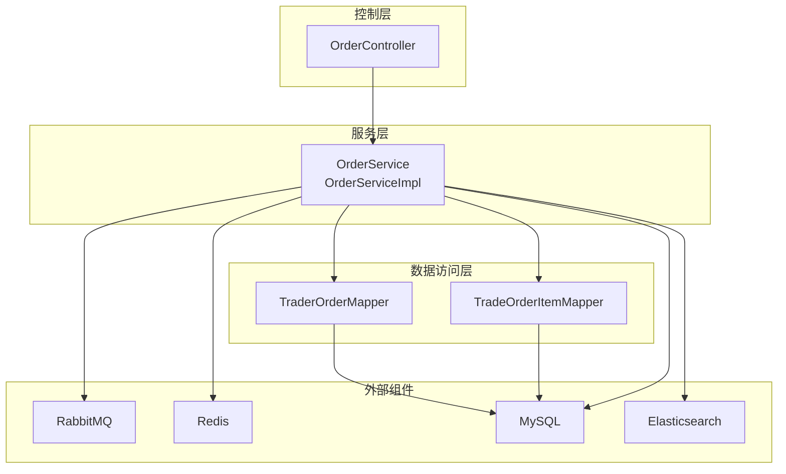

图表来源
- [OrderController.java:1-59](file://src/main/java/com/bohao/globalshop/controller/OrderController.java#L1-L59)
- [OrderServiceImpl.java:1-330](file://src/main/java/com/bohao/globalshop/service/impl/OrderServiceImpl.java#L1-L330)
- [TraderOrderMapper.java:1-10](file://src/main/java/com/bohao/globalshop/mapper/TraderOrderMapper.java#L1-L10)
- [TradeOrderItemMapper.java:1-10](file://src/main/java/com/bohao/globalshop/mapper/TradeOrderItemMapper.java#L1-L10)
- [RabbitMqConfig.java:1-61](file://src/main/java/com/bohao/globalshop/config/RabbitMqConfig.java#L1-L61)
- [application.yml:1-42](file://src/main/resources/application.yml#L1-L42)

章节来源
- [GlobalShopApplication.java:1-18](file://src/main/java/com/bohao/globalshop/GlobalShopApplication.java#L1-L18)
- [application.yml:1-42](file://src/main/resources/application.yml#L1-L42)

## 核心组件
- 控制器：提供订单创建、查询我的订单、购物车结算、支付、确认收货、评价提交等接口
- 服务实现：封装订单生命周期内的所有业务逻辑，包括库存扣减、余额支付、状态变更、评价与退款联动
- 实体与映射：主订单与订单项模型，分别映射到 trade_order 与 trade_order_item 表
- 配置：RabbitMQ 延迟与死信交换机、队列绑定；Redis 与 MySQL、Elasticsearch 连接配置
- 监听与任务：RabbitMQ 死信监听器与定时任务，实现订单超时自动取消

章节来源
- [OrderController.java:1-59](file://src/main/java/com/bohao/globalshop/controller/OrderController.java#L1-L59)
- [OrderService.java:1-32](file://src/main/java/com/bohao/globalshop/service/OrderService.java#L1-L32)
- [OrderServiceImpl.java:1-330](file://src/main/java/com/bohao/globalshop/service/impl/OrderServiceImpl.java#L1-L330)
- [TradeOrder.java:1-24](file://src/main/java/com/bohao/globalshop/entity/TradeOrder.java#L1-L24)
- [TradeOrderItem.java:1-26](file://src/main/java/com/bohao/globalshop/entity/TradeOrderItem.java#L1-L26)
- [RabbitMqConfig.java:1-61](file://src/main/java/com/bohao/globalshop/config/RabbitMqConfig.java#L1-L61)
- [application.yml:1-42](file://src/main/resources/application.yml#L1-L42)

## 架构总览
系统通过延迟队列与死信队列实现“下单即延时取消”的能力，结合 Redis 原子扣减与数据库事务，确保高并发下的库存与订单一致性。定时任务与 MQ 监听器共同兜底，形成“异步+同步”的双重保障。

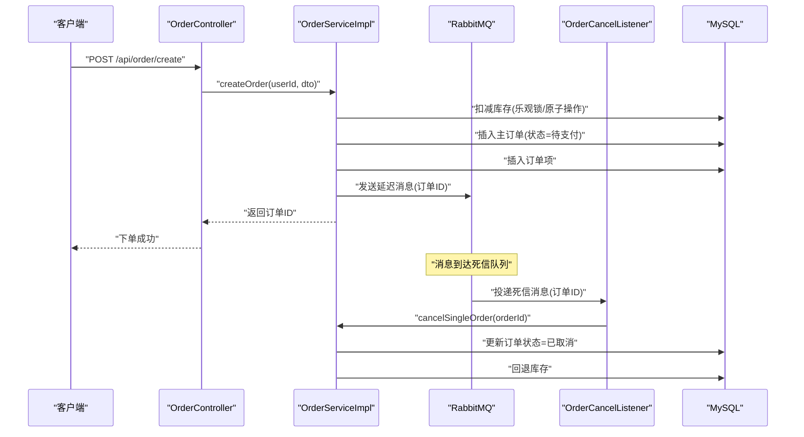

图表来源
- [OrderController.java:19-24](file://src/main/java/com/bohao/globalshop/controller/OrderController.java#L19-L24)
- [OrderServiceImpl.java:40-81](file://src/main/java/com/bohao/globalshop/service/impl/OrderServiceImpl.java#L40-L81)
- [RabbitMqConfig.java:11-59](file://src/main/java/com/bohao/globalshop/config/RabbitMqConfig.java#L11-L59)
- [OrderCancelListener.java:16-27](file://src/main/java/com/bohao/globalshop/listener/OrderCancelListener.java#L16-L27)

## 详细组件分析

### 订单数据模型与关联
- 主订单 TradeOrder：包含用户ID、店铺ID、总金额、状态、创建/更新时间
- 订单项 TradeOrderItem：包含订单ID、商品ID、名称、封面、单价、数量、小计、创建/更新时间
- 一对多关系：一个主订单可包含多个订单项

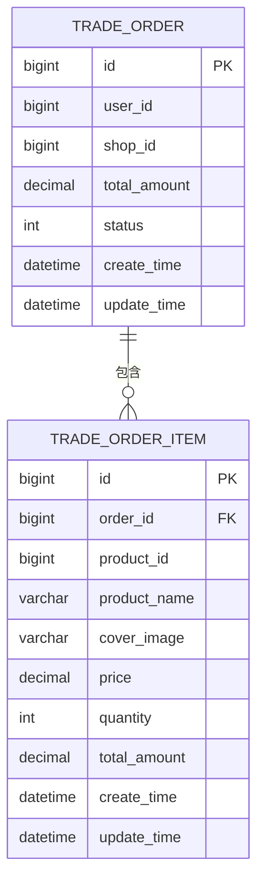

图表来源
- [TradeOrder.java:11-23](file://src/main/java/com/bohao/globalshop/entity/TradeOrder.java#L11-L23)
- [TradeOrderItem.java:11-25](file://src/main/java/com/bohao/globalshop/entity/TradeOrderItem.java#L11-L25)

章节来源
- [TradeOrder.java:1-24](file://src/main/java/com/bohao/globalshop/entity/TradeOrder.java#L1-L24)
- [TradeOrderItem.java:1-26](file://src/main/java/com/bohao/globalshop/entity/TradeOrderItem.java#L1-L26)

### 订单创建流程
- 校验商品是否存在与库存充足
- 使用数据库更新并检查影响行数，实现乐观锁式的库存扣减
- 插入主订单与订单项
- 异步发送延迟消息至 RabbitMQ，用于后续自动取消
- 返回订单ID

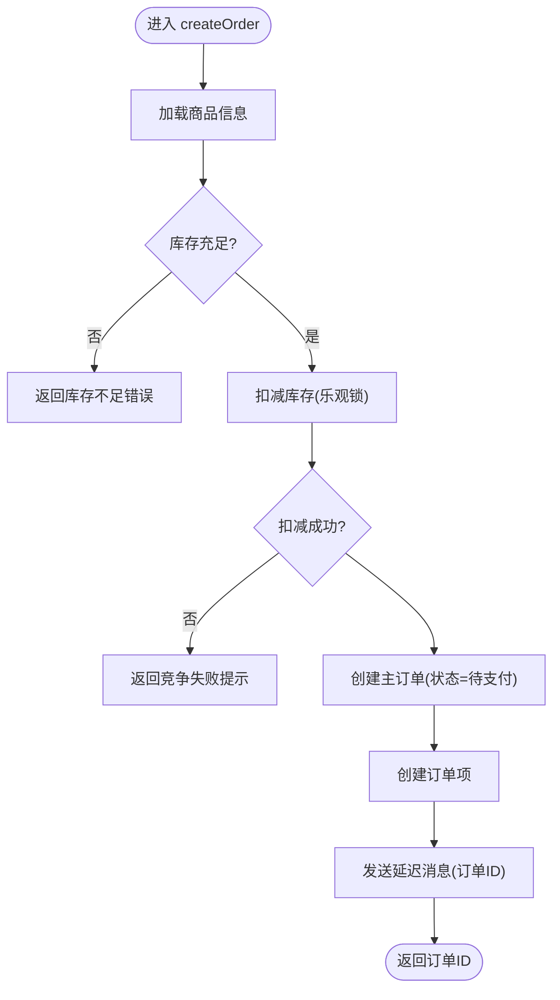

图表来源
- [OrderServiceImpl.java:40-81](file://src/main/java/com/bohao/globalshop/service/impl/OrderServiceImpl.java#L40-L81)

章节来源
- [OrderServiceImpl.java:38-81](file://src/main/java/com/bohao/globalshop/service/impl/OrderServiceImpl.java#L38-L81)

### 购物车结算与拆单
- 按店铺聚合购物车商品
- 对每个店铺内的商品执行 Redis 原子扣减与数据库扣减
- 为每个店铺生成独立主订单与订单项
- 异步发送延迟消息，实现按店铺维度的超时取消

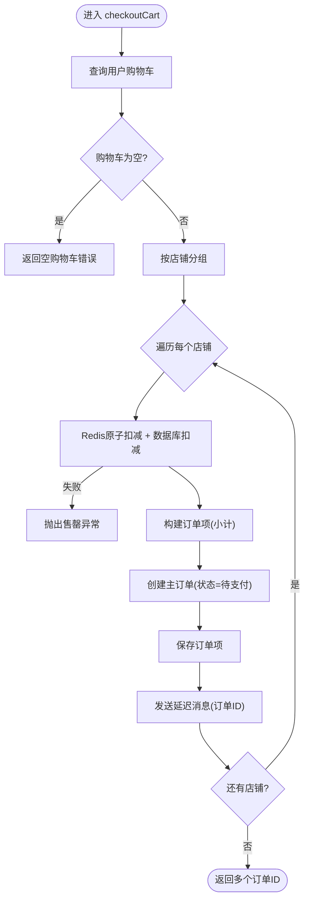

图表来源
- [OrderServiceImpl.java:140-236](file://src/main/java/com/bohao/globalshop/service/impl/OrderServiceImpl.java#L140-L236)

章节来源
- [OrderServiceImpl.java:140-236](file://src/main/java/com/bohao/globalshop/service/impl/OrderServiceImpl.java#L140-L236)

### 支付处理与状态流转
- 校验订单存在性与归属
- 校验订单状态必须为待支付
- 校验用户余额是否足够
- 余额扣减与订单状态更新
- 状态流转：待支付 → 已支付

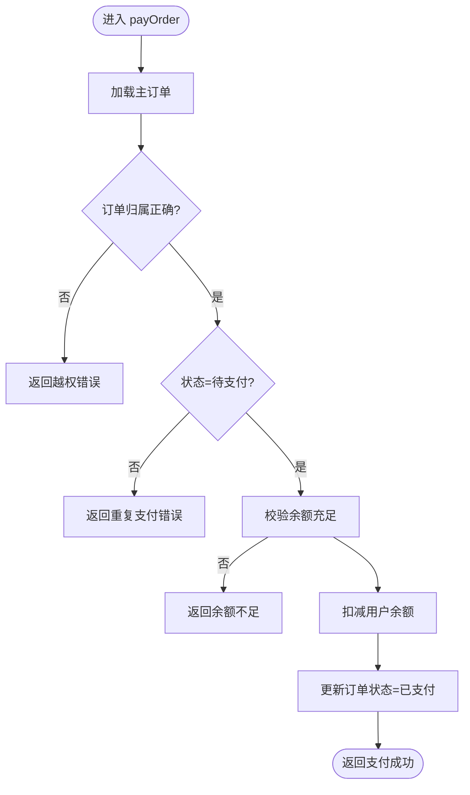

图表来源
- [OrderServiceImpl.java:110-138](file://src/main/java/com/bohao/globalshop/service/impl/OrderServiceImpl.java#L110-L138)

章节来源
- [OrderServiceImpl.java:110-138](file://src/main/java/com/bohao/globalshop/service/impl/OrderServiceImpl.java#L110-L138)

### 确认收货与资金结算
- 校验订单存在性与归属
- 校验订单状态必须为已发货
- 更新订单状态为已收货
- 将订单金额结算至商家账户

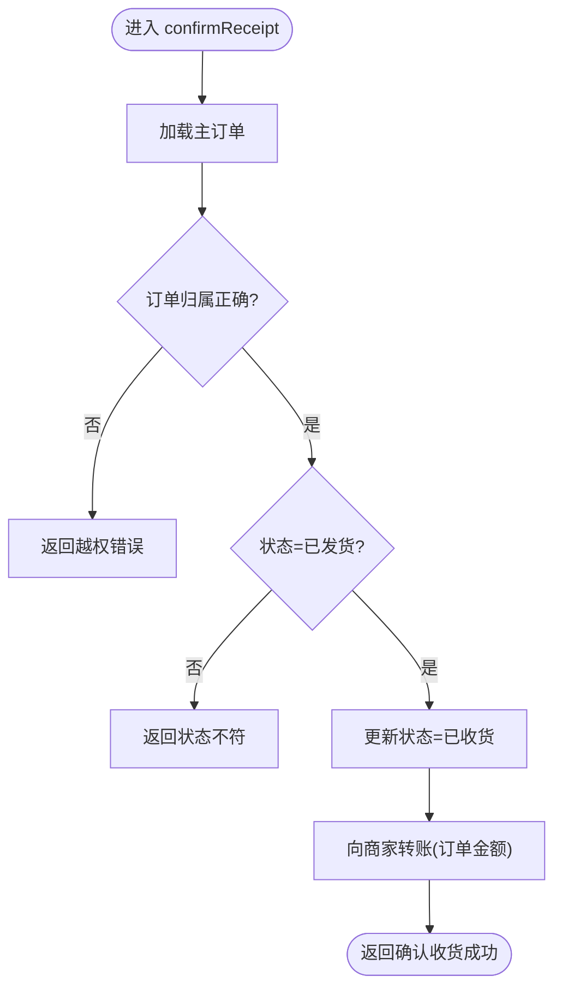

图表来源
- [OrderServiceImpl.java:264-293](file://src/main/java/com/bohao/globalshop/service/impl/OrderServiceImpl.java#L264-L293)

章节来源
- [OrderServiceImpl.java:264-293](file://src/main/java/com/bohao/globalshop/service/impl/OrderServiceImpl.java#L264-L293)

### 评价提交与订单完结
- 校验订单项存在性与归属
- 校验订单状态必须为已收货
- 防重复评价校验
- 写入评价记录并更新主订单状态为已完结

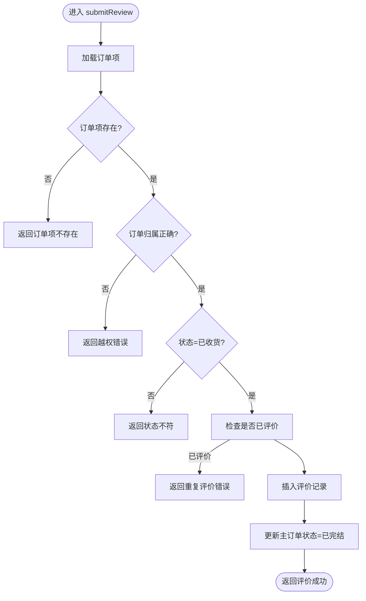

图表来源
- [OrderServiceImpl.java:295-328](file://src/main/java/com/bohao/globalshop/service/impl/OrderServiceImpl.java#L295-L328)

章节来源
- [OrderServiceImpl.java:295-328](file://src/main/java/com/bohao/globalshop/service/impl/OrderServiceImpl.java#L295-L328)

### 订单取消机制与库存回退
- 仅对“待支付”状态的订单执行取消
- 更新订单状态为已取消
- 回退订单项对应的库存

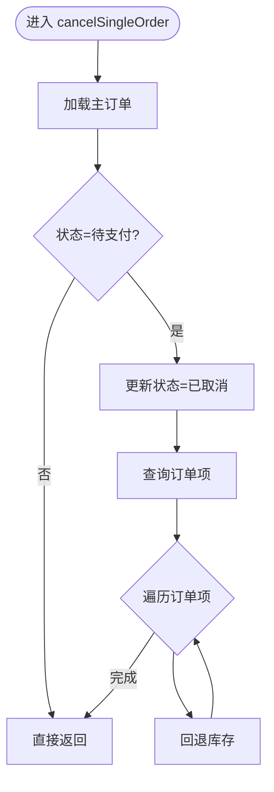

图表来源
- [OrderServiceImpl.java:240-260](file://src/main/java/com/bohao/globalshop/service/impl/OrderServiceImpl.java#L240-L260)

章节来源
- [OrderServiceImpl.java:240-260](file://src/main/java/com/bohao/globalshop/service/impl/OrderServiceImpl.java#L240-L260)

### 异步取消与超时处理
- RabbitMQ 延迟交换机与死信队列：订单未支付超时自动取消
- 定时任务：轮询 Redis ZSet 中的超时订单，使用 Redis 去重后执行取消
- 监听器：消费死信队列消息，统一调用取消逻辑

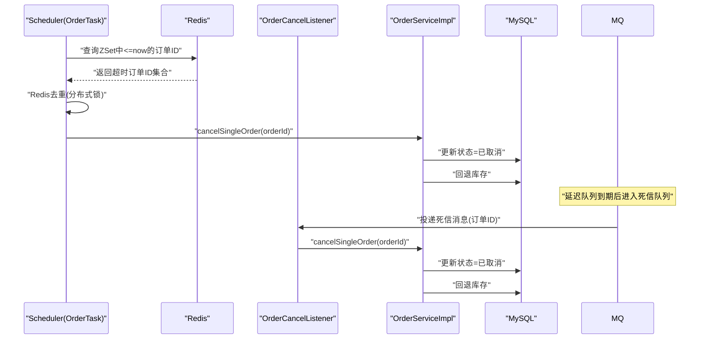

图表来源
- [OrderTask.java:19-42](file://src/main/java/com/bohao/globalshop/task/OrderTask.java#L19-L42)
- [OrderCancelListener.java:16-27](file://src/main/java/com/bohao/globalshop/listener/OrderCancelListener.java#L16-L27)
- [RabbitMqConfig.java:43-58](file://src/main/java/com/bohao/globalshop/config/RabbitMqConfig.java#L43-L58)

章节来源
- [OrderTask.java:1-44](file://src/main/java/com/bohao/globalshop/task/OrderTask.java#L1-L44)
- [OrderCancelListener.java:1-30](file://src/main/java/com/bohao/globalshop/listener/OrderCancelListener.java#L1-L30)
- [RabbitMqConfig.java:1-61](file://src/main/java/com/bohao/globalshop/config/RabbitMqConfig.java#L1-L61)

### 订单状态机设计
- 状态定义（整型枚举）：0=待支付、1=已支付、2=已取消、3=已发货、4=已收货、5=已完结
- 关键流转路径：
  - 下单 → 待支付（0）
  - 待支付 → 已支付（1）
  - 待支付 → 已取消（2）
  - 已支付 → 已发货（3）
  - 已发货 → 已收货（4）
  - 已收货 → 已完结（5）

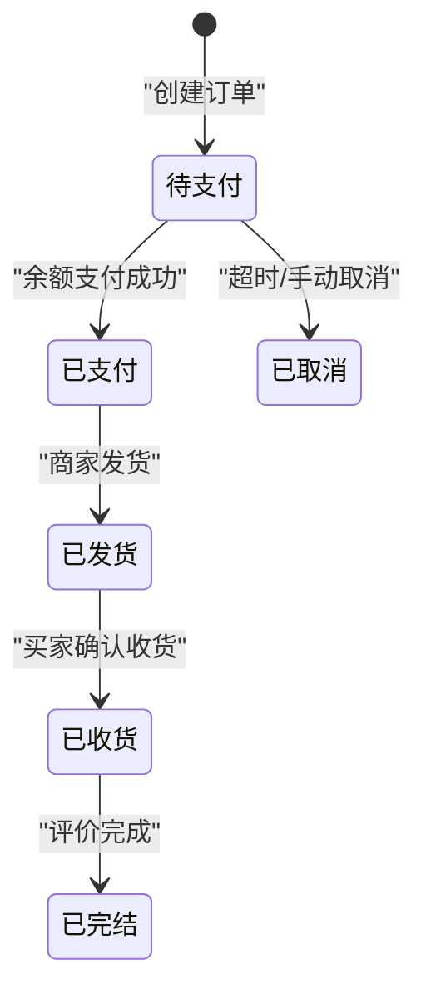

图表来源
- [OrderServiceImpl.java:110-138](file://src/main/java/com/bohao/globalshop/service/impl/OrderServiceImpl.java#L110-L138)
- [OrderServiceImpl.java:264-293](file://src/main/java/com/bohao/globalshop/service/impl/OrderServiceImpl.java#L264-L293)
- [OrderServiceImpl.java:295-328](file://src/main/java/com/bohao/globalshop/service/impl/OrderServiceImpl.java#L295-L328)

章节来源
- [OrderServiceImpl.java:110-138](file://src/main/java/com/bohao/globalshop/service/impl/OrderServiceImpl.java#L110-L138)
- [OrderServiceImpl.java:264-293](file://src/main/java/com/bohao/globalshop/service/impl/OrderServiceImpl.java#L264-L293)
- [OrderServiceImpl.java:295-328](file://src/main/java/com/bohao/globalshop/service/impl/OrderServiceImpl.java#L295-L328)

### 并发控制与事务策略
- 库存扣减：数据库更新影响行数校验（乐观锁），避免超卖
- Redis 原子扣减：Lua 脚本保证高并发下的库存一致性
- 事务边界：订单创建、支付、取消、确认收货均在事务中执行，确保状态与资金一致
- 分布式锁：Redis ZSet 去重，避免定时任务重复取消同一订单

章节来源
- [OrderServiceImpl.java:40-81](file://src/main/java/com/bohao/globalshop/service/impl/OrderServiceImpl.java#L40-L81)
- [OrderServiceImpl.java:140-236](file://src/main/java/com/bohao/globalshop/service/impl/OrderServiceImpl.java#L140-L236)
- [OrderServiceImpl.java:240-260](file://src/main/java/com/bohao/globalshop/service/impl/OrderServiceImpl.java#L240-L260)
- [OrderTask.java:27-39](file://src/main/java/com/bohao/globalshop/task/OrderTask.java#L27-L39)

## 依赖分析
- 组件耦合：控制器依赖服务接口；服务实现依赖 Mapper、Redis、RabbitMQ、Elasticsearch
- 外部依赖：MySQL（持久化）、Redis（缓存与分布式锁）、RabbitMQ（异步解耦）、Elasticsearch（搜索）
- 配置集中：数据库、Redis、RabbitMQ、Elasticsearch 与 MyBatis-Plus 配置集中在 application.yml

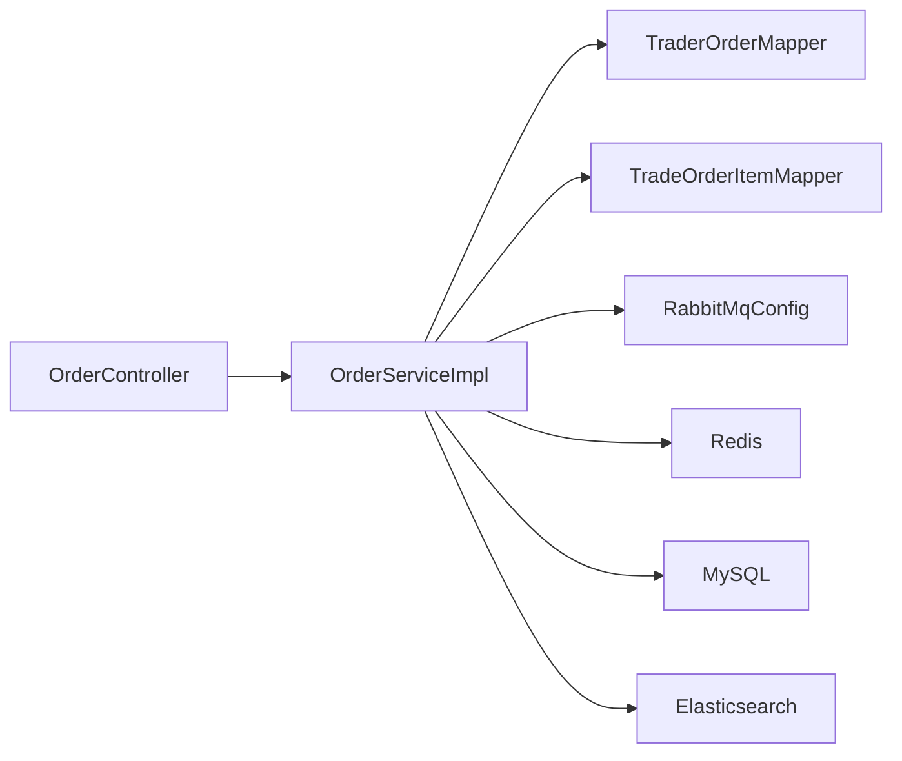

图表来源
- [OrderController.java:1-59](file://src/main/java/com/bohao/globalshop/controller/OrderController.java#L1-L59)
- [OrderServiceImpl.java:1-37](file://src/main/java/com/bohao/globalshop/service/impl/OrderServiceImpl.java#L1-L37)
- [application.yml:4-42](file://src/main/resources/application.yml#L4-L42)

章节来源
- [application.yml:1-42](file://src/main/resources/application.yml#L1-L42)

## 性能考虑
- Redis 原子扣减：Lua 脚本减少网络往返，降低竞争条件
- 异步化：下单与取消通过消息队列异步处理，提升响应速度
- 批量拆单：按店铺拆单，减少跨库事务范围
- 缓存与索引：利用 Redis 缓存热点商品库存，结合数据库索引优化查询
- 限流与降级：建议在网关层增加限流策略，异常时启用降级方案

## 故障排查指南
- 下单失败：检查商品是否存在、库存是否充足、数据库更新影响行数是否为 0（竞争失败）
- 支付失败：核对订单状态是否仍为待支付、用户余额是否足够
- 取消无效：确认订单状态是否为待支付、是否已触发超时取消
- 超时未取消：检查 RabbitMQ 延迟与死信配置、定时任务是否运行、Redis ZSet 是否存在重复ID
- MQ 死信堆积：查看死信队列消费情况与监听器日志

章节来源
- [OrderServiceImpl.java:40-81](file://src/main/java/com/bohao/globalshop/service/impl/OrderServiceImpl.java#L40-L81)
- [OrderServiceImpl.java:110-138](file://src/main/java/com/bohao/globalshop/service/impl/OrderServiceImpl.java#L110-L138)
- [OrderServiceImpl.java:240-260](file://src/main/java/com/bohao/globalshop/service/impl/OrderServiceImpl.java#L240-L260)
- [OrderCancelListener.java:16-27](file://src/main/java/com/bohao/globalshop/listener/OrderCancelListener.java#L16-L27)
- [OrderTask.java:19-42](file://src/main/java/com/bohao/globalshop/task/OrderTask.java#L19-L42)

## 结论
本系统通过“数据库事务 + Redis 原子操作 + RabbitMQ 延迟/死信 + 定时任务”的组合拳，在高并发场景下实现了订单生命周期的可靠管理。状态机清晰、流程可追溯、异常处理完备，具备良好的扩展性与稳定性。

## 附录

### API 接口文档
- 创建订单
  - 方法：POST
  - 路径：/api/order/create
  - 请求体：OrderCreateDto(productId, quantity)
  - 返回：Result<String>(订单ID)
- 我的订单
  - 方法：GET
  - 路径：/api/order/my
  - 返回：Result<List<OrderVo>>
- 购物车结算
  - 方法：POST
  - 路径：/api/order/checkout
  - 返回：Result<String>(逗号分隔的订单ID列表)
- 订单支付
  - 方法：POST
  - 路径：/api/order/pay/{id}
  - 返回：Result<String>(支付结果)
- 确认收货
  - 方法：POST
  - 路径：/api/order/confirm-receipt/{id}
  - 返回：Result<String>(确认结果)
- 提交评价
  - 方法：POST
  - 路径：/api/order/review
  - 返回：Result<String>(评价结果)

章节来源
- [OrderController.java:19-57](file://src/main/java/com/bohao/globalshop/controller/OrderController.java#L19-L57)
- [OrderCreateDto.java:1-10](file://src/main/java/com/bohao/globalshop/dto/OrderCreateDto.java#L1-L10)
- [OrderVo.java:1-18](file://src/main/java/com/bohao/globalshop/vo/OrderVo.java#L1-L18)
- [Result.java:1-30](file://src/main/java/com/bohao/globalshop/common/Result.java#L1-L30)