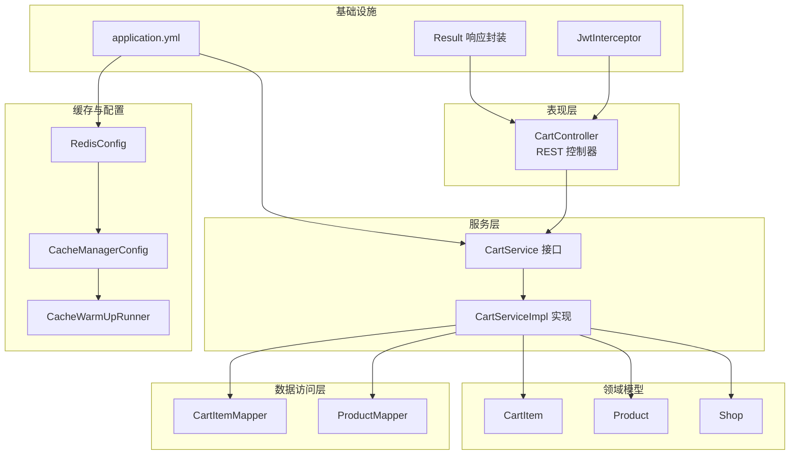
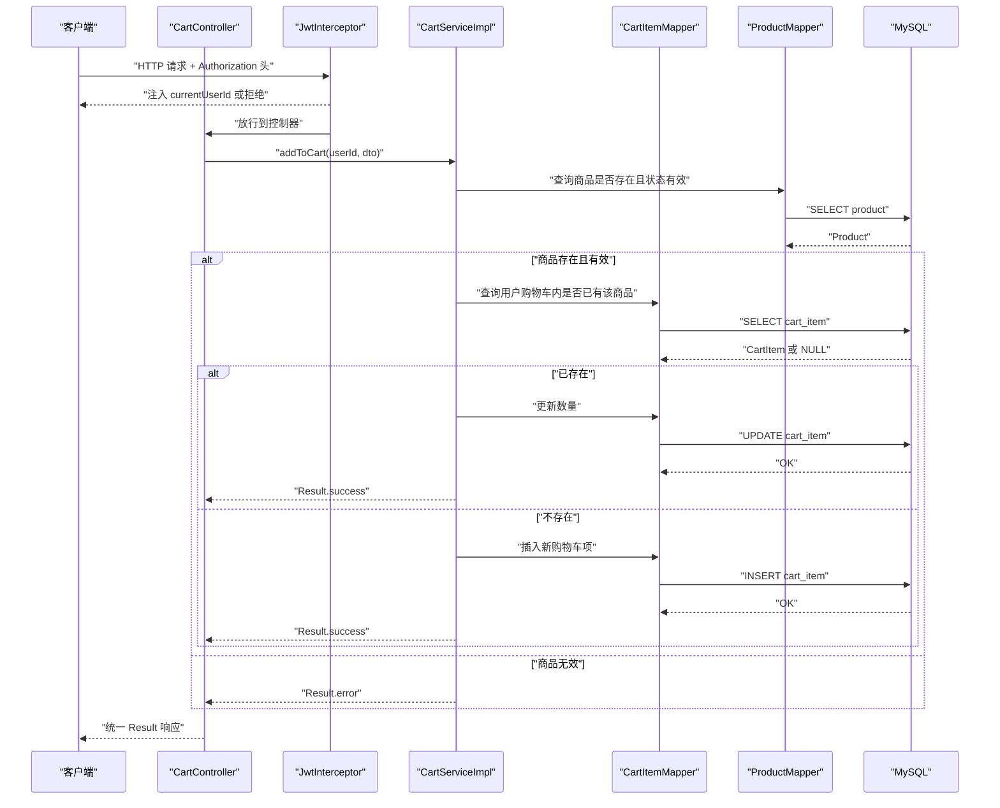
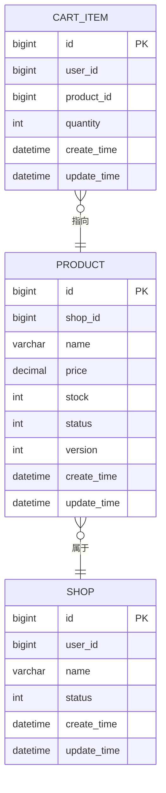
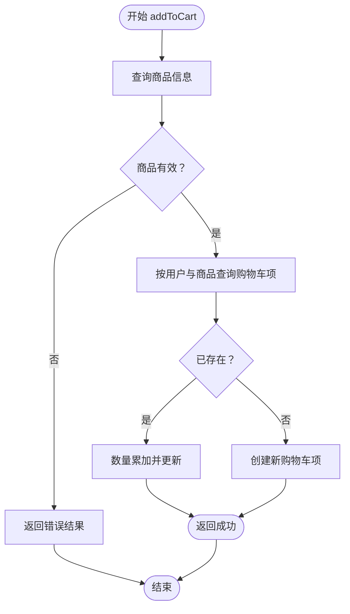
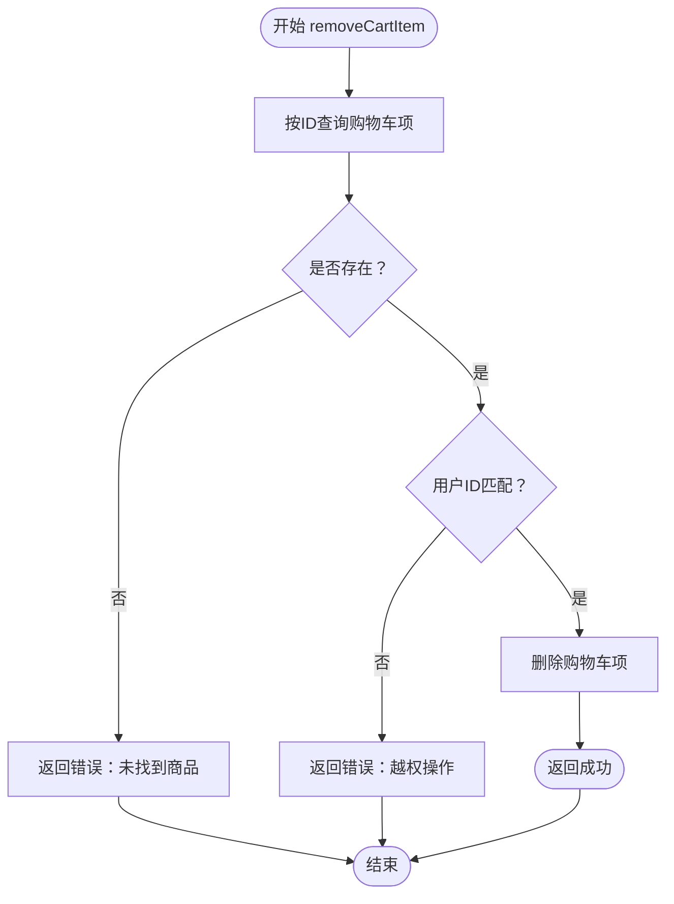
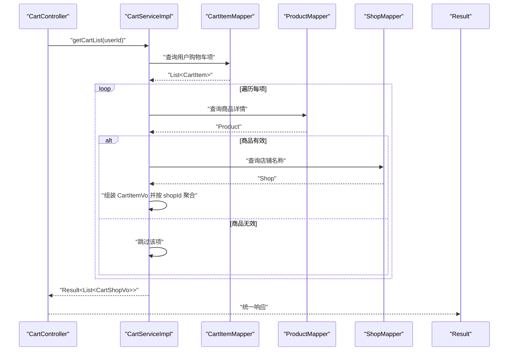
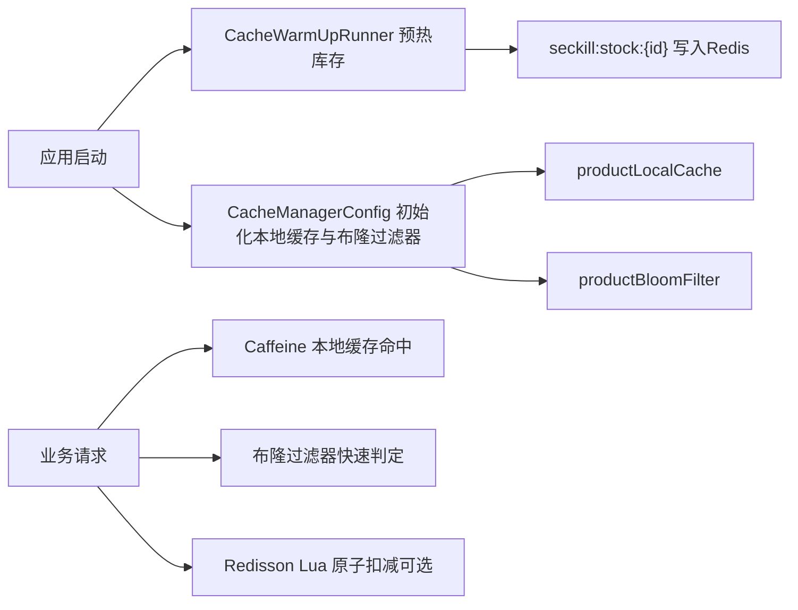
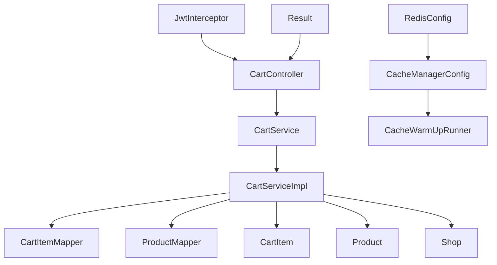

# 购物车管理系统

<cite>
**本文引用的文件**
- [CartController.java](file://src/main/java/com/bohao/globalshop/controller/CartController.java)
- [CartService.java](file://src/main/java/com/bohao/globalshop/service/CartService.java)
- [CartServiceImpl.java](file://src/main/java/com/bohao/globalshop/service/impl/CartServiceImpl.java)
- [CartItem.java](file://src/main/java/com/bohao/globalshop/entity/CartItem.java)
- [CartItemMapper.java](file://src/main/java/com/bohao/globalshop/mapper/CartItemMapper.java)
- [CartAddDto.java](file://src/main/java/com/bohao/globalshop/dto/CartAddDto.java)
- [CartItemVo.java](file://src/main/java/com/bohao/globalshop/vo/CartItemVo.java)
- [CartShopVo.java](file://src/main/java/com/bohao/globalshop/vo/CartShopVo.java)
- [Product.java](file://src/main/java/com/bohao/globalshop/entity/Product.java)
- [Shop.java](file://src/main/java/com/bohao/globalshop/entity/Shop.java)
- [ProductMapper.java](file://src/main/java/com/bohao/globalshop/mapper/ProductMapper.java)
- [RedisConfig.java](file://src/main/java/com/bohao/globalshop/config/RedisConfig.java)
- [CacheManagerConfig.java](file://src/main/java/com/bohao/globalshop/config/CacheManagerConfig.java)
- [CacheWarmUpRunner.java](file://src/main/java/com/bohao/globalshop/task/CacheWarmUpRunner.java)
- [JwtInterceptor.java](file://src/main/java/com/bohao/globalshop/interceptor/JwtInterceptor.java)
- [Result.java](file://src/main/java/com/bohao/globalshop/common/Result.java)
- [application.yml](file://src/main/resources/application.yml)
</cite>

## 目录
1. [简介](#简介)
2. [项目结构](#项目结构)
3. [核心组件](#核心组件)
4. [架构总览](#架构总览)
5. [详细组件分析](#详细组件分析)
6. [依赖分析](#依赖分析)
7. [性能考虑](#性能考虑)
8. [故障排除指南](#故障排除指南)
9. [结论](#结论)
10. [附录](#附录)

## 简介
本技术文档围绕购物车管理系统展开，聚焦于购物车的添加、删除、列表查询等核心操作的实现机制，以及购物车主数据模型设计、用户与商品的关联关系、购物车项的状态管理。文档还涵盖数据结构、缓存策略、持久化机制与并发控制方案，并对购物车合并、清理过期数据、批量操作等高级功能进行说明。最后提供完整的API接口规范、请求参数说明、响应格式，以及性能优化、内存管理最佳实践与故障排除指南。

## 项目结构
购物车模块采用典型的分层架构：控制器层负责HTTP接口与鉴权拦截；服务层封装业务逻辑；数据访问层通过MyBatis-Plus访问数据库；缓存与分布式能力由Redis与Redisson提供；配置文件集中管理数据源、缓存与中间件连接参数。

图示来源
- [CartController.java:1-41](file://src/main/java/com/bohao/globalshop/controller/CartController.java#L1-L41)
- [CartServiceImpl.java:1-122](file://src/main/java/com/bohao/globalshop/service/impl/CartServiceImpl.java#L1-L122)
- [CartItemMapper.java:1-11](file://src/main/java/com/bohao/globalshop/mapper/CartItemMapper.java#L1-L11)
- [ProductMapper.java:1-10](file://src/main/java/com/bohao/globalshop/mapper/ProductMapper.java#L1-L10)
- [CartItem.java:1-21](file://src/main/java/com/bohao/globalshop/entity/CartItem.java#L1-L21)
- [Product.java:1-30](file://src/main/java/com/bohao/globalshop/entity/Product.java#L1-L30)
- [Shop.java:1-22](file://src/main/java/com/bohao/globalshop/entity/Shop.java#L1-L22)
- [RedisConfig.java:1-46](file://src/main/java/com/bohao/globalshop/config/RedisConfig.java#L1-L46)
- [CacheManagerConfig.java:1-81](file://src/main/java/com/bohao/globalshop/config/CacheManagerConfig.java#L1-L81)
- [CacheWarmUpRunner.java:1-52](file://src/main/java/com/bohao/globalshop/task/CacheWarmUpRunner.java#L1-L52)
- [JwtInterceptor.java:1-36](file://src/main/java/com/bohao/globalshop/interceptor/JwtInterceptor.java#L1-L36)
- [Result.java:1-30](file://src/main/java/com/bohao/globalshop/common/Result.java#L1-L30)
- [application.yml:1-42](file://src/main/resources/application.yml#L1-L42)

章节来源
- [CartController.java:1-41](file://src/main/java/com/bohao/globalshop/controller/CartController.java#L1-L41)
- [application.yml:1-42](file://src/main/resources/application.yml#L1-L42)

## 核心组件
- 控制器层：提供购物车添加、列表查询、移除购物车项的REST接口，统一通过鉴权拦截器注入当前用户标识。
- 服务层：实现购物车合并、数量更新、按店铺聚合、安全校验等核心业务。
- 数据访问层：基于MyBatis-Plus的Mapper，提供购物车项、商品、店铺的读写能力。
- 领域模型：CartItem、Product、Shop实体映射数据库表，承载业务属性与版本控制。
- 缓存与并发：Redis与Redisson用于高性能缓存与分布式锁/布隆过滤器；Caffeine用于本地缓存预热。
- 响应封装：Result统一返回结构，便于前端处理。

章节来源
- [CartController.java:1-41](file://src/main/java/com/bohao/globalshop/controller/CartController.java#L1-L41)
- [CartService.java:1-18](file://src/main/java/com/bohao/globalshop/service/CartService.java#L1-L18)
- [CartServiceImpl.java:1-122](file://src/main/java/com/bohao/globalshop/service/impl/CartServiceImpl.java#L1-L122)
- [CartItem.java:1-21](file://src/main/java/com/bohao/globalshop/entity/CartItem.java#L1-L21)
- [Product.java:1-30](file://src/main/java/com/bohao/globalshop/entity/Product.java#L1-L30)
- [Shop.java:1-22](file://src/main/java/com/bohao/globalshop/entity/Shop.java#L1-L22)
- [RedisConfig.java:1-46](file://src/main/java/com/bohao/globalshop/config/RedisConfig.java#L1-L46)
- [CacheManagerConfig.java:1-81](file://src/main/java/com/bohao/globalshop/config/CacheManagerConfig.java#L1-L81)
- [Result.java:1-30](file://src/main/java/com/bohao/globalshop/common/Result.java#L1-L30)

## 架构总览
购物车系统遵循“接口-服务-数据访问-存储”的分层设计，结合Redis与Caffeine实现多级缓存，确保高并发下的低延迟与高吞吐。鉴权拦截器在进入业务前校验用户身份，服务层在关键路径执行安全校验与数据一致性保障。

图示来源
- [CartController.java:22-27](file://src/main/java/com/bohao/globalshop/controller/CartController.java#L22-L27)
- [JwtInterceptor.java:11-36](file://src/main/java/com/bohao/globalshop/interceptor/JwtInterceptor.java#L11-L36)
- [CartServiceImpl.java:35-61](file://src/main/java/com/bohao/globalshop/service/impl/CartServiceImpl.java#L35-L61)
- [CartItemMapper.java:1-11](file://src/main/java/com/bohao/globalshop/mapper/CartItemMapper.java#L1-L11)
- [ProductMapper.java:1-10](file://src/main/java/com/bohao/globalshop/mapper/ProductMapper.java#L1-L10)

## 详细组件分析

### 数据模型与关联关系
- 购物车项（CartItem）：记录用户、商品、数量及时间戳，作为购物车的核心实体。
- 商品（Product）：包含价格、库存、状态、版本号等，用于计算小计与校验有效性。
- 店铺（Shop）：用于按店铺聚合展示购物车内容。
- 关联关系：CartItem.userId → 用户；CartItem.productId → Product.id；Product.shopId → Shop.id。

图示来源
- [CartItem.java:10-21](file://src/main/java/com/bohao/globalshop/entity/CartItem.java#L10-L21)
- [Product.java:13-30](file://src/main/java/com/bohao/globalshop/entity/Product.java#L13-L30)
- [Shop.java:11-22](file://src/main/java/com/bohao/globalshop/entity/Shop.java#L11-L22)

章节来源
- [CartItem.java:1-21](file://src/main/java/com/bohao/globalshop/entity/CartItem.java#L1-L21)
- [Product.java:1-30](file://src/main/java/com/bohao/globalshop/entity/Product.java#L1-L30)
- [Shop.java:1-22](file://src/main/java/com/bohao/globalshop/entity/Shop.java#L1-L22)

### 添加购物车流程（含合并逻辑）
- 校验商品有效性：查询商品是否存在且状态有效。
- 合并同类项：若用户购物车内已存在该商品，则累加数量；否则新增一条购物车记录。
- 返回统一结果对象。

图示来源
- [CartServiceImpl.java:35-61](file://src/main/java/com/bohao/globalshop/service/impl/CartServiceImpl.java#L35-L61)

章节来源
- [CartServiceImpl.java:35-61](file://src/main/java/com/bohao/globalshop/service/impl/CartServiceImpl.java#L35-L61)

### 删除购物车项（安全校验）
- 查询待删除的购物车项。
- 校验是否存在与用户ID匹配，防止越权删除。
- 校验通过后删除记录并返回成功结果。

图示来源
- [CartServiceImpl.java:105-121](file://src/main/java/com/bohao/globalshop/service/impl/CartServiceImpl.java#L105-L121)

章节来源
- [CartServiceImpl.java:105-121](file://src/main/java/com/bohao/globalshop/service/impl/CartServiceImpl.java#L105-L121)

### 获取购物车列表（按店铺聚合）
- 查询当前用户的所有购物车项。
- 逐条加载商品信息，按店铺ID聚合为CartShopVo列表。
- 计算单项小计金额，最终返回统一结果对象。

图示来源
- [CartController.java:29-33](file://src/main/java/com/bohao/globalshop/controller/CartController.java#L29-L33)
- [CartServiceImpl.java:63-103](file://src/main/java/com/bohao/globalshop/service/impl/CartServiceImpl.java#L63-L103)
- [CartItemMapper.java:1-11](file://src/main/java/com/bohao/globalshop/mapper/CartItemMapper.java#L1-L11)
- [ProductMapper.java:1-10](file://src/main/java/com/bohao/globalshop/mapper/ProductMapper.java#L1-L10)

章节来源
- [CartController.java:29-33](file://src/main/java/com/bohao/globalshop/controller/CartController.java#L29-L33)
- [CartServiceImpl.java:63-103](file://src/main/java/com/bohao/globalshop/service/impl/CartServiceImpl.java#L63-L103)

### DTO、VO与响应封装
- CartAddDto：添加购物车时的输入参数，包含productId与quantity。
- CartItemVo：购物车项的输出视图，包含商品信息与小计金额。
- CartShopVo：按店铺聚合的输出视图，包含items列表。
- Result：统一响应封装，包含code、message与data。

章节来源
- [CartAddDto.java:1-11](file://src/main/java/com/bohao/globalshop/dto/CartAddDto.java#L1-L11)
- [CartItemVo.java:1-17](file://src/main/java/com/bohao/globalshop/vo/CartItemVo.java#L1-L17)
- [CartShopVo.java:1-13](file://src/main/java/com/bohao/globalshop/vo/CartShopVo.java#L1-L13)
- [Result.java:1-30](file://src/main/java/com/bohao/globalshop/common/Result.java#L1-L30)

### 缓存策略与并发控制
- 本地缓存（Caffeine）：为热点商品ID建立本地缓存，提升读取性能与降低数据库压力。
- 布隆过滤器（Redisson）：对上架商品ID建立布隆过滤器，快速判定ID是否存在，减少无效查询。
- 缓存预热（CommandLineRunner）：启动时将上架商品库存写入Redis，支持后续秒杀等场景的防超卖校验。
- Redis配置：提供RedissonClient与Lua脚本（秒杀库存扣减），保障原子性与一致性。

图示来源
- [CacheWarmUpRunner.java:27-50](file://src/main/java/com/bohao/globalshop/task/CacheWarmUpRunner.java#L27-L50)
- [CacheManagerConfig.java:29-78](file://src/main/java/com/bohao/globalshop/config/CacheManagerConfig.java#L29-L78)
- [RedisConfig.java:12-44](file://src/main/java/com/bohao/globalshop/config/RedisConfig.java#L12-L44)

章节来源
- [CacheWarmUpRunner.java:1-52](file://src/main/java/com/bohao/globalshop/task/CacheWarmUpRunner.java#L1-L52)
- [CacheManagerConfig.java:1-81](file://src/main/java/com/bohao/globalshop/config/CacheManagerConfig.java#L1-L81)
- [RedisConfig.java:1-46](file://src/main/java/com/bohao/globalshop/config/RedisConfig.java#L1-L46)

### 并发控制与一致性
- 服务层通过数据库唯一性约束与条件更新实现“合并同类项”与“数量更新”的一致性。
- 删除操作进行用户ID校验，防止越权删除。
- 对于高并发场景，可在需要时引入Redisson分布式锁或Lua脚本保障原子性（如库存扣减）。

章节来源
- [CartServiceImpl.java:35-61](file://src/main/java/com/bohao/globalshop/service/impl/CartServiceImpl.java#L35-L61)
- [CartServiceImpl.java:105-121](file://src/main/java/com/bohao/globalshop/service/impl/CartServiceImpl.java#L105-L121)
- [RedisConfig.java:27-44](file://src/main/java/com/bohao/globalshop/config/RedisConfig.java#L27-L44)

### 高级功能
- 购物车合并：已在添加逻辑中实现，相同商品数量累加。
- 清理过期数据：当前代码未实现定时清理逻辑，建议通过任务调度定期清理长时间未更新的购物车项。
- 批量操作：当前仅提供单条添加与单条删除，建议扩展批量添加、批量删除与批量更新数量的接口。

章节来源
- [CartServiceImpl.java:35-61](file://src/main/java/com/bohao/globalshop/service/impl/CartServiceImpl.java#L35-L61)
- [CartController.java:22-39](file://src/main/java/com/bohao/globalshop/controller/CartController.java#L22-L39)

## 依赖分析
- 控制器依赖服务接口，服务实现依赖Mapper与实体。
- 服务层依赖数据库进行数据读写，同时依赖商品与店铺信息进行聚合展示。
- 缓存配置依赖Redis与Redisson，提供本地缓存与布隆过滤器能力。
- 鉴权拦截器依赖JWT工具校验用户身份，向后续业务传递用户ID。

图示来源
- [CartController.java:1-41](file://src/main/java/com/bohao/globalshop/controller/CartController.java#L1-L41)
- [CartServiceImpl.java:1-122](file://src/main/java/com/bohao/globalshop/service/impl/CartServiceImpl.java#L1-L122)
- [RedisConfig.java:1-46](file://src/main/java/com/bohao/globalshop/config/RedisConfig.java#L1-L46)
- [CacheManagerConfig.java:1-81](file://src/main/java/com/bohao/globalshop/config/CacheManagerConfig.java#L1-L81)
- [JwtInterceptor.java:1-36](file://src/main/java/com/bohao/globalshop/interceptor/JwtInterceptor.java#L1-L36)
- [Result.java:1-30](file://src/main/java/com/bohao/globalshop/common/Result.java#L1-L30)

章节来源
- [CartController.java:1-41](file://src/main/java/com/bohao/globalshop/controller/CartController.java#L1-L41)
- [CartServiceImpl.java:1-122](file://src/main/java/com/bohao/globalshop/service/impl/CartServiceImpl.java#L1-L122)
- [RedisConfig.java:1-46](file://src/main/java/com/bohao/globalshop/config/RedisConfig.java#L1-L46)
- [CacheManagerConfig.java:1-81](file://src/main/java/com/bohao/globalshop/config/CacheManagerConfig.java#L1-L81)
- [JwtInterceptor.java:1-36](file://src/main/java/com/bohao/globalshop/interceptor/JwtInterceptor.java#L1-L36)
- [Result.java:1-30](file://src/main/java/com/bohao/globalshop/common/Result.java#L1-L30)

## 性能考虑
- 本地缓存（Caffeine）：合理设置容量与过期策略，避免内存膨胀；对热点数据进行预热。
- 布隆过滤器：根据商品总量与误判率配置，减少无效查询；定期维护与重建。
- 数据库索引：为cart_item的(user_id, product_id)建立复合索引，加速查询与去重。
- 分页与批量：聚合时避免一次性加载过多数据，必要时分页或批量处理。
- 异步与限流：在高并发场景引入限流与异步处理，保障系统稳定性。
- Redis原子操作：使用Lua脚本或Redisson命令保证库存扣减等关键操作的原子性。

章节来源
- [CacheManagerConfig.java:29-78](file://src/main/java/com/bohao/globalshop/config/CacheManagerConfig.java#L29-L78)
- [CacheWarmUpRunner.java:27-50](file://src/main/java/com/bohao/globalshop/task/CacheWarmUpRunner.java#L27-L50)
- [RedisConfig.java:27-44](file://src/main/java/com/bohao/globalshop/config/RedisConfig.java#L27-L44)

## 故障排除指南
- 未登录或令牌无效：鉴权拦截器会拒绝请求并返回401，检查Authorization头与JWT签名。
- 越权删除：删除购物车项时若用户ID不匹配，返回403，检查当前登录用户与购物车项归属。
- 商品不存在或已下架：添加购物车时若商品无效，返回400，检查商品状态与ID。
- 数据库异常：关注MyBatis-Plus日志与事务配置，确保唯一性约束与更新语义正确。
- 缓存不一致：检查布隆过滤器与本地缓存的初始化与预热流程，确保数据同步。

章节来源
- [JwtInterceptor.java:13-34](file://src/main/java/com/bohao/globalshop/interceptor/JwtInterceptor.java#L13-L34)
- [CartServiceImpl.java:35-61](file://src/main/java/com/bohao/globalshop/service/impl/CartServiceImpl.java#L35-L61)
- [CartServiceImpl.java:105-121](file://src/main/java/com/bohao/globalshop/service/impl/CartServiceImpl.java#L105-L121)
- [application.yml:4-42](file://src/main/resources/application.yml#L4-L42)

## 结论
购物车系统通过清晰的分层设计与完善的缓存策略，在保证数据一致性的同时实现了良好的性能与可扩展性。建议在现有基础上增强批量操作、过期清理与分布式锁等能力，进一步提升高并发场景下的稳定性与用户体验。

## 附录

### API 接口规范
- 添加购物车
  - 方法与路径：POST /api/cart/add
  - 请求头：Authorization（Bearer Token）
  - 请求体：CartAddDto
    - productId: 商品ID（整数）
    - quantity: 数量（整数）
  - 成功响应：Result<String>，包含操作成功信息
  - 错误响应：Result<String>，包含错误码与提示
- 获取购物车列表
  - 方法与路径：GET /api/cart/list
  - 请求头：Authorization（Bearer Token）
  - 成功响应：Result<List<CartShopVo>>
    - shopId: 店铺ID（整数）
    - shopName: 店铺名称（字符串）
    - items: 购物车项列表（CartItemVo[]）
  - 错误响应：Result<String>，包含错误码与提示
- 移除购物车项
  - 方法与路径：DELETE /api/cart/remove/{id}
  - 请求头：Authorization（Bearer Token）
  - 路径参数：id（购物车项ID）
  - 成功响应：Result<String>，包含操作成功信息
  - 错误响应：Result<String>，包含错误码与提示

章节来源
- [CartController.java:22-39](file://src/main/java/com/bohao/globalshop/controller/CartController.java#L22-L39)
- [CartAddDto.java:1-11](file://src/main/java/com/bohao/globalshop/dto/CartAddDto.java#L1-L11)
- [CartShopVo.java:1-13](file://src/main/java/com/bohao/globalshop/vo/CartShopVo.java#L1-L13)
- [CartItemVo.java:1-17](file://src/main/java/com/bohao/globalshop/vo/CartItemVo.java#L1-L17)
- [Result.java:1-30](file://src/main/java/com/bohao/globalshop/common/Result.java#L1-L30)