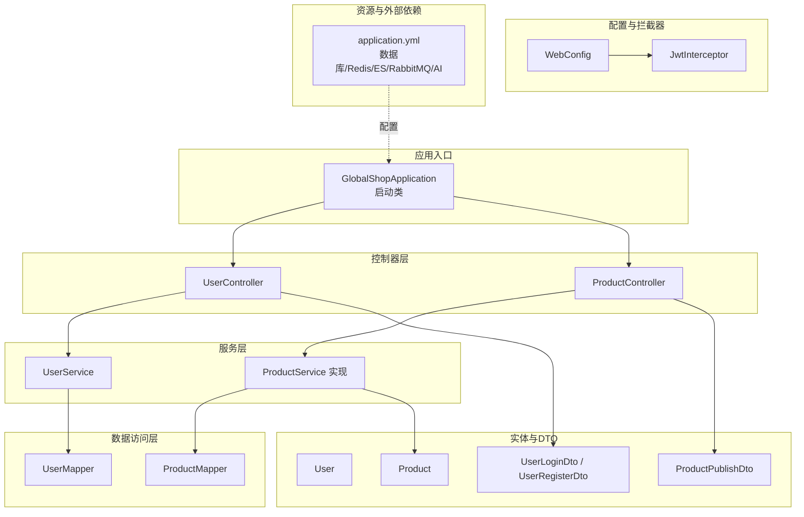
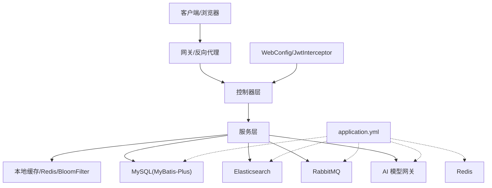
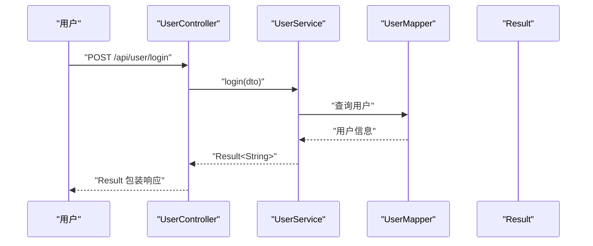
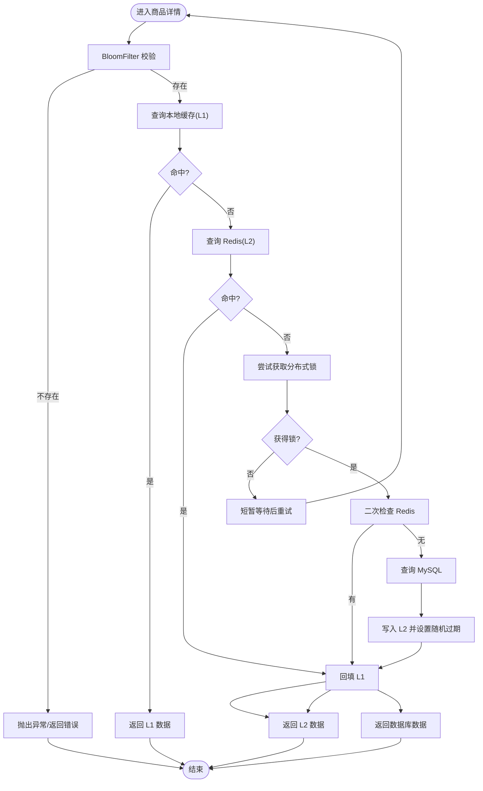
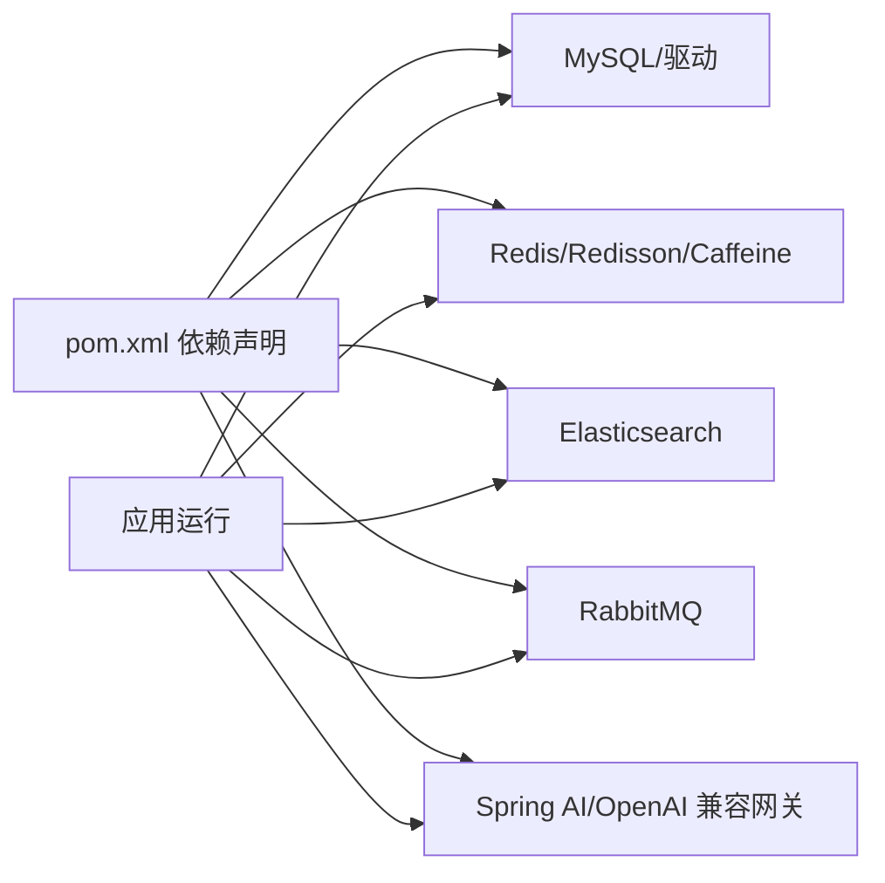

# 测试策略

<cite>
**本文引用的文件**
- [GlobalShopApplication.java](file://src/main/java/com/bohao/globalshop/GlobalShopApplication.java)
- [pom.xml](file://pom.xml)
- [application.yml](file://src/main/resources/application.yml)
- [ProductController.java](file://src/main/java/com/bohao/globalshop/controller/ProductController.java)
- [ProductServiceImpl.java](file://src/main/java/com/bohao/globalshop/service/impl/ProductServiceImpl.java)
- [ProductMapper.java](file://src/main/java/com/bohao/globalshop/mapper/ProductMapper.java)
- [Product.java](file://src/main/java/com/bohao/globalshop/entity/Product.java)
- [ProductPublishDto.java](file://src/main/java/com/bohao/globalshop/dto/ProductPublishDto.java)
- [UserController.java](file://src/main/java/com/bohao/globalshop/controller/UserController.java)
- [UserService.java](file://src/main/java/com/bohao/globalshop/service/UserService.java)
- [Result.java](file://src/main/java/com/bohao/globalshop/common/Result.java)
- [WebConfig.java](file://src/main/java/com/bohao/globalshop/config/WebConfig.java)
- [JwtInterceptor.java](file://src/main/java/com/bohao/globalshop/interceptor/JwtInterceptor.java)
</cite>

## 目录
1. [简介](#简介)
2. [项目结构](#项目结构)
3. [核心组件](#核心组件)
4. [架构总览](#架构总览)
5. [详细组件分析](#详细组件分析)
6. [依赖分析](#依赖分析)
7. [性能考虑](#性能考虑)
8. [故障排查指南](#故障排查指南)
9. [结论](#结论)
10. [附录](#附录)

## 简介
本测试策略面向全球购物平台，覆盖单元测试、集成测试与端到端测试的实施方法；明确测试用例设计原则与覆盖率目标；给出 Mock 测试、数据库测试与 API 测试最佳实践；说明测试数据管理、测试环境配置与持续集成流程；并提供性能测试、安全测试与兼容性测试指导，帮助测试工程师与质量保证团队高效落地。

## 项目结构
该工程采用 Spring Boot 标准目录结构，主要模块包括：
- 控制器层：处理 HTTP 请求与响应，统一返回包装类型
- 服务层：业务逻辑编排，包含缓存、分布式锁等高并发保护
- 数据访问层：MyBatis-Plus Mapper 接口
- 实体与 DTO：数据模型与传输对象
- 配置与拦截器：跨域、JWT 拦截、Web MVC 配置
- 资源配置：数据库、Redis、Elasticsearch、RabbitMQ、AI 模型等外部依赖

**图表来源**
- [GlobalShopApplication.java:1-17](file://src/main/java/com/bohao/globalshop/GlobalShopApplication.java#L1-L17)
- [UserController.java:1-29](file://src/main/java/com/bohao/globalshop/controller/UserController.java#L1-L29)
- [ProductController.java:1-101](file://src/main/java/com/bohao/globalshop/controller/ProductController.java#L1-L101)
- [ProductServiceImpl.java:1-177](file://src/main/java/com/bohao/globalshop/service/impl/ProductServiceImpl.java#L1-L177)
- [ProductMapper.java:1-10](file://src/main/java/com/bohao/globalshop/mapper/ProductMapper.java#L1-L10)
- [Product.java:1-30](file://src/main/java/com/bohao/globalshop/entity/Product.java#L1-L30)
- [ProductPublishDto.java:1-15](file://src/main/java/com/bohao/globalshop/dto/ProductPublishDto.java#L1-L15)
- [UserService.java:1-12](file://src/main/java/com/bohao/globalshop/service/UserService.java#L1-L12)
- [WebConfig.java:1-36](file://src/main/java/com/bohao/globalshop/config/WebConfig.java#L1-L36)
- [JwtInterceptor.java:1-36](file://src/main/java/com/bohao/globalshop/interceptor/JwtInterceptor.java#L1-L36)
- [application.yml:1-42](file://src/main/resources/application.yml#L1-L42)

**章节来源**
- [GlobalShopApplication.java:1-17](file://src/main/java/com/bohao/globalshop/GlobalShopApplication.java#L1-L17)
- [pom.xml:1-148](file://pom.xml#L1-L148)
- [application.yml:1-42](file://src/main/resources/application.yml#L1-L42)

## 核心组件
- 统一响应包装：Result 类提供统一的 code/message/data 结构，便于测试断言与前后端一致性
- 控制器：对外暴露 REST 接口，负责参数接收与结果封装
- 服务层：包含复杂业务逻辑与缓存策略，是测试重点
- 数据访问层：基于 MyBatis-Plus，支持条件构造器与分页查询
- 配置与拦截器：跨域与 JWT 认证拦截，影响 API 测试与端到端场景

**章节来源**
- [Result.java:1-30](file://src/main/java/com/bohao/globalshop/common/Result.java#L1-L30)
- [UserController.java:1-29](file://src/main/java/com/bohao/globalshop/controller/UserController.java#L1-L29)
- [ProductController.java:1-101](file://src/main/java/com/bohao/globalshop/controller/ProductController.java#L1-L101)
- [ProductServiceImpl.java:1-177](file://src/main/java/com/bohao/globalshop/service/impl/ProductServiceImpl.java#L1-L177)
- [ProductMapper.java:1-10](file://src/main/java/com/bohao/globalshop/mapper/ProductMapper.java#L1-L10)
- [WebConfig.java:1-36](file://src/main/java/com/bohao/globalshop/config/WebConfig.java#L1-L36)
- [JwtInterceptor.java:1-36](file://src/main/java/com/bohao/globalshop/interceptor/JwtInterceptor.java#L1-L36)

## 架构总览
系统采用分层架构，控制器层负责请求接入，服务层承载业务与缓存策略，数据访问层对接数据库，配置层提供拦截与跨域支持。外部依赖包括 MySQL、Redis、Elasticsearch、RabbitMQ 与 AI 模型网关。

**图表来源**
- [application.yml:1-42](file://src/main/resources/application.yml#L1-L42)
- [WebConfig.java:1-36](file://src/main/java/com/bohao/globalshop/config/WebConfig.java#L1-L36)
- [JwtInterceptor.java:1-36](file://src/main/java/com/bohao/globalshop/interceptor/JwtInterceptor.java#L1-L36)
- [ProductServiceImpl.java:1-177](file://src/main/java/com/bohao/globalshop/service/impl/ProductServiceImpl.java#L1-L177)

## 详细组件分析

### 用户认证与授权测试
- 测试目标：验证登录/注册接口与 JWT 拦截器行为
- 关键点：
  - 登录/注册接口返回统一 Result 包装
  - JWT 拦截器对受保护路径进行鉴权，缺失或无效 Token 应返回 401
  - 跨域配置允许前端跨域访问
- 测试建议：
  - 单元：UserService 接口与实现，使用 Mock Mapper 与工具类
  - 集成：UserController + JwtInterceptor + WebConfig
  - 端到端：携带有效/无效 Token 调用受保护接口，断言状态码与 Result 结构

**图表来源**
- [UserController.java:1-29](file://src/main/java/com/bohao/globalshop/controller/UserController.java#L1-L29)
- [UserService.java:1-12](file://src/main/java/com/bohao/globalshop/service/UserService.java#L1-L12)
- [Result.java:1-30](file://src/main/java/com/bohao/globalshop/common/Result.java#L1-L30)

**章节来源**
- [UserController.java:1-29](file://src/main/java/com/bohao/globalshop/controller/UserController.java#L1-L29)
- [UserService.java:1-12](file://src/main/java/com/bohao/globalshop/service/UserService.java#L1-L12)
- [WebConfig.java:1-36](file://src/main/java/com/bohao/globalshop/config/WebConfig.java#L1-L36)
- [JwtInterceptor.java:1-36](file://src/main/java/com/bohao/globalshop/interceptor/JwtInterceptor.java#L1-L36)
- [Result.java:1-30](file://src/main/java/com/bohao/globalshop/common/Result.java#L1-L30)

### 商品搜索与详情缓存测试
- 测试目标：验证商品列表、详情、评论、全文检索与缓存链路
- 关键点：
  - 商品详情包含三级缓存（本地/Caffeine + Redis + 分布式锁）
  - BloomFilter 防缓存穿透
  - ES 全文检索与分页
- 测试建议：
  - 单元：ProductServiceImpl 缓存与锁逻辑，Mock Redis、BloomFilter、Mapper
  - 集成：ProductController + ProductServiceImpl + ES Repository/Mapper
  - 端到端：调用搜索与详情接口，断言缓存命中、锁行为与分页结果

**图表来源**
- [ProductServiceImpl.java:111-177](file://src/main/java/com/bohao/globalshop/service/impl/ProductServiceImpl.java#L111-L177)

**章节来源**
- [ProductController.java:1-101](file://src/main/java/com/bohao/globalshop/controller/ProductController.java#L1-L101)
- [ProductServiceImpl.java:1-177](file://src/main/java/com/bohao/globalshop/service/impl/ProductServiceImpl.java#L1-L177)
- [ProductMapper.java:1-10](file://src/main/java/com/bohao/globalshop/mapper/ProductMapper.java#L1-L10)
- [Product.java:1-30](file://src/main/java/com/bohao/globalshop/entity/Product.java#L1-L30)

### 数据与检索测试
- 测试目标：验证商品列表、评论、全文检索与同步流程
- 关键点：
  - 列表与详情通过 Mapper 查询
  - 评论按时间倒序展示并进行用户名脱敏
  - ES 同步与搜索接口
- 测试建议：
  - 单元：Mapper 与 VO 转换逻辑
  - 集成：ES Repository 与 Controller
  - 端到端：调用同步与搜索接口，断言文档数量与关键词匹配

**章节来源**
- [ProductController.java:1-101](file://src/main/java/com/bohao/globalshop/controller/ProductController.java#L1-L101)
- [ProductServiceImpl.java:46-109](file://src/main/java/com/bohao/globalshop/service/impl/ProductServiceImpl.java#L46-L109)

## 依赖分析
- 外部依赖：MySQL、Redis、Elasticsearch、RabbitMQ、Spring AI/OpenAI 兼容网关
- 内部依赖：控制器依赖服务，服务依赖 Mapper/Repository，统一由 Spring 容器注入
- 配置依赖：application.yml 提供连接参数，WebConfig/JwtInterceptor 影响运行时行为

**图表来源**
- [pom.xml:33-102](file://pom.xml#L33-L102)
- [application.yml:4-38](file://src/main/resources/application.yml#L4-L38)

**章节来源**
- [pom.xml:1-148](file://pom.xml#L1-L148)
- [application.yml:1-42](file://src/main/resources/application.yml#L1-L42)

## 性能考虑
- 缓存策略：本地缓存优先、Redis 降级、分布式锁防击穿、随机过期防雪崩
- 搜索性能：ES 全文检索与分页，建议对高频关键词建立索引与映射
- 并发控制：Redisson 分布式锁，避免热点数据集中查询数据库
- 数据库优化：合理索引、分页查询、批量写入 ES
- 压测建议：针对商品详情、搜索、下单等关键路径进行并发与容量压测，关注缓存命中率、延迟与错误率

**章节来源**
- [ProductServiceImpl.java:111-177](file://src/main/java/com/bohao/globalshop/service/impl/ProductServiceImpl.java#L111-L177)
- [ProductController.java:85-99](file://src/main/java/com/bohao/globalshop/controller/ProductController.java#L85-L99)

## 故障排查指南
- 统一响应断言：所有接口返回 Result，测试中应断言 code/message/data
- JWT 问题：拦截器校验失败会返回 401，需检查 Token 是否存在、格式是否正确、是否过期
- 跨域问题：WebConfig 已开启跨域，若仍失败，检查请求头与预检请求
- 数据库/ES/MQ 连接：核对 application.yml 中连接参数与服务可用性
- 缓存异常：检查 Redis 可用性、BloomFilter 初始化、分布式锁是否正确释放

**章节来源**
- [Result.java:1-30](file://src/main/java/com/bohao/globalshop/common/Result.java#L1-L30)
- [JwtInterceptor.java:1-36](file://src/main/java/com/bohao/globalshop/interceptor/JwtInterceptor.java#L1-L36)
- [WebConfig.java:1-36](file://src/main/java/com/bohao/globalshop/config/WebConfig.java#L1-L36)
- [application.yml:4-38](file://src/main/resources/application.yml#L4-L38)

## 结论
本测试策略围绕统一响应、控制器、服务与缓存链路构建，结合 Mock、数据库与 API 测试方法，覆盖单元、集成与端到端场景。建议以关键业务路径为主线，配合性能与安全测试，确保系统稳定性与可维护性。

## 附录

### 测试策略与覆盖率要求
- 单元测试：服务层与工具类 100% 覆盖，关键分支与异常路径全覆盖
- 集成测试：控制器 + 服务 + 外部依赖（Redis/ES/MQ）90% 覆盖
- 端到端测试：核心业务流程（登录/注册、商品搜索、详情、评论）100% 场景覆盖
- 覆盖率工具：JaCoCo 或其他覆盖率工具，结合 CI 报告阈值

### Mock 测试最佳实践
- 使用 Mockito 对 Mapper/Repository/Redis/ES/MQ 进行 Mock
- 对分布式锁与缓存进行桩函数模拟，验证锁竞争与缓存回填逻辑
- 对外部 AI 网关进行 HTTP Mock，避免真实调用

### 数据库测试最佳实践
- 使用内存数据库（如 H2）或 Docker MySQL 运行测试
- 基于事务回滚或测试专用 Schema，保证测试隔离
- 对缓存穿透/击穿/雪崩场景进行压力与边界测试

### API 测试最佳实践
- 使用 REST Assured/Postman/Newman 等工具编写接口测试
- 统一断言 Result 结构，覆盖正常与异常分支
- 对受保护接口补充 JWT Token 与权限场景

### 测试数据管理
- 使用固定种子数据与工厂类生成测试数据
- 对 ES 索引进行初始化与清理，确保每次测试独立
- 对 Redis 设置 TTL 与命名空间，避免污染

### 测试环境配置
- 本地：application.yml 指向本地服务
- CI：使用 Docker Compose 启动 MySQL/Redis/ES/RabbitMQ，动态生成测试数据库
- 环境变量：通过 Maven Profile 或环境变量切换配置

### 持续集成流程
- 触发：Push/PR 触发流水线
- 步骤：编译 → 单元测试（覆盖率报告）→ 集成测试（容器化依赖）→ 端到端测试 → 性能/安全扫描
- 报告：上传覆盖率与测试报告，失败时阻断发布

### 性能测试
- 路径：商品详情、搜索、下单、评论
- 指标：吞吐量、P95/P99 延迟、缓存命中率、数据库连接池使用率
- 工具：JMeter/Gatling/Locust

### 安全测试
- 认证与授权：JWT 伪造、越权访问、敏感信息泄露
- 输入校验：SQL 注入、XSS、参数边界
- 配置安全：密钥与凭据管理、日志脱敏

### 兼容性测试
- 浏览器：Chrome/Firefox/Safari/Edge
- 移动端：iOS/Android WebView
- 网络：弱网、高延迟、断网重连