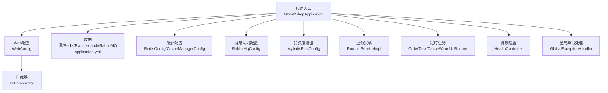
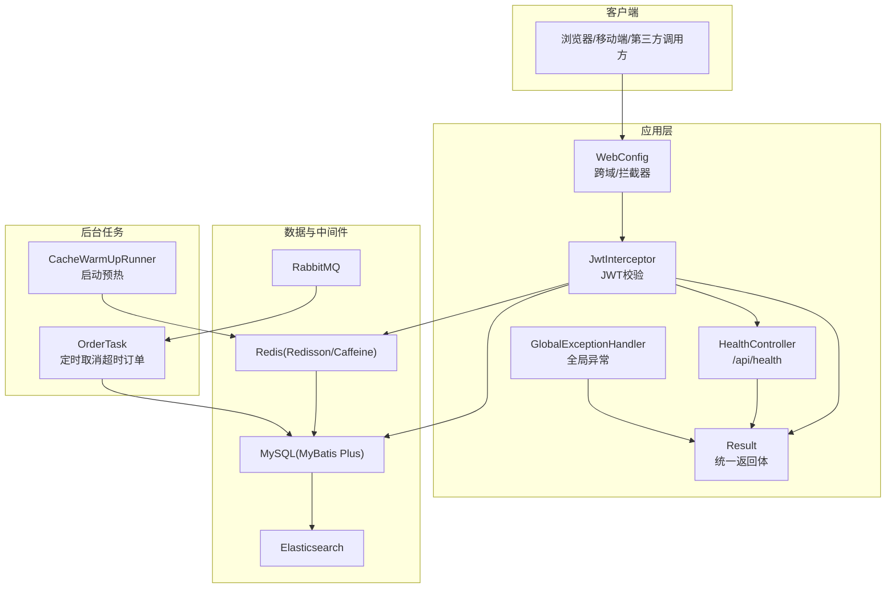
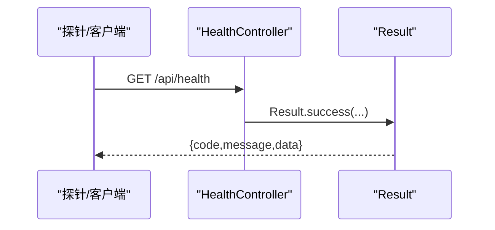
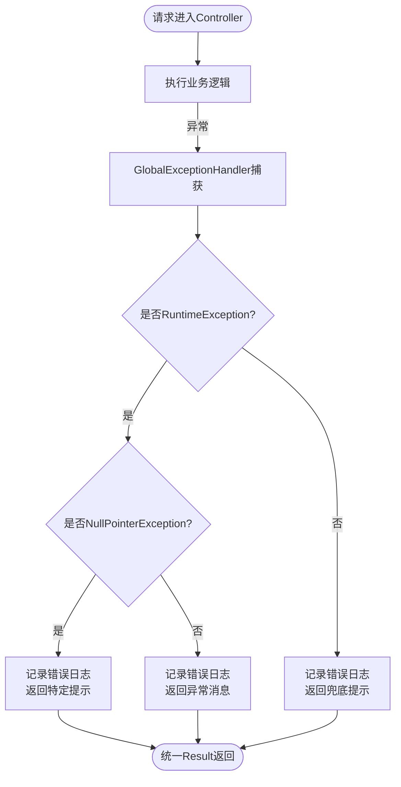
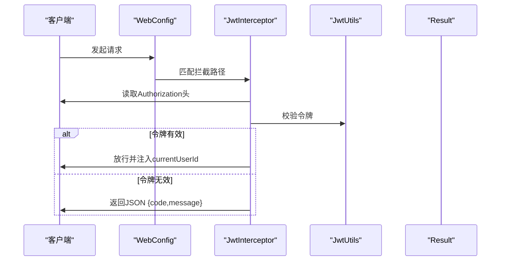
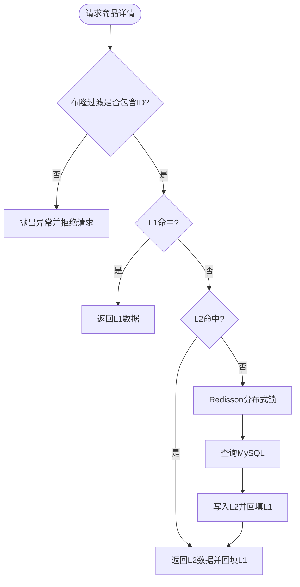
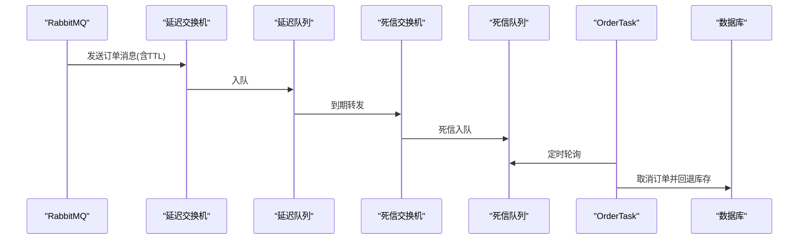
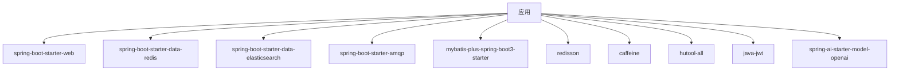

# 监控运维

<cite>
**本文引用的文件**
- [GlobalShopApplication.java](file://src/main/java/com/bohao/globalshop/GlobalShopApplication.java)
- [application.yml](file://src/main/resources/application.yml)
- [HealthController.java](file://src/main/java/com/bohao/globalshop/controller/HealthController.java)
- [GlobalExceptionHandler.java](file://src/main/java/com/bohao/globalshop/exception/GlobalExceptionHandler.java)
- [WebConfig.java](file://src/main/java/com/bohao/globalshop/config/WebConfig.java)
- [JwtInterceptor.java](file://src/main/java/com/bohao/globalshop/interceptor/JwtInterceptor.java)
- [Result.java](file://src/main/java/com/bohao/globalshop/common/Result.java)
- [JwtUtils.java](file://src/main/java/com/bohao/globalshop/common/JwtUtils.java)
- [RabbitMqConfig.java](file://src/main/java/com/bohao/globalshop/config/RabbitMqConfig.java)
- [RedisConfig.java](file://src/main/java/com/bohao/globalshop/config/RedisConfig.java)
- [MybatisPlusConfig.java](file://src/main/java/com/bohao/globalshop/config/MybatisPlusConfig.java)
- [CacheManagerConfig.java](file://src/main/java/com/bohao/globalshop/config/CacheManagerConfig.java)
- [ProductServiceImpl.java](file://src/main/java/com/bohao/globalshop/service/impl/ProductServiceImpl.java)
- [OrderTask.java](file://src/main/java/com/bohao/globalshop/task/OrderTask.java)
- [CacheWarmUpRunner.java](file://src/main/java/com/bohao/globalshop/task/CacheWarmUpRunner.java)
- [pom.xml](file://pom.xml)
</cite>

## 目录
1. [简介](#简介)
2. [项目结构](#项目结构)
3. [核心组件](#核心组件)
4. [架构总览](#架构总览)
5. [详细组件分析](#详细组件分析)
6. [依赖分析](#依赖分析)
7. [性能考虑](#性能考虑)
8. [故障排查指南](#故障排查指南)
9. [结论](#结论)
10. [附录](#附录)

## 简介
本运维文档面向全球购物平台的运维工程师与SRE团队，围绕健康检查接口、异常与日志处理、性能与业务监控、系统监控、日志管理、告警配置以及故障排查流程展开。文档基于仓库现有代码与配置，给出可落地的监控与运维实践建议，并提供部署与备份恢复思路。

## 项目结构
- 应用入口与调度：应用主类启用调度能力；配置层包含Web拦截器、跨域、JWT校验、Redis、RabbitMQ、MyBatis Plus、缓存布隆过滤器等。
- 控制器层：提供健康检查接口，其余业务控制器负责具体功能。
- 异常与结果封装：统一异常处理与响应体封装，便于前端消费与监控采集。
- 业务与任务：商品详情缓存策略、延迟订单处理定时任务、缓存预热。

图表来源
- [GlobalShopApplication.java:1-17](file://src/main/java/com/bohao/globalshop/GlobalShopApplication.java#L1-L17)
- [WebConfig.java:1-36](file://src/main/java/com/bohao/globalshop/config/WebConfig.java#L1-L36)
- [JwtInterceptor.java:1-36](file://src/main/java/com/bohao/globalshop/interceptor/JwtInterceptor.java#L1-L36)
- [application.yml:1-42](file://src/main/resources/application.yml#L1-L42)
- [RedisConfig.java:1-46](file://src/main/java/com/bohao/globalshop/config/RedisConfig.java#L1-L46)
- [CacheManagerConfig.java:1-55](file://src/main/java/com/bohao/globalshop/config/CacheManagerConfig.java#L1-L55)
- [RabbitMqConfig.java:1-61](file://src/main/java/com/bohao/globalshop/config/RabbitMqConfig.java#L1-L61)
- [MybatisPlusConfig.java:1-18](file://src/main/java/com/bohao/globalshop/config/MybatisPlusConfig.java#L1-L18)
- [ProductServiceImpl.java:1-177](file://src/main/java/com/bohao/globalshop/service/impl/ProductServiceImpl.java#L1-L177)
- [OrderTask.java:1-44](file://src/main/java/com/bohao/globalshop/task/OrderTask.java#L1-L44)
- [CacheWarmUpRunner.java:1-52](file://src/main/java/com/bohao/globalshop/task/CacheWarmUpRunner.java#L1-L52)
- [HealthController.java:1-19](file://src/main/java/com/bohao/globalshop/controller/HealthController.java#L1-L19)
- [GlobalExceptionHandler.java:1-33](file://src/main/java/com/bohao/globalshop/exception/GlobalExceptionHandler.java#L1-L33)

章节来源
- [GlobalShopApplication.java:1-17](file://src/main/java/com/bohao/globalshop/GlobalShopApplication.java#L1-L17)
- [application.yml:1-42](file://src/main/resources/application.yml#L1-L42)

## 核心组件
- 健康检查接口：提供基础可用性探测路径，便于K8s/负载均衡/探针使用。
- 全局异常处理：集中捕获运行时与通用异常，输出统一JSON结构，记录错误日志。
- 结果封装：统一返回体结构，便于前端与监控系统消费。
- Web与拦截：跨域配置与JWT拦截器，保护受控接口。
- 缓存与布隆过滤：多级缓存与布隆过滤，降低数据库压力。
- 消息与定时：延迟队列与定时任务，保障订单超时处理与缓存预热。
- ORM增强：乐观锁插件，提升并发一致性。

章节来源
- [HealthController.java:14-17](file://src/main/java/com/bohao/globalshop/controller/HealthController.java#L14-L17)
- [GlobalExceptionHandler.java:15-31](file://src/main/java/com/bohao/globalshop/exception/GlobalExceptionHandler.java#L15-L31)
- [Result.java:11-28](file://src/main/java/com/bohao/globalshop/common/Result.java#L11-L28)
- [WebConfig.java:16-32](file://src/main/java/com/bohao/globalshop/config/WebConfig.java#L16-L32)
- [JwtInterceptor.java:14-34](file://src/main/java/com/bohao/globalshop/interceptor/JwtInterceptor.java#L14-L34)
- [RedisConfig.java:12-44](file://src/main/java/com/bohao/globalshop/config/RedisConfig.java#L12-L44)
- [CacheManagerConfig.java:26-52](file://src/main/java/com/bohao/globalshop/config/CacheManagerConfig.java#L26-L52)
- [RabbitMqConfig.java:10-60](file://src/main/java/com/bohao/globalshop/config/RabbitMqConfig.java#L10-L60)
- [MybatisPlusConfig.java:10-16](file://src/main/java/com/bohao/globalshop/config/MybatisPlusConfig.java#L10-L16)

## 架构总览
下图展示应用启动、Web请求、拦截与认证、缓存与数据库访问、消息队列与定时任务的整体交互。

图表来源
- [WebConfig.java:16-32](file://src/main/java/com/bohao/globalshop/config/WebConfig.java#L16-L32)
- [JwtInterceptor.java:14-34](file://src/main/java/com/bohao/globalshop/interceptor/JwtInterceptor.java#L14-L34)
- [HealthController.java:14-17](file://src/main/java/com/bohao/globalshop/controller/HealthController.java#L14-L17)
- [GlobalExceptionHandler.java:15-31](file://src/main/java/com/bohao/globalshop/exception/GlobalExceptionHandler.java#L15-L31)
- [Result.java:11-28](file://src/main/java/com/bohao/globalshop/common/Result.java#L11-L28)
- [RedisConfig.java:12-44](file://src/main/java/com/bohao/globalshop/config/RedisConfig.java#L12-L44)
- [CacheManagerConfig.java:26-52](file://src/main/java/com/bohao/globalshop/config/CacheManagerConfig.java#L26-L52)
- [RabbitMqConfig.java:10-60](file://src/main/java/com/bohao/globalshop/config/RabbitMqConfig.java#L10-L60)
- [OrderTask.java:19-42](file://src/main/java/com/bohao/globalshop/task/OrderTask.java#L19-L42)
- [CacheWarmUpRunner.java:27-50](file://src/main/java/com/bohao/globalshop/task/CacheWarmUpRunner.java#L27-L50)

## 详细组件分析

### 健康检查接口
- 接口路径：/api/health
- 返回：统一结果封装，便于监控系统识别可用性
- 用途：容器编排/负载均衡/探针健康探测

图表来源
- [HealthController.java:14-17](file://src/main/java/com/bohao/globalshop/controller/HealthController.java#L14-L17)
- [Result.java:11-21](file://src/main/java/com/bohao/globalshop/common/Result.java#L11-L21)

章节来源
- [HealthController.java:14-17](file://src/main/java/com/bohao/globalshop/controller/HealthController.java#L14-L17)
- [Result.java:11-28](file://src/main/java/com/bohao/globalshop/common/Result.java#L11-L28)

### 全局异常处理与错误日志
- 拦截范围：所有Controller
- 运行时异常：记录错误日志，区分空指针等场景，返回友好提示
- 通用异常：记录错误日志，返回兜底提示
- 日志策略：统一使用SLF4J记录，便于接入日志系统与告警

图表来源
- [GlobalExceptionHandler.java:15-31](file://src/main/java/com/bohao/globalshop/exception/GlobalExceptionHandler.java#L15-L31)

章节来源
- [GlobalExceptionHandler.java:15-31](file://src/main/java/com/bohao/globalshop/exception/GlobalExceptionHandler.java#L15-L31)

### Web与拦截器
- 跨域：允许所有来源、方法与头，支持凭据
- 拦截：对订单/购物车/商户相关路径进行JWT校验，排除登录/注册/商品列表等公开接口
- JWT校验：从Authorization头解析令牌，失败时直接返回JSON并终止后续处理

图表来源
- [WebConfig.java:16-32](file://src/main/java/com/bohao/globalshop/config/WebConfig.java#L16-L32)
- [JwtInterceptor.java:14-34](file://src/main/java/com/bohao/globalshop/interceptor/JwtInterceptor.java#L14-L34)
- [JwtUtils.java:28-37](file://src/main/java/com/bohao/globalshop/common/JwtUtils.java#L28-L37)
- [Result.java:23-28](file://src/main/java/com/bohao/globalshop/common/Result.java#L23-L28)

章节来源
- [WebConfig.java:16-32](file://src/main/java/com/bohao/globalshop/config/WebConfig.java#L16-L32)
- [JwtInterceptor.java:14-34](file://src/main/java/com/bohao/globalshop/interceptor/JwtInterceptor.java#L14-L34)
- [JwtUtils.java:17-37](file://src/main/java/com/bohao/globalshop/common/JwtUtils.java#L17-L37)

### 缓存与布隆过滤
- 多级缓存：Caffeine本地缓存(L1) + Redis分布式缓存(L2)
- 布隆过滤：拦截不存在ID的请求，避免缓存穿透
- Lua限流：基于Redis的Lua脚本实现秒杀库存扣减
- 缓存预热：启动时将库存写入Redis，形成防超卖护城河

图表来源
- [CacheManagerConfig.java:37-52](file://src/main/java/com/bohao/globalshop/config/CacheManagerConfig.java#L37-L52)
- [RedisConfig.java:28-44](file://src/main/java/com/bohao/globalshop/config/RedisConfig.java#L28-L44)
- [ProductServiceImpl.java:114-175](file://src/main/java/com/bohao/globalshop/service/impl/ProductServiceImpl.java#L114-L175)

章节来源
- [CacheManagerConfig.java:26-52](file://src/main/java/com/bohao/globalshop/config/CacheManagerConfig.java#L26-L52)
- [RedisConfig.java:12-44](file://src/main/java/com/bohao/globalshop/config/RedisConfig.java#L12-L44)
- [ProductServiceImpl.java:111-175](file://src/main/java/com/bohao/globalshop/service/impl/ProductServiceImpl.java#L111-L175)

### 消息队列与定时任务
- 延迟队列：订单延迟交换机与死信交换机，消息过期后进入死信队列
- 定时任务：周期性扫描超时订单，幂等移除并取消订单、回退库存
- 启动预热：应用启动后将库存写入Redis，确保高并发秒杀安全

图表来源
- [RabbitMqConfig.java:10-60](file://src/main/java/com/bohao/globalshop/config/RabbitMqConfig.java#L10-L60)
- [OrderTask.java:19-42](file://src/main/java/com/bohao/globalshop/task/OrderTask.java#L19-L42)
- [CacheWarmUpRunner.java:27-50](file://src/main/java/com/bohao/globalshop/task/CacheWarmUpRunner.java#L27-L50)

章节来源
- [RabbitMqConfig.java:10-60](file://src/main/java/com/bohao/globalshop/config/RabbitMqConfig.java#L10-L60)
- [OrderTask.java:19-42](file://src/main/java/com/bohao/globalshop/task/OrderTask.java#L19-L42)
- [CacheWarmUpRunner.java:27-50](file://src/main/java/com/bohao/globalshop/task/CacheWarmUpRunner.java#L27-L50)

### ORM增强与乐观锁
- 注册乐观锁插件，避免并发更新导致的数据覆盖问题
- 与业务缓存配合，减少脏读与写冲突

章节来源
- [MybatisPlusConfig.java:10-16](file://src/main/java/com/bohao/globalshop/config/MybatisPlusConfig.java#L10-L16)

## 依赖分析
- Spring Boot Starter：web、data-redis、data-elasticsearch、amqp、security-crypto、test
- ORM：MyBatis Plus 3.5.5
- 缓存：Redisson 4.3.0、Caffeine 3.2.3
- 工具：Hutool 5.8.44
- 消息：RabbitMQ（publisher confirm/returns）
- AI集成：Spring AI OpenAI Starter

图表来源
- [pom.xml:34-101](file://pom.xml#L34-L101)

章节来源
- [pom.xml:34-101](file://pom.xml#L34-L101)

## 性能考虑
- 缓存策略
  - L1：Caffeine本地缓存，纳秒级访问，适合热点数据
  - L2：Redis分布式缓存，支持分布式共享与持久化
  - 布隆过滤：拦截不存在ID，避免穿透
  - 随机过期：缓解缓存雪崩
  - 分布式锁：缓存击穿防护
- 并发与限流
  - Lua脚本：原子性扣减库存，防超卖
  - 启动预热：提前写入库存，降低冷启动抖动
- 数据库与ORM
  - 乐观锁：减少写冲突
  - SQL日志：开发阶段开启，生产谨慎开启
- 消息与定时
  - 延迟队列：异步化订单超时处理
  - 定时任务：固定周期扫描，幂等处理

章节来源
- [CacheManagerConfig.java:26-52](file://src/main/java/com/bohao/globalshop/config/CacheManagerConfig.java#L26-L52)
- [RedisConfig.java:12-44](file://src/main/java/com/bohao/globalshop/config/RedisConfig.java#L12-L44)
- [ProductServiceImpl.java:111-175](file://src/main/java/com/bohao/globalshop/service/impl/ProductServiceImpl.java#L111-L175)
- [CacheWarmUpRunner.java:27-50](file://src/main/java/com/bohao/globalshop/task/CacheWarmUpRunner.java#L27-L50)
- [MybatisPlusConfig.java:10-16](file://src/main/java/com/bohao/globalshop/config/MybatisPlusConfig.java#L10-L16)
- [RabbitMqConfig.java:10-60](file://src/main/java/com/bohao/globalshop/config/RabbitMqConfig.java#L10-L60)
- [OrderTask.java:19-42](file://src/main/java/com/bohao/globalshop/task/OrderTask.java#L19-L42)

## 故障排查指南
- 健康检查不可用
  - 检查健康接口路径与返回结构
  - 关注统一返回体字段
- 认证失败
  - 核对Authorization头是否存在与格式正确
  - 校验令牌签名与有效期
- 缓存相关问题
  - 检查布隆过滤器是否初始化完成
  - 核对Redis键空间与Lua脚本执行情况
  - 关注分布式锁持有与释放
- 订单超时未取消
  - 检查延迟队列与死信队列绑定
  - 核对定时任务扫描范围与幂等删除
- 全局异常
  - 查看错误日志级别与上下文
  - 区分运行时与通用异常分支

章节来源
- [HealthController.java:14-17](file://src/main/java/com/bohao/globalshop/controller/HealthController.java#L14-L17)
- [JwtInterceptor.java:14-34](file://src/main/java/com/bohao/globalshop/interceptor/JwtInterceptor.java#L14-L34)
- [JwtUtils.java:28-37](file://src/main/java/com/bohao/globalshop/common/JwtUtils.java#L28-L37)
- [CacheManagerConfig.java:37-52](file://src/main/java/com/bohao/globalshop/config/CacheManagerConfig.java#L37-L52)
- [RedisConfig.java:28-44](file://src/main/java/com/bohao/globalshop/config/RedisConfig.java#L28-L44)
- [RabbitMqConfig.java:10-60](file://src/main/java/com/bohao/globalshop/config/RabbitMqConfig.java#L10-L60)
- [OrderTask.java:19-42](file://src/main/java/com/bohao/globalshop/task/OrderTask.java#L19-L42)
- [GlobalExceptionHandler.java:15-31](file://src/main/java/com/bohao/globalshop/exception/GlobalExceptionHandler.java#L15-L31)

## 结论
本项目在健康检查、统一异常与日志、多级缓存与布隆过滤、延迟队列与定时任务等方面具备完善的基础设施。建议结合日志系统与监控平台，完善指标采集与告警策略，持续优化缓存与数据库访问路径，确保在高并发场景下的稳定性与可观测性。

## 附录

### 监控指标建议
- 健康检查
  - 探针成功率、响应时间
- 业务指标
  - 商品详情访问命中率、缓存穿透次数、Lua扣减成功率
  - 订单超时取消次数、重试与失败次数
- 系统指标
  - Redis连接数、命令耗时、键空间统计
  - RabbitMQ队列长度、死信数、消息确认/返回状态
  - 数据库慢查询、连接池占用、事务冲突次数

### 日志管理
- 日志级别
  - 错误：全局异常与业务异常
  - 信息：缓存命中/未命中、定时任务执行、启动预热
- 日志落盘与采集
  - 使用标准输出/文件输出，结合日志系统采集
  - 对敏感信息进行脱敏（如用户名部分脱敏）

### 告警配置建议
- 基于日志与指标阈值告警
  - 健康检查失败率、异常比例上升、缓存命中率骤降、订单取消失败堆积
- 通知渠道
  - 邮件/IM/电话分级告警

### 运维脚本与部署清单
- 部署清单
  - Docker镜像构建与发布
  - Kubernetes Deployment/Service/Ingress/HPA
  - Redis、MySQL、Elasticsearch、RabbitMQ外部化部署
- 运维脚本
  - 启停脚本、健康检查脚本、日志巡检脚本、缓存清理脚本
  - 备份与恢复脚本（数据库、Redis键空间导出/导入）

### 备份与恢复
- 数据库备份
  - 定时全量+增量备份，保留至少7天
- 缓存备份
  - Redis RDB/AOF策略，定期导出键空间快照
- 恢复演练
  - 定期进行故障演练与恢复验证