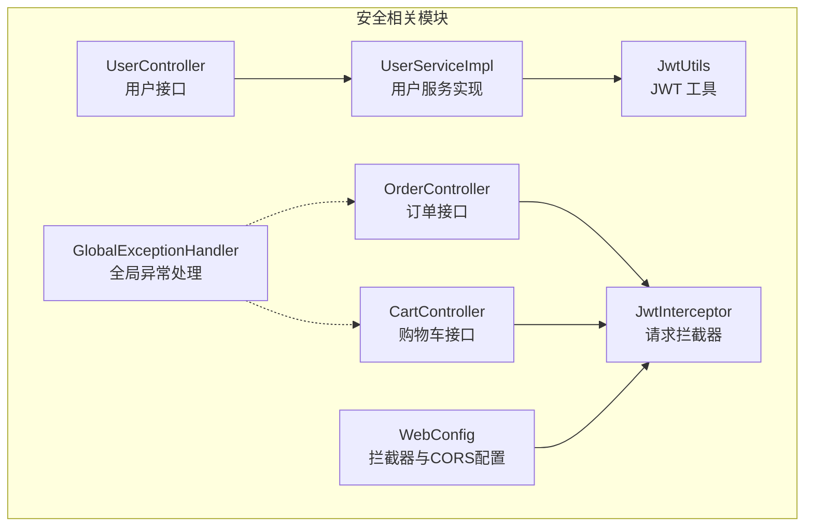
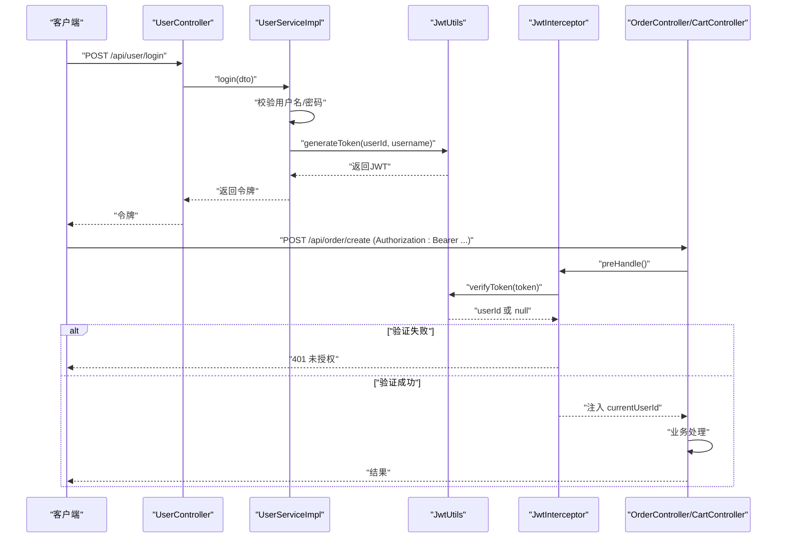
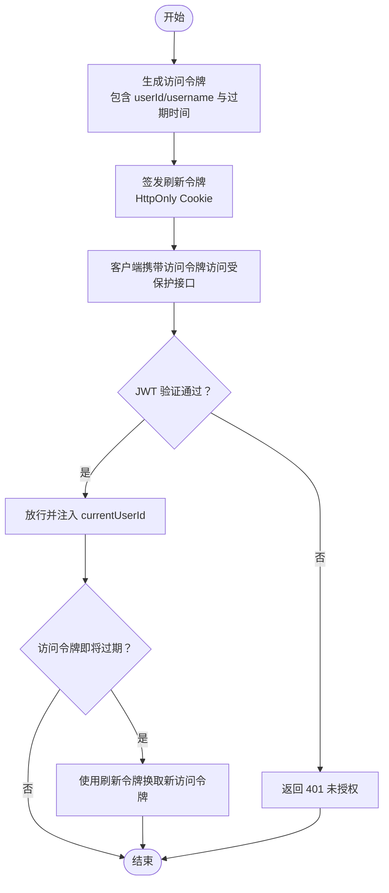
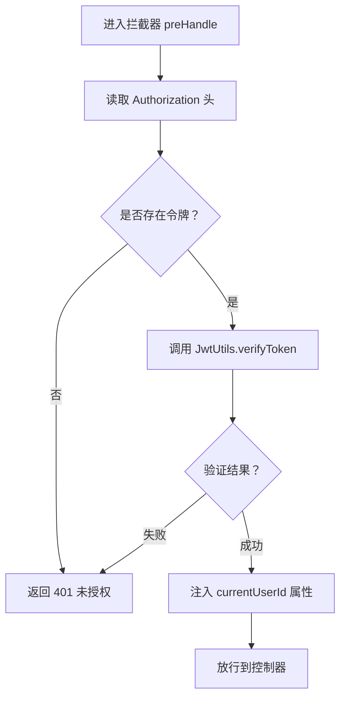
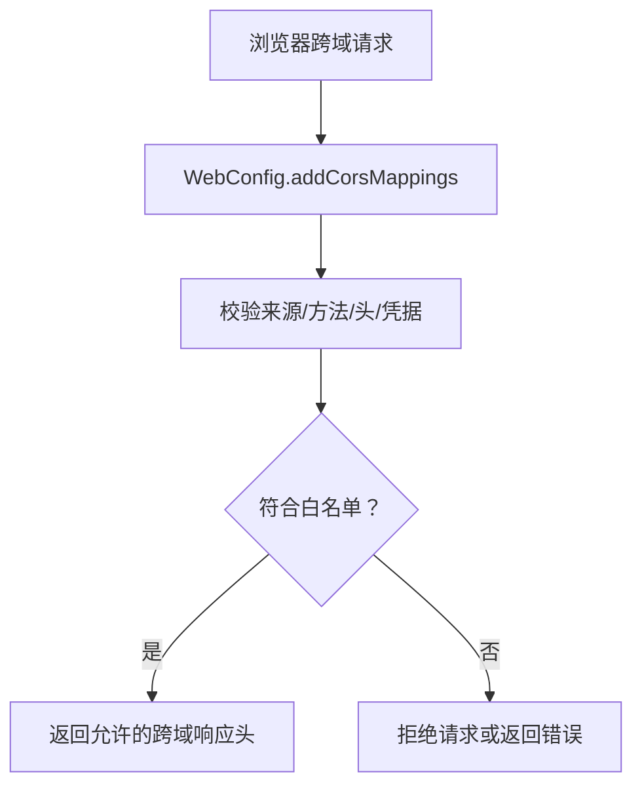
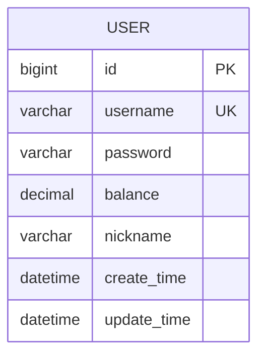
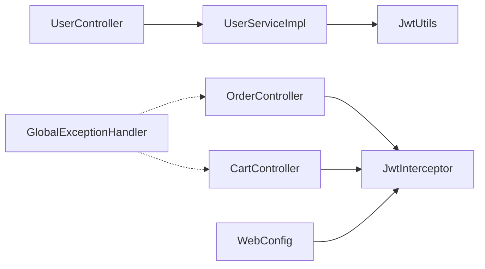

# 安全架构设计

<cite>
**本文引用的文件**
- [JwtUtils.java](file://src/main/java/com/bohao/globalshop/common/JwtUtils.java)
- [JwtInterceptor.java](file://src/main/java/com/bohao/globalshop/interceptor/JwtInterceptor.java)
- [WebConfig.java](file://src/main/java/com/bohao/globalshop/config/WebConfig.java)
- [RedisConfig.java](file://src/main/java/com/bohao/globalshop/config/RedisConfig.java)
- [CacheManagerConfig.java](file://src/main/java/com/bohao/globalshop/config/CacheManagerConfig.java)
- [UserService.java](file://src/main/java/com/bohao/globalshop/service/UserService.java)
- [UserServiceImpl.java](file://src/main/java/com/bohao/globalshop/service/impl/UserServiceImpl.java)
- [UserController.java](file://src/main/java/com/bohao/globalshop/controller/UserController.java)
- [OrderController.java](file://src/main/java/com/bohao/globalshop/controller/OrderController.java)
- [CartController.java](file://src/main/java/com/bohao/globalshop/controller/CartController.java)
- [UserLoginDto.java](file://src/main/java/com/bohao/globalshop/dto/UserLoginDto.java)
- [UserRegisterDto.java](file://src/main/java/com/bohao/globalshop/dto/UserRegisterDto.java)
- [User.java](file://src/main/java/com/bohao/globalshop/entity/User.java)
- [UserMapper.java](file://src/main/java/com/bohao/globalshop/mapper/UserMapper.java)
- [GlobalExceptionHandler.java](file://src/main/java/com/bohao/globalshop/exception/GlobalExceptionHandler.java)
- [application.yml](file://src/main/resources/application.yml)
</cite>

## 目录
1. [引言](#引言)
2. [项目结构](#项目结构)
3. [核心组件](#核心组件)
4. [架构总览](#架构总览)
5. [详细组件分析](#详细组件分析)
6. [依赖分析](#依赖分析)
7. [性能考量](#性能考量)
8. [故障排查指南](#故障排查指南)
9. [结论](#结论)
10. [附录](#附录)

## 引言
本文件面向安全工程师与架构师，系统化梳理该全球购物平台的安全架构设计，重点覆盖以下方面：
- JWT 令牌认证机制：生成、验证与刷新策略建议
- 请求拦截器与权限控制：拦截路径、放行规则与上下文注入
- 跨域资源共享（CORS）配置与生产安全建议
- 密码加密、会话管理与 CSRF 防护最佳实践
- 安全漏洞防范与攻击检测实施方案
- 结合现有代码的落地实现与改进建议

## 项目结构
项目采用标准 Spring Boot 分层结构，安全相关的关键模块集中在以下位置：
- common：通用工具（JWT 工具）
- interceptor：请求拦截器（JWT 权限校验）
- config：Web MVC 配置（拦截器注册、CORS）
- controller：受保护资源的入口（订单、购物车等）
- service/impl：业务服务（用户注册/登录、令牌签发）
- exception：全局异常处理
- resources：应用配置（数据库、Redis、Elasticsearch、RabbitMQ 等）

**图表来源**
- [JwtUtils.java:1-41](file://src/main/java/com/bohao/globalshop/common/JwtUtils.java#L1-L41)
- [JwtInterceptor.java:1-36](file://src/main/java/com/bohao/globalshop/interceptor/JwtInterceptor.java#L1-L36)
- [WebConfig.java:1-37](file://src/main/java/com/bohao/globalshop/config/WebConfig.java#L1-L37)
- [UserServiceImpl.java:1-68](file://src/main/java/com/bohao/globalshop/service/impl/UserServiceImpl.java#L1-L68)
- [UserController.java:1-29](file://src/main/java/com/bohao/globalshop/controller/UserController.java#L1-L29)
- [OrderController.java:1-59](file://src/main/java/com/bohao/globalshop/controller/OrderController.java#L1-L59)
- [CartController.java:1-41](file://src/main/java/com/bohao/globalshop/controller/CartController.java#L1-L41)
- [GlobalExceptionHandler.java:1-43](file://src/main/java/com/bohao/globalshop/exception/GlobalExceptionHandler.java#L1-L43)

**章节来源**
- [WebConfig.java:1-37](file://src/main/java/com/bohao/globalshop/config/WebConfig.java#L1-L37)
- [application.yml:1-42](file://src/main/resources/application.yml#L1-L42)

## 核心组件
- JWT 工具：负责令牌生成与验证，包含密钥与有效期常量
- 请求拦截器：从请求头读取 Authorization，调用 JWT 工具验证，失败返回 401；成功将用户标识注入请求属性
- Web 配置：注册拦截器并设置拦截路径与排除路径；配置 CORS 映射与允许的头/方法/凭据
- 用户服务：注册时使用 BCrypt 加密存储密码；登录时校验密码并签发 JWT
- 控制器：受保护接口通过拦截器注入 currentUserId，用于后续业务操作
- 全局异常处理：统一异常响应格式，便于前端识别与提示

**章节来源**
- [JwtUtils.java:1-41](file://src/main/java/com/bohao/globalshop/common/JwtUtils.java#L1-L41)
- [JwtInterceptor.java:1-36](file://src/main/java/com/bohao/globalshop/interceptor/JwtInterceptor.java#L1-L36)
- [WebConfig.java:1-37](file://src/main/java/com/bohao/globalshop/config/WebConfig.java#L1-L37)
- [UserServiceImpl.java:1-68](file://src/main/java/com/bohao/globalshop/service/impl/UserServiceImpl.java#L1-L68)
- [UserController.java:1-29](file://src/main/java/com/bohao/globalshop/controller/UserController.java#L1-L29)
- [OrderController.java:1-59](file://src/main/java/com/bohao/globalshop/controller/OrderController.java#L1-L59)
- [CartController.java:1-41](file://src/main/java/com/bohao/globalshop/controller/CartController.java#L1-L41)
- [GlobalExceptionHandler.java:1-43](file://src/main/java/com/bohao/globalshop/exception/GlobalExceptionHandler.java#L1-L43)

## 架构总览
下图展示从客户端到后端的典型交互流程，包括认证、授权与异常处理：

**图表来源**
- [UserController.java:1-29](file://src/main/java/com/bohao/globalshop/controller/UserController.java#L1-L29)
- [UserServiceImpl.java:1-68](file://src/main/java/com/bohao/globalshop/service/impl/UserServiceImpl.java#L1-L68)
- [JwtUtils.java:1-41](file://src/main/java/com/bohao/globalshop/common/JwtUtils.java#L1-L41)
- [JwtInterceptor.java:1-36](file://src/main/java/com/bohao/globalshop/interceptor/JwtInterceptor.java#L1-L36)
- [OrderController.java:1-59](file://src/main/java/com/bohao/globalshop/controller/OrderController.java#L1-L59)
- [CartController.java:1-41](file://src/main/java/com/bohao/globalshop/controller/CartController.java#L1-L41)

## 详细组件分析

### JWT 令牌认证机制
- 令牌生成
  - 使用 HMAC256 算法，包含用户标识与用户名声明，设置固定有效期
  - 返回字符串形式的 JWT，由客户端在后续请求头 Authorization 中携带
- 令牌验证
  - 从请求头提取 Authorization，调用验证方法
  - 成功则返回用户标识；失败返回 null，拦截器按 401 拒绝
- 刷新策略建议
  - 当前实现未提供刷新接口。建议引入“刷新令牌”（Refresh Token）与“访问令牌”（Access Token）双令牌模型：
    - 访问令牌短期有效（如 15 分钟），用于日常请求
    - 刷新令牌长期有效但受限存储（如 HttpOnly Cookie），仅在登录时发放
    - 服务端维护刷新令牌的黑名单/白名单与失效时间，刷新时校验并签发新的访问令牌
  - 令牌撤销：结合 Redis 存储已吊销的访问令牌集合，拦截器在每次请求检查

**图表来源**
- [JwtUtils.java:1-41](file://src/main/java/com/bohao/globalshop/common/JwtUtils.java#L1-L41)
- [JwtInterceptor.java:1-36](file://src/main/java/com/bohao/globalshop/interceptor/JwtInterceptor.java#L1-L36)

**章节来源**
- [JwtUtils.java:1-41](file://src/main/java/com/bohao/globalshop/common/JwtUtils.java#L1-L41)
- [JwtInterceptor.java:1-36](file://src/main/java/com/bohao/globalshop/interceptor/JwtInterceptor.java#L1-L36)

### 请求拦截器与权限控制
- 拦截范围
  - 对 /api/order/**、/api/cart/**、/api/merchant/** 接口启用拦截
  - 放行 /api/user/login、/api/user/register、/api/product/** 等公开接口
- 校验流程
  - 从 Authorization 头提取令牌
  - 调用 JWT 工具验证，失败返回 401
  - 成功将 currentUserId 注入请求属性，供控制器读取
- 权限细化建议
  - 当前拦截器仅做“是否登录”的判定。可扩展为基于角色/资源的细粒度授权：
    - 在拦截器中解析用户角色与目标资源权限，拒绝无权限访问
    - 对敏感操作（如删除、修改他人资源）增加二次校验

**图表来源**
- [JwtInterceptor.java:1-36](file://src/main/java/com/bohao/globalshop/interceptor/JwtInterceptor.java#L1-L36)
- [WebConfig.java:1-37](file://src/main/java/com/bohao/globalshop/config/WebConfig.java#L1-L37)

**章节来源**
- [JwtInterceptor.java:1-36](file://src/main/java/com/bohao/globalshop/interceptor/JwtInterceptor.java#L1-L36)
- [WebConfig.java:1-37](file://src/main/java/com/bohao/globalshop/config/WebConfig.java#L1-L37)

### 跨域资源共享（CORS）配置与安全考虑
- 当前配置
  - 允许所有路径映射，开发阶段允许所有来源，允许 GET/POST/PUT/DELETE，允许指定请求头，允许携带凭据
- 生产安全建议
  - 限定 allowedOriginPatterns 为具体前端域名（例如 https://yourdomain.com）
  - 最小化 allowedMethods 与 allowedHeaders
  - 严格控制 allowCredentials 的使用，避免在多域名场景下泄露凭据
  - 对于携带 Cookie 的跨域请求，确保 SameSite 与 Secure 属性合理设置（若使用 Cookie 作为认证介质）

**图表来源**
- [WebConfig.java:25-33](file://src/main/java/com/bohao/globalshop/config/WebConfig.java#L25-L33)

**章节来源**
- [WebConfig.java:25-33](file://src/main/java/com/bohao/globalshop/config/WebConfig.java#L25-L33)

### 密码加密、会话管理与 CSRF 防护
- 密码加密
  - 注册时使用 BCrypt 对密码进行不可逆加密存储
  - 登录时使用 matches 进行密码比对，不涉及解密
- 会话管理
  - 当前采用无状态 JWT，未使用传统 Session
  - 建议配合刷新令牌与黑名单机制，实现令牌撤销与强制登出
- CSRF 防护
  - 由于使用 JWT，无需传统 CSRF 防护
  - 若未来引入 Cookie 作为认证介质，需：
    - 启用 SameSite=Strict/Lax
    - 使用 HttpOnly 防止 XSS 获取 Cookie
    - 为关键操作添加同步令牌（CSRF Token）并与后端校验

**章节来源**
- [UserServiceImpl.java:32-61](file://src/main/java/com/bohao/globalshop/service/impl/UserServiceImpl.java#L32-L61)
- [User.java:1-23](file://src/main/java/com/bohao/globalshop/entity/User.java#L1-L23)
- [UserMapper.java:1-11](file://src/main/java/com/bohao/globalshop/mapper/UserMapper.java#L1-L11)

### 安全漏洞防范与攻击检测实施
- 常见风险与对策
  - 令牌泄露：缩短访问令牌有效期、启用刷新令牌与黑名单、监控异常登录与频繁请求
  - 点击劫持：设置 X-Frame-Options 与 CSP
  - XSS：输入校验与输出编码、内容安全策略、HttpOnly Cookie
  - 暴力破解：登录失败次数限制、账户锁定、验证码
  - 重放攻击：在 JWT 中加入随机 nonce 与时间窗口校验
- 攻击检测建议
  - 日志审计：记录登录、令牌签发/撤销、高危操作
  - 实时风控：基于 IP/设备/地理位置的异常检测
  - 漏洞扫描：定期对依赖与配置进行安全扫描

[本节为通用安全指导，不直接分析具体文件]

### 数据模型与缓存安全
- 用户实体包含用户名、密码、昵称与余额等字段，密码以加密形式存储
- 缓存与布隆过滤器
  - 本地缓存（Caffeine）与 Redis 布隆过滤器用于商品查询优化
  - 建议对敏感数据（如用户余额）避免缓存明文，或采用加密存储

**图表来源**
- [User.java:1-23](file://src/main/java/com/bohao/globalshop/entity/User.java#L1-L23)

**章节来源**
- [User.java:1-23](file://src/main/java/com/bohao/globalshop/entity/User.java#L1-L23)
- [CacheManagerConfig.java:1-81](file://src/main/java/com/bohao/globalshop/config/CacheManagerConfig.java#L1-L81)
- [RedisConfig.java:1-46](file://src/main/java/com/bohao/globalshop/config/RedisConfig.java#L1-L46)

## 依赖分析
- 组件耦合
  - 控制器依赖服务层；服务层依赖 JWT 工具与数据访问层
  - 拦截器依赖 JWT 工具；Web 配置注册拦截器并设置拦截范围
- 外部依赖
  - 数据源、Redis、Elasticsearch、RabbitMQ 等基础设施在配置文件中定义
- 潜在风险
  - CORS 在生产环境过于宽松，应限制来源与凭据使用
  - 密钥与连接信息建议通过环境变量或配置中心管理

**图表来源**
- [UserController.java:1-29](file://src/main/java/com/bohao/globalshop/controller/UserController.java#L1-L29)
- [UserServiceImpl.java:1-68](file://src/main/java/com/bohao/globalshop/service/impl/UserServiceImpl.java#L1-L68)
- [JwtUtils.java:1-41](file://src/main/java/com/bohao/globalshop/common/JwtUtils.java#L1-L41)
- [OrderController.java:1-59](file://src/main/java/com/bohao/globalshop/controller/OrderController.java#L1-L59)
- [CartController.java:1-41](file://src/main/java/com/bohao/globalshop/controller/CartController.java#L1-L41)
- [JwtInterceptor.java:1-36](file://src/main/java/com/bohao/globalshop/interceptor/JwtInterceptor.java#L1-L36)
- [WebConfig.java:1-37](file://src/main/java/com/bohao/globalshop/config/WebConfig.java#L1-L37)
- [GlobalExceptionHandler.java:1-43](file://src/main/java/com/bohao/globalshop/exception/GlobalExceptionHandler.java#L1-L43)

**章节来源**
- [application.yml:1-42](file://src/main/resources/application.yml#L1-L42)

## 性能考量
- JWT 无状态特性降低服务器负载，适合水平扩展
- 缓存与布隆过滤器提升商品查询性能，建议对热点数据设置合理的过期策略
- 登录与注册接口应结合限流与验证码，防止暴力破解

[本节提供一般性建议，不直接分析具体文件]

## 故障排查指南
- 401 未授权
  - 检查客户端是否正确携带 Authorization 头
  - 核对令牌是否过期或签名无效
- 登录失败
  - 确认用户名存在且密码匹配（BCrypt）
- CORS 问题
  - 核对 allowedOriginPatterns、allowedMethods、allowedHeaders 与 allowCredentials
- 全局异常
  - 查看统一异常处理器返回的错误信息与日志

**章节来源**
- [JwtInterceptor.java:18-30](file://src/main/java/com/bohao/globalshop/interceptor/JwtInterceptor.java#L18-L30)
- [UserServiceImpl.java:49-61](file://src/main/java/com/bohao/globalshop/service/impl/UserServiceImpl.java#L49-L61)
- [WebConfig.java:25-33](file://src/main/java/com/bohao/globalshop/config/WebConfig.java#L25-L33)
- [GlobalExceptionHandler.java:1-43](file://src/main/java/com/bohao/globalshop/exception/GlobalExceptionHandler.java#L1-L43)

## 结论
该平台已建立基于 JWT 的无状态认证体系，配合拦截器实现受保护接口的统一鉴权，并通过全局异常处理提升可观测性。建议在生产环境中完善 CORS 限制、引入刷新令牌与黑名单、强化 CSRF 防护与会话管理，并持续进行安全扫描与攻击检测，以构建更稳健的安全架构。

## 附录
- 关键 DTO 与实体
  - 用户登录/注册 DTO：用于接收前端参数
  - 用户实体：包含密码字段，需确保加密存储
- 配置要点
  - 数据源、Redis、Elasticsearch、RabbitMQ 等外部依赖在配置文件中集中管理

**章节来源**
- [UserLoginDto.java:1-10](file://src/main/java/com/bohao/globalshop/dto/UserLoginDto.java#L1-L10)
- [UserRegisterDto.java:1-10](file://src/main/java/com/bohao/globalshop/dto/UserRegisterDto.java#L1-L10)
- [User.java:1-23](file://src/main/java/com/bohao/globalshop/entity/User.java#L1-L23)
- [application.yml:1-42](file://src/main/resources/application.yml#L1-L42)