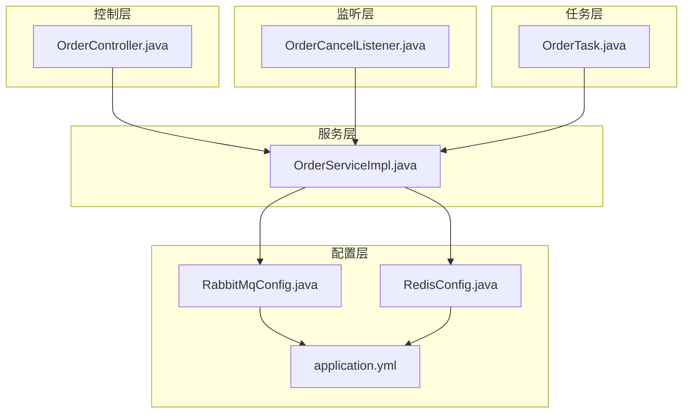
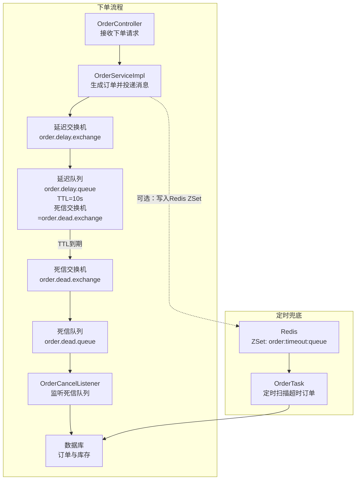
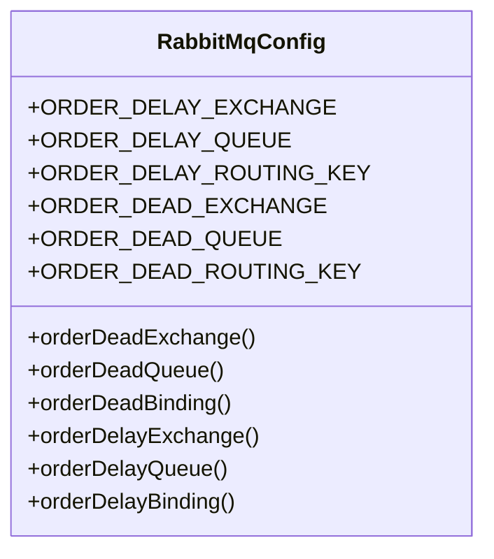
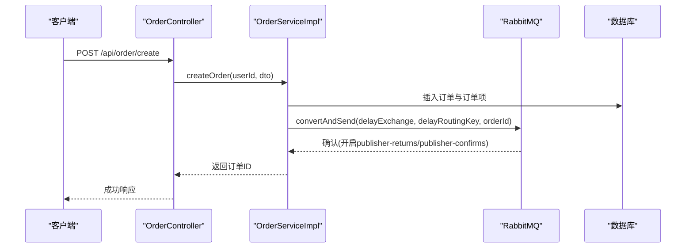
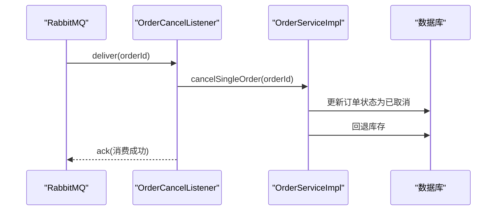
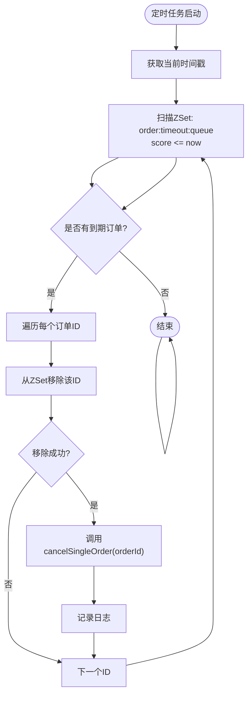
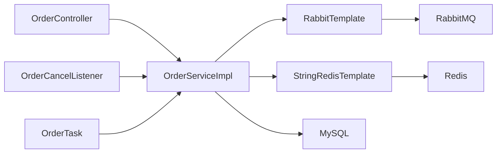

# 异步处理机制

<cite>
**本文引用的文件**
- [RabbitMqConfig.java](file://src/main/java/com/bohao/globalshop/config/RabbitMqConfig.java)
- [OrderCancelListener.java](file://src/main/java/com/bohao/globalshop/listener/OrderCancelListener.java)
- [OrderTask.java](file://src/main/java/com/bohao/globalshop/task/OrderTask.java)
- [OrderServiceImpl.java](file://src/main/java/com/bohao/globalshop/service/impl/OrderServiceImpl.java)
- [OrderController.java](file://src/main/java/com/bohao/globalshop/controller/OrderController.java)
- [application.yml](file://src/main/resources/application.yml)
- [RedisConfig.java](file://src/main/java/com/bohao/globalshop/config/RedisConfig.java)
- [GlobalShopApplication.java](file://src/main/java/com/bohao/globalshop/GlobalShopApplication.java)
</cite>

## 目录
1. [引言](#引言)
2. [项目结构](#项目结构)
3. [核心组件](#核心组件)
4. [架构总览](#架构总览)
5. [详细组件分析](#详细组件分析)
6. [依赖分析](#依赖分析)
7. [性能考虑](#性能考虑)
8. [故障排查指南](#故障排查指南)
9. [结论](#结论)
10. [附录](#附录)

## 引言
本文件面向全球购物平台的异步处理机制，围绕基于RabbitMQ的消息队列架构进行系统性梳理，重点覆盖以下方面：
- 消息生产者、消费者与消息路由机制
- 订单超时取消的异步处理流程与可靠性保障
- 定时任务调度机制与任务执行策略
- 消息序列化、持久化与事务处理的实现细节
- 消息监控、重试机制与死信队列的配置指南
- 为开发者提供异步架构的设计思路与实现参考

## 项目结构
本项目采用Spring Boot标准目录结构，异步处理相关的关键模块分布如下：
- 配置层：RabbitMQ与Redis配置
- 控制层：订单相关接口
- 服务层：订单业务逻辑与异步编排
- 监听层：RabbitMQ死信监听器
- 任务层：基于Redis的定时扫描任务

图表来源
- [RabbitMqConfig.java:1-61](file://src/main/java/com/bohao/globalshop/config/RabbitMqConfig.java#L1-L61)
- [OrderController.java:1-59](file://src/main/java/com/bohao/globalshop/controller/OrderController.java#L1-L59)
- [OrderServiceImpl.java:1-330](file://src/main/java/com/bohao/globalshop/service/impl/OrderServiceImpl.java#L1-L330)
- [OrderCancelListener.java:1-30](file://src/main/java/com/bohao/globalshop/listener/OrderCancelListener.java#L1-L30)
- [OrderTask.java:1-44](file://src/main/java/com/bohao/globalshop/task/OrderTask.java#L1-L44)
- [application.yml:1-42](file://src/main/resources/application.yml#L1-L42)
- [RedisConfig.java:1-46](file://src/main/java/com/bohao/globalshop/config/RedisConfig.java#L1-L46)

章节来源
- [RabbitMqConfig.java:1-61](file://src/main/java/com/bohao/globalshop/config/RabbitMqConfig.java#L1-L61)
- [application.yml:1-42](file://src/main/resources/application.yml#L1-L42)

## 核心组件
- RabbitMQ配置与路由
  - 定义延迟交换机与队列、死信交换机与队列，以及绑定关系
  - 关键参数：TTL（消息存活时间）、死信交换机与路由键
- 订单服务与消息生产
  - 下单成功后，将订单ID投递到延迟交换机，实现“下单即返回，异步超时取消”
- 死信监听器
  - 监听死信队列，触发订单取消与库存回退
- 定时任务
  - 基于Redis有序集合的定时扫描，实现“兜底”的超时取消
- 应用启动与调度
  - 启用定时任务调度能力

章节来源
- [RabbitMqConfig.java:11-60](file://src/main/java/com/bohao/globalshop/config/RabbitMqConfig.java#L11-L60)
- [OrderServiceImpl.java:65-68](file://src/main/java/com/bohao/globalshop/service/impl/OrderServiceImpl.java#L65-L68)
- [OrderCancelListener.java:17-27](file://src/main/java/com/bohao/globalshop/listener/OrderCancelListener.java#L17-L27)
- [OrderTask.java:19-42](file://src/main/java/com/bohao/globalshop/task/OrderTask.java#L19-L42)
- [GlobalShopApplication.java:6-9](file://src/main/java/com/bohao/globalshop/GlobalShopApplication.java#L6-L9)

## 架构总览
整体异步架构由“消息生产—延迟路由—死信消费—定时兜底”构成，确保订单在超时未支付时可靠取消并回退库存。

图表来源
- [OrderController.java:19-24](file://src/main/java/com/bohao/globalshop/controller/OrderController.java#L19-L24)
- [OrderServiceImpl.java:65-68](file://src/main/java/com/bohao/globalshop/service/impl/OrderServiceImpl.java#L65-L68)
- [RabbitMqConfig.java:13-59](file://src/main/java/com/bohao/globalshop/config/RabbitMqConfig.java#L13-L59)
- [OrderCancelListener.java:17-27](file://src/main/java/com/bohao/globalshop/listener/OrderCancelListener.java#L17-L27)
- [OrderTask.java:19-42](file://src/main/java/com/bohao/globalshop/task/OrderTask.java#L19-L42)

## 详细组件分析

### RabbitMQ配置与消息路由
- 命名规范与常量定义：通过常量统一管理交换机、队列与路由键，避免拼写错误
- 死信组件：定义死信交换机与队列，并建立绑定关系
- 延迟组件：定义延迟交换机；延迟队列配置死信交换机、路由键与TTL
- 绑定关系：将死信队列绑定到延迟交换机，形成“TTL到期后进入死信队列”的闭环

图表来源
- [RabbitMqConfig.java:11-60](file://src/main/java/com/bohao/globalshop/config/RabbitMqConfig.java#L11-L60)

章节来源
- [RabbitMqConfig.java:11-60](file://src/main/java/com/bohao/globalshop/config/RabbitMqConfig.java#L11-L60)

### 订单服务与消息生产
- 下单流程：生成主订单与订单明细，随后将订单ID投递至延迟交换机
- 消息发送：使用RabbitTemplate将订单ID作为消息体发送
- 数据库事务：下单与扣库存在同一个事务中，保证一致性

图表来源
- [OrderController.java:19-24](file://src/main/java/com/bohao/globalshop/controller/OrderController.java#L19-L24)
- [OrderServiceImpl.java:40-81](file://src/main/java/com/bohao/globalshop/service/impl/OrderServiceImpl.java#L40-L81)
- [application.yml:35-37](file://src/main/resources/application.yml#L35-L37)

章节来源
- [OrderServiceImpl.java:40-81](file://src/main/java/com/bohao/globalshop/service/impl/OrderServiceImpl.java#L40-L81)
- [application.yml:35-37](file://src/main/resources/application.yml#L35-L37)

### 死信监听器与订单取消
- 监听机制：通过RabbitListener监听死信队列
- 处理逻辑：调用订单服务取消订单，完成状态变更与库存回退
- 异常处理：捕获异常并记录日志，避免默认重试导致的无限循环

图表来源
- [OrderCancelListener.java:17-27](file://src/main/java/com/bohao/globalshop/listener/OrderCancelListener.java#L17-L27)
- [OrderServiceImpl.java:240-260](file://src/main/java/com/bohao/globalshop/service/impl/OrderServiceImpl.java#L240-L260)

章节来源
- [OrderCancelListener.java:17-27](file://src/main/java/com/bohao/globalshop/listener/OrderCancelListener.java#L17-L27)
- [OrderServiceImpl.java:240-260](file://src/main/java/com/bohao/globalshop/service/impl/OrderServiceImpl.java#L240-L260)

### 定时任务与Redis兜底
- 定时扫描：每5秒扫描Redis ZSet中已到期的订单ID
- 并发控制：通过删除ZSet元素实现轻量级分布式锁，避免并发重复取消
- 业务处理：调用订单服务取消订单并回退库存
- 可选集成：下单时可同时将订单ID写入Redis ZSet，形成“消息队列+Redis定时”的双重保障

图表来源
- [OrderTask.java:19-42](file://src/main/java/com/bohao/globalshop/task/OrderTask.java#L19-L42)
- [OrderServiceImpl.java:240-260](file://src/main/java/com/bohao/globalshop/service/impl/OrderServiceImpl.java#L240-L260)

章节来源
- [OrderTask.java:19-42](file://src/main/java/com/bohao/globalshop/task/OrderTask.java#L19-L42)
- [OrderServiceImpl.java:240-260](file://src/main/java/com/bohao/globalshop/service/impl/OrderServiceImpl.java#L240-L260)

### 应用启动与调度启用
- 启用定时任务：通过@EnableScheduling启用Spring调度能力
- 应用入口：Spring Boot启动类

章节来源
- [GlobalShopApplication.java:6-9](file://src/main/java/com/bohao/globalshop/GlobalShopApplication.java#L6-L9)

## 依赖分析
- 组件耦合
  - 订单服务依赖RabbitTemplate与StringRedisTemplate，承担消息生产与Redis操作职责
  - 死信监听器依赖订单服务，负责消费死信并触发业务处理
  - 定时任务依赖RedisTemplate与订单服务，负责兜底扫描与取消
- 外部依赖
  - RabbitMQ：消息中间件，提供延迟与死信能力
  - Redis：ZSet用于定时扫描，Redisson用于分布式锁等高级特性
  - MySQL：订单与库存数据存储

图表来源
- [OrderController.java:19-24](file://src/main/java/com/bohao/globalshop/controller/OrderController.java#L19-L24)
- [OrderServiceImpl.java:36-36](file://src/main/java/com/bohao/globalshop/service/impl/OrderServiceImpl.java#L36-L36)
- [OrderCancelListener.java:14-14](file://src/main/java/com/bohao/globalshop/listener/OrderCancelListener.java#L14-L14)
- [OrderTask.java:16-17](file://src/main/java/com/bohao/globalshop/task/OrderTask.java#L16-L17)

章节来源
- [OrderServiceImpl.java:36-36](file://src/main/java/com/bohao/globalshop/service/impl/OrderServiceImpl.java#L36-L36)
- [OrderCancelListener.java:14-14](file://src/main/java/com/bohao/globalshop/listener/OrderCancelListener.java#L14-L14)
- [OrderTask.java:16-17](file://src/main/java/com/bohao/globalshop/task/OrderTask.java#L16-L17)

## 性能考虑
- 消息确认与持久化
  - 开启发送方确认与返回，确保消息不丢失
  - 队列与交换机声明为持久化，结合TTL与死信实现可靠超时取消
- 并发与幂等
  - Redis ZSet删除操作充当轻量级分布式锁，避免重复取消
  - 死信监听器内部捕获异常，避免默认重试导致的风暴
- 资源隔离
  - 将超时取消逻辑拆分为消息队列与定时任务两条路径，降低单一故障点风险

章节来源
- [application.yml:35-37](file://src/main/resources/application.yml#L35-L37)
- [RabbitMqConfig.java:46-53](file://src/main/java/com/bohao/globalshop/config/RabbitMqConfig.java#L46-L53)
- [OrderTask.java:29-39](file://src/main/java/com/bohao/globalshop/task/OrderTask.java#L29-L39)
- [OrderCancelListener.java:23-26](file://src/main/java/com/bohao/globalshop/listener/OrderCancelListener.java#L23-L26)

## 故障排查指南
- 消息未达死信队列
  - 检查延迟队列是否正确配置死信交换机与路由键
  - 确认TTL设置是否合理，测试环境建议缩短TTL以便验证
- 死信监听器未消费
  - 确认监听器所在队列与绑定关系正确
  - 检查监听方法签名与消息类型匹配
- 定时任务未触发
  - 确认应用已启用@EnableScheduling
  - 检查Redis连接与ZSet数据结构
- 重复取消或并发问题
  - 核对Redis ZSet删除逻辑是否成功
  - 检查订单状态是否已在其他路径被修改

章节来源
- [RabbitMqConfig.java:46-59](file://src/main/java/com/bohao/globalshop/config/RabbitMqConfig.java#L46-L59)
- [OrderCancelListener.java:17-27](file://src/main/java/com/bohao/globalshop/listener/OrderCancelListener.java#L17-L27)
- [OrderTask.java:19-42](file://src/main/java/com/bohao/globalshop/task/OrderTask.java#L19-L42)
- [GlobalShopApplication.java:6-9](file://src/main/java/com/bohao/globalshop/GlobalShopApplication.java#L6-L9)

## 结论
本项目通过“消息队列延迟+死信+定时任务Redis兜底”的组合，构建了高可靠、低耦合的订单超时取消机制。消息层确保下单即返回、异步处理超时；定时任务层提供兜底保障，二者协同提升系统的可用性与一致性。开发者可在此基础上扩展监控、告警与更细粒度的重试策略。

## 附录
- 配置要点
  - RabbitMQ：启用publisher-returns与publisher-confirms，确保消息可靠投递
  - Redis：ZSet用于定时扫描，注意键命名与过期时间设置
- 最佳实践
  - 优先使用消息队列延迟机制，Redis定时仅作为兜底
  - 对关键业务操作增加幂等校验与分布式锁
  - 建立完善的日志与监控体系，便于定位问题