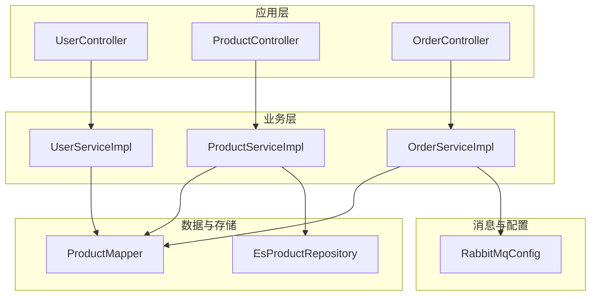
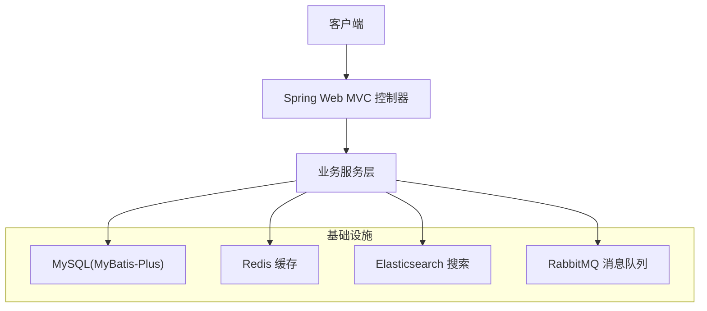
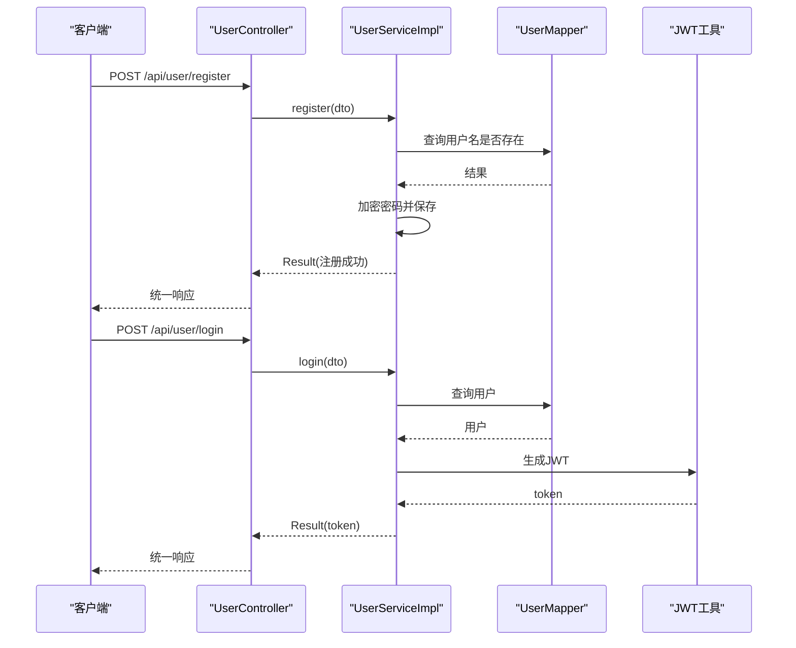
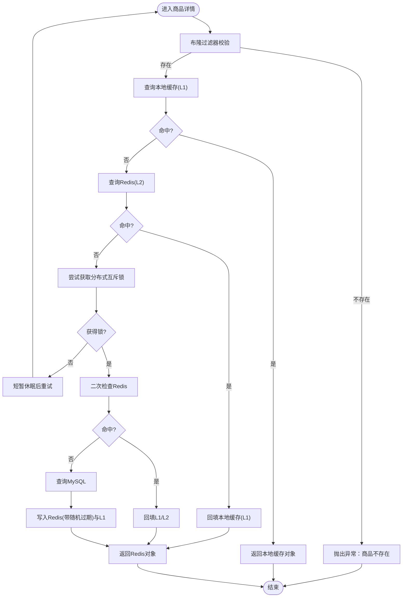
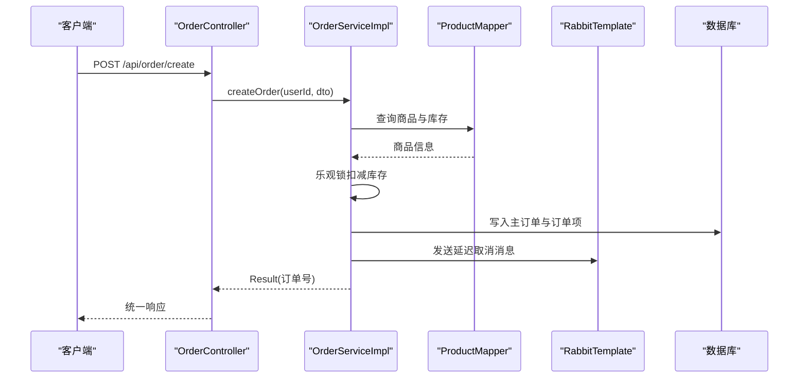
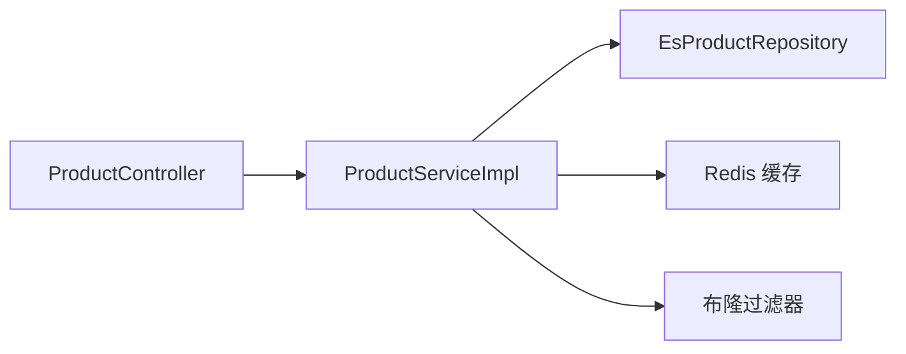
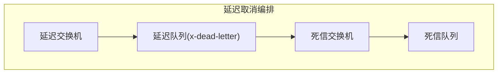
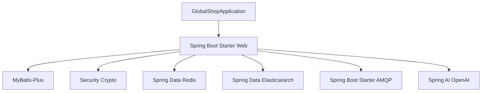

# 微服务化设计思路

<cite>
**本文引用的文件**
- [GlobalShopApplication.java](file://src/main/java/com/bohao/globalshop/GlobalShopApplication.java)
- [application.yml](file://src/main/resources/application.yml)
- [pom.xml](file://pom.xml)
- [UserController.java](file://src/main/java/com/bohao/globalshop/controller/UserController.java)
- [ProductController.java](file://src/main/java/com/bohao/globalshop/controller/ProductController.java)
- [OrderController.java](file://src/main/java/com/bohao/globalshop/controller/OrderController.java)
- [UserService.java](file://src/main/java/com/bohao/globalshop/service/UserService.java)
- [ProductService.java](file://src/main/java/com/bohao/globalshop/service/ProductService.java)
- [OrderService.java](file://src/main/java/com/bohao/globalshop/service/OrderService.java)
- [UserServiceImpl.java](file://src/main/java/com/bohao/globalshop/service/impl/UserServiceImpl.java)
- [ProductServiceImpl.java](file://src/main/java/com/bohao/globalshop/service/impl/ProductServiceImpl.java)
- [OrderServiceImpl.java](file://src/main/java/com/bohao/globalshop/service/impl/OrderServiceImpl.java)
- [RabbitMqConfig.java](file://src/main/java/com/bohao/globalshop/config/RabbitMqConfig.java)
- [EsProductRepository.java](file://src/main/java/com/bohao/globalshop/repository/EsProductRepository.java)
- [Product.java](file://src/main/java/com/bohao/globalshop/entity/Product.java)
- [TradeOrder.java](file://src/main/java/com/bohao/globalshop/entity/TradeOrder.java)
- [JwtUtils.java](file://src/main/java/com/bohao/globalshop/common/JwtUtils.java)
</cite>

## 目录
1. [简介](#简介)
2. [项目结构](#项目结构)
3. [核心组件](#核心组件)
4. [架构总览](#架构总览)
5. [详细组件分析](#详细组件分析)
6. [依赖分析](#依赖分析)
7. [性能考量](#性能考量)
8. [故障排查指南](#故障排查指南)
9. [结论](#结论)
10. [附录](#附录)

## 简介
本指导文档面向全球购物平台的微服务化演进，基于现有单体应用的代码结构与运行特性，提出从单体到微服务的拆分思路、模块边界定义、服务间通信机制、API网关与负载均衡策略、服务发现与配置中心、监控与告警集成方案，并给出拆分时机判断与实施步骤，帮助架构师做出科学决策与落地实践。

## 项目结构
当前工程采用Spring Boot单体架构，主要模块包括：
- 控制层：用户、商品、订单等REST控制器
- 业务层：用户、商品、订单服务接口与实现
- 数据访问层：MyBatis-Plus Mapper接口
- 搜索与缓存：Elasticsearch仓库与Redis缓存
- 消息与异步：RabbitMQ延迟队列与死信队列
- 配置与启动：Spring Boot入口、YAML配置、依赖管理

图表来源
- [UserController.java:1-29](file://src/main/java/com/bohao/globalshop/controller/UserController.java#L1-L29)
- [ProductController.java:1-101](file://src/main/java/com/bohao/globalshop/controller/ProductController.java#L1-L101)
- [OrderController.java:1-59](file://src/main/java/com/bohao/globalshop/controller/OrderController.java#L1-L59)
- [UserServiceImpl.java:1-68](file://src/main/java/com/bohao/globalshop/service/impl/UserServiceImpl.java#L1-L68)
- [ProductServiceImpl.java:1-194](file://src/main/java/com/bohao/globalshop/service/impl/ProductServiceImpl.java#L1-L194)
- [OrderServiceImpl.java:1-330](file://src/main/java/com/bohao/globalshop/service/impl/OrderServiceImpl.java#L1-L330)
- [ProductMapper.java:1-10](file://src/main/java/com/bohao/globalshop/mapper/ProductMapper.java#L1-L10)
- [EsProductRepository.java:1-13](file://src/main/java/com/bohao/globalshop/repository/EsProductRepository.java#L1-L13)
- [RabbitMqConfig.java:1-61](file://src/main/java/com/bohao/globalshop/config/RabbitMqConfig.java#L1-L61)

章节来源
- [GlobalShopApplication.java:1-18](file://src/main/java/com/bohao/globalshop/GlobalShopApplication.java#L1-L18)
- [application.yml:1-42](file://src/main/resources/application.yml#L1-L42)
- [pom.xml:1-148](file://pom.xml#L1-L148)

## 核心组件
- 用户域：注册、登录、鉴权令牌发放
- 商品域：商品列表、详情、评价、全文检索与同步
- 订单域：下单、支付、拆单、取消、确认收货、评价
- 基础设施：Redis缓存、Elasticsearch搜索、RabbitMQ异步编排

章节来源
- [UserController.java:1-29](file://src/main/java/com/bohao/globalshop/controller/UserController.java#L1-L29)
- [ProductController.java:1-101](file://src/main/java/com/bohao/globalshop/controller/ProductController.java#L1-L101)
- [OrderController.java:1-59](file://src/main/java/com/bohao/globalshop/controller/OrderController.java#L1-L59)
- [UserService.java:1-12](file://src/main/java/com/bohao/globalshop/service/UserService.java#L1-L12)
- [ProductService.java:1-19](file://src/main/java/com/bohao/globalshop/service/ProductService.java#L1-L19)
- [OrderService.java:1-32](file://src/main/java/com/bohao/globalshop/service/OrderService.java#L1-L32)

## 架构总览
单体应用通过REST接口对外提供能力，内部以服务层聚合业务逻辑，持久化层对接MySQL，缓存层对接Redis，搜索层对接Elasticsearch，消息层通过RabbitMQ实现延迟取消等异步编排。

图表来源
- [application.yml:5-18](file://src/main/resources/application.yml#L5-L18)
- [RabbitMqConfig.java:10-61](file://src/main/java/com/bohao/globalshop/config/RabbitMqConfig.java#L10-L61)
- [EsProductRepository.java:1-13](file://src/main/java/com/bohao/globalshop/repository/EsProductRepository.java#L1-L13)

## 详细组件分析

### 用户域（UserController → UserServiceImpl）
- 控制器负责接收请求、注入服务并返回统一结果包装
- 服务实现包含用户注册（幂等检查、密码加密）、登录（凭据校验、JWT签发）

图表来源
- [UserController.java:19-27](file://src/main/java/com/bohao/globalshop/controller/UserController.java#L19-L27)
- [UserServiceImpl.java:20-66](file://src/main/java/com/bohao/globalshop/service/impl/UserServiceImpl.java#L20-L66)
- [JwtUtils.java:17-39](file://src/main/java/com/bohao/globalshop/common/JwtUtils.java#L17-L39)

章节来源
- [UserController.java:1-29](file://src/main/java/com/bohao/globalshop/controller/UserController.java#L1-L29)
- [UserServiceImpl.java:1-68](file://src/main/java/com/bohao/globalshop/service/impl/UserServiceImpl.java#L1-L68)
- [JwtUtils.java:1-41](file://src/main/java/com/bohao/globalshop/common/JwtUtils.java#L1-L41)

### 商品域（ProductController → ProductServiceImpl）
- 控制器提供商品列表、详情、评价查询、ES全量同步与检索
- 服务实现包含：
  - 商品列表与店铺关联的批量查询优化
  - 商品详情的三级缓存（布隆过滤器→本地缓存→分布式缓存）与并发保护
  - 评价列表的用户信息脱敏处理

图表来源
- [ProductServiceImpl.java:128-192](file://src/main/java/com/bohao/globalshop/service/impl/ProductServiceImpl.java#L128-L192)

章节来源
- [ProductController.java:1-101](file://src/main/java/com/bohao/globalshop/controller/ProductController.java#L1-L101)
- [ProductServiceImpl.java:1-194](file://src/main/java/com/bohao/globalshop/service/impl/ProductServiceImpl.java#L1-L194)

### 订单域（OrderController → OrderServiceImpl）
- 控制器提供下单、我的订单、购物车结算、支付、取消、确认收货、评价提交
- 服务实现包含：
  - 下单：库存乐观锁、订单与订单项写入、RabbitMQ延迟取消
  - 支付：用户余额校验与扣款、状态变更
  - 购物车结算：按店铺拆单、Redis Lua原子扣减、库存回退
  - 确认收货：状态校验、资金结算给商家
  - 评价：防刷单校验、订单状态校验

图表来源
- [OrderController.java:19-24](file://src/main/java/com/bohao/globalshop/controller/OrderController.java#L19-L24)
- [OrderServiceImpl.java:38-81](file://src/main/java/com/bohao/globalshop/service/impl/OrderServiceImpl.java#L38-L81)

章节来源
- [OrderController.java:1-59](file://src/main/java/com/bohao/globalshop/controller/OrderController.java#L1-L59)
- [OrderServiceImpl.java:1-330](file://src/main/java/com/bohao/globalshop/service/impl/OrderServiceImpl.java#L1-L330)

### 搜索与缓存（EsProductRepository、Redis）
- Elasticsearch用于全文检索与索引同步
- Redis用于缓存与Lua原子扣减

图表来源
- [ProductController.java:85-99](file://src/main/java/com/bohao/globalshop/controller/ProductController.java#L85-L99)
- [EsProductRepository.java:8-11](file://src/main/java/com/bohao/globalshop/repository/EsProductRepository.java#L8-L11)
- [ProductServiceImpl.java:134-177](file://src/main/java/com/bohao/globalshop/service/impl/ProductServiceImpl.java#L134-L177)

章节来源
- [EsProductRepository.java:1-13](file://src/main/java/com/bohao/globalshop/repository/EsProductRepository.java#L1-L13)
- [ProductServiceImpl.java:1-194](file://src/main/java/com/bohao/globalshop/service/impl/ProductServiceImpl.java#L1-L194)

### 消息与异步（RabbitMqConfig）
- 定义延迟交换机与死信交换机，实现订单超时取消的可靠编排

图表来源
- [RabbitMqConfig.java:11-59](file://src/main/java/com/bohao/globalshop/config/RabbitMqConfig.java#L11-L59)
- [OrderServiceImpl.java:65-67](file://src/main/java/com/bohao/globalshop/service/impl/OrderServiceImpl.java#L65-L67)

章节来源
- [RabbitMqConfig.java:1-61](file://src/main/java/com/bohao/globalshop/config/RabbitMqConfig.java#L1-L61)
- [OrderServiceImpl.java:1-330](file://src/main/java/com/bohao/globalshop/service/impl/OrderServiceImpl.java#L1-L330)

## 依赖分析
- 应用启动与扫描：Spring Boot自动装配、Mapper扫描、定时任务启用
- 数据源与ORM：MySQL驱动、MyBatis-Plus
- 缓存与搜索：Redis、Elasticsearch
- 消息与AI：RabbitMQ、Spring AI OpenAI兼容
- 安全与工具：BCrypt加密、JWT工具、Hutool工具集

图表来源
- [GlobalShopApplication.java:8-10](file://src/main/java/com/bohao/globalshop/GlobalShopApplication.java#L8-L10)
- [pom.xml:34-101](file://pom.xml#L34-L101)

章节来源
- [pom.xml:1-148](file://pom.xml#L1-L148)
- [application.yml:1-42](file://src/main/resources/application.yml#L1-L42)

## 性能考量
- 缓存策略：三级缓存（布隆→本地→分布式），降低数据库压力；随机过期避免雪崩
- 扣减策略：Redis+Lua原子扣减，保障高并发场景一致性
- 批量查询：商品列表与店铺信息批量查询，减少N+1问题
- 异步编排：订单超时取消通过延迟队列与死信队列实现可靠处理

章节来源
- [ProductServiceImpl.java:128-192](file://src/main/java/com/bohao/globalshop/service/impl/ProductServiceImpl.java#L128-L192)
- [OrderServiceImpl.java:174-232](file://src/main/java/com/bohao/globalshop/service/impl/OrderServiceImpl.java#L174-L232)

## 故障排查指南
- 登录失败：检查用户名是否存在、密码匹配（BCrypt）与JWT签发
- 商品不存在：确认布隆过滤器命中、缓存链路与数据库一致性
- 下单失败：检查库存乐观锁冲突、消息发送与延迟队列配置
- 支付异常：核对用户余额、订单状态与事务一致性
- 评价异常：确认订单状态、防刷单校验与订单项归属

章节来源
- [UserServiceImpl.java:42-66](file://src/main/java/com/bohao/globalshop/service/impl/UserServiceImpl.java#L42-L66)
- [ProductServiceImpl.java:128-192](file://src/main/java/com/bohao/globalshop/service/impl/ProductServiceImpl.java#L128-L192)
- [OrderServiceImpl.java:38-138](file://src/main/java/com/bohao/globalshop/service/impl/OrderServiceImpl.java#L38-L138)

## 结论
当前单体应用已具备清晰的业务边界与良好的基础设施支撑。微服务化应以业务域为依据进行拆分，优先拆分用户、商品、订单三大核心域，配套引入API网关、服务注册与发现、配置中心、链路追踪与告警体系，逐步实现服务自治与弹性伸缩。

## 附录

### 模块划分原则与边界定义
- 以业务领域为核心：用户域、商品域、订单域
- 单一职责：每个服务仅负责一个业务闭环
- 数据所有权：围绕数据实体与DAO进行边界收敛
- 可观测性：为每个服务建立独立日志、指标与告警

### 服务间通信机制
- 同步调用：REST + DTO + 统一响应包装
- 异步编排：RabbitMQ延迟队列与死信队列实现可靠取消与后续处理

章节来源
- [OrderServiceImpl.java:65-67](file://src/main/java/com/bohao/globalshop/service/impl/OrderServiceImpl.java#L65-L67)
- [RabbitMqConfig.java:11-59](file://src/main/java/com/bohao/globalshop/config/RabbitMqConfig.java#L11-L59)

### API网关设计与负载均衡
- API网关：统一入口、路由转发、限流熔断、鉴权透传
- 负载均衡：基于服务名的服务发现与轮询/加权策略

### 服务发现、配置中心与监控告警
- 服务发现：注册中心（如Consul/Nacos/Eureka）
- 配置中心：集中化配置与动态刷新
- 监控告警：Prometheus+Grafana+Alertmanager，结合链路追踪（Zipkin/SkyWalking）

### 微服务拆分时机与实施步骤
- 拆分时机：单体膨胀、团队耦合、性能瓶颈、发布风险高
- 实施步骤：识别边界→拆分服务→数据迁移→接口改造→网关与注册中心→监控与告警→灰度发布