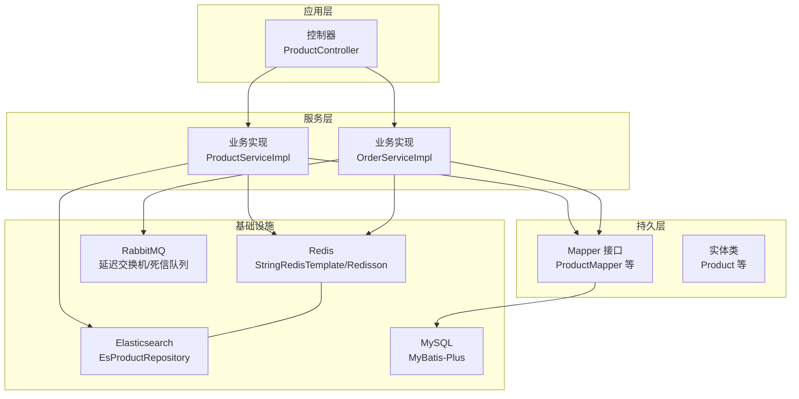
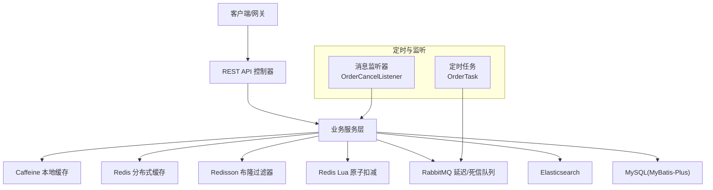
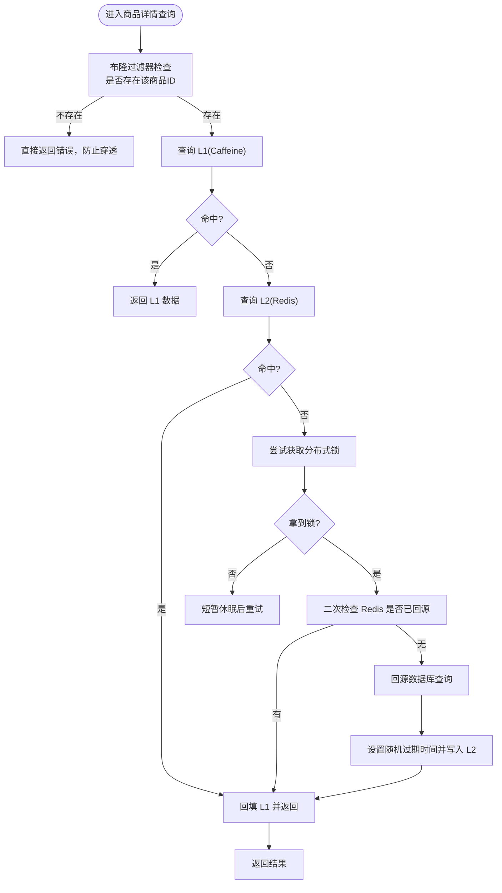
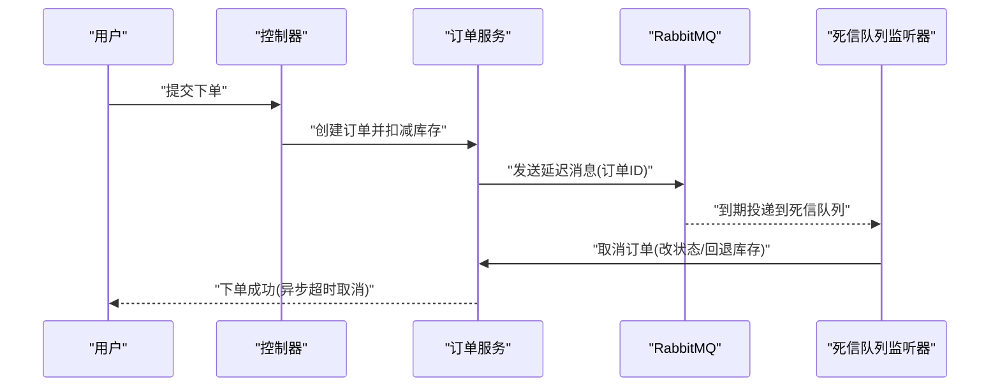
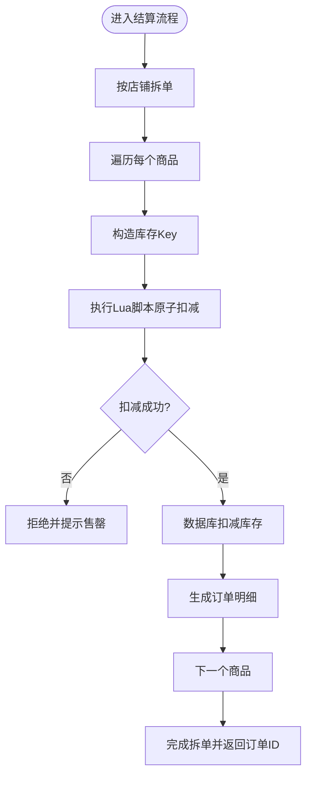
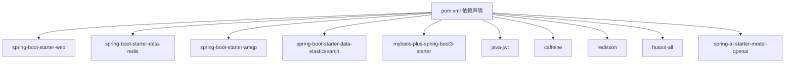

# 系统架构

<cite>
**本文引用的文件**
- [GlobalShopApplication.java](file://src/main/java/com/bohao/globalshop/GlobalShopApplication.java)
- [pom.xml](file://pom.xml)
- [application.yml](file://src/main/resources/application.yml)
- [CacheManagerConfig.java](file://src/main/java/com/bohao/globalshop/config/CacheManagerConfig.java)
- [RedisConfig.java](file://src/main/java/com/bohao/globalshop/config/RedisConfig.java)
- [RabbitMqConfig.java](file://src/main/java/com/bohao/globalshop/config/RabbitMqConfig.java)
- [MybatisPlusConfig.java](file://src/main/java/com/bohao/globalshop/config/MybatisPlusConfig.java)
- [ProductController.java](file://src/main/java/com/bohao/globalshop/controller/ProductController.java)
- [ProductServiceImpl.java](file://src/main/java/com/bohao/globalshop/service/impl/ProductServiceImpl.java)
- [OrderServiceImpl.java](file://src/main/java/com/bohao/globalshop/service/impl/OrderServiceImpl.java)
- [OrderTask.java](file://src/main/java/com/bohao/globalshop/task/OrderTask.java)
- [OrderCancelListener.java](file://src/main/java/com/bohao/globalshop/listener/OrderCancelListener.java)
- [CacheWarmUpRunner.java](file://src/main/java/com/bohao/globalshop/task/CacheWarmUpRunner.java)
- [JwtUtils.java](file://src/main/java/com/bohao/globalshop/common/JwtUtils.java)
- [Product.java](file://src/main/java/com/bohao/globalshop/entity/Product.java)
</cite>

## 目录
1. [简介](#简介)
2. [项目结构](#项目结构)
3. [核心组件](#核心组件)
4. [架构总览](#架构总览)
5. [详细组件分析](#详细组件分析)
6. [依赖分析](#依赖分析)
7. [性能考量](#性能考量)
8. [故障排查指南](#故障排查指南)
9. [结论](#结论)
10. [附录](#附录)

## 简介
本系统是一个基于 Spring Boot 的全球购物平台，采用经典的分层架构（Controller-Service-Mapper-Entity），结合多级缓存（Caffeine 本地缓存 + Redis 分布式缓存）、Redis 布隆过滤器、Redis Lua 原子扣减、RabbitMQ 延迟队列与死信队列、Elasticsearch 全文检索、以及基于注解的任务调度与消息监听，形成高可用、高性能、可扩展的电商系统。

## 项目结构
系统采用标准的 Spring Boot Maven 工程结构，核心目录与职责如下：
- config：集中配置类（缓存、Redis、RabbitMQ、MyBatis-Plus、Web）
- controller：REST 控制器，负责接收请求、参数校验与响应封装
- service：业务服务层，包含接口与实现类，承载核心业务逻辑
- mapper：MyBatis-Plus 映射接口，访问数据库
- entity：实体类，映射数据库表
- repository：Elasticsearch 仓库，支持全文检索
- task：定时任务与启动预热
- listener：RabbitMQ 消费监听器
- common：通用工具类（如 JWT）
- resources：应用配置与静态资源

图表来源
- [ProductController.java:1-101](file://src/main/java/com/bohao/globalshop/controller/ProductController.java#L1-L101)
- [ProductServiceImpl.java:1-177](file://src/main/java/com/bohao/globalshop/service/impl/ProductServiceImpl.java#L1-L177)
- [OrderServiceImpl.java:1-330](file://src/main/java/com/bohao/globalshop/service/impl/OrderServiceImpl.java#L1-L330)
- [CacheManagerConfig.java:1-55](file://src/main/java/com/bohao/globalshop/config/CacheManagerConfig.java#L1-L55)
- [RedisConfig.java:1-46](file://src/main/java/com/bohao/globalshop/config/RedisConfig.java#L1-L46)
- [RabbitMqConfig.java:1-61](file://src/main/java/com/bohao/globalshop/config/RabbitMqConfig.java#L1-L61)
- [MybatisPlusConfig.java:1-18](file://src/main/java/com/bohao/globalshop/config/MybatisPlusConfig.java#L1-L18)

章节来源
- [GlobalShopApplication.java:1-17](file://src/main/java/com/bohao/globalshop/GlobalShopApplication.java#L1-L17)
- [pom.xml:1-148](file://pom.xml#L1-L148)
- [application.yml:1-42](file://src/main/resources/application.yml#L1-L42)

## 核心组件
- 应用入口与调度：应用启动类启用调度能力，便于定时任务运行。
- 配置中心：集中管理缓存、Redis、RabbitMQ、MyBatis-Plus、Web 等配置。
- 控制器层：面向 API 的 REST 接口，负责参数接收与结果封装。
- 服务层：实现业务编排与复杂流程，包含缓存策略、分布式锁、幂等与一致性保障。
- 持久层：MyBatis-Plus Mapper + 实体类，配合乐观锁插件提升并发安全性。
- 基础设施：Redis（本地缓存、分布式缓存、布隆过滤器、Lua 原子扣减、ZSet 延迟队列）、RabbitMQ（延迟/死信队列）、Elasticsearch（全文检索）、MySQL（关系型存储）。

章节来源
- [GlobalShopApplication.java:1-17](file://src/main/java/com/bohao/globalshop/GlobalShopApplication.java#L1-L17)
- [MybatisPlusConfig.java:1-18](file://src/main/java/com/bohao/globalshop/config/MybatisPlusConfig.java#L1-L18)
- [ProductController.java:1-101](file://src/main/java/com/bohao/globalshop/controller/ProductController.java#L1-L101)

## 架构总览
系统采用分层架构与多级缓存策略，结合消息驱动与定时任务，实现高吞吐、低延迟与强一致性的业务闭环。

图表来源
- [ProductServiceImpl.java:1-177](file://src/main/java/com/bohao/globalshop/service/impl/ProductServiceImpl.java#L1-L177)
- [OrderServiceImpl.java:1-330](file://src/main/java/com/bohao/globalshop/service/impl/OrderServiceImpl.java#L1-L330)
- [OrderTask.java:1-44](file://src/main/java/com/bohao/globalshop/task/OrderTask.java#L1-L44)
- [OrderCancelListener.java:1-30](file://src/main/java/com/bohao/globalshop/listener/OrderCancelListener.java#L1-L30)
- [CacheManagerConfig.java:1-55](file://src/main/java/com/bohao/globalshop/config/CacheManagerConfig.java#L1-L55)
- [RedisConfig.java:1-46](file://src/main/java/com/bohao/globalshop/config/RedisConfig.java#L1-L46)
- [RabbitMqConfig.java:1-61](file://src/main/java/com/bohao/globalshop/config/RabbitMqConfig.java#L1-L61)

## 详细组件分析

### 多级缓存架构：Caffeine + Redis + 布隆过滤器
- 设计目标
  - 降低数据库压力，提升读取性能
  - 防止缓存穿透、击穿、雪崩
  - 通过布隆过滤器快速判定商品是否存在
- 实现要点
  - Caffeine 本地缓存：纳秒级访问，适合热点数据的极致加速
  - Redis 分布式缓存：跨实例共享，统一热点数据
  - 布隆过滤器：在进入缓存与数据库前拦截不存在的 ID，避免无效穿透
  - 缓存预热：启动阶段将真实存在的商品 ID 加载到布隆过滤器
  - 随机过期：为热点数据设置随机过期时间，避免雪崩
  - 分布式锁：热点数据缓存失效时，仅允许一个线程回源数据库并写回缓存

图表来源
- [ProductServiceImpl.java:111-177](file://src/main/java/com/bohao/globalshop/service/impl/ProductServiceImpl.java#L111-L177)
- [CacheManagerConfig.java:26-52](file://src/main/java/com/bohao/globalshop/config/CacheManagerConfig.java#L26-L52)
- [CacheWarmUpRunner.java:1-52](file://src/main/java/com/bohao/globalshop/task/CacheWarmUpRunner.java#L1-L52)

章节来源
- [CacheManagerConfig.java:1-55](file://src/main/java/com/bohao/globalshop/config/CacheManagerConfig.java#L1-L55)
- [RedisConfig.java:1-46](file://src/main/java/com/bohao/globalshop/config/RedisConfig.java#L1-L46)
- [ProductServiceImpl.java:1-177](file://src/main/java/com/bohao/globalshop/service/impl/ProductServiceImpl.java#L1-L177)
- [CacheWarmUpRunner.java:1-52](file://src/main/java/com/bohao/globalshop/task/CacheWarmUpRunner.java#L1-L52)

### 异步处理机制：RabbitMQ 延迟队列与订单超时取消
- 设计目标
  - 下单即返回，不阻塞主线程
  - 通过延迟队列实现订单超时自动取消
  - 通过死信队列兜底，确保消息最终被消费
- 实现要点
  - 延迟交换机与队列：设置 TTL（示例 10 秒用于演示，生产环境应为 15 分钟）
  - 死信交换机与队列：消息到期后路由到死信队列
  - 生产端：下单成功后将订单 ID 发送至延迟交换机
  - 消费端：监听死信队列，执行取消逻辑（改状态、回退库存）
  - 定时任务：轮询 Redis ZSet 中已超时的订单号，做幂等取消

图表来源
- [OrderServiceImpl.java:38-81](file://src/main/java/com/bohao/globalshop/service/impl/OrderServiceImpl.java#L38-L81)
- [RabbitMqConfig.java:11-59](file://src/main/java/com/bohao/globalshop/config/RabbitMqConfig.java#L11-L59)
- [OrderCancelListener.java:1-30](file://src/main/java/com/bohao/globalshop/listener/OrderCancelListener.java#L1-L30)

章节来源
- [RabbitMqConfig.java:1-61](file://src/main/java/com/bohao/globalshop/config/RabbitMqConfig.java#L1-L61)
- [OrderServiceImpl.java:1-330](file://src/main/java/com/bohao/globalshop/service/impl/OrderServiceImpl.java#L1-L330)
- [OrderCancelListener.java:1-30](file://src/main/java/com/bohao/globalshop/listener/OrderCancelListener.java#L1-L30)
- [OrderTask.java:1-44](file://src/main/java/com/bohao/globalshop/task/OrderTask.java#L1-L44)

### 秒杀与库存扣减：Redis + Lua 原子性
- 设计目标
  - 高并发场景下保证库存不超卖
  - 降低数据库压力，提升吞吐
- 实现要点
  - 使用 Lua 脚本在 Redis 中原子性判断与扣减库存
  - 预热阶段将库存写入 Redis，减少首次访问延迟
  - 成功扣减后，再进行数据库更新与订单落库

图表来源
- [OrderServiceImpl.java:140-236](file://src/main/java/com/bohao/globalshop/service/impl/OrderServiceImpl.java#L140-L236)
- [RedisConfig.java:27-44](file://src/main/java/com/bohao/globalshop/config/RedisConfig.java#L27-L44)
- [CacheWarmUpRunner.java:1-52](file://src/main/java/com/bohao/globalshop/task/CacheWarmUpRunner.java#L1-L52)

章节来源
- [OrderServiceImpl.java:1-330](file://src/main/java/com/bohao/globalshop/service/impl/OrderServiceImpl.java#L1-L330)
- [RedisConfig.java:1-46](file://src/main/java/com/bohao/globalshop/config/RedisConfig.java#L1-L46)
- [CacheWarmUpRunner.java:1-52](file://src/main/java/com/bohao/globalshop/task/CacheWarmUpRunner.java#L1-L52)

### 搜索与全文检索：Elasticsearch
- 设计目标
  - 提供高性能的商品搜索体验
- 实现要点
  - 控制器提供全文检索接口，基于名称或描述匹配
  - 支持将 MySQL 商品数据全量同步到 ES

章节来源
- [ProductController.java:54-99](file://src/main/java/com/bohao/globalshop/controller/ProductController.java#L54-L99)

### 安全与认证：JWT
- 设计目标
  - 无状态鉴权，支持跨域与移动端
- 实现要点
  - 工具类生成与校验令牌，包含用户标识与过期时间

章节来源
- [JwtUtils.java:1-41](file://src/main/java/com/bohao/globalshop/common/JwtUtils.java#L1-L41)

### 分布式锁与幂等：Redisson 与幂等键
- 设计目标
  - 防止缓存击穿与并发竞争
  - 幂等处理超时取消
- 实现要点
  - 使用 Redisson 获取可重入锁，限定等待与持有时间
  - 定时任务通过移除 ZSet 成员实现轻量分布式锁效果

章节来源
- [ProductServiceImpl.java:133-177](file://src/main/java/com/bohao/globalshop/service/impl/ProductServiceImpl.java#L133-L177)
- [OrderTask.java:20-42](file://src/main/java/com/bohao/globalshop/task/OrderTask.java#L20-L42)

### 乐观锁与并发控制：MyBatis-Plus 插件
- 设计目标
  - 避免超卖与并发更新冲突
- 实现要点
  - 注册乐观锁插件，基于 version 字段实现 CAS 更新

章节来源
- [MybatisPlusConfig.java:1-18](file://src/main/java/com/bohao/globalshop/config/MybatisPlusConfig.java#L1-L18)
- [Product.java:1-30](file://src/main/java/com/bohao/globalshop/entity/Product.java#L1-L30)

## 依赖分析
系统依赖围绕 Spring 生态展开，关键依赖包括：
- web、data-redis、amqp、data-elasticsearch、security-crypto、jwt、mybatis-plus、caffeine、redisson、hutool、spring-ai 等
- 版本与 Java 17 兼容，使用 Spring Boot 3.x Starter

图表来源
- [pom.xml:33-102](file://pom.xml#L33-L102)

章节来源
- [pom.xml:1-148](file://pom.xml#L1-L148)
- [application.yml:1-42](file://src/main/resources/application.yml#L1-L42)

## 性能考量
- 读路径优化
  - 多级缓存链路优先命中 L1/L2，布隆过滤器拦截无效请求
  - 随机过期时间避免雪崩
  - 分布式锁保护热点回源，降低数据库压力
- 写路径优化
  - 秒杀场景使用 Redis + Lua 原子扣减，减少往返与竞争
  - 乐观锁避免并发更新冲突
- 异步化
  - 下单与超时取消异步化，提升接口响应
  - 死信队列兜底，确保消息最终被处理
- 搜索与 AI
  - ES 提升检索性能；AI 向量化能力预留扩展空间

## 故障排查指南
- 缓存相关
  - 布隆过滤器未初始化：检查缓存预热与布隆过滤器初始化逻辑
  - 缓存穿透：确认布隆过滤器是否正确拦截不存在 ID
  - 缓存击穿：检查分布式锁是否生效与等待时间设置
- Redis 相关
  - Lua 脚本未命中：核对库存 Key 命名与预热脚本
  - ZSet 超时队列未触发：检查定时任务 Cron 表达式与监听器绑定
- MQ 相关
  - 延迟消息未到期：核对 TTL 设置与路由键
  - 死信队列未消费：检查死信交换机绑定与监听器实现
- 数据一致性
  - 乐观锁冲突：关注版本号导致的更新失败
- 配置问题
  - 数据源、Redis、ES、RabbitMQ 地址与凭据需与实际环境一致

章节来源
- [CacheManagerConfig.java:1-55](file://src/main/java/com/bohao/globalshop/config/CacheManagerConfig.java#L1-L55)
- [RedisConfig.java:1-46](file://src/main/java/com/bohao/globalshop/config/RedisConfig.java#L1-L46)
- [RabbitMqConfig.java:1-61](file://src/main/java/com/bohao/globalshop/config/RabbitMqConfig.java#L1-L61)
- [OrderTask.java:1-44](file://src/main/java/com/bohao/globalshop/task/OrderTask.java#L1-L44)
- [OrderCancelListener.java:1-30](file://src/main/java/com/bohao/globalshop/listener/OrderCancelListener.java#L1-L30)
- [MybatisPlusConfig.java:1-18](file://src/main/java/com/bohao/globalshop/config/MybatisPlusConfig.java#L1-L18)

## 结论
本系统通过清晰的分层架构与多级缓存、Redis 原子扣减、RabbitMQ 延迟/死信队列、Elasticsearch 全文检索等关键技术，构建了高可用、高性能、可扩展的全球购物平台。在工程实践中，建议：
- 生产环境调整 RabbitMQ TTL 为 15 分钟
- 完善监控与告警，覆盖缓存命中率、MQ 延迟、Redis 命中与 Lua 执行成功率
- 持续优化 ES 索引与分词策略，结合 AI 向量化能力提升搜索质量

## 附录
- 技术选型与权衡
  - Spring Boot 3.x + Java 17：获得更好的性能与生态支持
  - MyBatis-Plus：简化 CRUD 与乐观锁，提升开发效率
  - Caffeine + Redis：兼顾本地与分布式缓存优势
  - Redisson：提供分布式锁、布隆过滤器等企业级能力
  - RabbitMQ：成熟可靠的消息中间件，满足延迟与死信需求
  - Elasticsearch：专业全文检索引擎，支撑搜索体验
  - Spring AI：为未来引入向量化与智能推荐预留能力