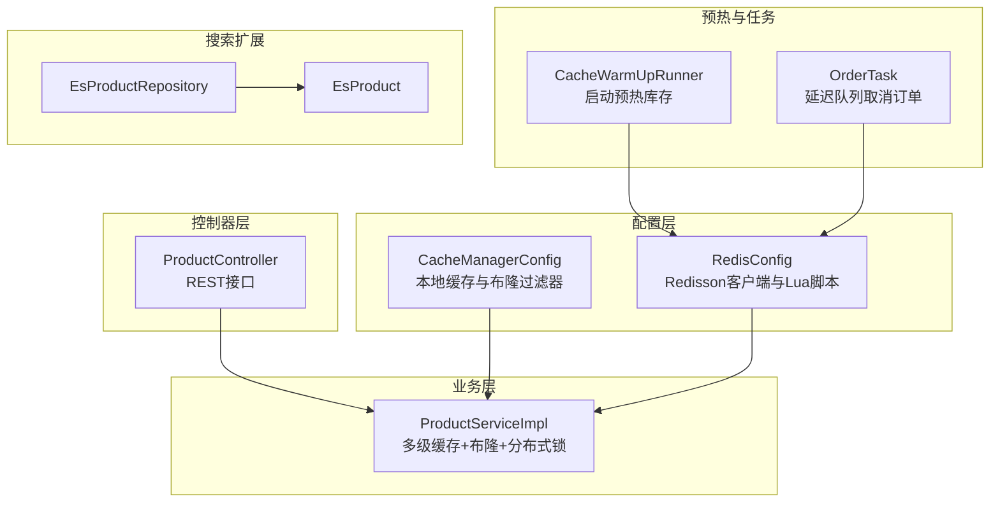
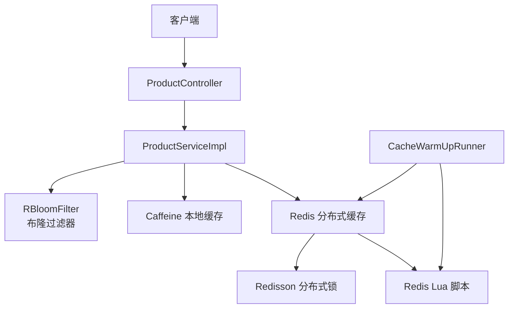
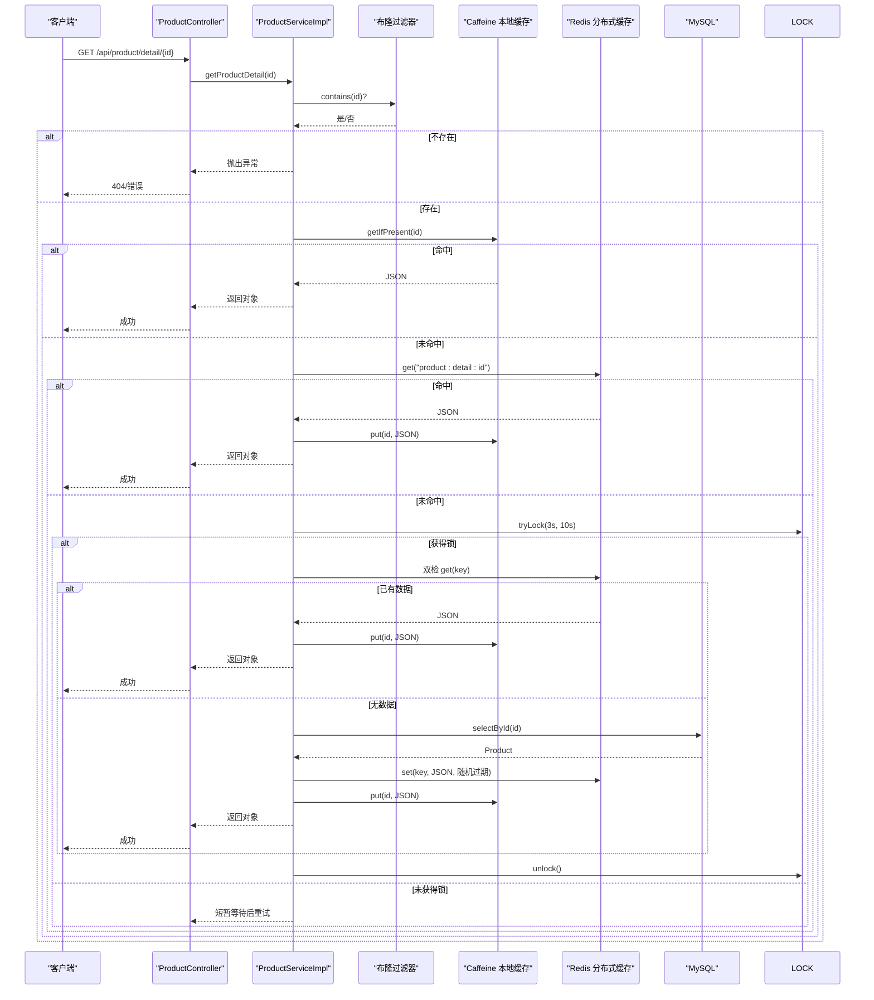
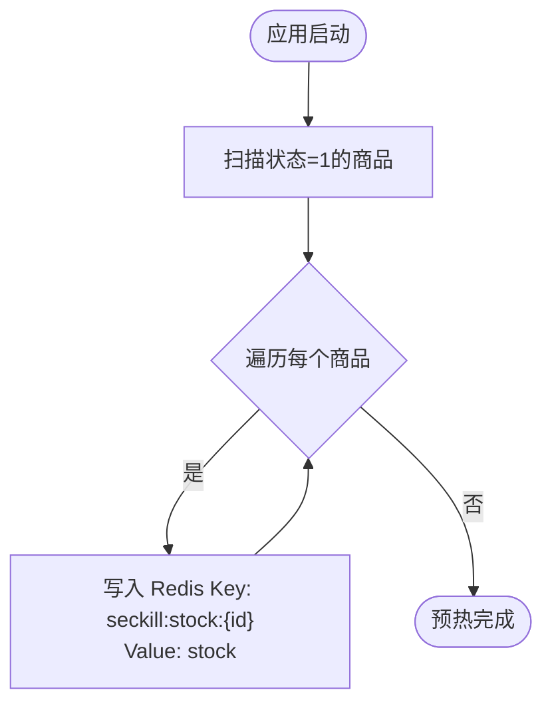
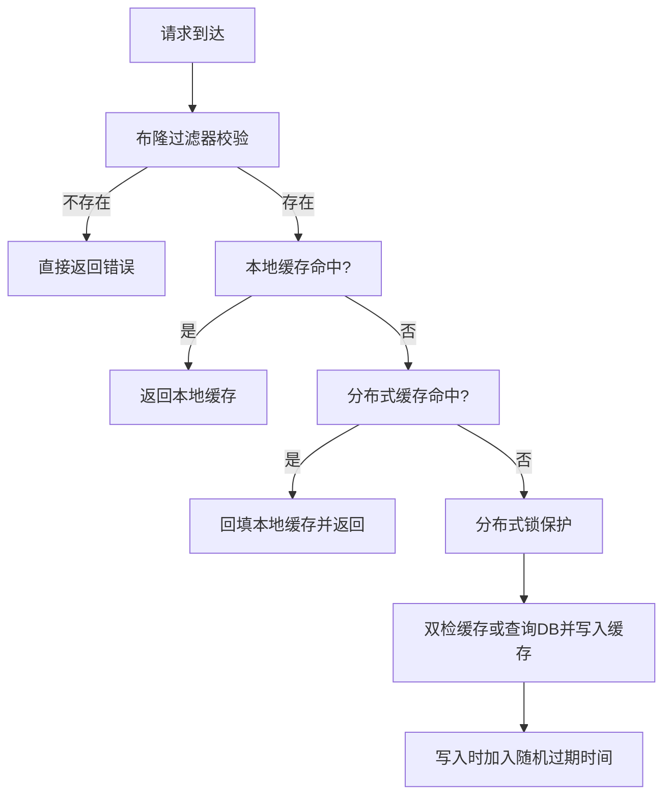
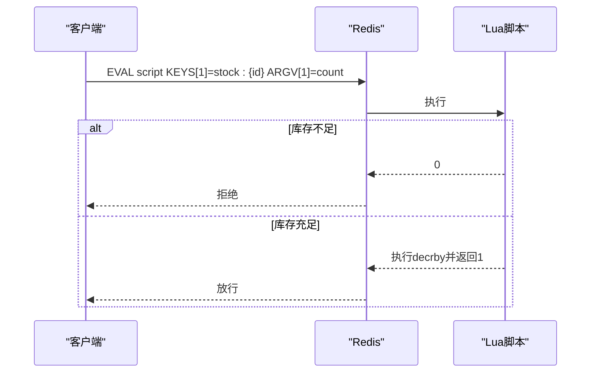
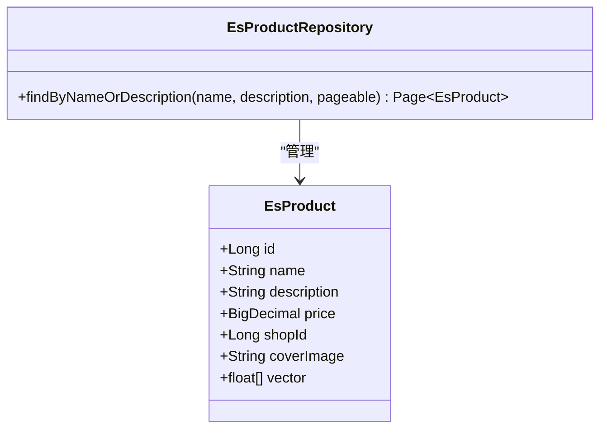
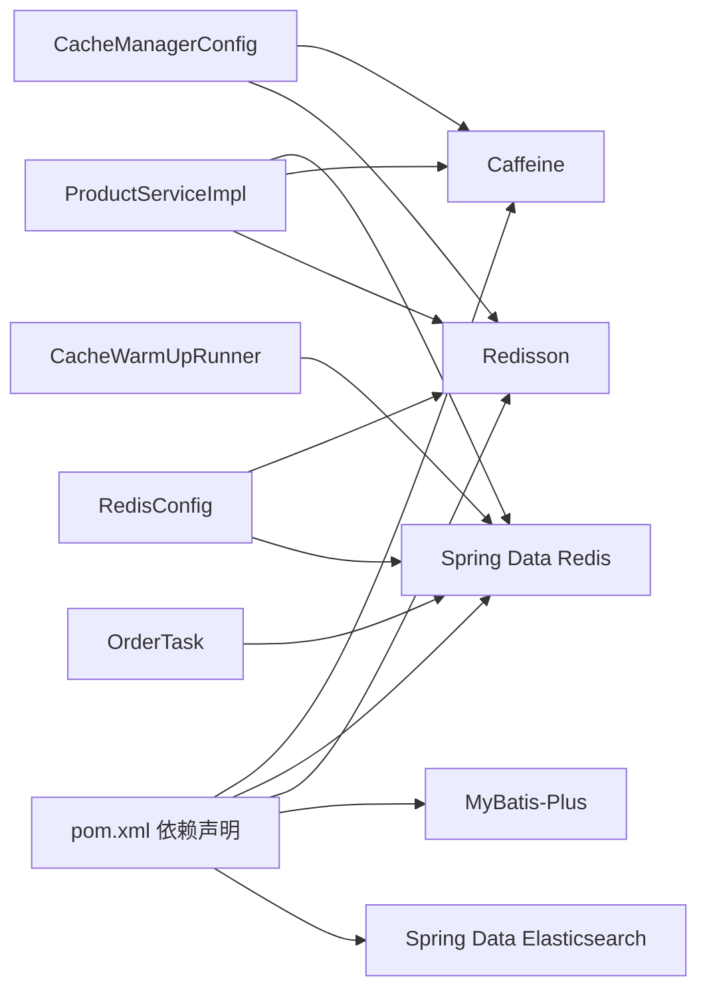

# 缓存架构设计

<cite>
**本文引用的文件**
- [CacheManagerConfig.java](file://src/main/java/com/bohao/globalshop/config/CacheManagerConfig.java)
- [RedisConfig.java](file://src/main/java/com/bohao/globalshop/config/RedisConfig.java)
- [CacheWarmUpRunner.java](file://src/main/java/com/bohao/globalshop/task/CacheWarmUpRunner.java)
- [ProductServiceImpl.java](file://src/main/java/com/bohao/globalshop/service/impl/ProductServiceImpl.java)
- [ProductController.java](file://src/main/java/com/bohao/globalshop/controller/ProductController.java)
- [application.yml](file://src/main/resources/application.yml)
- [pom.xml](file://pom.xml)
- [EsProductRepository.java](file://src/main/java/com/bohao/globalshop/repository/EsProductRepository.java)
- [EsProduct.java](file://src/main/java/com/bohao/globalshop/entity/EsProduct.java)
- [OrderTask.java](file://src/main/java/com/bohao/globalshop/task/OrderTask.java)
</cite>

## 目录
1. [简介](#简介)
2. [项目结构](#项目结构)
3. [核心组件](#核心组件)
4. [架构总览](#架构总览)
5. [详细组件分析](#详细组件分析)
6. [依赖关系分析](#依赖关系分析)
7. [性能考量](#性能考量)
8. [故障排查指南](#故障排查指南)
9. [结论](#结论)
10. [附录](#附录)

## 简介
本文件面向全球购物平台的多级缓存架构，系统性阐述本地缓存（Caffeine）与分布式缓存（Redis）的协同机制，覆盖缓存策略、失效与一致性保障、缓存预热、以及针对缓存穿透、击穿、雪崩的防护手段。同时给出配置参数、性能监控与调优建议，并通过序列图与流程图直观展示关键路径，帮助开发者快速掌握并落地最佳实践。

## 项目结构
围绕缓存主题的关键模块分布如下：
- 配置层：负责缓存与Redis客户端的Bean装配与脚本定义
- 业务层：服务实现中实现多级缓存读取、布隆过滤、分布式锁与随机过期
- 控制器层：对外暴露商品详情查询接口
- 启动与预热：应用启动后对Redis库存进行预热
- 搜索扩展：Elasticsearch集成用于全文检索

**图表来源**
- [CacheManagerConfig.java:26-52](file://src/main/java/com/bohao/globalshop/config/CacheManagerConfig.java#L26-L52)
- [RedisConfig.java:12-44](file://src/main/java/com/bohao/globalshop/config/RedisConfig.java#L12-L44)
- [ProductServiceImpl.java:34-176](file://src/main/java/com/bohao/globalshop/service/impl/ProductServiceImpl.java#L34-L176)
- [ProductController.java:23-49](file://src/main/java/com/bohao/globalshop/controller/ProductController.java#L23-L49)
- [CacheWarmUpRunner.java:17-50](file://src/main/java/com/bohao/globalshop/task/CacheWarmUpRunner.java#L17-L50)
- [EsProductRepository.java:8-11](file://src/main/java/com/bohao/globalshop/repository/EsProductRepository.java#L8-L11)
- [EsProduct.java:14-41](file://src/main/java/com/bohao/globalshop/entity/EsProduct.java#L14-L41)
- [OrderTask.java:19-42](file://src/main/java/com/bohao/globalshop/task/OrderTask.java#L19-L42)

**章节来源**
- [CacheManagerConfig.java:26-52](file://src/main/java/com/bohao/globalshop/config/CacheManagerConfig.java#L26-L52)
- [RedisConfig.java:12-44](file://src/main/java/com/bohao/globalshop/config/RedisConfig.java#L12-L44)
- [ProductServiceImpl.java:34-176](file://src/main/java/com/bohao/globalshop/service/impl/ProductServiceImpl.java#L34-L176)
- [ProductController.java:23-49](file://src/main/java/com/bohao/globalshop/controller/ProductController.java#L23-L49)
- [CacheWarmUpRunner.java:17-50](file://src/main/java/com/bohao/globalshop/task/CacheWarmUpRunner.java#L17-L50)
- [EsProductRepository.java:8-11](file://src/main/java/com/bohao/globalshop/repository/EsProductRepository.java#L8-L11)
- [EsProduct.java:14-41](file://src/main/java/com/bohao/globalshop/entity/EsProduct.java#L14-L41)
- [OrderTask.java:19-42](file://src/main/java/com/bohao/globalshop/task/OrderTask.java#L19-L42)

## 核心组件
- 本地缓存（L1，Caffeine）
  - 初始容量、最大容量、写入过期策略均在配置中定义
  - 作为第一级命中目标，提供纳秒级访问速度
- 分布式缓存（L2，Redis）
  - 使用Redis String存储商品详情JSON
  - 使用Redisson分布式锁保护热点Key
  - 使用布隆过滤器拦截不存在的Key，避免穿透
- 缓存预热
  - 应用启动后批量将库存写入Redis，形成“防超卖护城河”
- Lua脚本
  - 原子化库存扣减，配合库存Key预热，确保高并发下不超卖
- 搜索扩展
  - Elasticsearch索引与IK分词器，支持全文检索与分页

**章节来源**
- [CacheManagerConfig.java:26-34](file://src/main/java/com/bohao/globalshop/config/CacheManagerConfig.java#L26-L34)
- [CacheManagerConfig.java:36-52](file://src/main/java/com/bohao/globalshop/config/CacheManagerConfig.java#L36-L52)
- [RedisConfig.java:12-25](file://src/main/java/com/bohao/globalshop/config/RedisConfig.java#L12-L25)
- [RedisConfig.java:27-44](file://src/main/java/com/bohao/globalshop/config/RedisConfig.java#L27-L44)
- [CacheWarmUpRunner.java:27-50](file://src/main/java/com/bohao/globalshop/task/CacheWarmUpRunner.java#L27-L50)
- [EsProductRepository.java:8-11](file://src/main/java/com/bohao/globalshop/repository/EsProductRepository.java#L8-L11)
- [EsProduct.java:14-41](file://src/main/java/com/bohao/globalshop/entity/EsProduct.java#L14-L41)

## 架构总览
多级缓存采用“本地优先、分布式兜底”的策略，结合布隆过滤器、分布式锁与随机过期，形成完整的防护体系；同时通过启动预热与Lua脚本，强化高并发下的稳定性与一致性。

**图表来源**
- [ProductController.java:41-49](file://src/main/java/com/bohao/globalshop/controller/ProductController.java#L41-L49)
- [ProductServiceImpl.java:111-176](file://src/main/java/com/bohao/globalshop/service/impl/ProductServiceImpl.java#L111-L176)
- [CacheManagerConfig.java:36-52](file://src/main/java/com/bohao/globalshop/config/CacheManagerConfig.java#L36-L52)
- [CacheWarmUpRunner.java:27-50](file://src/main/java/com/bohao/globalshop/task/CacheWarmUpRunner.java#L27-L50)
- [RedisConfig.java:27-44](file://src/main/java/com/bohao/globalshop/config/RedisConfig.java#L27-L44)

## 详细组件分析

### 多级缓存读取与一致性
- 读取顺序：本地缓存 → 分布式缓存 → 数据库
- 命中分布式缓存后，顺手回填本地缓存，提升后续访问速度
- 写入时采用随机过期时间，降低雪崩概率
- 使用分布式锁，避免击穿场景下数据库瞬时压力

**图表来源**
- [ProductController.java:41-49](file://src/main/java/com/bohao/globalshop/controller/ProductController.java#L41-L49)
- [ProductServiceImpl.java:111-176](file://src/main/java/com/bohao/globalshop/service/impl/ProductServiceImpl.java#L111-L176)
- [CacheManagerConfig.java:36-52](file://src/main/java/com/bohao/globalshop/config/CacheManagerConfig.java#L36-L52)

**章节来源**
- [ProductServiceImpl.java:111-176](file://src/main/java/com/bohao/globalshop/service/impl/ProductServiceImpl.java#L111-L176)

### 缓存预热机制
- 启动预热：应用启动完成后，扫描所有上架商品，将库存写入Redis，形成“防超卖护城河”
- 预热Key：统一使用“seckill:stock:{productId}”格式，与Lua脚本一致
- 执行时机：CommandLineRunner在Spring容器启动后立即执行

**图表来源**
- [CacheWarmUpRunner.java:27-50](file://src/main/java/com/bohao/globalshop/task/CacheWarmUpRunner.java#L27-L50)
- [RedisConfig.java:27-44](file://src/main/java/com/bohao/globalshop/config/RedisConfig.java#L27-L44)

**章节来源**
- [CacheWarmUpRunner.java:27-50](file://src/main/java/com/bohao/globalshop/task/CacheWarmUpRunner.java#L27-L50)

### 缓存穿透、击穿、雪崩防护
- 缓存穿透
  - 使用布隆过滤器在进入缓存链路前拦截不存在的Key，避免无效查询落到数据库
- 缓存击穿
  - 热点Key过期时通过分布式锁仅让一个线程查询数据库并回填缓存，其他线程短暂等待后重试
- 缓存雪崩
  - 写入Redis时为过期时间增加随机抖动，避免大量Key在同一时刻集中过期

**图表来源**
- [ProductServiceImpl.java:111-176](file://src/main/java/com/bohao/globalshop/service/impl/ProductServiceImpl.java#L111-L176)
- [CacheManagerConfig.java:36-52](file://src/main/java/com/bohao/globalshop/config/CacheManagerConfig.java#L36-L52)

**章节来源**
- [ProductServiceImpl.java:111-176](file://src/main/java/com/bohao/globalshop/service/impl/ProductServiceImpl.java#L111-L176)

### Lua脚本与库存扣减
- 脚本逻辑：原子判断库存是否充足，不足则返回0，充足则扣减并返回1
- 预热库存：启动阶段将库存写入Redis，保证脚本执行时有初始值
- 使用方式：通过RedisTemplate执行Lua脚本，确保高并发下的强一致性

**图表来源**
- [RedisConfig.java:27-44](file://src/main/java/com/bohao/globalshop/config/RedisConfig.java#L27-L44)
- [CacheWarmUpRunner.java:38-46](file://src/main/java/com/bohao/globalshop/task/CacheWarmUpRunner.java#L38-L46)

**章节来源**
- [RedisConfig.java:27-44](file://src/main/java/com/bohao/globalshop/config/RedisConfig.java#L27-L44)
- [CacheWarmUpRunner.java:38-46](file://src/main/java/com/bohao/globalshop/task/CacheWarmUpRunner.java#L38-L46)

### 搜索与向量化（可选）
- Elasticsearch索引：商品名称与描述使用IK分词器，支持中文全文检索
- 文档模型：包含文本字段与向量字段，便于未来接入AI向量检索
- 接口：提供同步与搜索两个接口，满足不同场景需求

**图表来源**
- [EsProduct.java:14-41](file://src/main/java/com/bohao/globalshop/entity/EsProduct.java#L14-L41)
- [EsProductRepository.java:8-11](file://src/main/java/com/bohao/globalshop/repository/EsProductRepository.java#L8-L11)

**章节来源**
- [EsProduct.java:14-41](file://src/main/java/com/bohao/globalshop/entity/EsProduct.java#L14-L41)
- [EsProductRepository.java:8-11](file://src/main/java/com/bohao/globalshop/repository/EsProductRepository.java#L8-L11)

## 依赖关系分析
- 缓存与Redis客户端
  - Caffeine本地缓存由配置类提供
  - Redisson客户端与Lua脚本由配置类提供
- 业务服务
  - 服务实现依赖RedisTemplate、Caffeine缓存、布隆过滤器与RedissonClient
- 启动与任务
  - 预热Runner在启动后执行
  - 定时任务基于Redis ZSet处理超时订单

**图表来源**
- [pom.xml:69-93](file://pom.xml#L69-L93)
- [CacheManagerConfig.java:26-52](file://src/main/java/com/bohao/globalshop/config/CacheManagerConfig.java#L26-L52)
- [RedisConfig.java:12-25](file://src/main/java/com/bohao/globalshop/config/RedisConfig.java#L12-L25)
- [ProductServiceImpl.java:34-44](file://src/main/java/com/bohao/globalshop/service/impl/ProductServiceImpl.java#L34-L44)
- [CacheWarmUpRunner.java:17-23](file://src/main/java/com/bohao/globalshop/task/CacheWarmUpRunner.java#L17-L23)
- [OrderTask.java:15-17](file://src/main/java/com/bohao/globalshop/task/OrderTask.java#L15-L17)

**章节来源**
- [pom.xml:69-93](file://pom.xml#L69-L93)
- [CacheManagerConfig.java:26-52](file://src/main/java/com/bohao/globalshop/config/CacheManagerConfig.java#L26-L52)
- [RedisConfig.java:12-25](file://src/main/java/com/bohao/globalshop/config/RedisConfig.java#L12-L25)
- [ProductServiceImpl.java:34-44](file://src/main/java/com/bohao/globalshop/service/impl/ProductServiceImpl.java#L34-L44)
- [CacheWarmUpRunner.java:17-23](file://src/main/java/com/bohao/globalshop/task/CacheWarmUpRunner.java#L17-L23)
- [OrderTask.java:15-17](file://src/main/java/com/bohao/globalshop/task/OrderTask.java#L15-L17)

## 性能考量
- 本地缓存（Caffeine）
  - 初始容量与最大容量建议结合峰值QPS与热点比例评估
  - 写入过期时间需平衡命中率与内存占用
- 分布式缓存（Redis）
  - Key命名规范与过期策略需统一，避免碎片化
  - Lua脚本减少网络往返，提高原子性与吞吐
- 防护策略
  - 布隆过滤器误判率与容量需按业务规模调优
  - 分布式锁粒度与超时时间需权衡吞吐与公平性
- 监控与调优
  - 关注缓存命中率、穿透率、击穿次数与雪崩影响范围
  - 结合日志与指标（如Redis慢查询、JVM GC）持续优化

[本节为通用性能建议，不直接分析具体文件]

## 故障排查指南
- 缓存穿透
  - 现象：大量不存在的Key导致数据库压力增大
  - 排查：确认布隆过滤器是否正确初始化与命中
  - 处理：检查布隆过滤器容量与误判率配置
- 缓存击穿
  - 现象：热点Key过期瞬间流量冲击数据库
  - 排查：确认分布式锁是否生效、锁粒度与等待时间
  - 处理：适当延长热点Key的过期时间或设置互斥更新
- 缓存雪崩
  - 现象：大量Key同时过期导致数据库瞬时压力
  - 排查：核对写入时的随机过期逻辑是否生效
  - 处理：调整随机抖动范围与过期基线
- 预热问题
  - 现象：启动后库存未写入或脚本执行异常
  - 排查：确认启动Runner执行日志与Redis连接配置
  - 处理：检查数据库连接、Redis地址与权限

**章节来源**
- [CacheManagerConfig.java:36-52](file://src/main/java/com/bohao/globalshop/config/CacheManagerConfig.java#L36-L52)
- [ProductServiceImpl.java:111-176](file://src/main/java/com/bohao/globalshop/service/impl/ProductServiceImpl.java#L111-L176)
- [CacheWarmUpRunner.java:27-50](file://src/main/java/com/bohao/globalshop/task/CacheWarmUpRunner.java#L27-L50)
- [RedisConfig.java:12-25](file://src/main/java/com/bohao/globalshop/config/RedisConfig.java#L12-L25)

## 结论
该架构通过“本地优先、分布式兜底”的多级缓存策略，结合布隆过滤器、分布式锁与随机过期，有效解决了穿透、击穿与雪崩三大风险；并通过启动预热与Lua脚本，进一步提升了高并发场景下的稳定性与一致性。建议在生产环境中持续监控命中率与延迟，动态调整缓存参数与防护策略，以获得最佳性能与可靠性。

[本节为总结性内容，不直接分析具体文件]

## 附录

### 缓存配置参数与要点
- 本地缓存（Caffeine）
  - 初始容量：建议与峰值并发下的热点Key数量匹配
  - 最大容量：建议按内存上限与Key大小估算
  - 写入过期：建议结合业务访问周期设定
- 布隆过滤器
  - 预计元素：建议按商品总量与增长趋势预留
  - 误判率：建议不高于1%
- Redis
  - 地址与库：确保与环境一致
  - 密码：如启用请解除注释并正确配置
- Lua脚本
  - Key命名：与预热保持一致
  - 参数：库存扣减数量通过脚本参数传入

**章节来源**
- [CacheManagerConfig.java:26-52](file://src/main/java/com/bohao/globalshop/config/CacheManagerConfig.java#L26-L52)
- [RedisConfig.java:12-25](file://src/main/java/com/bohao/globalshop/config/RedisConfig.java#L12-L25)
- [CacheWarmUpRunner.java:38-46](file://src/main/java/com/bohao/globalshop/task/CacheWarmUpRunner.java#L38-L46)

### 性能指标监控与调优建议
- 指标
  - 缓存命中率、穿透率、击穿次数、雪崩影响窗口
  - Redis内存使用、命令耗时、慢查询
  - JVM GC频率与停顿
- 建议
  - 动态调整Caffeine容量与过期时间
  - 优化布隆过滤器容量与误判率
  - 调整分布式锁等待与持有时间
  - 引入异步预热与热点Key分级策略

[本节为通用指导，不直接分析具体文件]

### 使用模式与最佳实践（代码示例路径）
- 多级缓存读取与回填
  - [ProductServiceImpl.getProductDetail:111-176](file://src/main/java/com/bohao/globalshop/service/impl/ProductServiceImpl.java#L111-L176)
- 布隆过滤器初始化与预热
  - [CacheManagerConfig.productBloomFilter:36-52](file://src/main/java/com/bohao/globalshop/config/CacheManagerConfig.java#L36-L52)
- 启动预热库存
  - [CacheWarmUpRunner.run:27-50](file://src/main/java/com/bohao/globalshop/task/CacheWarmUpRunner.java#L27-L50)
- Lua脚本与库存扣减
  - [RedisConfig.seckillScript:27-44](file://src/main/java/com/bohao/globalshop/config/RedisConfig.java#L27-L44)
- 接口调用链
  - [ProductController.getProductDetail:41-49](file://src/main/java/com/bohao/globalshop/controller/ProductController.java#L41-L49)

**章节来源**
- [ProductServiceImpl.java:111-176](file://src/main/java/com/bohao/globalshop/service/impl/ProductServiceImpl.java#L111-L176)
- [CacheManagerConfig.java:36-52](file://src/main/java/com/bohao/globalshop/config/CacheManagerConfig.java#L36-L52)
- [CacheWarmUpRunner.java:27-50](file://src/main/java/com/bohao/globalshop/task/CacheWarmUpRunner.java#L27-L50)
- [RedisConfig.java:27-44](file://src/main/java/com/bohao/globalshop/config/RedisConfig.java#L27-L44)
- [ProductController.java:41-49](file://src/main/java/com/bohao/globalshop/controller/ProductController.java#L41-L49)