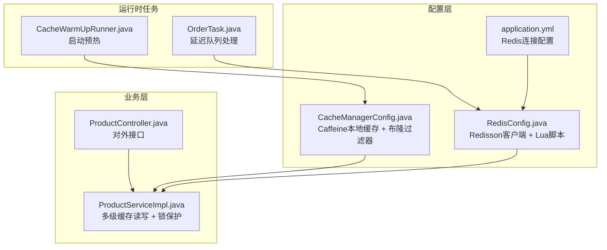
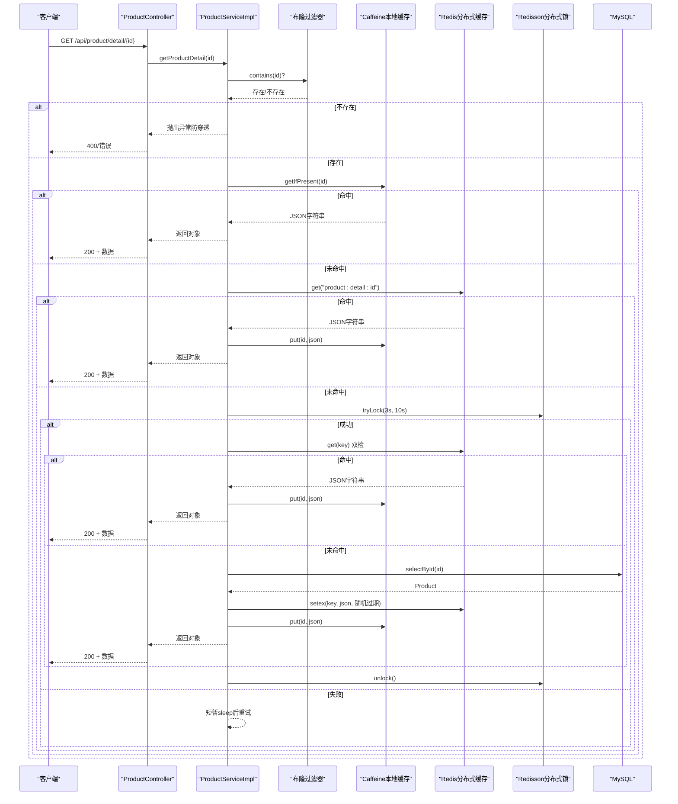
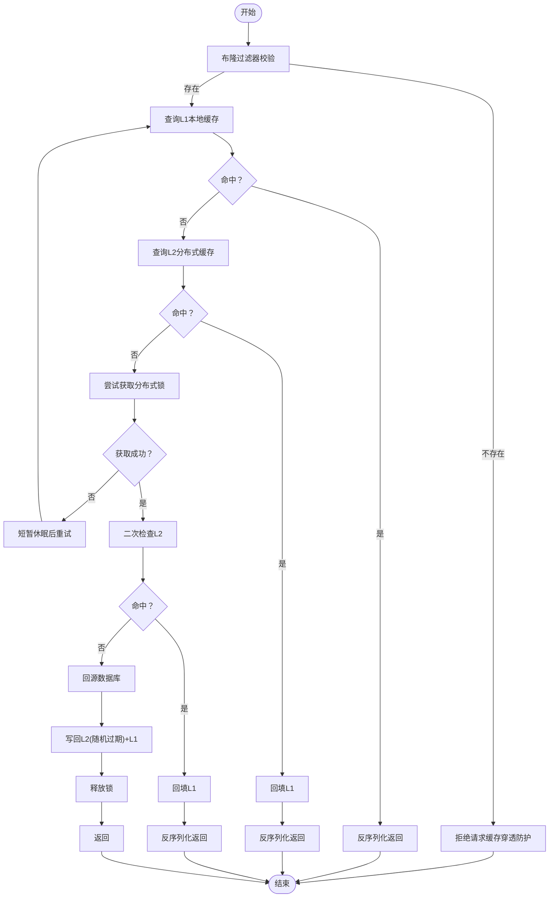
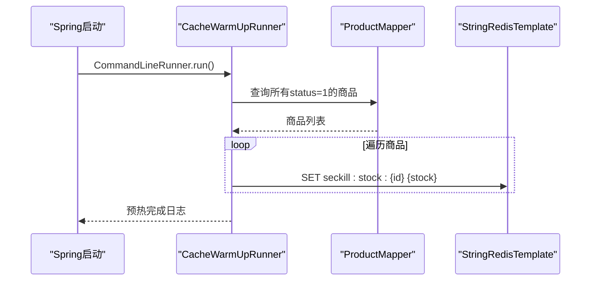
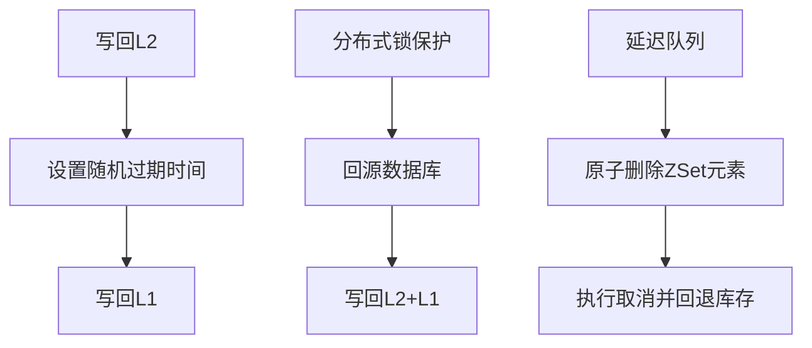
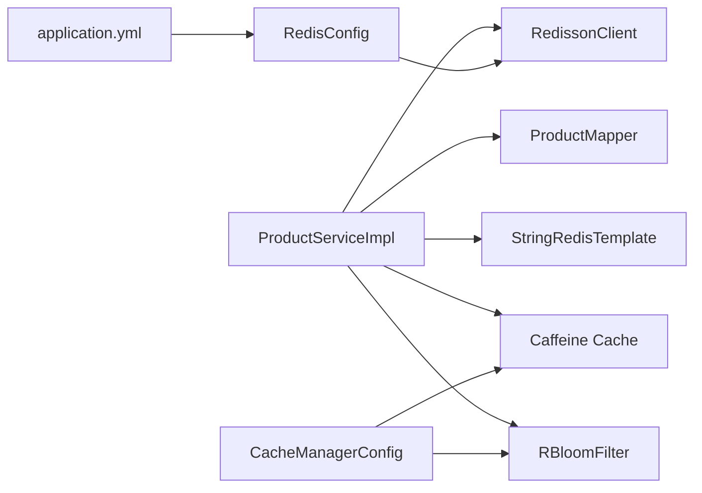

# 缓存系统

<cite>
**本文引用的文件**
- [CacheManagerConfig.java](file://src/main/java/com/bohao/globalshop/config/CacheManagerConfig.java)
- [RedisConfig.java](file://src/main/java/com/bohao/globalshop/config/RedisConfig.java)
- [CacheWarmUpRunner.java](file://src/main/java/com/bohao/globalshop/task/CacheWarmUpRunner.java)
- [application.yml](file://src/main/resources/application.yml)
- [ProductServiceImpl.java](file://src/main/java/com/bohao/globalshop/service/impl/ProductServiceImpl.java)
- [ProductController.java](file://src/main/java/com/bohao/globalshop/controller/ProductController.java)
- [OrderTask.java](file://src/main/java/com/bohao/globalshop/task/OrderTask.java)
- [Product.java](file://src/main/java/com/bohao/globalshop/entity/Product.java)
- [TradeOrder.java](file://src/main/java/com/bohao/globalshop/entity/TradeOrder.java)
</cite>

## 目录
1. [简介](#简介)
2. [项目结构](#项目结构)
3. [核心组件](#核心组件)
4. [架构总览](#架构总览)
5. [详细组件分析](#详细组件分析)
6. [依赖分析](#依赖分析)
7. [性能考量](#性能考量)
8. [故障排查指南](#故障排查指南)
9. [结论](#结论)
10. [附录](#附录)

## 简介
本文件面向系统架构师与性能工程师，围绕全球购物平台的多级缓存体系进行系统化说明。该体系采用“Caffeine 本地缓存（L1）+ Redis 分布式缓存（L2）”的组合策略，结合布隆过滤器、Redisson 分布式锁、Lua 原子脚本与定时预热任务，形成覆盖“缓存穿透、缓存击穿、缓存雪崩”的完整防护闭环，并提供缓存键设计原则、失效策略、命中率优化与性能监控建议。

## 项目结构
与缓存系统直接相关的模块分布如下：
- 配置层：缓存与 Redis 客户端初始化、Lua 脚本注册
- 业务层：商品详情缓存读写、布隆过滤器校验、分布式锁保护
- 启动任务：系统启动时对热点库存进行预热
- 控制器：对外暴露商品详情查询接口
- 定时任务：基于有序集合的延迟队列处理订单超时取消

**图表来源**
- [CacheManagerConfig.java:1-55](file://src/main/java/com/bohao/globalshop/config/CacheManagerConfig.java#L1-L55)
- [RedisConfig.java:1-46](file://src/main/java/com/bohao/globalshop/config/RedisConfig.java#L1-L46)
- [application.yml:1-42](file://src/main/resources/application.yml#L1-L42)
- [ProductServiceImpl.java:1-177](file://src/main/java/com/bohao/globalshop/service/impl/ProductServiceImpl.java#L1-L177)
- [ProductController.java:1-101](file://src/main/java/com/bohao/globalshop/controller/ProductController.java#L1-L101)
- [CacheWarmUpRunner.java:1-52](file://src/main/java/com/bohao/globalshop/task/CacheWarmUpRunner.java#L1-L52)
- [OrderTask.java:1-44](file://src/main/java/com/bohao/globalshop/task/OrderTask.java#L1-L44)

**章节来源**
- [CacheManagerConfig.java:1-55](file://src/main/java/com/bohao/globalshop/config/CacheManagerConfig.java#L1-L55)
- [RedisConfig.java:1-46](file://src/main/java/com/bohao/globalshop/config/RedisConfig.java#L1-L46)
- [application.yml:1-42](file://src/main/resources/application.yml#L1-L42)
- [ProductServiceImpl.java:1-177](file://src/main/java/com/bohao/globalshop/service/impl/ProductServiceImpl.java#L1-L177)
- [ProductController.java:1-101](file://src/main/java/com/bohao/globalshop/controller/ProductController.java#L1-L101)
- [CacheWarmUpRunner.java:1-52](file://src/main/java/com/bohao/globalshop/task/CacheWarmUpRunner.java#L1-L52)
- [OrderTask.java:1-44](file://src/main/java/com/bohao/globalshop/task/OrderTask.java#L1-L44)

## 核心组件
- Caffeine 本地缓存（L1）
  - 初始容量、最大容量、写入过期时间等参数在配置中定义
  - 用于极低延迟的本地热点数据读取
- Redis 分布式缓存（L2）
  - 使用 Redisson 客户端与 StringRedisTemplate
  - 提供分布式锁、布隆过滤器、Lua 原子脚本能力
- 布隆过滤器（Bloom Filter）
  - 用于快速判定“商品ID是否存在”，避免缓存穿透
- 启动预热任务
  - 在应用启动后将上架商品的库存写入 Redis，降低首次高峰压力
- 商品详情读取流程
  - 布隆过滤器 → L1 → L2 → 分布式锁 → MySQL → 写回 L1/L2
- 订单超时处理
  - 基于 ZSet 的延迟队列 + 原子删除 + 分布式锁，保障幂等与一致性

**章节来源**
- [CacheManagerConfig.java:26-34](file://src/main/java/com/bohao/globalshop/config/CacheManagerConfig.java#L26-L34)
- [CacheManagerConfig.java:36-52](file://src/main/java/com/bohao/globalshop/config/CacheManagerConfig.java#L36-L52)
- [RedisConfig.java:12-25](file://src/main/java/com/bohao/globalshop/config/RedisConfig.java#L12-L25)
- [CacheWarmUpRunner.java:17-51](file://src/main/java/com/bohao/globalshop/task/CacheWarmUpRunner.java#L17-L51)
- [ProductServiceImpl.java:111-176](file://src/main/java/com/bohao/globalshop/service/impl/ProductServiceImpl.java#L111-L176)
- [OrderTask.java:19-42](file://src/main/java/com/bohao/globalshop/task/OrderTask.java#L19-L42)

## 架构总览
多级缓存的整体交互流程如下：

**图表来源**
- [ProductServiceImpl.java:111-176](file://src/main/java/com/bohao/globalshop/service/impl/ProductServiceImpl.java#L111-L176)
- [CacheManagerConfig.java:36-52](file://src/main/java/com/bohao/globalshop/config/CacheManagerConfig.java#L36-L52)
- [ProductController.java:41-49](file://src/main/java/com/bohao/globalshop/controller/ProductController.java#L41-L49)

## 详细组件分析

### 组件A：多级缓存读写与一致性（商品详情）
- 缓存键设计
  - L2 键名：统一前缀 + 主键，如 “product:detail:{id}”
  - 库存键名：秒杀库存键 “seckill:stock:{productId}”
  - 分布式锁键名：按资源粒度命名，如 “kock:product:detail{id}”
- 读路径
  - 布隆过滤器先行校验，避免无效请求进入缓存链路
  - L1 命中直接反序列化返回
  - L2 命中则回填 L1 后返回
- 写路径与失效策略
  - 写回 L1/L2 时设置随机过期时间，缓解雪崩
  - 分布式锁保护下仅允许一个线程回源数据库，其余等待或重试
- 并发与幂等
  - 双重检查：加锁后再次查询 L2，避免重复回源
  - 锁释放需判断持有者，防止误删

**图表来源**
- [ProductServiceImpl.java:111-176](file://src/main/java/com/bohao/globalshop/service/impl/ProductServiceImpl.java#L111-L176)

**章节来源**
- [ProductServiceImpl.java:111-176](file://src/main/java/com/bohao/globalshop/service/impl/ProductServiceImpl.java#L111-L176)
- [CacheManagerConfig.java:36-52](file://src/main/java/com/bohao/globalshop/config/CacheManagerConfig.java#L36-L52)

### 组件B：缓存预热机制（启动预热 + 秒杀库存预热）
- 启动预热
  - 应用启动完成后扫描所有“已上架”商品，将库存写入 Redis 对应键
  - 降低冷启动与促销活动的瞬时压力
- 秒杀库存预热
  - 预热脚本使用 Lua 原子脚本，确保库存扣减的原子性与一致性
- 预热键设计
  - 库存键：固定前缀 + 商品ID，便于后续脚本直接使用

**图表来源**
- [CacheWarmUpRunner.java:27-50](file://src/main/java/com/bohao/globalshop/task/CacheWarmUpRunner.java#L27-L50)
- [RedisConfig.java:27-44](file://src/main/java/com/bohao/globalshop/config/RedisConfig.java#L27-L44)

**章节来源**
- [CacheWarmUpRunner.java:17-51](file://src/main/java/com/bohao/globalshop/task/CacheWarmUpRunner.java#L17-L51)
- [RedisConfig.java:27-44](file://src/main/java/com/bohao/globalshop/config/RedisConfig.java#L27-L44)

### 组件C：缓存一致性与失效策略
- 失效策略
  - L1：写入时同步更新；默认写入过期时间，避免长期驻留
  - L2：写回时设置随机过期时间，分散到期高峰，缓解雪崩
- 一致性保障
  - 分布式锁保护下的回源写回，确保同一时刻只有一个副本更新
  - 双重检查避免脏读与重复回源
- 幂等与并发
  - 延迟队列 + 原子删除 + 分布式锁，保证超时取消的幂等性

**图表来源**
- [ProductServiceImpl.java:147-160](file://src/main/java/com/bohao/globalshop/service/impl/ProductServiceImpl.java#L147-L160)
- [OrderTask.java:22-39](file://src/main/java/com/bohao/globalshop/task/OrderTask.java#L22-L39)

**章节来源**
- [ProductServiceImpl.java:147-160](file://src/main/java/com/bohao/globalshop/service/impl/ProductServiceImpl.java#L147-L160)
- [OrderTask.java:19-42](file://src/main/java/com/bohao/globalshop/task/OrderTask.java#L19-L42)

### 组件D：缓存键设计原则与实体映射
- 键设计原则
  - 前缀清晰：业务域/维度/主键，如 “product:detail:{id}”
  - 命名一致：跨模块统一风格，便于运维与监控
  - 避免冲突：资源级键名（如锁）与业务键区分
- 实体映射
  - 商品实体包含主键、状态、库存等字段，支撑缓存键与预热逻辑

**章节来源**
- [Product.java:14-28](file://src/main/java/com/bohao/globalshop/entity/Product.java#L14-L28)
- [ProductController.java:41-49](file://src/main/java/com/bohao/globalshop/controller/ProductController.java#L41-L49)

## 依赖分析
- 组件耦合
  - Service 层依赖 Mapper、RedisTemplate、RedissonClient、Caffeine Cache、RBloomFilter
  - 配置层提供 Bean 注入，降低业务层对第三方库的感知
- 外部依赖
  - Redis/Redisson：分布式缓存、锁、布隆过滤器、Lua
  - MySQL：最终一致性数据源
- 潜在风险
  - 锁粒度过粗可能导致热点竞争；应按资源维度细化键名
  - 预热数据量大时需考虑批量写入与限流

**图表来源**
- [ProductServiceImpl.java:34-43](file://src/main/java/com/bohao/globalshop/service/impl/ProductServiceImpl.java#L34-L43)
- [CacheManagerConfig.java:22-34](file://src/main/java/com/bohao/globalshop/config/CacheManagerConfig.java#L22-L34)
- [RedisConfig.java:12-25](file://src/main/java/com/bohao/globalshop/config/RedisConfig.java#L12-L25)
- [application.yml:11-18](file://src/main/resources/application.yml#L11-L18)

**章节来源**
- [ProductServiceImpl.java:34-43](file://src/main/java/com/bohao/globalshop/service/impl/ProductServiceImpl.java#L34-L43)
- [CacheManagerConfig.java:22-34](file://src/main/java/com/bohao/globalshop/config/CacheManagerConfig.java#L22-L34)
- [RedisConfig.java:12-25](file://src/main/java/com/bohao/globalshop/config/RedisConfig.java#L12-L25)
- [application.yml:11-18](file://src/main/resources/application.yml#L11-L18)

## 性能考量
- 命中率优化
  - 优先提升 L1 命中：合理设置初始容量与最大容量，关注热点商品
  - L2 过期时间引入随机抖动，避免“集体过期”
  - 对高频读取的详情页开启预热，减少首屏延迟
- 延迟与吞吐
  - L1 为纳秒级访问，L2 为毫秒级；通过双检与回填降低回源频率
  - 分布式锁持有时间短，避免长尾阻塞
- 资源占用
  - Caffeine 本地缓存占用 JVM 堆内存，需结合 GC 与压测评估
  - Redisson 客户端连接池与 Lua 脚本执行开销可控
- 监控建议
  - 统计 L1/L2 命中率、回源比例、锁等待时间、Lua 执行耗时
  - 关注布隆过滤器误判率与预热完成度

[本节为通用性能指导，不直接分析具体代码文件]

## 故障排查指南
- 缓存穿透
  - 现象：大量不存在的 ID 导致频繁回源
  - 排查：确认布隆过滤器是否初始化、是否正确使用 contains 判断
  - 处理：新增/删除商品时同步维护布隆过滤器
- 缓存击穿
  - 现象：热点 Key 突然过期，大量并发请求击穿到数据库
  - 排查：检查分布式锁是否生效、Double-Check 是否执行
  - 处理：缩短热点 Key 的过期时间或设置互斥更新
- 缓存雪崩
  - 现象：大量 Key 同步过期，导致数据库瞬时压力过大
  - 排查：核对写回时是否设置了随机过期时间
  - 处理：增加随机抖动幅度、设置分级过期策略
- 预热失败
  - 现象：启动后部分商品库存未写入 Redis
  - 排查：确认启动任务执行日志、数据库连接与 Redis 地址
  - 处理：调整预热策略（分批、限速）并补充重试
- Lua 脚本异常
  - 现象：库存扣减不生效或出现负数
  - 排查：核对脚本内容、KEYS/ARGV 使用是否与调用一致
  - 处理：在调用处打印调试信息，必要时回滚脚本版本

**章节来源**
- [ProductServiceImpl.java:113-116](file://src/main/java/com/bohao/globalshop/service/impl/ProductServiceImpl.java#L113-L116)
- [ProductServiceImpl.java:135-174](file://src/main/java/com/bohao/globalshop/service/impl/ProductServiceImpl.java#L135-L174)
- [CacheWarmUpRunner.java:27-50](file://src/main/java/com/bohao/globalshop/task/CacheWarmUpRunner.java#L27-L50)
- [RedisConfig.java:27-44](file://src/main/java/com/bohao/globalshop/config/RedisConfig.java#L27-L44)

## 结论
该缓存体系通过“L1 + L2 + 布隆过滤器 + 分布式锁 + Lua 原子脚本 + 启动预热”的组合拳，有效覆盖了缓存穿透、击穿与雪崩三大风险点，并在商品详情与订单超时等关键路径上实现了高性能与强一致的平衡。建议在生产环境中持续监控命中率与延迟指标，结合业务峰值动态调整缓存参数与预热策略。

[本节为总结性内容，不直接分析具体代码文件]

## 附录

### A. 缓存配置参数清单（示例）
- Caffeine 本地缓存
  - 初始容量：示例值
  - 最大容量：示例值
  - 写入过期时间：示例值（分钟）
- Redisson 客户端
  - 单机地址：示例值
  - 数据库编号：示例值
  - 密码：按需启用
- Lua 脚本
  - 秒杀库存扣减脚本：KEYS[1] 为库存键，ARGV[1] 为扣减数量

**章节来源**
- [CacheManagerConfig.java:26-34](file://src/main/java/com/bohao/globalshop/config/CacheManagerConfig.java#L26-L34)
- [RedisConfig.java:12-25](file://src/main/java/com/bohao/globalshop/config/RedisConfig.java#L12-L25)
- [RedisConfig.java:27-44](file://src/main/java/com/bohao/globalshop/config/RedisConfig.java#L27-L44)
- [application.yml:11-18](file://src/main/resources/application.yml#L11-L18)

### B. 缓存键设计规范
- 通用规则
  - 前缀：业务域/维度（如 product/detail）
  - 分隔符：冒号
  - 主键：资源主键
- 示例
  - 商品详情：product:detail:{id}
  - 秒杀库存：seckill:stock:{productId}
  - 分布式锁：kock:product:detail{id}

**章节来源**
- [ProductServiceImpl.java:125](file://src/main/java/com/bohao/globalshop/service/impl/ProductServiceImpl.java#L125)
- [CacheWarmUpRunner.java:40](file://src/main/java/com/bohao/globalshop/task/CacheWarmUpRunner.java#L40)

### C. 常见问题与对策对照
- 问题类型：缓存穿透
  - 解决方案：布隆过滤器 + 快速拒绝
- 问题类型：缓存击穿
  - 解决方案：分布式锁 + 双检
- 问题类型：缓存雪崩
  - 解决方案：随机过期 + 分级过期
- 问题类型：预热不完整
  - 解决方案：分批预热 + 日志与告警
- 问题类型：Lua 扣减异常
  - 解决方案：脚本校验 + 参数对齐

**章节来源**
- [ProductServiceImpl.java:113-116](file://src/main/java/com/bohao/globalshop/service/impl/ProductServiceImpl.java#L113-L116)
- [ProductServiceImpl.java:135-174](file://src/main/java/com/bohao/globalshop/service/impl/ProductServiceImpl.java#L135-L174)
- [CacheWarmUpRunner.java:27-50](file://src/main/java/com/bohao/globalshop/task/CacheWarmUpRunner.java#L27-L50)
- [RedisConfig.java:27-44](file://src/main/java/com/bohao/globalshop/config/RedisConfig.java#L27-L44)