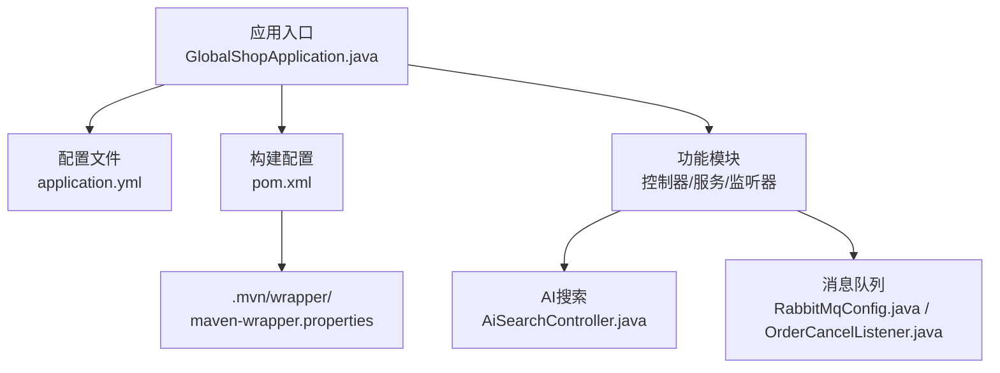
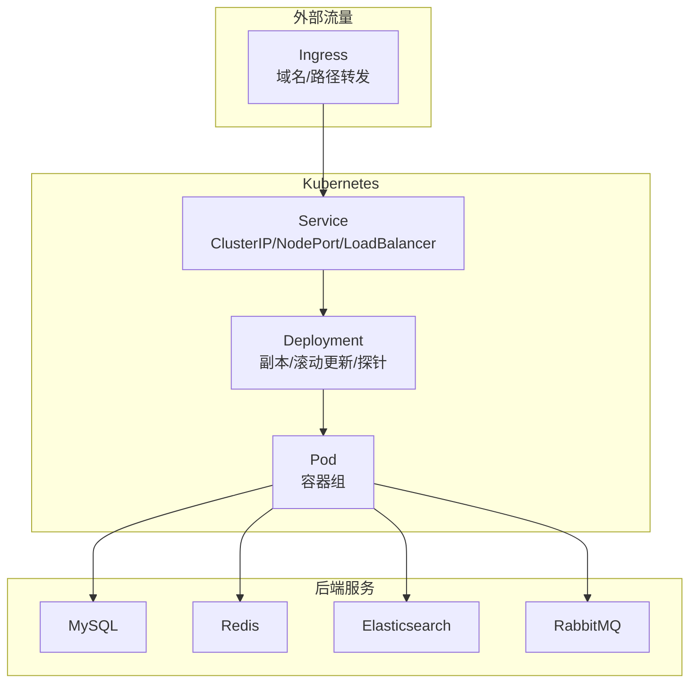
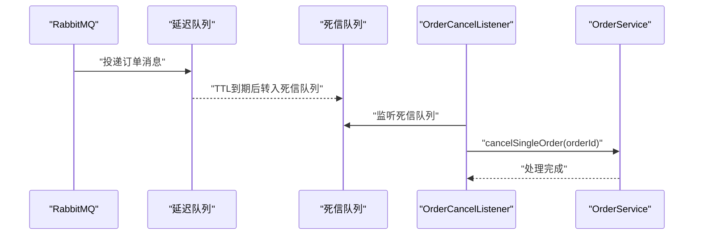
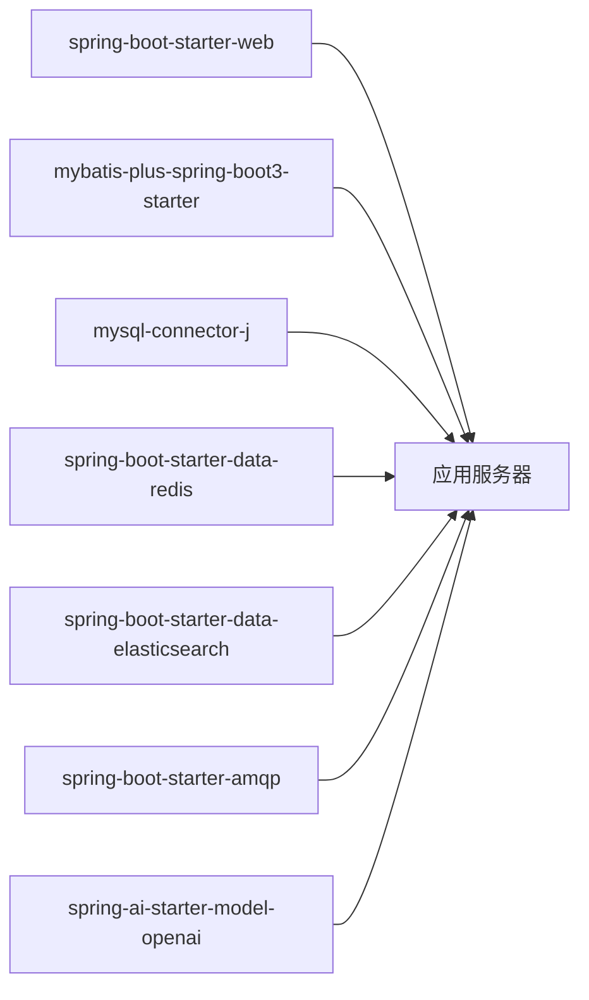

# 部署指南

<cite>
**本文引用的文件**
- [pom.xml](file://pom.xml)
- [application.yml](file://src/main/resources/application.yml)
- [GlobalShopApplication.java](file://src/main/java/com/bohao/globalshop/GlobalShopApplication.java)
- [HELP.md](file://HELP.md)
- [.mvn/wrapper/maven-wrapper.properties](file://.mvn/wrapper/maven-wrapper.properties)
- [RabbitMqConfig.java](file://src/main/java/com/bohao/globalshop/config/RabbitMqConfig.java)
- [OrderCancelListener.java](file://src/main/java/com/bohao/globalshop/listener/OrderCancelListener.java)
- [AiSearchController.java](file://src/main/java/com/bohao/globalshop/controller/AiSearchController.java)
</cite>

## 目录
1. [简介](#简介)
2. [项目结构](#项目结构)
3. [核心组件](#核心组件)
4. [架构总览](#架构总览)
5. [详细组件分析](#详细组件分析)
6. [依赖分析](#依赖分析)
7. [性能考虑](#性能考虑)
8. [故障排查指南](#故障排查指南)
9. [结论](#结论)
10. [附录](#附录)

## 简介
本指南面向DevOps工程师与系统管理员，提供全球购物平台的完整部署实施参考，涵盖以下内容：
- Docker容器化部署：镜像构建、运行参数与网络配置建议
- Kubernetes集群部署：Deployment、Service、Ingress等资源清单设计要点
- CI/CD流水线：基于Maven构建与镜像推送的自动化思路
- 生产环境配置管理：数据库、缓存、消息队列、搜索引擎与AI服务的连接配置
- 负载均衡与高可用：副本数、探针、滚动更新与故障转移策略
- 运维脚本与监控：健康检查端点、日志采集与告警建议
- 故障恢复：死信队列与订单超时取消流程

## 项目结构
该工程为基于Spring Boot的Java应用，使用Maven进行依赖与构建管理。核心目录与文件如下：
- 应用入口类：GlobalShopApplication.java
- 配置文件：application.yml（端口、数据源、Redis、Elasticsearch、RabbitMQ、AI服务等）
- 构建配置：pom.xml（依赖、插件、BOM管理）
- Maven包装器：.mvn/wrapper/maven-wrapper.properties
- 参考文档：HELP.md（含OCI镜像构建链接）

**图表来源**
- [GlobalShopApplication.java:1-17](file://src/main/java/com/bohao/globalshop/GlobalShopApplication.java#L1-L17)
- [application.yml:1-42](file://src/main/resources/application.yml#L1-L42)
- [pom.xml:1-148](file://pom.xml#L1-L148)
- [.mvn/wrapper/maven-wrapper.properties:1-4](file://.mvn/wrapper/maven-wrapper.properties#L1-L4)
- [AiSearchController.java:1-83](file://src/main/java/com/bohao/globalshop/controller/AiSearchController.java#L1-L83)
- [RabbitMqConfig.java:1-60](file://src/main/java/com/bohao/globalshop/config/RabbitMqConfig.java#L1-L60)
- [OrderCancelListener.java:1-29](file://src/main/java/com/bohao/globalshop/listener/OrderCancelListener.java#L1-L29)

**章节来源**
- [GlobalShopApplication.java:1-17](file://src/main/java/com/bohao/globalshop/GlobalShopApplication.java#L1-L17)
- [application.yml:1-42](file://src/main/resources/application.yml#L1-L42)
- [pom.xml:1-148](file://pom.xml#L1-L148)
- [.mvn/wrapper/maven-wrapper.properties:1-4](file://.mvn/wrapper/maven-wrapper.properties#L1-L4)
- [HELP.md:1-28](file://HELP.md#L1-L28)

## 核心组件
- 应用服务器：基于Spring Boot启动，监听HTTP请求，默认端口由配置文件定义
- 数据访问：MyBatis-Plus + MySQL驱动
- 缓存：Redis客户端集成
- 搜索引擎：Spring Data Elasticsearch + Elasticsearch服务
- 消息队列：RabbitMQ集成，支持延迟队列与死信队列
- AI能力：Spring AI OpenAI兼容模式，向量嵌入与KNN检索
- 健康检查：内置健康端点，便于容器与K8s探针使用

**章节来源**
- [application.yml:1-42](file://src/main/resources/application.yml#L1-L42)
- [pom.xml:33-102](file://pom.xml#L33-L102)
- [AiSearchController.java:1-83](file://src/main/java/com/bohao/globalshop/controller/AiSearchController.java#L1-L83)
- [RabbitMqConfig.java:1-60](file://src/main/java/com/bohao/globalshop/config/RabbitMqConfig.java#L1-L60)
- [OrderCancelListener.java:1-29](file://src/main/java/com/bohao/globalshop/listener/OrderCancelListener.java#L1-L29)

## 架构总览
下图展示应用在容器与Kubernetes中的典型拓扑：前端或网关通过Ingress接入，Service暴露Pod，Pod内运行应用进程；应用连接MySQL、Redis、Elasticsearch与RabbitMQ。

[此图为概念性架构示意，无需图表来源]

## 详细组件分析

### 应用启动与端口配置
- 应用入口类负责启动Spring Boot应用
- HTTP端口在配置文件中集中定义，便于容器环境覆盖
- 建议通过环境变量覆盖端口与数据库连接信息，以适配不同环境

**章节来源**
- [GlobalShopApplication.java:10-14](file://src/main/java/com/bohao/globalshop/GlobalShopApplication.java#L10-L14)
- [application.yml:1-4](file://src/main/resources/application.yml#L1-L4)

### 数据库与缓存配置
- 数据源：MySQL驱动、URL、用户名、密码
- Redis：主机、端口
- 建议在生产环境使用Secret管理敏感信息，并通过环境变量注入

**章节来源**
- [application.yml:5-14](file://src/main/resources/application.yml#L5-L14)

### 搜索引擎与AI服务
- Elasticsearch：URI、用户名、密码
- AI服务：OpenAI兼容模式、API Key、Base URL、向量模型
- 控制器演示了基于向量的语义检索流程，适合在容器内作为独立服务部署

**章节来源**
- [application.yml:15-29](file://src/main/resources/application.yml#L15-L29)
- [AiSearchController.java:20-83](file://src/main/java/com/bohao/globalshop/controller/AiSearchController.java#L20-L83)

### 消息队列与订单超时取消
- 延迟交换机与队列：用于订单支付超时场景
- 死信交换机与队列：消息过期后进入死信队列
- 监听器从死信队列消费，调用业务服务取消订单

**图表来源**
- [RabbitMqConfig.java:11-59](file://src/main/java/com/bohao/globalshop/config/RabbitMqConfig.java#L11-L59)
- [OrderCancelListener.java:17-27](file://src/main/java/com/bohao/globalshop/listener/OrderCancelListener.java#L17-L27)

**章节来源**
- [RabbitMqConfig.java:1-60](file://src/main/java/com/bohao/globalshop/config/RabbitMqConfig.java#L1-L60)
- [OrderCancelListener.java:1-29](file://src/main/java/com/bohao/globalshop/listener/OrderCancelListener.java#L1-L29)

### 健康检查与就绪探针
- 建议启用Spring Boot Actuator健康端点，供K8s Liveness/Readiness探针使用
- 健康状态应依赖数据库、缓存、搜索引擎与消息队列的连通性

[本节为通用实践说明，无需章节来源]

## 依赖分析
应用依赖包括Web、数据库、安全、缓存、搜索引擎、消息队列与AI能力等模块。这些依赖通过Maven统一管理，并在构建阶段打包到可执行JAR中。

**图表来源**
- [pom.xml:33-102](file://pom.xml#L33-L102)

**章节来源**
- [pom.xml:33-102](file://pom.xml#L33-L102)

## 性能考虑
- JVM版本：Java 17，建议在容器内固定JRE运行时
- 连接池与超时：为数据库、Redis与Elasticsearch设置合理的连接数与超时参数
- 缓存策略：结合本地缓存与Redis，降低数据库压力
- 搜索性能：向量检索的候选集与K值需根据业务规模调优
- 消息可靠性：生产环境开启发布确认与返回，确保消息不丢失

[本节提供通用指导，无需章节来源]

## 故障排查指南
- 健康检查失败
  - 使用健康端点查看各依赖状态
  - 检查数据库、Redis、Elasticsearch与RabbitMQ连通性
- 订单未取消
  - 确认延迟队列TTL与死信路由配置正确
  - 查看监听器日志，定位异常分支
- 搜索结果为空
  - 确认向量模型已初始化且索引存在
  - 检查Embedding模型的API Key与Base URL

**章节来源**
- [OrderCancelListener.java:16-27](file://src/main/java/com/bohao/globalshop/listener/OrderCancelListener.java#L16-L27)
- [AiSearchController.java:58-83](file://src/main/java/com/bohao/globalshop/controller/AiSearchController.java#L58-L83)

## 结论
本指南提供了从单体应用到容器化与Kubernetes编排的部署蓝图。建议在生产环境中结合Secret管理、探针配置、滚动更新与灰度发布策略，确保系统的高可用与可维护性。

[本节为总结性内容，无需章节来源]

## 附录

### Docker容器化部署（建议步骤）
- 基础镜像：选择官方JRE镜像作为基础
- 构建产物：使用Maven插件生成可执行JAR
- 运行参数：通过环境变量覆盖端口与数据库连接
- 健康检查：映射健康端点至容器探针
- 存储卷：持久化日志目录（如需要）

[本节为通用实践说明，无需章节来源]

### Kubernetes部署清单要点
- Deployment
  - 设置副本数与滚动更新策略
  - 配置资源限制与请求
  - 设置Liveness/Readiness探针
- Service
  - ClusterIP/NodePort/LoadBalancer按需选择
- Ingress
  - 配置域名与路径转发规则
- ConfigMap/Secret
  - 通过环境变量注入数据库、Redis、Elasticsearch与RabbitMQ凭据

[本节为通用实践说明，无需章节来源]

### CI/CD流水线（建议流程）
- 触发条件：代码合并主分支
- 步骤
  - 代码检出与缓存
  - 单元测试
  - 打包构建（Maven）
  - 镜像构建与推送
  - 发布到Kubernetes（Helm/Kustomize或kubectl）
- 回滚策略：滚动回滚至上一版本

[本节为通用实践说明，无需章节来源]

### 生产环境配置管理
- 环境隔离：dev/stage/prod三套配置
- 凭据管理：Secret存储数据库、消息队列、AI服务密钥
- 网络策略：最小权限访问后端服务
- 日志与链路追踪：集中化日志与指标采集

[本节为通用实践说明，无需章节来源]

### 监控与告警
- 指标：CPU、内存、JVM GC、数据库连接池、消息积压
- 健康端点：/actuator/health
- 告警：阈值触发与SLA监控

[本节为通用实践说明，无需章节来源]