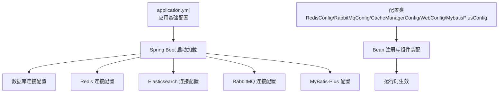
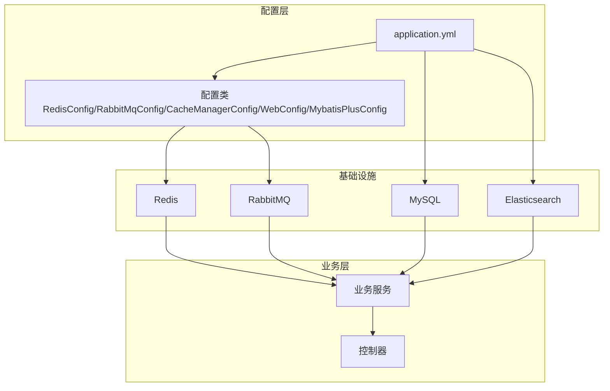
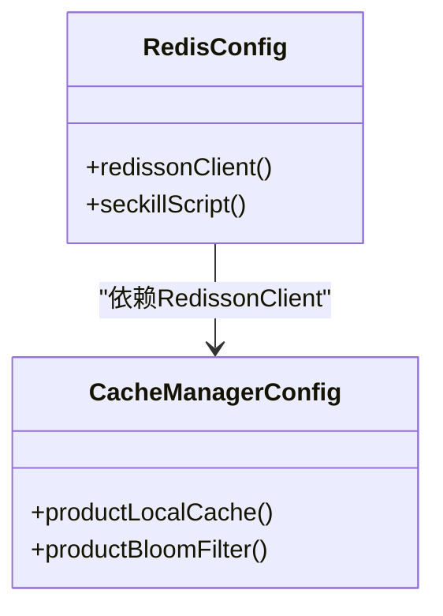
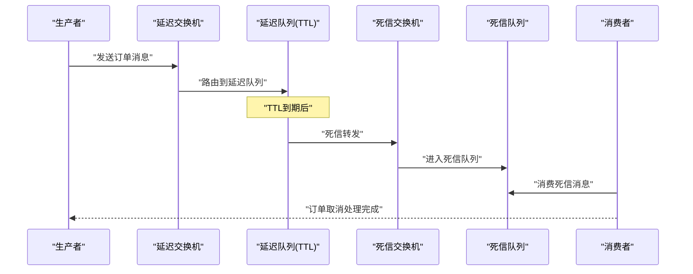

# 配置管理

<cite>
**本文引用的文件**
- [application.yml](file://src/main/resources/application.yml)
- [RedisConfig.java](file://src/main/java/com/bohao/globalshop/config/RedisConfig.java)
- [RabbitMqConfig.java](file://src/main/java/com/bohao/globalshop/config/RabbitMqConfig.java)
- [CacheManagerConfig.java](file://src/main/java/com/bohao/globalshop/config/CacheManagerConfig.java)
- [WebConfig.java](file://src/main/java/com/bohao/globalshop/config/WebConfig.java)
- [MybatisPlusConfig.java](file://src/main/java/com/bohao/globalshop/config/MybatisPlusConfig.java)
- [pom.xml](file://pom.xml)
- [HealthController.java](file://src/main/java/com/bohao/globalshop/controller/HealthController.java)
</cite>

## 目录
1. [简介](#简介)
2. [项目结构与配置文件定位](#项目结构与配置文件定位)
3. [核心配置项详解](#核心配置项详解)
4. [架构总览](#架构总览)
5. [详细组件配置分析](#详细组件配置分析)
6. [环境配置与优先级策略](#环境配置与优先级策略)
7. [配置热更新与动态刷新](#配置热更新与动态刷新)
8. [配置验证与校验最佳实践](#配置验证与校验最佳实践)
9. [配置安全与敏感信息保护](#配置安全与敏感信息保护)
10. [自定义配置类创建与使用](#自定义配置类创建与使用)
11. [配置监控与故障排查](#配置监控与故障排查)
12. [性能考量与优化建议](#性能考量与优化建议)
13. [结论](#结论)

## 简介
本文件面向DevOps工程师与系统管理员，系统性梳理全球购物平台的配置管理方案，覆盖application.yml中各项参数的作用与影响范围，解释数据库连接、Redis、Elasticsearch、RabbitMQ、MyBatis-Plus等关键组件的配置要点；并给出环境配置策略、配置优先级、热更新、验证与安全最佳实践，以及自定义配置类的创建与使用方法，最后提供配置监控与故障排查指南。

## 项目结构与配置文件定位
- 核心配置文件位于资源目录，采用Spring Boot标准命名与层级组织，便于按模块化配置与环境隔离。
- 关键配置类集中在config包下，通过Java配置方式补充或覆盖YAML中的默认行为，确保缓存、消息队列、拦截器等组件的可扩展性与可控性。

图表来源
- [application.yml:1-42](file://src/main/resources/application.yml#L1-L42)
- [RedisConfig.java:1-46](file://src/main/java/com/bohao/globalshop/config/RedisConfig.java#L1-L46)
- [RabbitMqConfig.java:1-61](file://src/main/java/com/bohao/globalshop/config/RabbitMqConfig.java#L1-L61)
- [CacheManagerConfig.java:1-55](file://src/main/java/com/bohao/globalshop/config/CacheManagerConfig.java#L1-L55)
- [WebConfig.java:1-36](file://src/main/java/com/bohao/globalshop/config/WebConfig.java#L1-L36)
- [MybatisPlusConfig.java:1-18](file://src/main/java/com/bohao/globalshop/config/MybatisPlusConfig.java#L1-L18)

章节来源
- [application.yml:1-42](file://src/main/resources/application.yml#L1-L42)

## 核心配置项详解
以下为application.yml中关键配置项的逐项说明与影响范围：

- 服务器端口
  - 作用：指定HTTP服务监听端口，便于容器编排与反向代理映射。
  - 影响范围：所有REST接口访问入口。
  - 章节来源
    - [application.yml:1-3](file://src/main/resources/application.yml#L1-L3)

- 数据源（MySQL）
  - 参数：驱动类名、JDBC URL、用户名、密码。
  - 作用：建立与MySQL数据库的连接，支持多语言字符集与时区设置。
  - 影响范围：所有持久层操作（MyBatis-Plus）。
  - 章节来源
    - [application.yml:5-9](file://src/main/resources/application.yml#L5-L9)

- Redis（Spring Data Redis）
  - 参数：主机、端口。
  - 作用：提供Spring RedisTemplate的基础连接能力。
  - 影响范围：Spring RedisTemplate、缓存读写、会话存储等。
  - 章节来源
    - [application.yml:10-14](file://src/main/resources/application.yml#L10-L14)

- Elasticsearch
  - 参数：URI、用户名、密码。
  - 作用：连接Elasticsearch集群，用于全文检索与向量检索。
  - 影响范围：搜索、推荐、AI向量化检索。
  - 章节来源
    - [application.yml:15-18](file://src/main/resources/application.yml#L15-L18)

- AI（OpenAI兼容网关）
  - 参数：API Key、Base URL、嵌入模型选项。
  - 作用：对接第三方AI服务（如通义千问），用于向量化与智能搜索。
  - 影响范围：向量生成、语义搜索。
  - 章节来源
    - [application.yml:19-28](file://src/main/resources/application.yml#L19-L28)

- RabbitMQ
  - 参数：主机、端口、用户名、密码、发布者确认类型、发布返回。
  - 作用：启用消息发送确认与返回，保障消息可靠投递。
  - 影响范围：订单延迟取消、死信队列等异步流程。
  - 章节来源
    - [application.yml:29-37](file://src/main/resources/application.yml#L29-L37)

- MyBatis-Plus
  - 参数：下划线转驼峰映射、日志实现。
  - 作用：提升SQL映射体验与调试可观测性。
  - 影响范围：所有Mapper与实体映射。
  - 章节来源
    - [application.yml:39-42](file://src/main/resources/application.yml#L39-L42)

## 架构总览
下图展示配置在系统中的装配路径与组件交互关系：

图表来源
- [application.yml:1-42](file://src/main/resources/application.yml#L1-L42)
- [RedisConfig.java:1-46](file://src/main/java/com/bohao/globalshop/config/RedisConfig.java#L1-L46)
- [RabbitMqConfig.java:1-61](file://src/main/java/com/bohao/globalshop/config/RabbitMqConfig.java#L1-L61)
- [CacheManagerConfig.java:1-55](file://src/main/java/com/bohao/globalshop/config/CacheManagerConfig.java#L1-L55)
- [WebConfig.java:1-36](file://src/main/java/com/bohao/globalshop/config/WebConfig.java#L1-L36)
- [MybatisPlusConfig.java:1-18](file://src/main/java/com/bohao/globalshop/config/MybatisPlusConfig.java#L1-L18)

## 详细组件配置分析

### Redis配置
- Spring Data Redis连接
  - 通过application.yml提供基础连接参数，适用于通用缓存场景。
  - 章节来源
    - [application.yml:10-14](file://src/main/resources/application.yml#L10-L14)

- Redisson客户端与Lua脚本
  - 使用Redisson配置单节点模式，支持密码与数据库选择。
  - 提供秒杀场景的Lua脚本Bean，实现原子库存扣减。
  - 章节来源
    - [RedisConfig.java:12-25](file://src/main/java/com/bohao/globalshop/config/RedisConfig.java#L12-L25)
    - [RedisConfig.java:27-44](file://src/main/java/com/bohao/globalshop/config/RedisConfig.java#L27-L44)

- 布隆过滤器与本地缓存
  - 本地缓存（Caffeine）作为L1缓存，降低热点数据的Redis压力。
  - 布隆过滤器用于快速判断商品ID是否存在，减少无效查询。
  - 章节来源
    - [CacheManagerConfig.java:26-34](file://src/main/java/com/bohao/globalshop/config/CacheManagerConfig.java#L26-L34)
    - [CacheManagerConfig.java:36-52](file://src/main/java/com/bohao/globalshop/config/CacheManagerConfig.java#L36-L52)

图表来源
- [RedisConfig.java:1-46](file://src/main/java/com/bohao/globalshop/config/RedisConfig.java#L1-L46)
- [CacheManagerConfig.java:1-55](file://src/main/java/com/bohao/globalshop/config/CacheManagerConfig.java#L1-L55)

### RabbitMQ配置
- 交换机与队列定义
  - 定义延迟交换机与死信交换机，配合TTL与死信路由规则实现订单超时自动取消。
  - 章节来源
    - [RabbitMqConfig.java:11-19](file://src/main/java/com/bohao/globalshop/config/RabbitMqConfig.java#L11-L19)
    - [RabbitMqConfig.java:21-35](file://src/main/java/com/bohao/globalshop/config/RabbitMqConfig.java#L21-L35)
    - [RabbitMqConfig.java:37-59](file://src/main/java/com/bohao/globalshop/config/RabbitMqConfig.java#L37-L59)

图表来源
- [RabbitMqConfig.java:1-61](file://src/main/java/com/bohao/globalshop/config/RabbitMqConfig.java#L1-L61)

### Web与拦截器配置
- 跨域配置
  - 放宽跨域限制，允许任意来源、方法与头部，支持凭据传递。
  - 章节来源
    - [WebConfig.java:25-32](file://src/main/java/com/bohao/globalshop/config/WebConfig.java#L25-L32)

- 拦截器配置
  - 对特定路径组启用JWT拦截器，排除公开接口。
  - 章节来源
    - [WebConfig.java:16-23](file://src/main/java/com/bohao/globalshop/config/WebConfig.java#L16-L23)

### MyBatis-Plus配置
- 乐观锁插件
  - 注册乐观锁插件，避免并发更新冲突。
  - 章节来源
    - [MybatisPlusConfig.java:10-16](file://src/main/java/com/bohao/globalshop/config/MybatisPlusConfig.java#L10-L16)

## 环境配置与优先级策略
- 配置文件优先级（从高到低）
  1) 命令行参数
  2) SPRING_APPLICATION_JSON
  3) 系统环境变量
  4) application-{profile}.yml
  5) application.yml
  6) @PropertySource注解
  7) 默认属性
- 环境隔离建议
  - 开发环境：本地application.yml，必要时通过命令行覆盖端口、数据库URL与密码。
  - 测试/预发环境：使用application-test.yml或application-uat.yml，通过-Dspring.profiles.active切换。
  - 生产环境：通过环境变量注入敏感配置，禁用明文密码，启用只读配置卷。
- profile激活方式
  - JVM参数：-Dspring.profiles.active=test
  - 环境变量：SPRING_PROFILES_ACTIVE=test
  - 配置文件：在application.yml中设置spring.profiles.active（不推荐在生产暴露）

章节来源
- [application.yml:1-42](file://src/main/resources/application.yml#L1-L42)

## 配置热更新与动态刷新
- Spring Cloud Config（推荐）
  - 将配置集中于配置中心，结合Bus实现配置变更广播与刷新。
  - 适用场景：多实例部署、需要零停机更新配置。
- 本地热更新方案
  - 使用@RefreshScope注解的Bean在配置变更后重新创建，适合部分非核心配置。
  - 手动触发刷新：/actuator/refresh（需引入Actuator并开放端点）。
- 重启策略
  - 对数据库、消息中间件、搜索引擎等核心连接配置变更，建议滚动重启以确保一致性。

章节来源
- [pom.xml:33-102](file://pom.xml#L33-L102)

## 配置验证与校验最佳实践
- 启动阶段校验
  - 在启动时对关键连接（数据库、Redis、ES、MQ）进行连通性检查，失败则阻断启动。
- 运行时健康检查
  - 通过/actuator/health暴露组件健康状态，结合外部监控系统告警。
- 配置项清单
  - 必检项：端口占用、网络可达性、认证凭据、SSL/TLS证书、超时与重试参数。
- 日志与审计
  - 记录配置加载顺序与最终生效值，便于问题溯源。

章节来源
- [HealthController.java:14-17](file://src/main/java/com/bohao/globalshop/controller/HealthController.java#L14-L17)

## 配置安全与敏感信息保护
- 敏感信息分离
  - 将数据库密码、ES密码、MQ密码、AI API Key放入环境变量或密钥管理服务。
- 加密与脱敏
  - 对外输出日志中避免打印完整敏感字段，必要时进行脱敏处理。
- 最小权限原则
  - 为各组件分配最小权限账户，定期轮换密码。
- 审计与合规
  - 记录配置变更历史，支持回滚与审计追踪。

## 自定义配置类创建与使用
- 创建步骤
  1) 新建@Configuration类，使用@Bean声明所需组件。
  2) 通过@Value或@ConfigurationProperties绑定外部配置。
  3) 在业务类中通过@Autowired注入使用。
- 示例参考
  - Redisson与Lua脚本：见RedisConfig。
  - 布隆过滤器与本地缓存：见CacheManagerConfig。
  - 拦截器与跨域：见WebConfig。
  - 乐观锁插件：见MybatisPlusConfig。
- 注意事项
  - Bean命名规范，避免重复。
  - 复杂初始化逻辑放在@PostConstruct中，确保依赖已装配。
  - 对外暴露的Bean应尽量保持不可变或受控更新。

章节来源
- [RedisConfig.java:1-46](file://src/main/java/com/bohao/globalshop/config/RedisConfig.java#L1-L46)
- [CacheManagerConfig.java:1-55](file://src/main/java/com/bohao/globalshop/config/CacheManagerConfig.java#L1-L55)
- [WebConfig.java:1-36](file://src/main/java/com/bohao/globalshop/config/WebConfig.java#L1-L36)
- [MybatisPlusConfig.java:1-18](file://src/main/java/com/bohao/globalshop/config/MybatisPlusConfig.java#L1-L18)

## 配置监控与故障排查
- 健康检查
  - GET /api/health 返回服务可用性状态。
  - /actuator/health 查看各组件健康度。
- 常见问题定位
  - 数据库：检查URL、用户名、密码、时区与字符集；确认防火墙与端口可达。
  - Redis：确认连接地址、端口、密码与数据库索引；检查内存与慢查询。
  - Elasticsearch：确认URI、认证与网络策略；关注分片与副本状态。
  - RabbitMQ：确认连接参数、权限与队列TTL/死信配置；检查消息堆积与死信队列。
- 日志与指标
  - 启用SQL日志与慢查询记录，结合APM工具观察调用链路。
  - 关注缓存命中率、布隆过滤器误判率、消息积压与重试次数。

章节来源
- [HealthController.java:14-17](file://src/main/java/com/bohao/globalshop/controller/HealthController.java#L14-L17)

## 性能考量与优化建议
- 缓存策略
  - L1（本地缓存）+ L2（Redis）双层缓存，热点数据预热，设置合理过期与随机抖动。
  - 布隆过滤器降低无效查询，但需定期重建以应对新增ID。
- 数据库
  - 合理设置连接池大小与超时；开启只读事务与批量操作。
- 搜索引擎
  - 合理设置分片与副本，避免过度分片导致写放大。
- 消息队列
  - 合理设置TTL与死信路由，避免消息无限重试；监控队列长度与消费速率。
- 并发与锁
  - 使用Redis分布式锁时设置合理的等待与自动释放时间，避免死锁。

## 结论
本配置管理文档基于实际代码与配置文件，给出了从参数解读、组件装配到环境策略、安全与监控的全链路实践指南。建议在生产环境中严格遵循最小权限、只读配置、密钥管理与审计追踪的原则，并结合监控与告警体系，持续优化配置与性能表现。