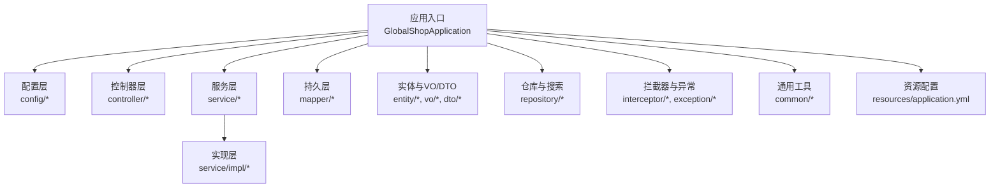
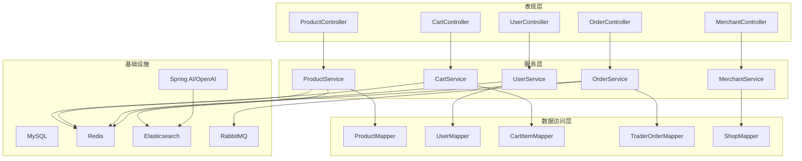
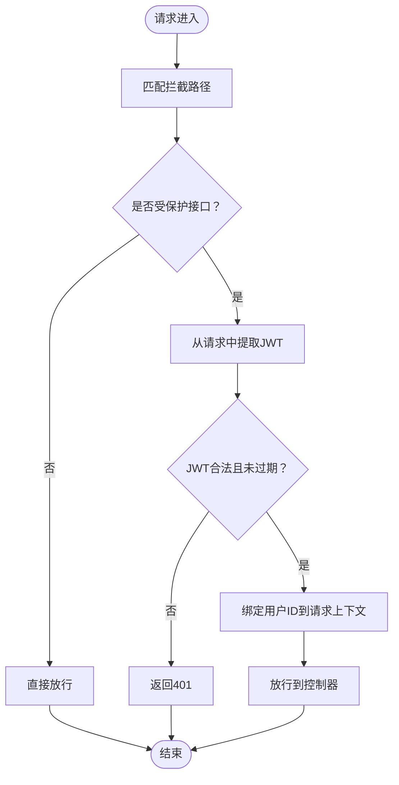
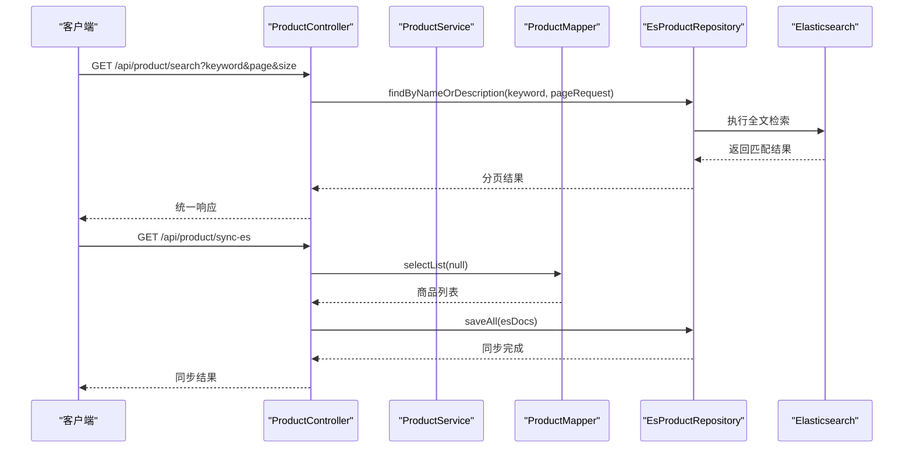
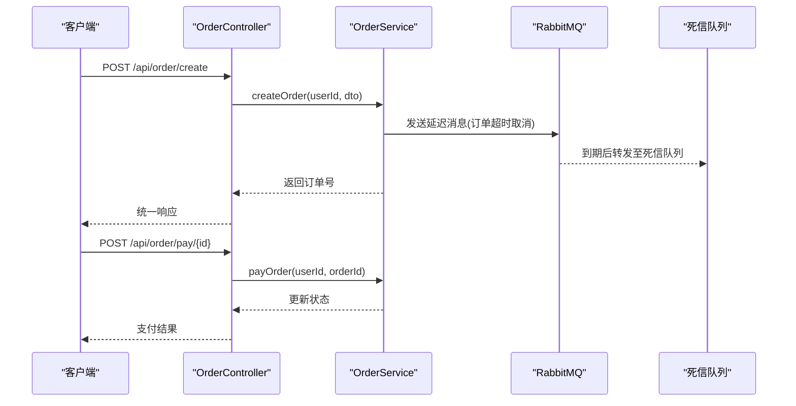
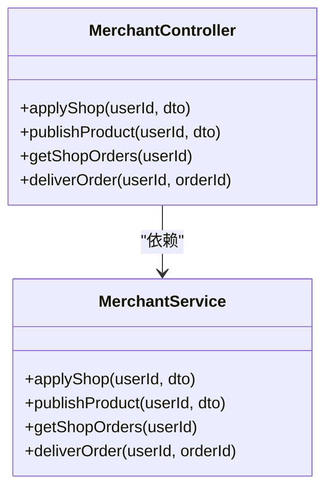
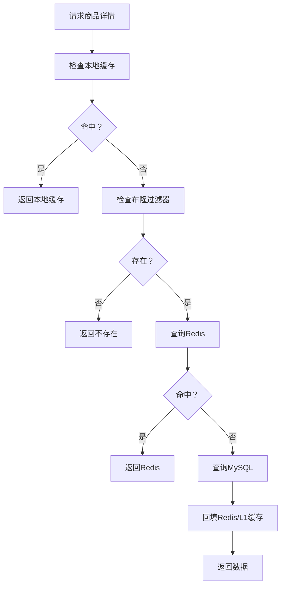

# 项目概述

<cite>
**本文引用的文件**
- [GlobalShopApplication.java](file://src/main/java/com/bohao/globalshop/GlobalShopApplication.java)
- [pom.xml](file://pom.xml)
- [application.yml](file://src/main/resources/application.yml)
- [Result.java](file://src/main/java/com/bohao/globalshop/common/Result.java)
- [JwtUtils.java](file://src/main/java/com/bohao/globalshop/common/JwtUtils.java)
- [WebConfig.java](file://src/main/java/com/bohao/globalshop/config/WebConfig.java)
- [RedisConfig.java](file://src/main/java/com/bohao/globalshop/config/RedisConfig.java)
- [RabbitMqConfig.java](file://src/main/java/com/bohao/globalshop/config/RabbitMqConfig.java)
- [MybatisPlusConfig.java](file://src/main/java/com/bohao/globalshop/config/MybatisPlusConfig.java)
- [CacheManagerConfig.java](file://src/main/java/com/bohao/globalshop/config/CacheManagerConfig.java)
- [UserController.java](file://src/main/java/com/bohao/globalshop/controller/UserController.java)
- [ProductController.java](file://src/main/java/com/bohao/globalshop/controller/ProductController.java)
- [CartController.java](file://src/main/java/com/bohao/globalshop/controller/CartController.java)
- [OrderController.java](file://src/main/java/com/bohao/globalshop/controller/OrderController.java)
- [MerchantController.java](file://src/main/java/com/bohao/globalshop/controller/MerchantController.java)
</cite>

## 目录
1. [简介](#简介)
2. [项目结构](#项目结构)
3. [核心组件](#核心组件)
4. [架构总览](#架构总览)
5. [详细组件分析](#详细组件分析)
6. [依赖分析](#依赖分析)
7. [性能考虑](#性能考虑)
8. [故障排查指南](#故障排查指南)
9. [结论](#结论)
10. [附录](#附录)

## 简介
本项目是一个基于 Spring Boot 的全球购物平台，面向初学者与有经验的开发者，提供清晰的背景介绍与技术决策说明。系统围绕用户、商品、购物车、订单、商户五大核心业务域构建，采用多层架构与现代化中间件组合，实现高可用、高性能与可扩展的电商解决方案。

- 项目目标
  - 提供完整的购物流程：用户注册/登录、商品浏览与搜索、购物车管理、订单创建与支付、商户入驻与商品上架、订单发货与评价。
  - 通过缓存、搜索引擎与消息队列提升性能与可靠性，结合分布式锁与布隆过滤器优化热点数据访问与查询体验。
  - 通过 Spring AI 能力探索向量化检索与智能推荐的集成路径。

- 技术栈概览
  - 后端语言与框架：Java 17、Spring Boot 3.2
  - ORM 与数据库：MyBatis Plus、MySQL
  - 缓存与分布式：Redis、Caffeine、Redisson
  - 搜索引擎：Elasticsearch
  - 消息队列：RabbitMQ
  - 安全与工具：JWT、Lombok、Hutool
  - AI 能力：Spring AI（OpenAI 兼容模式）

- 关键特性
  - 统一响应封装与全局异常处理
  - 基于 JWT 的鉴权与拦截器
  - 多级缓存（本地 + 远程）与布隆过滤器
  - 订单延迟取消与死信队列保障
  - 商品全文检索与向量化能力预留
  - 商户侧订单管理与发货流程

- 使用场景
  - 适合学习 Spring Boot 电商系统开发
  - 适合作为企业级电商系统的快速原型或核心模块参考
  - 支持后续扩展 AI 智能搜索与推荐

## 项目结构
项目采用标准的 Spring Boot Maven 结构，按功能域划分包层次，清晰分离控制器、服务、持久层、配置与通用工具。

图表来源
- [GlobalShopApplication.java:1-17](file://src/main/java/com/bohao/globalshop/GlobalShopApplication.java#L1-L17)
- [WebConfig.java:1-36](file://src/main/java/com/bohao/globalshop/config/WebConfig.java#L1-L36)
- [UserController.java:1-29](file://src/main/java/com/bohao/globalshop/controller/UserController.java#L1-L29)
- [ProductController.java:1-101](file://src/main/java/com/bohao/globalshop/controller/ProductController.java#L1-L101)
- [CartController.java:1-41](file://src/main/java/com/bohao/globalshop/controller/CartController.java#L1-L41)
- [OrderController.java:1-59](file://src/main/java/com/bohao/globalshop/controller/OrderController.java#L1-L59)
- [MerchantController.java:1-48](file://src/main/java/com/bohao/globalshop/controller/MerchantController.java#L1-L48)

章节来源
- [GlobalShopApplication.java:1-17](file://src/main/java/com/bohao/globalshop/GlobalShopApplication.java#L1-L17)
- [pom.xml:1-148](file://pom.xml#L1-L148)
- [application.yml:1-42](file://src/main/resources/application.yml#L1-L42)

## 核心组件
- 应用入口与调度
  - 应用程序入口启用调度能力，便于后续任务编排与定时任务执行。
  - 参考：[GlobalShopApplication.java:10-16](file://src/main/java/com/bohao/globalshop/GlobalShopApplication.java#L10-L16)

- 统一响应与安全
  - 统一响应封装 Result，简化前后端交互。
  - JWT 工具类负责令牌生成与校验，配合拦截器实现权限控制。
  - 参考：[Result.java:1-30](file://src/main/java/com/bohao/globalshop/common/Result.java#L1-L30)、[JwtUtils.java:1-41](file://src/main/java/com/bohao/globalshop/common/JwtUtils.java#L1-L41)

- Web 与拦截器
  - WebConfig 注册跨域与拦截器，对受保护接口进行统一鉴权。
  - 参考：[WebConfig.java:12-36](file://src/main/java/com/bohao/globalshop/config/WebConfig.java#L12-L36)

- 数据访问与缓存
  - MyBatis Plus 配置注入乐观锁插件，提升并发更新安全性。
  - Redis 配置提供 Redisson 客户端与 Lua 抢购脚本。
  - 多级缓存与布隆过滤器配置，提升读性能与查询准确性。
  - 参考：[MybatisPlusConfig.java:1-18](file://src/main/java/com/bohao/globalshop/config/MybatisPlusConfig.java#L1-L18)、[RedisConfig.java:1-46](file://src/main/java/com/bohao/globalshop/config/RedisConfig.java#L1-L46)、[CacheManagerConfig.java:1-55](file://src/main/java/com/bohao/globalshop/config/CacheManagerConfig.java#L1-L55)

- 消息与异步
  - RabbitMQ 配置定义延迟交换机与死信队列，支撑订单超时取消等异步流程。
  - 参考：[RabbitMqConfig.java:1-61](file://src/main/java/com/bohao/globalshop/config/RabbitMqConfig.java#L1-L61)

- 控制器与业务边界
  - 用户、商品、购物车、订单、商户控制器分别暴露 REST 接口，职责清晰。
  - 参考：[UserController.java:1-29](file://src/main/java/com/bohao/globalshop/controller/UserController.java#L1-L29)、[ProductController.java:1-101](file://src/main/java/com/bohao/globalshop/controller/ProductController.java#L1-L101)、[CartController.java:1-41](file://src/main/java/com/bohao/globalshop/controller/CartController.java#L1-L41)、[OrderController.java:1-59](file://src/main/java/com/bohao/globalshop/controller/OrderController.java#L1-L59)、[MerchantController.java:1-48](file://src/main/java/com/bohao/globalshop/controller/MerchantController.java#L1-L48)

章节来源
- [GlobalShopApplication.java:1-17](file://src/main/java/com/bohao/globalshop/GlobalShopApplication.java#L1-L17)
- [Result.java:1-30](file://src/main/java/com/bohao/globalshop/common/Result.java#L1-L30)
- [JwtUtils.java:1-41](file://src/main/java/com/bohao/globalshop/common/JwtUtils.java#L1-L41)
- [WebConfig.java:1-36](file://src/main/java/com/bohao/globalshop/config/WebConfig.java#L1-L36)
- [MybatisPlusConfig.java:1-18](file://src/main/java/com/bohao/globalshop/config/MybatisPlusConfig.java#L1-L18)
- [RedisConfig.java:1-46](file://src/main/java/com/bohao/globalshop/config/RedisConfig.java#L1-L46)
- [CacheManagerConfig.java:1-55](file://src/main/java/com/bohao/globalshop/config/CacheManagerConfig.java#L1-L55)
- [RabbitMqConfig.java:1-61](file://src/main/java/com/bohao/globalshop/config/RabbitMqConfig.java#L1-L61)
- [UserController.java:1-29](file://src/main/java/com/bohao/globalshop/controller/UserController.java#L1-L29)
- [ProductController.java:1-101](file://src/main/java/com/bohao/globalshop/controller/ProductController.java#L1-L101)
- [CartController.java:1-41](file://src/main/java/com/bohao/globalshop/controller/CartController.java#L1-L41)
- [OrderController.java:1-59](file://src/main/java/com/bohao/globalshop/controller/OrderController.java#L1-L59)
- [MerchantController.java:1-48](file://src/main/java/com/bohao/globalshop/controller/MerchantController.java#L1-L48)

## 架构总览
系统采用多层架构与中间件协同，形成“控制器-服务-持久层”的清晰分层，结合缓存、搜索引擎与消息队列实现高性能与高可靠。

图表来源
- [UserController.java:1-29](file://src/main/java/com/bohao/globalshop/controller/UserController.java#L1-L29)
- [ProductController.java:1-101](file://src/main/java/com/bohao/globalshop/controller/ProductController.java#L1-L101)
- [CartController.java:1-41](file://src/main/java/com/bohao/globalshop/controller/CartController.java#L1-L41)
- [OrderController.java:1-59](file://src/main/java/com/bohao/globalshop/controller/OrderController.java#L1-L59)
- [MerchantController.java:1-48](file://src/main/java/com/bohao/globalshop/controller/MerchantController.java#L1-L48)
- [ProductMapper.java](file://src/main/java/com/bohao/globalshop/mapper/ProductMapper.java)
- [UserMapper.java](file://src/main/java/com/bohao/globalshop/mapper/UserMapper.java)
- [CartItemMapper.java](file://src/main/java/com/bohao/globalshop/mapper/CartItemMapper.java)
[TraderOrderMapper.java](file://src/main/java/com/bohao/globalshop/mapper/TraderOrderMapper.java)
[ShopMapper.java](file://src/main/java/com/bohao/globalshop/mapper/ShopMapper.java)

## 详细组件分析

### 认证与拦截器
- 设计要点
  - 基于 JWT 的无状态认证，拦截器对受保护路径进行统一鉴权。
  - 放行登录、注册与公开商品接口，减少非必要鉴权开销。
- 流程图

图表来源
- [WebConfig.java:17-23](file://src/main/java/com/bohao/globalshop/config/WebConfig.java#L17-L23)
- [JwtUtils.java:28-38](file://src/main/java/com/bohao/globalshop/common/JwtUtils.java#L28-L38)

章节来源
- [WebConfig.java:1-36](file://src/main/java/com/bohao/globalshop/config/WebConfig.java#L1-L36)
- [JwtUtils.java:1-41](file://src/main/java/com/bohao/globalshop/common/JwtUtils.java#L1-L41)

### 商品搜索与同步
- 设计要点
  - 商品详情与列表采用多级缓存策略，结合布隆过滤器降低无效查询。
  - 提供全量同步接口将 MySQL 商品数据批量导入 Elasticsearch，支持全文检索。
  - 搜索接口基于 ES 的分词与匹配，支持关键词分页检索。
- 时序图

图表来源
- [ProductController.java:85-99](file://src/main/java/com/bohao/globalshop/controller/ProductController.java#L85-L99)
- [ProductController.java:54-80](file://src/main/java/com/bohao/globalshop/controller/ProductController.java#L54-L80)

章节来源
- [ProductController.java:1-101](file://src/main/java/com/bohao/globalshop/controller/ProductController.java#L1-L101)

### 购物车与订单流程
- 设计要点
  - 购物车操作基于用户维度，支持添加、查询与删除。
  - 订单流程覆盖创建、结算、支付、收货确认与评价提交。
  - 订单超时取消通过 RabbitMQ 延迟队列与死信队列实现可靠异步处理。
- 顺序图

图表来源
- [OrderController.java:19-44](file://src/main/java/com/bohao/globalshop/controller/OrderController.java#L19-L44)
- [RabbitMqConfig.java:12-59](file://src/main/java/com/bohao/globalshop/config/RabbitMqConfig.java#L12-L59)

章节来源
- [OrderController.java:1-59](file://src/main/java/com/bohao/globalshop/controller/OrderController.java#L1-L59)
- [RabbitMqConfig.java:1-61](file://src/main/java/com/bohao/globalshop/config/RabbitMqConfig.java#L1-L61)

### 商户管理
- 设计要点
  - 商户侧提供开店申请、商品上架、订单查询与发货能力。
  - 通过拦截器绑定当前用户，确保商户操作仅限本人店铺。
- 类图

图表来源
- [MerchantController.java:1-48](file://src/main/java/com/bohao/globalshop/controller/MerchantController.java#L1-L48)

章节来源
- [MerchantController.java:1-48](file://src/main/java/com/bohao/globalshop/controller/MerchantController.java#L1-L48)

### 缓存与布隆过滤器
- 设计要点
  - L1 本地缓存（Caffeine）与 L2 远程缓存（Redis）双层缓存，降低数据库压力。
  - 布隆过滤器用于快速判断商品是否存在，避免误查询。
  - 抢购场景使用 Redis Lua 脚本原子性扣减库存。
- 流程图

图表来源
- [CacheManagerConfig.java:26-52](file://src/main/java/com/bohao/globalshop/config/CacheManagerConfig.java#L26-L52)
- [RedisConfig.java:27-44](file://src/main/java/com/bohao/globalshop/config/RedisConfig.java#L27-L44)

章节来源
- [CacheManagerConfig.java:1-55](file://src/main/java/com/bohao/globalshop/config/CacheManagerConfig.java#L1-L55)
- [RedisConfig.java:1-46](file://src/main/java/com/bohao/globalshop/config/RedisConfig.java#L1-L46)

## 依赖分析
- 核心依赖
  - Spring Boot Starter Web、Test、Security Crypto、AMQP、Data Redis、Data Elasticsearch
  - MyBatis Plus、MySQL Connector、Lombok、Hutool
  - Redisson、Caffeine、Auth0 JWT
  - Spring AI OpenAI Starter
- 版本与属性
  - Java 17、Spring Boot 3.2、Spring AI 1.0.4
- 配置映射
  - 数据源、Redis、Elasticsearch、RabbitMQ、AI OpenAI 等外部服务连接信息集中于配置文件。

章节来源
- [pom.xml:1-148](file://pom.xml#L1-L148)
- [application.yml:1-42](file://src/main/resources/application.yml#L1-L42)

## 性能考虑
- 缓存策略
  - L1（Caffeine）：低延迟、高命中场景；L2（Redis）：共享缓存、持久化与分布式一致性。
  - 布隆过滤器：显著降低冷门查询与误查询带来的数据库压力。
- 异步与削峰
  - 订单超时取消采用延迟队列与死信队列，避免阻塞主流程。
- 并发与一致性
  - MyBatis Plus 乐观锁插件，减少写冲突导致的覆盖。
- 搜索与扩展
  - ES 全文检索满足商品搜索需求；预留向量化嵌入与 AI 能力集成点。

## 故障排查指南
- 常见问题定位
  - 认证失败：检查 JWT 生成与校验逻辑、拦截器路径配置与请求头携带情况。
  - 缓存异常：核对本地缓存容量与过期策略、Redis 地址与密码、布隆过滤器初始化状态。
  - 搜索无结果：确认商品同步任务是否执行、ES 索引是否建立、分词器配置。
  - 消息丢失：检查 RabbitMQ 发送确认、返回与死信队列绑定配置。
- 统一响应与异常
  - 使用统一响应封装，便于前端与监控系统识别错误码与消息。
- 端到端验证建议
  - 从用户注册登录开始，逐步验证商品搜索、购物车、下单与支付流程。
  - 对高并发场景（抢购）验证 Lua 脚本与限流策略。

章节来源
- [Result.java:1-30](file://src/main/java/com/bohao/globalshop/common/Result.java#L1-L30)
- [WebConfig.java:17-23](file://src/main/java/com/bohao/globalshop/config/WebConfig.java#L17-L23)
- [RedisConfig.java:27-44](file://src/main/java/com/bohao/globalshop/config/RedisConfig.java#L27-L44)
- [RabbitMqConfig.java:12-59](file://src/main/java/com/bohao/globalshop/config/RabbitMqConfig.java#L12-L59)

## 结论
本项目以 Spring Boot 为基础，整合 Redis、Elasticsearch、RabbitMQ 与 Spring AI，构建了具备完整购物流程与高可用特性的电商系统骨架。通过多级缓存、布隆过滤器、延迟队列与统一响应等设计，兼顾性能与可维护性。建议在生产环境中进一步完善限流、熔断、监控与日志体系，并持续演进 AI 搜索与推荐能力。

## 附录
- 快速启动
  - 准备 MySQL、Redis、Elasticsearch、RabbitMQ 服务，修改配置文件中的连接信息。
  - 使用 Maven 启动应用入口类，访问各控制器接口进行功能验证。
- 开发建议
  - 保持控制器薄、服务厚的设计风格，将复杂业务下沉至服务层。
  - 对热点数据与高并发接口优先采用缓存与异步化手段优化性能。
  - 逐步引入 Spring Cloud 生态以支持微服务化演进。